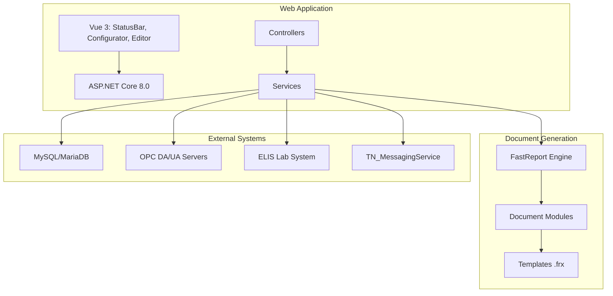

# TN_Doc

**Система генерации технических документов и отчетов для измерительно-вычислительных комплексов (ИВК)**

[](https://github.com/orpovy/ivk/tn_doc)
[](https://dotnet.microsoft.com/download/dotnet/8.0)
[]()

## Описание

TN_Doc — это ASP.NET Core веб-приложение для автоматической генерации технической документации:
- Паспорта качества продукции
- Протоколы поверки измерительных систем
- Акты приема-сдачи
- Отчеты по измерениям
- Журналы учета

Система интегрируется с измерительно-вычислительными комплексами (ИВК), получает данные через OPC DA/UA и генерирует документы на основе шаблонов FastReport.

## Быстрый старт

### Предварительные требования

- .NET SDK 8.0+
- .NET Runtime 8.0.13+
- MySQL/MariaDB (для хранения данных ИВК)
- libgdiplus (только для Linux)

### Установка

```bash
# Клонировать репозиторий
git clone http://192.168.100.100/orpovy/ivk/tn_doc.git
cd tn_doc

# Настроить NuGet источники
dotnet nuget add source "https://nuget.ortpr.ru/v3/index.json" --name ortpr
dotnet nuget add source "https://nuget.fast-report.com/api/v3/index.json" --name fr_nuget \
  --username "<USERNAME>" --password "<PASSWORD>" --store-password-in-clear-text

# Восстановить зависимости
dotnet restore

# Собрать проект
dotnet build

# Запустить в режиме разработки
cd TN_Doc
dotnet run
```

Приложение будет доступно по адресу: `http://localhost:38509`

### Сборка Vue компонентов

```bash
cd TN_Doc/Client
npm install                # Устанавливает зависимости для всех workspaces
npm run build:all          # Собирает statusbar, configurator, document-editor
```

## Документация

- [Архитектура проекта](docs/architecture/overview.md)
- [Руководство разработчика](docs/development/setup.md)
- [Развертывание](docs/deployment/linux.md)
- [API Reference](docs/api/endpoints.md)
- [История изменений](CHANGELOG.md)

### Структура документации

```
docs/
├── api/              # API документация
├── architecture/     # Архитектурные решения
├── configs/          # Конфигурация документов
├── deployment/       # Развертывание
├── development/      # Разработка
├── features/         # Функциональность
├── integration/      # Интеграция с внешними системами
└── operations/       # Эксплуатация и логирование
```

## Архитектура



## Основные технологии

- **Backend**: ASP.NET Core 8.0, C#
- **Frontend**: Vue 3 + TypeScript + PrimeVue (StatusBar, Configurator, Document Editor)
- **Генерация отчетов**: FastReport.Web.Skia 2025.2.2
- **База данных**: MySQL/MariaDB (Pomelo.EntityFrameworkCore.MySql 7.0.0)
- **Real-time**: SignalR
- **Логирование**: NLog 5.4.0
- **OPC**: OPC DA, OPC UA
- **Интеграция**: ELIS (Единая Лабораторная Информационная Система)

## Структура проекта

```
tn_doc/
├── TN_Doc/                      # Основное веб-приложение
│   ├── Controllers/             # ASP.NET Core контроллеры
│   ├── Models/                  # Модели и сервисы
│   ├── Views/                   # Razor views
│   ├── wwwroot/                 # Статические файлы
│   ├── Client/                  # Vue.js приложения (npm workspaces)
│   │   ├── statusbar/           # Статус-бар
│   │   ├── configurator/        # Конфигуратор
│   │   ├── document-editor/     # Редактор документов (в разработке)
│   │   └── shared/              # Общие компоненты
│   ├── Cfg/                     # Конфигурация документов
│   └── Doc/                     # Шаблоны FastReport
├── tn.docgeneral/               # Git submodule: модули документов (~48 библиотек)
│   └── TN.DocGeneral/           # Общая бизнес-логика (v1.1.1)
│   ├── Act, Passport, Report, Jornal
│   ├── Poverka* (21 библиотек)
│   ├── KMH* (18 библиотек)
│   └── Common* (3 библиотеки)
├── Tests/                       # Unit-тесты (NUnit)
└── docs/                        # Документация
```

## Тестирование

Проект содержит 35 тестовых файлов (~650 тестов). Подробная документация: [Tests/README.md](Tests/README.md)

```bash
# Запустить все тесты
dotnet test Tests/Tests.csproj

# С детальным выводом
dotnet test Tests/Tests.csproj --logger:"console;verbosity=detailed"

# Конкретный класс тестов
dotnet test Tests/Tests.csproj --filter "FullyQualifiedName~AppConfigServiceTests"

# КМХ тесты
dotnet test Tests/Tests.csproj --filter "Namespace~Tests.Libraries.KMH"
```

**Статус тестов (v1.3.8):**
- Работающих: ~315 тестов (~48%)
- Отключенных: ~335 тестов (~52%) - для нереализованного функционала

## Развертывание

### Linux (через .deb пакет)

```bash
# Установка из пакета
sudo dpkg -i tn-doc_1.3.8_amd64.deb

# Управление службой
sudo systemctl start tn-doc
sudo systemctl status tn-doc

# Логи находятся в /opt/TN_Doc/logs/
```

### Windows (как служба)

```bash
# Публикация
dotnet publish -c Release -r win-x64 --self-contained false

# Установка службы
sc create TN_Doc binPath="C:\path\to\TN_Doc.exe"
sc start TN_Doc
```

Подробнее: [Deployment Guide](docs/deployment/linux.md)

## Связанные проекты

- **TN_KMH**: Контроль метрологических характеристик
- **TN_MessagingService**: OPC клиент и обработка данных
- **TN.ElisConnector**: Интеграция с ELIS

Все проекты должны находиться на одном уровне и использовать общий `CfgApp.json`.

## Лицензия

Proprietary - Все права защищены

## Авторы

- ОРПОВУ (Отдел разработки программного обеспечения верхнего уровня)

## Поддержка

Для сообщений об ошибках и предложений используйте внутреннюю систему отслеживания задач.
