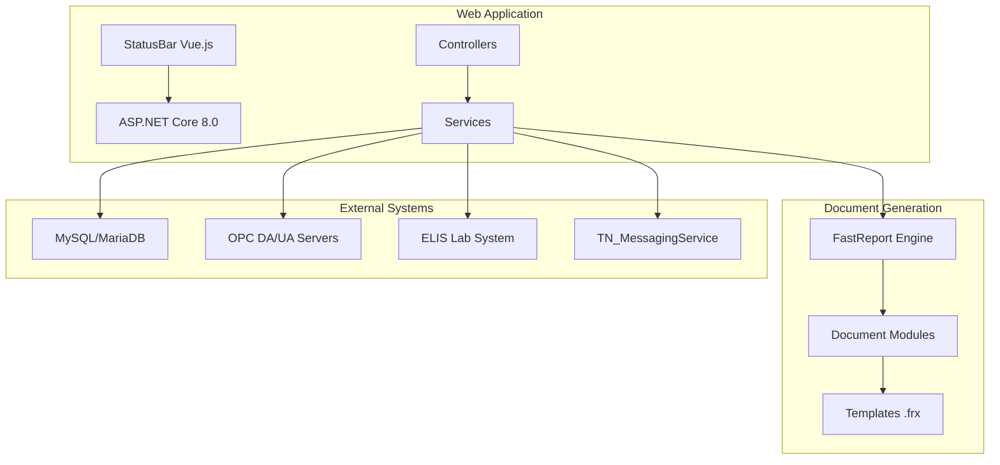

# TN_Doc

**Система генерации технических документов и отчетов для измерительно-вычислительных комплексов (ИВК)**

[](https://github.com/tn-ivk/tn-doc)
[](https://dotnet.microsoft.com/download/dotnet/8.0)
[]()

## 📋 Описание

TN_Doc — это ASP.NET Core веб-приложение для автоматической генерации технической документации:
- Паспорта качества продукции
- Протоколы поверки измерительных систем
- Акты приема-сдачи
- Отчеты по измерениям
- Журналы учета

Система интегрируется с измерительно-вычислительными комплексами (ИВК), получает данные через OPC DA/UA и генерирует документы на основе шаблонов FastReport.

## 🚀 Быстрый старт

### Предварительные требования

- .NET SDK 8.0+
- .NET Runtime 8.0.13+
- MySQL/MariaDB (для хранения данных ИВК)
- libgdiplus (только для Linux)

### Установка

```bash
# Клонировать репозиторий
git clone http://192.168.100.100/orpovy/ivk/tn_doc.git
cd tn_doc

# Настроить NuGet источники
dotnet nuget add source "https://nuget.ortpr.ru/v3/index.json" --name ortpr
dotnet nuget add source "https://nuget.fast-report.com/api/v3/index.json" --name fr_nuget \
  --username "<USERNAME>" --password "<PASSWORD>" --store-password-in-clear-text

# Восстановить зависимости
dotnet restore

# Собрать проект
dotnet build

# Запустить в режиме разработки
cd TN_Doc
dotnet run
```

Приложение будет доступно по адресу: `http://localhost:5000` (Kestrel) или `http://localhost:38509` (IIS Express)

### Сборка клиентских приложений (Vue.js)

```bash
cd TN_Doc/Client
npm install
npm run build:all   # statusbar + configurator
```

## 📖 Документация

- [Архитектура проекта](docs/architecture/overview.md)
- [Модули документов](docs/architecture/document-modules.md)
- [Статус-бар](docs/architecture/statusbar.md)
- [Клиентские приложения](TN_Doc/Client/README.md)
- [Руководство разработчика](docs/development/setup.md)
- [Сборка проекта](docs/development/building.md)
- [Конфигурация](docs/deployment/configuration.md)
- [Развертывание Linux](docs/deployment/linux.md)
- [Развертывание Windows](docs/deployment/windows.md)
- [Шаблоны FastReport](docs/development/fastreport-templates.md)
- [Добавление нового модуля](docs/development/new-module-tutorial.md)
- [Интеграция с ELIS](docs/integration/elis.md)
- [API Reference](docs/api/endpoints.md)
- [История изменений](CHANGELOG.md)

### Структура документации

```
docs/
├── api/              # API документация
├── architecture/     # Архитектурные решения
├── assets/           # Диаграммы и материалы
├── deployment/       # Развертывание и эксплуатация
├── development/      # Разработка
├── integration/      # Интеграция с внешними системами
├── ui-design.md      # Гайд по UI
└── ui-screenshots/   # Скриншоты UI
```

## 🏗️ Архитектура



## 🔧 Основные технологии

- **Backend**: ASP.NET Core 8.0, C#
- **Frontend**: Vue 3 + TypeScript + PrimeVue (StatusBar, Configurator)
- **Генерация отчетов**: FastReport.Web.Skia
- **База данных**: MySQL/MariaDB (Pomelo.EntityFrameworkCore.MySql)
- **Real-time**: SignalR
- **Логирование**: NLog
- **OPC**: OPC DA, OPC UA
- **Интеграция**: ELIS (Единая Лабораторная Информационная Система)

## 📦 Структура проекта

```
tn_doc/
├── TN_Doc/                      # Основное веб-приложение
│   ├── Controllers/             # ASP.NET Core контроллеры
│   ├── Models/                  # Модели и сервисы
│   ├── Views/                   # Razor views
│   ├── wwwroot/                 # Статические файлы
│   ├── Client/                  # Vue.js workspaces (statusbar, configurator, shared, e2e)
│   ├── Cfg/                     # Конфигурация документов
│   └── Doc/                     # Шаблоны FastReport
├── tn.docgeneral/               # Модули документов и общие библиотеки
│   ├── TN.DocGeneral/           # Общая бизнес-логика
│   ├── tn.utils/                # Общие утилиты
│   ├── Passport/
│   ├── Poverka*/
│   ├── KMH*/
│   └── ...
├── tn_toolsfastreport/          # Утилиты FastReport
├── Tests/                       # Unit-тесты (NUnit)
└── docs/                        # Документация
```

## 🧪 Тестирование

```bash
# Запустить все тесты
dotnet test

# С детальным выводом
dotnet test --logger:"console;verbosity=detailed"

# Конкретный тест
dotnet test --filter "ClassName=AppConfigServiceTests"
```

## 🚢 Развертывание

### Linux (через .deb пакет)

```bash
# Установка из пакета
sudo dpkg -i tn.doc-full-<FULL_VERSION>_amd64.deb

# Управление службой
sudo systemctl start tn-doc
sudo systemctl status tn-doc
```

### Windows (через MSI пакет)

```cmd
:: Графическая установка
msiexec /i tn.doc-full-<FULL_VERSION>_win-x64.msi

:: Тихая установка с параметрами
msiexec /i tn.doc-full-<FULL_VERSION>_win-x64.msi /quiet INSTALLFOLDER="C:\ProjectVU\DotNetComponents\TN_Doc" SERVICENAME="tn.doc"

:: Управление службой
sc query tn.doc
sc stop tn.doc
sc start tn.doc
```

Подробнее: [Linux](docs/deployment/linux.md) | [Windows](docs/deployment/windows.md)

## 🔗 Связанные проекты

- **TN_KMH**: Контроль метрологических характеристик
- **TN_MessagingService**: OPC клиент и обработка данных
- **TN.ElisConnector**: Интеграция с ELIS

Все проекты должны находиться на одном уровне и использовать общий `CfgApp.json`.

## 📝 Лицензия

Proprietary - Все права защищены

## 👥 Авторы

- ОРТПР (Отдел разработки и технической поддержки ПО)

## 🆘 Поддержка

Для сообщений об ошибках и предложений используйте внутреннюю систему отслеживания задач.
