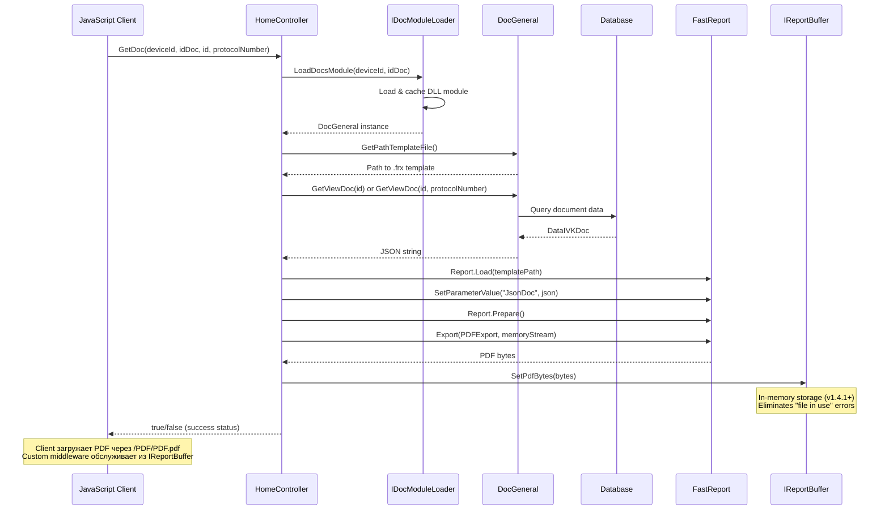
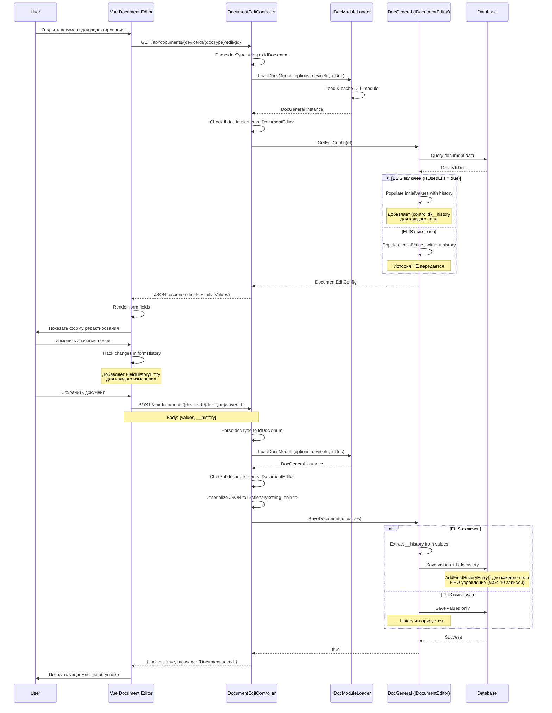
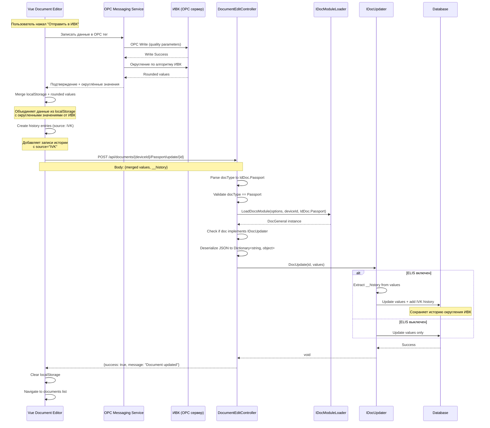
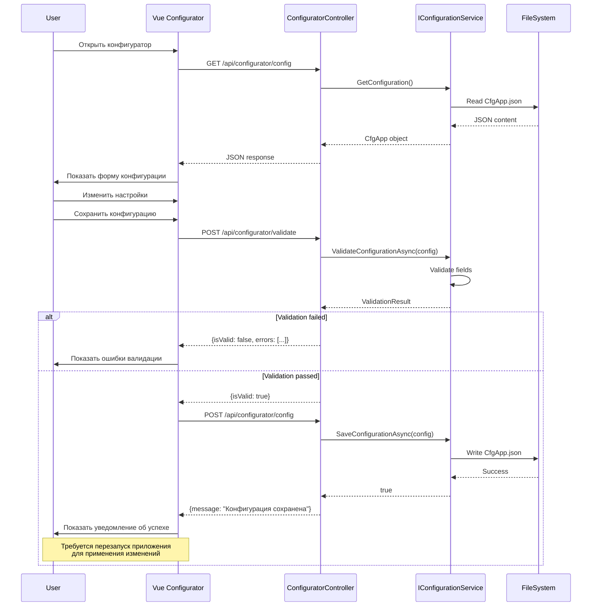

# API Endpoints

## Обзор

TN_Doc предоставляет REST API для генерации документов, редактирования через Vue SPA, управления конфигурацией и мониторинга состояния системы.

**Версия API**: 1.4.4+
**Последнее обновление документации**: 2025-11-17

## Base URL

```
Development: http://localhost:38509
Production:  http://server-address:38509
```

## Authentication

В текущей версии аутентификация не требуется. В будущих версиях планируется добавление JWT токенов.

## Endpoints

### Document Editor API (v1.4.4+)

**Новый REST API для Vue Document Editor** - современный интерфейс редактирования документов с поддержкой истории изменений полей.

⚠️ **Требование**: История изменений доступна только при включенном ELIS (`IsUsedElis = true` в CfgApp.json)

#### Health Check

```http
GET /api/documents/health
```

Проверка доступности Document Editor API.

**Response:**
```json
{
  "status": "healthy",
  "service": "DocumentEditAPI",
  "timestamp": "2025-11-17T10:30:00.0000000Z"
}
```

#### Получить конфигурацию формы редактирования

```http
GET /api/documents/{deviceId}/{docType}/edit/{id}
```

**URL Parameters:**

| Parameter | Type | Required | Description |
|-----------|------|----------|-------------|
| deviceId | int | Yes | ID устройства ИВК (целое число) |
| docType | string | Yes | Тип документа (Passport, Report, Act и т.д.) |
| id | int | Yes | ID записи документа |

**Response:**
```json
{
  "docId": 12345,
  "docType": "Passport",
  "deviceId": 1,
  "fields": [
    {
      "key": "ExportPermit",
      "label": "Разрешение на экспорт",
      "type": "text",
      "required": true,
      "editable": true,
      "tag": "additionalInfo"
    },
    {
      "key": "value.Density",
      "label": "Плотность при 20°C",
      "type": "number",
      "required": true,
      "editable": true,
      "roundValue": 1,
      "tag": "qualityParameter",
      "elisAlias": ["Density", "Плотность"]
    }
  ],
  "initialValues": {
    "ExportPermit": "АБВ123",
    "ExportPermit__history": [
      {
        "source": "Manual",
        "modifiedAt": "2025-01-14T09:00:00Z",
        "modifiedBy": "Пользователь",
        "value": "АБВ123",
        "previousValue": null,
        "comment": null
      }
    ],
    "value.Density": "850.567",
    "value.Density__history": [
      {
        "source": "ELIS",
        "modifiedAt": "2025-01-14T10:00:00Z",
        "modifiedBy": "ELIS",
        "value": "850.5",
        "previousValue": null,
        "comment": "Загружено из протокола ПР-2024-12345"
      },
      {
        "source": "Manual",
        "modifiedAt": "2025-01-14T10:32:00Z",
        "modifiedBy": "Пользователь",
        "value": "850.567",
        "previousValue": "850.5",
        "comment": "Скорректировано вручную"
      }
    ]
  },
  "dictionaries": {
    "licenses": [
      {
        "id": 1,
        "licensesNumber": "ЛИЦ-2025-001",
        "licensesDate": "2025-01-01"
      }
    ]
  }
}
```

**Формат истории изменений:**
- История передается в `initialValues` с суффиксом `__history`
- Ключ поля: `{controlId}__history` (например, `ExportPermit__history`, `value.Density__history`)
- Значение: массив объектов `FieldHistoryEntry`

#### Сохранить изменения документа

```http
POST /api/documents/{deviceId}/{docType}/save/{id}
```

**URL Parameters:**

| Parameter | Type | Required | Description |
|-----------|------|----------|-------------|
| deviceId | int | Yes | ID устройства ИВК |
| docType | string | Yes | Тип документа |
| id | int | Yes | ID записи документа |

**Request Body:**
```json
{
  "ExportPermit": "АБВ123",
  "value.Density": "850.567",
  "__history": {
    "ExportPermit": [
      {
        "source": "Manual",
        "modifiedAt": "2025-01-14T09:00:00Z",
        "modifiedBy": "Пользователь",
        "value": "АБВ123",
        "previousValue": null,
        "comment": null
      }
    ],
    "value.Density": [
      {
        "source": "ELIS",
        "modifiedAt": "2025-01-14T10:00:00Z",
        "modifiedBy": "ELIS",
        "value": "850.5",
        "previousValue": null,
        "comment": "Загружено из протокола ПР-2024-12345"
      },
      {
        "source": "Manual",
        "modifiedAt": "2025-01-14T10:32:00Z",
        "modifiedBy": "Пользователь",
        "value": "850.567",
        "previousValue": "850.5",
        "comment": "Скорректировано вручную"
      }
    ]
  }
}
```

**Response:**
```json
{
  "success": true,
  "message": "Document saved successfully"
}
```

**Формат передачи истории при сохранении:**
- История передается в специальном поле `__history`
- Ключ: `controlId` без суффикса (например, `ExportPermit`, `value.Density`)
- Backend автоматически управляет FIFO (максимум 10 записей на поле)

#### Обновить документ после подтверждения от ИВК

```http
POST /api/documents/{deviceId}/{docType}/update/{id}
```

⚠️ **Только для паспортов качества** - используется после успешной записи в OPC тег.

**URL Parameters:**

| Parameter | Type | Required | Description |
|-----------|------|----------|-------------|
| deviceId | int | Yes | ID устройства ИВК |
| docType | string | Yes | Должно быть "Passport" |
| id | int | Yes | ID записи документа |

**Request Body:**
```json
{
  "ExportPermit": "АБВ123",
  "value.Density": "850.567",
  "__history": {
    "value.Density": [
      {
        "source": "IVK",
        "modifiedAt": "2025-01-14T10:35:00Z",
        "modifiedBy": "IVK",
        "value": "850.567",
        "previousValue": "850.5",
        "comment": "Округлено ИВК"
      }
    ]
  }
}
```

**Response:**
```json
{
  "success": true,
  "message": "Document updated successfully"
}
```

### Documents API (Legacy)

⚠️ **Устаревшее API** - используется для обратной совместимости со старым JavaScript клиентом. Для новых функций используйте DocumentEditController REST API.

#### Сгенерировать документ (PDF)

```http
GET /Home/GetDoc
```

**Query Parameters:**

| Parameter | Type | Required | Description |
|-----------|------|----------|-------------|
| IdDevice | int | Yes | ID устройства ИВК |
| IdDoc | string | Yes | Тип документа (enum IdDoc) |
| id | int | Yes | ID записи документа |
| protocolNumber | int | No | Номер протокола (для документов КМХ и поверок) |

**Response:**
```json
true  // Успешная генерация
false // Ошибка генерации
```

**Примечание:**
- PDF генерируется в память через IReportBuffer (v1.4.1+)
- Клиент загружает PDF через `/PDF/PDF.pdf`
- Custom middleware обслуживает запрос из in-memory буфера

#### Получить форму редактирования документа

```http
GET /Home/GetDocEdit
```

**Query Parameters:**

| Parameter | Type | Required | Description |
|-----------|------|----------|-------------|
| IdDevice | int | Yes | ID устройства ИВК |
| IdDoc | string | Yes | Тип документа (enum IdDoc) |
| id | int | Yes | ID записи документа |

**Response:**
```json
{
  "useVue": true,
  "url": "/document-editor/edit/1/Passport/12345"
}
```

**Примечание:**
- С версии 1.4.4+ все документы используют Vue Document Editor
- HTML формы устарели и удалены
- Метод возвращает URL для Vue SPA

#### Обновить документ после подтверждения от ИВК (Legacy)

```http
POST /Home/UpdateDoc
```

**Query Parameters:**

| Parameter | Type | Required | Description |
|-----------|------|----------|-------------|
| IdDevice | int | Yes | ID устройства ИВК |
| IdDoc | string | Yes | Должно быть "Passport" |
| data | string | Yes | JSON строка с данными документа |

**Примечание:**
- ⚠️ **Устаревший метод** - используйте `/api/documents/{deviceId}/Passport/update/{id}`
- Работает только для паспортов качества
- Принимает JSON как строку (не объект)
- Для новых реализаций используйте DocumentEditController.UpdateDocument()

### Status API

#### Получить статус системы

```http
GET /api/status
```

**Response:**
```json
{
  "devices": [
    {
      "id": "IVK-1",
      "name": "ИВК №1",
      "type": "database",
      "isConnected": true,
      "latencyMs": 15,
      "lastChecked": "2025-10-02T15:30:00Z",
      "error": null
    }
  ],
  "services": {
    "messagingService": {
      "isConnected": true,
      "latencyMs": 8,
      "lastChecked": "2025-10-02T15:30:00Z",
      "error": null
    },
    "elis": {
      "isConnected": true,
      "latencyMs": 250,
      "lastChecked": "2025-10-02T15:30:00Z",
      "error": null
    }
  },
  "timestamp": "2025-10-02T15:30:00Z"
}
```

### Configurator API (v1.4.2+)

**API для управления конфигурацией приложения** через веб-интерфейс конфигуратора.

#### Получить конфигурацию приложения

```http
GET /api/configurator/config
```

**Response:**
```json
{
  "isUsedElis": true,
  "isUsedMessagingService": true,
  "devices": [
    {
      "id": 1,
      "name": "ИВК №1",
      "connectionString": "Server=localhost;Database=IVK1;...",
      "dbType": "MySql"
    }
  ],
  "elisConnectionSettings": {
    "url": "https://elis.example.com",
    "certificate": "elis_cert.pfx",
    "password": "encrypted_password"
  },
  "opcConnectionSettings": {
    "messagingServiceUrl": "http://localhost:5000",
    "opcServerUrl": "opc.tcp://localhost:4840"
  }
}
```

#### Сохранить конфигурацию приложения

```http
POST /api/configurator/config
```

**Request Body:**
```json
{
  "isUsedElis": true,
  "isUsedMessagingService": true,
  "devices": [...],
  "elisConnectionSettings": {...},
  "opcConnectionSettings": {...}
}
```

**Response:**
```json
{
  "message": "Конфигурация успешно сохранена"
}
```

**Error Response (400):**
```json
{
  "error": "Ошибка валидации конфигурации",
  "errors": [
    "Поле 'devices' не может быть пустым",
    "Некорректный URL для ELIS"
  ]
}
```

#### Валидировать конфигурацию

```http
POST /api/configurator/validate
```

**Request Body:**
```json
{
  "isUsedElis": true,
  "devices": [...],
  "elisConnectionSettings": {...}
}
```

**Response:**
```json
{
  "isValid": true,
  "errors": []
}
```

#### Загрузить конфигурацию документа

```http
GET /api/configurator/document-config?path=Cfg/CfgPassport.json
```

**Query Parameters:**

| Parameter | Type | Required | Description |
|-----------|------|----------|-------------|
| path | string | Yes | Относительный путь к файлу конфигурации от корня приложения |

**Response:**
```json
{
  "fileTemplate": "Doc/Passport/01_Passport.frx",
  "pathReportFile": "PDF",
  "nameReportFile": "Passport.pdf",
  "viewReportInBrowser": true,
  "reportSetting": {
    "format": "PDF",
    "showToolbar": false
  }
}
```

**Error Response (404):**
```json
{
  "error": "Файл конфигурации не найден",
  "path": "Cfg/CfgPassport.json"
}
```

#### Сохранить конфигурацию документа

```http
POST /api/configurator/document-config
```

**Request Body:**
```json
{
  "path": "Cfg/CfgPassport.json",
  "content": "{\"fileTemplate\":\"Doc/Passport/01_Passport.frx\",\"pathReportFile\":\"PDF\",...}"
}
```

**Response:**
```json
{
  "message": "Конфигурация документа успешно сохранена"
}
```

**Error Response (400 - Invalid JSON):**
```json
{
  "error": "Невалидный JSON",
  "details": "Unexpected character at position 42"
}
```

### Dictionaries API

#### Получить список справочников

```http
GET /Dictionaries/GetList
```

**Response:**
```json
{
  "dictionaries": [
    {
      "id": "TestMethods",
      "name": "Методы испытаний",
      "itemCount": 25
    },
    {
      "id": "Users",
      "name": "Пользователи",
      "itemCount": 10
    }
  ]
}
```

#### Получить элементы справочника

```http
GET /Dictionaries/GetItems
```

**Query Parameters:**

| Parameter | Type | Required | Description |
|-----------|------|----------|-------------|
| dictionary | string | Yes | ID справочника |

**Response:**
```json
{
  "items": [
    {
      "id": 1,
      "name": "ГОСТ 3900-85",
      "description": "Плотность нефти",
      "isActive": true
    }
  ]
}
```

#### Добавить элемент в справочник

```http
POST /Dictionaries/AddItem
```

**Request Body:**
```json
{
  "dictionary": "TestMethods",
  "name": "ГОСТ 33-2016",
  "description": "Вязкость кинематическая",
  "parameters": {
    "minValue": 0,
    "maxValue": 100,
    "unit": "мм²/с"
  }
}
```

### Printing API

#### Печать документа

```http
POST /Document/Print
```

**Request Body:**
```json
{
  "documentPath": "/PDF/Passport_12345.pdf",
  "printerName": "HP_LaserJet",
  "copies": 1
}
```

**Response:**
```json
{
  "success": true,
  "message": "Документ отправлен на печать"
}
```

## SignalR Hubs

### StatusHub

**Hub URL:**
```
/statusHub
```

**Events:**

#### Server → Client: statusUpdated

```typescript
connection.on("statusUpdated", (data: StatusResponse) => {
  // Обработка обновления статуса
  console.log(data);
});
```

**Data Format:**
```json
{
  "devices": [...],
  "services": {...},
  "timestamp": "2025-10-02T15:30:00Z"
}
```

## Error Responses

### Стандартный формат ошибки

```json
{
  "success": false,
  "error": {
    "code": "DOC_NOT_FOUND",
    "message": "Документ с ID 12345 не найден",
    "details": {
      "idDevice": "IVK-1",
      "idDoc": "Passport",
      "id": 12345
    }
  }
}
```

### HTTP Status Codes

| Code | Название | Использование |
|------|----------|---------------|
| 200 | OK | Успешный запрос (GET, POST) |
| 400 | Bad Request | Неверные параметры, невалидный JSON, неизвестный тип документа |
| 404 | Not Found | Документ/файл конфигурации не найден |
| 500 | Internal Server Error | Ошибка на сервере, ошибка загрузки модуля, ошибка сохранения |

**Примеры ошибок:**

#### 400 - Неизвестный тип документа
```json
{
  "error": "Unknown document type: InvalidType"
}
```

#### 400 - Невалидная конфигурация
```json
{
  "error": "Ошибка валидации конфигурации",
  "errors": [
    "Поле 'devices' не может быть пустым",
    "Некорректный URL для ELIS"
  ]
}
```

#### 404 - Файл не найден
```json
{
  "error": "Файл конфигурации не найден",
  "path": "Cfg/CfgInvalidDoc.json"
}
```

#### 500 - Ошибка загрузки модуля
```json
{
  "error": "Failed to load document module"
}
```

#### 500 - Внутренняя ошибка
```json
{
  "error": "Internal server error",
  "message": "Object reference not set to an instance of an object."
}
```

## Rate Limiting

В текущей версии rate limiting не применяется.

## Примеры использования

### cURL

#### Document Editor API (v1.4.4+)

```bash
# Health check
curl -X GET "http://localhost:38509/api/documents/health"

# Получить конфигурацию формы редактирования
curl -X GET "http://localhost:38509/api/documents/1/Passport/edit/12345"

# Сохранить документ с историей изменений
curl -X POST "http://localhost:38509/api/documents/1/Passport/save/12345" \
  -H "Content-Type: application/json" \
  -d '{
    "ExportPermit": "АБВ123",
    "value.Density": "850.567",
    "__history": {
      "value.Density": [
        {
          "source": "Manual",
          "modifiedAt": "2025-01-14T10:32:00Z",
          "modifiedBy": "Пользователь",
          "value": "850.567",
          "previousValue": "850.5",
          "comment": null
        }
      ]
    }
  }'

# Обновить документ после подтверждения от ИВК
curl -X POST "http://localhost:38509/api/documents/1/Passport/update/12345" \
  -H "Content-Type: application/json" \
  -d '{
    "value.Density": "850.567",
    "__history": {
      "value.Density": [
        {
          "source": "IVK",
          "modifiedAt": "2025-01-14T10:35:00Z",
          "modifiedBy": "IVK",
          "value": "850.567",
          "previousValue": "850.5",
          "comment": "Округлено ИВК"
        }
      ]
    }
  }'
```

#### Configurator API (v1.4.2+)

```bash
# Получить конфигурацию приложения
curl -X GET "http://localhost:38509/api/configurator/config"

# Загрузить конфигурацию документа
curl -X GET "http://localhost:38509/api/configurator/document-config?path=Cfg/CfgPassport.json"

# Сохранить конфигурацию документа
curl -X POST "http://localhost:38509/api/configurator/document-config" \
  -H "Content-Type: application/json" \
  -d '{
    "path": "Cfg/CfgPassport.json",
    "content": "{\"fileTemplate\":\"Doc/Passport/01_Passport.frx\"}"
  }'
```

#### Legacy Documents API

```bash
# Получить список документов
curl -X GET "http://localhost:38509/Document/GetListDoc?idDevice=IVK-1"

# Сгенерировать PDF
curl -X POST "http://localhost:38509/Document/ViewDoc" \
  -H "Content-Type: application/json" \
  -d '{"idDevice":"IVK-1","idDoc":"Passport","id":12345}' \
  --output passport.pdf

# Проверить статус
curl -X GET "http://localhost:38509/api/status"
```

### JavaScript

#### Document Editor API (v1.4.4+)

```javascript
// Получить конфигурацию формы редактирования
const response = await fetch('http://localhost:38509/api/documents/1/Passport/edit/12345');
const config = await response.json();
console.log('Fields:', config.fields);
console.log('Initial values:', config.initialValues);

// Сохранить документ с историей изменений
const saveResponse = await fetch('http://localhost:38509/api/documents/1/Passport/save/12345', {
  method: 'POST',
  headers: { 'Content-Type': 'application/json' },
  body: JSON.stringify({
    ExportPermit: 'АБВ123',
    'value.Density': '850.567',
    __history: {
      'value.Density': [
        {
          source: 'Manual',
          modifiedAt: new Date().toISOString(),
          modifiedBy: 'Пользователь',
          value: '850.567',
          previousValue: '850.5',
          comment: null
        }
      ]
    }
  })
});

if (saveResponse.ok) {
  console.log('Документ успешно сохранен');
}
```

#### Configurator API (v1.4.2+)

```javascript
// Получить конфигурацию приложения
const config = await fetch('http://localhost:38509/api/configurator/config')
  .then(res => res.json());
console.log('ELIS включен:', config.isUsedElis);

// Загрузить конфигурацию документа
const docConfig = await fetch(
  'http://localhost:38509/api/configurator/document-config?path=Cfg/CfgPassport.json'
).then(res => res.json());
console.log('Шаблон:', docConfig.fileTemplate);
```

#### Legacy API

```javascript
// Получить статус системы
fetch('http://localhost:38509/api/status')
  .then(res => res.json())
  .then(data => console.log(data));

// Сгенерировать документ
fetch('http://localhost:38509/Document/ViewDoc', {
  method: 'POST',
  headers: { 'Content-Type': 'application/json' },
  body: JSON.stringify({
    idDevice: 'IVK-1',
    idDoc: 'Passport',
    id: 12345,
    format: 'PDF'
  })
})
.then(res => res.blob())
.then(blob => {
  const url = window.URL.createObjectURL(blob);
  window.open(url);
});
```

### C#

#### Document Editor API (v1.4.4+)

```csharp
using var client = new HttpClient();
client.BaseAddress = new Uri("http://localhost:38509");

// Получить конфигурацию формы редактирования
var configResponse = await client.GetAsync("/api/documents/1/Passport/edit/12345");
var editConfig = await configResponse.Content.ReadFromJsonAsync<DocumentEditConfig>();
Console.WriteLine($"Тип документа: {editConfig.DocType}");
Console.WriteLine($"Количество полей: {editConfig.Fields.Count}");

// Сохранить документ с историей изменений
var saveData = new Dictionary<string, object>
{
    ["ExportPermit"] = "АБВ123",
    ["value.Density"] = "850.567",
    ["__history"] = new Dictionary<string, List<FieldHistoryEntry>>
    {
        ["value.Density"] = new List<FieldHistoryEntry>
        {
            new FieldHistoryEntry
            {
                Source = "Manual",
                ModifiedAt = DateTime.UtcNow.ToString("O"),
                ModifiedBy = "Пользователь",
                Value = "850.567",
                PreviousValue = "850.5",
                Comment = null
            }
        }
    }
};

var saveResponse = await client.PostAsJsonAsync(
    "/api/documents/1/Passport/save/12345",
    saveData
);

if (saveResponse.IsSuccessStatusCode)
{
    Console.WriteLine("Документ успешно сохранен");
}
```

#### Configurator API (v1.4.2+)

```csharp
using var client = new HttpClient();
client.BaseAddress = new Uri("http://localhost:38509");

// Получить конфигурацию приложения
var config = await client.GetFromJsonAsync<CfgApp>("/api/configurator/config");
Console.WriteLine($"ELIS включен: {config.IsUsedElis}");

// Загрузить конфигурацию документа
var docConfigJson = await client.GetStringAsync(
    "/api/configurator/document-config?path=Cfg/CfgPassport.json"
);
var docConfig = JsonConvert.DeserializeObject<CfgPassport>(docConfigJson);
Console.WriteLine($"Шаблон: {docConfig.FileTemplate}");
```

#### Legacy API

```csharp
using var client = new HttpClient();
client.BaseAddress = new Uri("http://localhost:38509");

// Получить статус
var statusResponse = await client.GetAsync("/api/status");
var status = await statusResponse.Content.ReadFromJsonAsync<StatusResponse>();

// Сгенерировать документ
var request = new
{
    idDevice = "IVK-1",
    idDoc = "Passport",
    id = 12345
};

var docResponse = await client.PostAsJsonAsync("/Document/ViewDoc", request);
var pdfBytes = await docResponse.Content.ReadAsByteArrayAsync();
await File.WriteAllBytesAsync("passport.pdf", pdfBytes);
```

## Sequence Diagrams

### Генерация документа (Legacy API)



### Редактирование документа через Vue Editor (v1.4.4+)



### Обновление документа после подтверждения от ИВК (v1.4.4+)



### Управление конфигурацией через Configurator (v1.4.2+)



## Field History API (v1.4.4+)

⚠️ **ВАЖНО**: Функциональность истории изменений доступна **только при включенном ELIS** (`IsUsedElis = true` в `CfgApp.json`).

Если ELIS выключен:
- История НЕ сохраняется в базу данных
- Поля `{controlId}__history` НЕ передаются в `initialValues`
- Объект `__history` в запросах игнорируется
- Backend логирует: `"ELIS выключен - история изменений не сохраняется"`

### Структура записи истории

```typescript
interface FieldHistoryEntry {
  source: 'Unknown' | 'ELIS' | 'Manual' | 'IVK';
  modifiedAt: string;      // ISO 8601 формат (UTC)
  modifiedBy: string;      // "Пользователь", "ELIS", "IVK"
  value: string;           // Новое значение (всегда строка)
  previousValue?: string;  // Предыдущее значение (для отслеживания изменений)
  comment?: string;        // Комментарий к изменению (опционально)
}
```

**Источники данных (DataSource):**
- `Unknown` - источник неизвестен (по умолчанию для старых данных)
- `ELIS` - данные загружены из ELIS (лабораторная система)
- `Manual` - ручное редактирование пользователем
- `IVK` - округление/корректировка со стороны ИВК

### Передача истории изменений

#### При загрузке документа

**Endpoint**: `GET /api/documents/{deviceId}/{docType}/edit/{id}`

История передается в `initialValues` с суффиксом `__history`:

```json
{
  "docId": 12345,
  "docType": "Passport",
  "fields": [...],
  "initialValues": {
    "ExportPermit": "АБВ123",
    "ExportPermit__history": [
      {
        "source": "Manual",
        "modifiedAt": "2025-01-14T09:00:00Z",
        "modifiedBy": "Пользователь",
        "value": "АБВ123",
        "previousValue": null,
        "comment": null
      }
    ],
    "value.Density": "850.567",
    "value.Density__history": [
      {
        "source": "ELIS",
        "modifiedAt": "2025-01-14T10:00:00Z",
        "modifiedBy": "ELIS",
        "value": "850.5",
        "previousValue": null,
        "comment": "Загружено из протокола ПР-2024-12345"
      },
      {
        "source": "Manual",
        "modifiedAt": "2025-01-14T10:32:00Z",
        "modifiedBy": "Пользователь",
        "value": "850.567",
        "previousValue": "850.5",
        "comment": "Скорректировано вручную"
      }
    ]
  }
}
```

**Формат ключей:**
- `{controlId}` - текущее значение поля
- `{controlId}__history` - массив записей истории (до 10 записей)

#### При сохранении документа

**Endpoint**: `POST /api/documents/{deviceId}/{docType}/save/{id}`

История передается в специальном поле `__history`:

```json
{
  "ExportPermit": "АБВ456",
  "value.Density": "851.2",
  "__history": {
    "ExportPermit": [
      {
        "source": "Manual",
        "modifiedAt": "2025-01-14T09:00:00Z",
        "modifiedBy": "Пользователь",
        "value": "АБВ123",
        "previousValue": null,
        "comment": null
      },
      {
        "source": "Manual",
        "modifiedAt": "2025-01-14T11:00:00Z",
        "modifiedBy": "Пользователь",
        "value": "АБВ456",
        "previousValue": "АБВ123",
        "comment": "Исправлен номер разрешения"
      }
    ],
    "value.Density": [
      {
        "source": "ELIS",
        "modifiedAt": "2025-01-14T10:00:00Z",
        "modifiedBy": "ELIS",
        "value": "850.5",
        "previousValue": null,
        "comment": "Загружено из протокола ПР-2024-12345"
      },
      {
        "source": "Manual",
        "modifiedAt": "2025-01-14T10:32:00Z",
        "modifiedBy": "Пользователь",
        "value": "850.567",
        "previousValue": "850.5",
        "comment": "Скорректировано вручную"
      },
      {
        "source": "Manual",
        "modifiedAt": "2025-01-14T11:00:00Z",
        "modifiedBy": "Пользователь",
        "value": "851.2",
        "previousValue": "850.567",
        "comment": null
      }
    ]
  }
}
```

**Backend автоматически:**
- Управляет FIFO очередью (максимум 10 записей на поле)
- Проставляет `modifiedBy = "Пользователь"` для `Manual` источника при отсутствии
- Удаляет самую старую запись при превышении лимита

### Ключи истории (controlId)

#### AdditionalInfo поля
Используют прямые ключи без префиксов:
- `ExportPermit` - разрешение на экспорт
- `Sample` - номер пробы
- `Laboratory_IOF` - ФИО лаборанта
- `ExpertQuality_IOF` - ФИО эксперта
- и другие поля из `AdditionalInfo`

#### Параметры качества
Используют префиксы для разделения типов данных:
- `value.{ParameterKey}` - измеренное значение (например, `value.Density`, `value.Temperature`)
- `result.{ParameterKey}` - результат для печати (форматированная строка)
- `method.{ParameterKey}` - метод испытаний (JSON string объекта `Metod`)
- `document.{ParameterKey}` - документ ELIS (JSON string объекта `LabDocumentInfo`)

**Пример для параметра "Плотность при 20°C":**
- `value.Density` → `"850.567"`
- `result.Density` → `"850.6"`
- `method.Density` → `"{\"id\":\"GOST3900\",\"name\":\"ГОСТ 3900-85\"}"`
- `document.Density` → `"{\"number\":\"ПР-2024-12345\",\"date\":\"2024-12-01\"}"`

### Ограничения

| Ограничение | Значение | Описание |
|-------------|----------|----------|
| Максимум записей на поле | 10 | FIFO - удаляется самая старая запись при превышении |
| Формат даты | ISO 8601 (UTC) | Пример: `2025-01-14T10:32:00Z` |
| Тип значения | string | Все значения хранятся как строки |
| Требование ELIS | true | История работает только при `IsUsedElis = true` |

### Примеры использования

#### Frontend: Отслеживание ручного изменения

```typescript
// Пользователь изменяет значение плотности
const newEntry: FieldHistoryEntry = {
  source: 'Manual',
  modifiedAt: new Date().toISOString(),
  modifiedBy: 'Пользователь',
  value: '850.567',
  previousValue: '850.5',
  comment: null
};

// Добавляем запись в историю поля
if (!formHistory['value.Density']) {
  formHistory['value.Density'] = [];
}
formHistory['value.Density'].push(newEntry);

// FIFO управление (если больше 10 записей)
if (formHistory['value.Density'].length > 10) {
  formHistory['value.Density'].shift(); // Удаляем самую старую
}
```

#### Frontend: Загрузка данных из ELIS

```typescript
// Загружены данные из ELIS протокола
const elisEntry: FieldHistoryEntry = {
  source: 'ELIS',
  modifiedAt: new Date().toISOString(),
  modifiedBy: 'ELIS',
  value: '850.5',
  previousValue: currentValue || null,
  comment: `Загружено из протокола ${protocolNumber}`
};

formHistory['value.Density'].push(elisEntry);
```

#### Backend: Обработка истории при сохранении

```csharp
// DocPassport.cs - SaveDocument() или DocUpdate()
if (isElisUsed && values.TryGetValue("__history", out var historyObj))
{
    var historyFromFrontend = JsonDeserializeObject<Dictionary<string, List<FieldHistoryEntry>>>(
        historyObj.ToString()
    );

    foreach (var (controlId, entries) in historyFromFrontend)
    {
        foreach (var entry in entries)
        {
            // Проставляем автора для Manual при отсутствии
            if (entry.Source == DataSource.Manual &&
                string.IsNullOrWhiteSpace(entry.ModifiedBy))
            {
                entry.ModifiedBy = "Пользователь";
            }

            // Добавляем запись в историю документа (FIFO управляется автоматически)
            dataArm.AddFieldHistoryEntry(controlId, entry);

            _logger.Debug($"История {controlId}: {entry.Source} от {entry.ModifiedBy} - {entry.Value}");
        }
    }
}
else if (!isElisUsed)
{
    _logger.Trace("ELIS выключен - история изменений не сохраняется");
}
```

#### Backend: Возврат истории при загрузке

```csharp
// DocPassport.cs - PopulateInitialValues()
var isElisUsed = _appConfig.IsUsedElis(_deviceId);

if (isElisUsed)
{
    // Добавляем историю для каждого поля
    foreach (var controlId in new[] { "ExportPermit", "Sample", "Laboratory_IOF" })
    {
        if (dataArm.FieldHistoryMap.TryGetValue(controlId, out var history) && history.Count > 0)
        {
            values[$"{controlId}__history"] = history;
        }
    }

    // Для параметров качества
    foreach (var param in dataArm.ListLabInfo)
    {
        var valueControlId = $"value.{param.ParameterKey}";
        if (dataArm.FieldHistoryMap.TryGetValue(valueControlId, out var valueHistory))
        {
            values[$"{valueControlId}__history"] = valueHistory;
        }
    }
}
```

### Миграция из старого формата

**Старый формат (до v1.4.4):**
```csharp
// Использовался флаг ElisFilled для всего параметра
labInfo.ElisFilled = true; // DEPRECATED
```

**Новый формат (v1.4.4+):**
```csharp
// История для каждого поля отдельно
dataArm.AddFieldHistoryEntry("value.Density", new FieldHistoryEntry
{
    Source = DataSource.ELIS,
    ModifiedAt = DateTime.UtcNow,
    ModifiedBy = "ELIS",
    Value = "850.5",
    Comment = "Загружено из протокола ПР-2024-12345"
});
```

### Обработка ошибок

**Некорректный JSON в `__history`:**
```csharp
try
{
    historyFromFrontend = JsonDeserializeObject<Dictionary<string, List<FieldHistoryEntry>>>(historyJson);
}
catch (Exception ex)
{
    _logger.Error(ex, "Ошибка при извлечении истории из __history");
    // История не сохраняется, но документ продолжает сохраняться
}
```

**ELIS выключен:**
```csharp
if (!isElisUsed)
{
    _logger.Trace("ELIS выключен - история изменений не сохраняется");
    // __history игнорируется, значения полей сохраняются как обычно
}
```

## См. также

### Документация по API
- [SignalR Documentation](signalr.md) - Работа с WebSocket подключениями для мониторинга

### Архитектура
- [Architecture Overview](../architecture/overview.md) - Общая архитектура системы
- [Document Modules](../architecture/document-modules.md) - Структура модулей документов

### Интеграция
- [ELIS Integration](../integration/elis.md) - Интеграция с лабораторной системой
- [OPC Communication](../integration/opc.md) - Работа с OPC DA/UA

### Функциональность
- [Field History Feature](../features/field-history.md) - Система истории изменений полей (v1.4.4+)

### Компоненты Vue
- [Document Editor Guide](../frontend/document-editor.md) - Руководство по Vue Document Editor
- [Configurator Guide](../frontend/configurator.md) - Руководство по Vue Configurator

### Развертывание
- [Deployment Guide](../deployment/deployment.md) - Инструкции по развертыванию приложения
