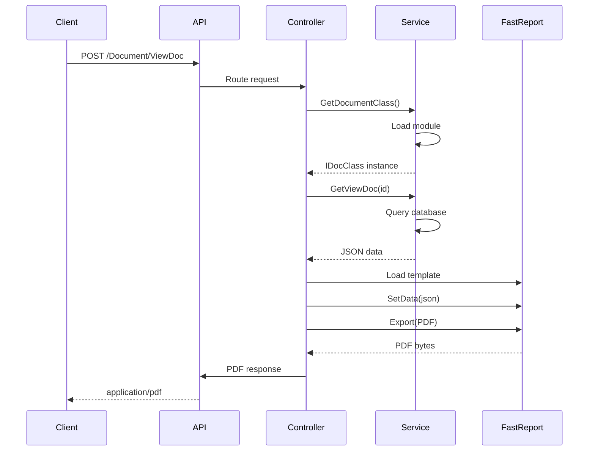

# API Endpoints

## Обзор

TN_Doc предоставляет REST API для генерации документов и мониторинга состояния системы.

## Base URL

```
Development: http://localhost:38509
Production:  http://server-address:38509
```

## Authentication

В текущей версии аутентификация не требуется. В будущих версиях планируется добавление JWT токенов.

## Endpoints

### Documents API

#### Получить список документов

```http
GET /Document/GetListDoc
```

**Query Parameters:**

| Parameter | Type | Required | Description |
|-----------|------|----------|-------------|
| idDevice | string | Yes | ID устройства ИВК |

**Response:**
```json
{
  "success": true,
  "documents": [
    {
      "id": "Passport",
      "name": "Паспорт качества",
      "description": "Паспорт качества по ГОСТ Р 50.2.040"
    },
    {
      "id": "Poverka1974",
      "name": "Протокол поверки ГОСТ Р 8.1011-2022",
      "description": "Поверка СИКН/СИКНП"
    }
  ]
}
```

#### Получить список записей документа

```http
GET /Document/GetListIdDoc
```

**Query Parameters:**

| Parameter | Type | Required | Description |
|-----------|------|----------|-------------|
| idDevice | string | Yes | ID устройства ИВК |
| idDoc | string | Yes | ID типа документа |

**Response:**
```json
{
  "success": true,
  "records": [
    {
      "id": 12345,
      "date": "2025-10-02T14:30:00",
      "description": "Паспорт №ПК-2025-001"
    }
  ]
}
```

#### Сгенерировать документ

```http
POST /Document/ViewDoc
```

**Request Body:**
```json
{
  "idDevice": "IVK-1",
  "idDoc": "Passport",
  "id": 12345,
  "format": "PDF"
}
```

**Response:**
```
Content-Type: application/pdf
Content-Disposition: inline; filename="Passport_12345.pdf"

[PDF binary data]
```

**Format Options:**
- `PDF` (default)
- `Excel`
- `ODS`
- `HTML`

#### Редактировать документ

```http
GET /Document/EditDoc
```

**Query Parameters:**

| Parameter | Type | Required | Description |
|-----------|------|----------|-------------|
| idDevice | string | Yes | ID устройства ИВК |
| idDoc | string | Yes | ID типа документа |
| id | int | Yes | ID записи |

**Response:**
```
Content-Type: text/html

<html>
  <form>...</form>
</html>
```

#### Сохранить изменения документа

```http
POST /Document/SaveDoc
```

**Request Body:**
```json
{
  "idDevice": "IVK-1",
  "idDoc": "Passport",
  "id": 12345,
  "data": {
    "passportNumber": "ПК-2025-001",
    "productName": "Нефть сырая",
    "qualityIndicators": [...]
  }
}
```

**Response:**
```json
{
  "success": true,
  "message": "Документ сохранен"
}
```

### Status API

#### Получить статус системы

```http
GET /api/status
```

**Response:**
```json
{
  "devices": [
    {
      "id": "IVK-1",
      "name": "ИВК №1",
      "type": "database",
      "isConnected": true,
      "latencyMs": 15,
      "lastChecked": "2025-10-02T15:30:00Z",
      "error": null
    }
  ],
  "services": {
    "messagingService": {
      "isConnected": true,
      "latencyMs": 8,
      "lastChecked": "2025-10-02T15:30:00Z",
      "error": null
    },
    "elis": {
      "isConnected": true,
      "latencyMs": 250,
      "lastChecked": "2025-10-02T15:30:00Z",
      "error": null
    }
  },
  "timestamp": "2025-10-02T15:30:00Z"
}
```

### Dictionaries API

#### Получить список справочников

```http
GET /Dictionaries/GetList
```

**Response:**
```json
{
  "dictionaries": [
    {
      "id": "TestMethods",
      "name": "Методы испытаний",
      "itemCount": 25
    },
    {
      "id": "Users",
      "name": "Пользователи",
      "itemCount": 10
    }
  ]
}
```

#### Получить элементы справочника

```http
GET /Dictionaries/GetItems
```

**Query Parameters:**

| Parameter | Type | Required | Description |
|-----------|------|----------|-------------|
| dictionary | string | Yes | ID справочника |

**Response:**
```json
{
  "items": [
    {
      "id": 1,
      "name": "ГОСТ 3900-85",
      "description": "Плотность нефти",
      "isActive": true
    }
  ]
}
```

#### Добавить элемент в справочник

```http
POST /Dictionaries/AddItem
```

**Request Body:**
```json
{
  "dictionary": "TestMethods",
  "name": "ГОСТ 33-2016",
  "description": "Вязкость кинематическая",
  "parameters": {
    "minValue": 0,
    "maxValue": 100,
    "unit": "мм²/с"
  }
}
```

### Printing API

#### Печать документа

```http
POST /Document/Print
```

**Request Body:**
```json
{
  "documentPath": "/PDF/Passport_12345.pdf",
  "printerName": "HP_LaserJet",
  "copies": 1
}
```

**Response:**
```json
{
  "success": true,
  "message": "Документ отправлен на печать"
}
```

## SignalR Hubs

### StatusHub

**Hub URL:**
```
/statusHub
```

**Events:**

#### Server → Client: statusUpdated

```typescript
connection.on("statusUpdated", (data: StatusResponse) => {
  // Обработка обновления статуса
  console.log(data);
});
```

**Data Format:**
```json
{
  "devices": [...],
  "services": {...},
  "timestamp": "2025-10-02T15:30:00Z"
}
```

## Error Responses

### Стандартный формат ошибки

```json
{
  "success": false,
  "error": {
    "code": "DOC_NOT_FOUND",
    "message": "Документ с ID 12345 не найден",
    "details": {
      "idDevice": "IVK-1",
      "idDoc": "Passport",
      "id": 12345
    }
  }
}
```

### HTTP Status Codes

| Code | Description |
|------|-------------|
| 200 | Success |
| 400 | Bad Request (неверные параметры) |
| 404 | Not Found (документ не найден) |
| 500 | Internal Server Error |

## Rate Limiting

В текущей версии rate limiting не применяется.

## Примеры использования

### cURL

```bash
# Получить список документов
curl -X GET "http://localhost:38509/Document/GetListDoc?idDevice=IVK-1"

# Сгенерировать PDF
curl -X POST "http://localhost:38509/Document/ViewDoc" \
  -H "Content-Type: application/json" \
  -d '{"idDevice":"IVK-1","idDoc":"Passport","id":12345}' \
  --output passport.pdf

# Проверить статус
curl -X GET "http://localhost:38509/api/status"
```

### JavaScript

```javascript
// Получить статус системы
fetch('http://localhost:38509/api/status')
  .then(res => res.json())
  .then(data => console.log(data));

// Сгенерировать документ
fetch('http://localhost:38509/Document/ViewDoc', {
  method: 'POST',
  headers: { 'Content-Type': 'application/json' },
  body: JSON.stringify({
    idDevice: 'IVK-1',
    idDoc: 'Passport',
    id: 12345,
    format: 'PDF'
  })
})
.then(res => res.blob())
.then(blob => {
  const url = window.URL.createObjectURL(blob);
  window.open(url);
});
```

### C#

```csharp
using var client = new HttpClient();
client.BaseAddress = new Uri("http://localhost:38509");

// Получить статус
var statusResponse = await client.GetAsync("/api/status");
var status = await statusResponse.Content.ReadFromJsonAsync<StatusResponse>();

// Сгенерировать документ
var request = new
{
    idDevice = "IVK-1",
    idDoc = "Passport",
    id = 12345
};

var docResponse = await client.PostAsJsonAsync("/Document/ViewDoc", request);
var pdfBytes = await docResponse.Content.ReadAsByteArrayAsync();
await File.WriteAllBytesAsync("passport.pdf", pdfBytes);
```

## Sequence Diagrams

### Генерация документа



## См. также

- [SignalR Documentation](signalr.md)
- [Architecture Overview](../architecture/overview.md)
- [Integration Guide](../integration/elis.md)
