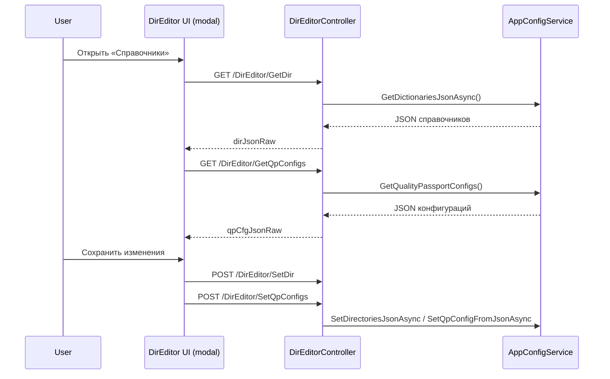

# Редактор справочников (DirEditor)

## Обзор

В текущей версии TN_Doc нет отдельного SPA‑конфигуратора. Вместо этого используется встроенный **редактор справочников** (DirEditor), который открывается модальным окном на главной странице приложения.

**Где находится UI:** `TN_Doc/Views/Home/Index.cshtml` (кнопка **«Справочники»**)

**Основной скрипт:** `TN_Doc/wwwroot/js/DirEditorComponentScript.js`

## Назначение

Редактор предназначен для правки:
- справочников персонала (группы пользователей, пользователи, доверенности)
- конфигурации методов испытаний паспорта качества (QP‑конфиги)

## Архитектура взаимодействия

## Табличные разделы

### Вкладка «Персонал»
- **Группы пользователей** (`UsersGroup`)
- **Пользователи** (`Users`)
- **Доверенности** (`Licenses`)

### Вкладка «Методы испытаний»
- Методы/настройки, используемые для заполнения паспортов качества

## Формат данных

Запросы/ответы передают JSON‑строки в полях:
- `dirJsonRaw` — справочники
- `qpCfgJsonRaw` — конфигурации паспортов качества

## Эндпойнты

См. `docs/api/endpoints.md`:
- `GET /DirEditor/GetDir`
- `POST /DirEditor/SetDir`
- `GET /DirEditor/GetQpConfigs`
- `POST /DirEditor/SetQpConfigs`

