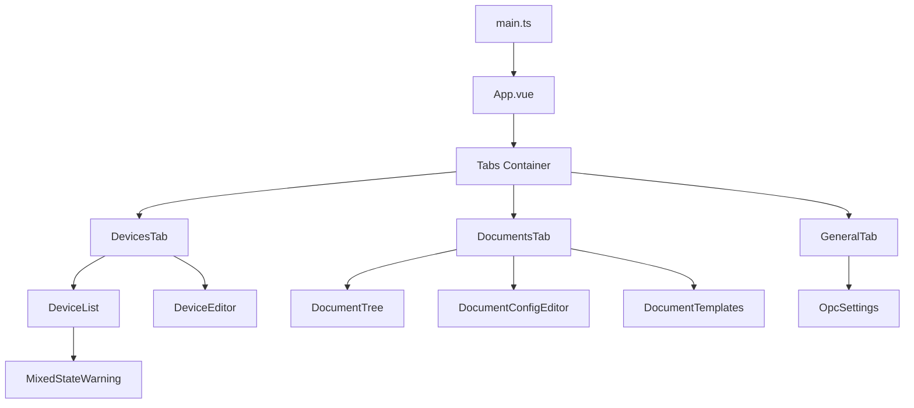
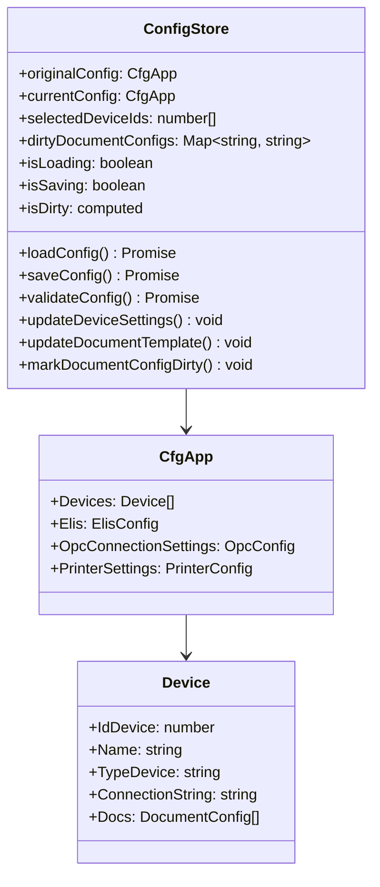
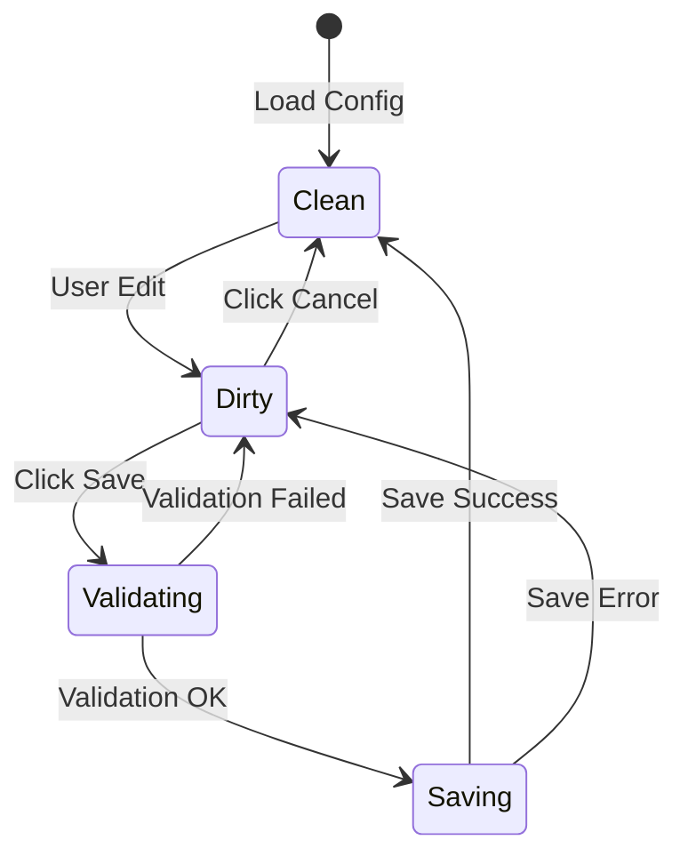
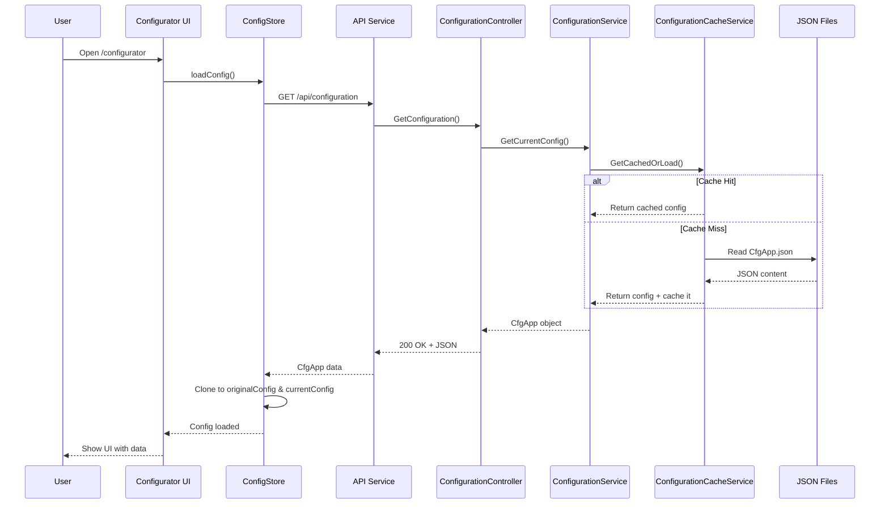
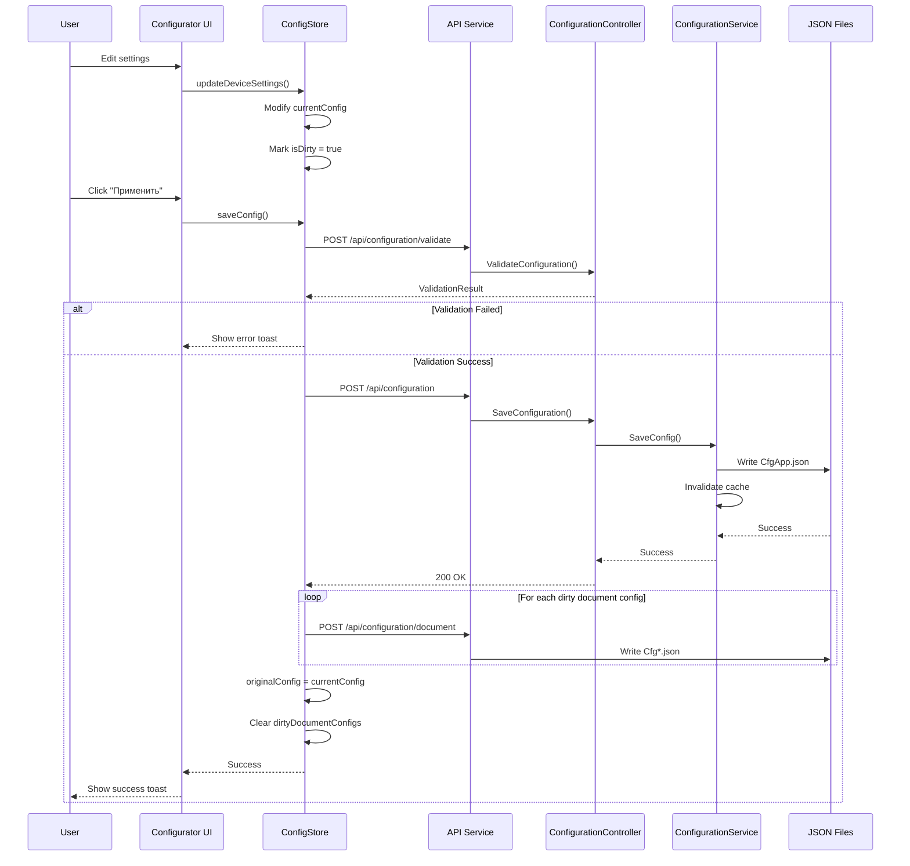
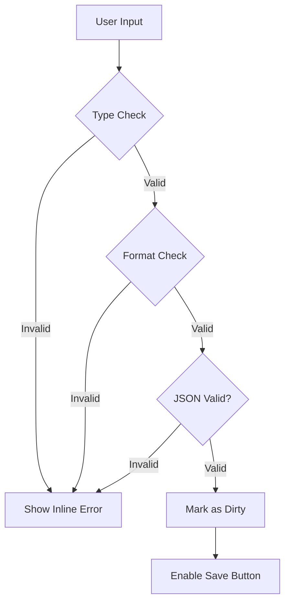
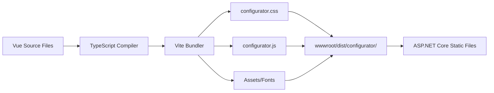
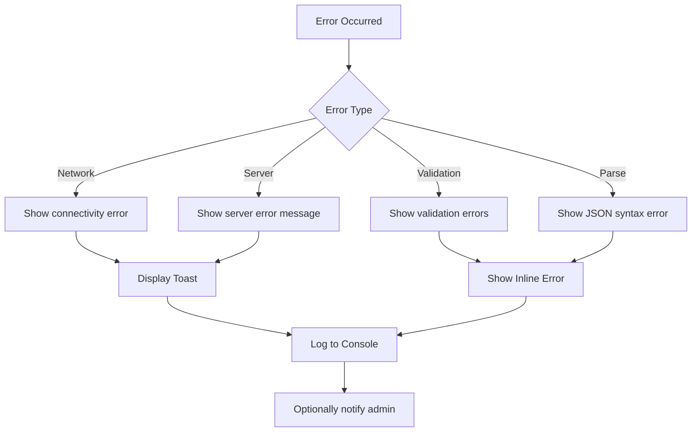
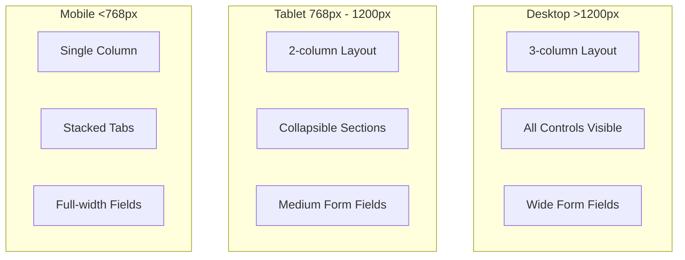

# Configurator Architecture

## Обзор

Configurator — это веб-интерфейс для управления конфигурацией приложения TN_Doc, построенный на **Vue 3 + TypeScript + PrimeVue**. Компонент предоставляет удобный UI для редактирования настроек устройств, документов, ELIS и OPC подключений без необходимости ручного редактирования JSON файлов.

**Статус**: Production (с версии 1.4.2)
**URL**: `/configurator`
**Порт dev-сервера**: 5174

## Архитектура компонента

```mermaid
graph TB
    subgraph "Frontend - Vue 3"
        App[App.vue]
        Tabs[Tabs Component]
        GeneralTab[GeneralTab.vue]
        DevicesTab[DevicesTab.vue]
        DocumentsTab[DocumentsTab.vue]
        Store[Pinia ConfigStore]
        ApiService[API Service]
    end

    subgraph "Backend - ASP.NET Core"
        ConfigController[ConfigurationController]
        ConfigService[IConfigurationService]
        ConfigCacheService[IConfigurationCacheService]
    end

    subgraph "Storage"
        CfgApp[CfgApp.json]
        CfgDoc[Cfg{DocumentType}.json]
        CfgEdit[CfgEdit{DocumentType}.json]
    end

    App --> Tabs
    Tabs --> GeneralTab
    Tabs --> DevicesTab
    Tabs --> DocumentsTab

    GeneralTab --> Store
    DevicesTab --> Store
    DocumentsTab --> Store

    Store --> ApiService
    ApiService <-->|HTTP REST| ConfigController

    ConfigController --> ConfigService
    ConfigService --> ConfigCacheService
    ConfigCacheService --> CfgApp
    ConfigCacheService --> CfgDoc
    ConfigCacheService --> CfgEdit
```

## Основные возможности

### 1. Управление общими настройками (GeneralTab)
- **ELIS настройки**: URL подключения, SSL сертификаты, таймауты
- **OPC настройки**: Параметры OPC DA/UA серверов
- **Глобальные параметры**: Пути к файлам, режимы работы

### 2. Управление устройствами (DevicesTab)
- **Список устройств**: Отображение всех ИВК из конфигурации
- **Множественный выбор**: Массовое редактирование параметров
- **Параметры устройства**:
  - Название и идентификатор
  - Строка подключения к БД
  - Настройки печати
  - Привязка к документам

### 3. Управление документами (DocumentsTab)
- **Дерево документов**: Иерархическое отображение типов документов
- **Редактор шаблонов**: Управление FastReport шаблонами
- **Редактор конфигураций**: Inline редактирование Cfg*.json файлов
- **Валидация**: Проверка JSON перед сохранением

## Frontend Architecture

### Component Hierarchy



### Vue Component Structure

**App.vue** - главный компонент:
```vue
<template>
  <div class="configurator-container">
    <Toast />
    <Tabs>
      <TabList>
        <Tab>Общие</Tab>
        <Tab>Устройства</Tab>
        <Tab>Документы</Tab>
      </TabList>
      <TabPanels>
        <TabPanel><GeneralTab /></TabPanel>
        <TabPanel><DevicesTab /></TabPanel>
        <TabPanel><DocumentsTab /></TabPanel>
      </TabPanels>
    </Tabs>
  </div>
</template>
```

### State Management (Pinia)



### Dirty State Tracking

Конфигуратор отслеживает изменения на двух уровнях:

1. **Основная конфигурация** (`CfgApp.json`):
   - Сравнение `originalConfig` vs `currentConfig` через `lodash.isEqual()`
   - Изменения устройств, общих настроек

2. **Конфигурации документов** (`Cfg*.json`):
   - Отслеживание через `dirtyDocumentConfigs` Map
   - Каждый редактируемый файл помечается как dirty
   - Сохранение всех dirty файлов при нажатии "Применить"



## Data Flow

### Configuration Loading



### Configuration Saving



## Backend API Endpoints

### Configuration Management

| Метод | Endpoint | Описание |
|-------|----------|----------|
| GET | `/api/configuration` | Получить текущую конфигурацию |
| POST | `/api/configuration` | Сохранить конфигурацию |
| POST | `/api/configuration/validate` | Валидировать конфигурацию |
| GET | `/api/configuration/document?path={path}` | Загрузить конфигурацию документа |
| POST | `/api/configuration/document` | Сохранить конфигурацию документа |

### Request/Response Examples

**GET /api/configuration**
```json
{
  "Devices": [
    {
      "IdDevice": 1,
      "Name": "ИВК-1",
      "TypeDevice": "КМХ",
      "ConnectionString": "Server=localhost;Database=ivk1;...",
      "Docs": [...]
    }
  ],
  "Elis": {
    "Url": "https://elis.example.com",
    "CertPath": "Cert/elis.pfx",
    "Timeout": 5000
  },
  "OpcConnectionSettings": {...}
}
```

**POST /api/configuration/validate**
```json
{
  "IsValid": false,
  "Errors": [
    "Устройство 'ИВК-1': некорректная строка подключения",
    "ELIS URL не может быть пустым"
  ],
  "Warnings": [
    "Сертификат ELIS не найден по пути Cert/elis.pfx"
  ]
}
```

## Key Features Implementation

### 1. Множественное редактирование устройств

**DeviceList.vue** поддерживает выбор нескольких устройств через Checkbox:

```typescript
// При изменении чекбокса
function handleSelectionChange(deviceIds: number[]) {
  configStore.selectDevices(deviceIds);
}

// Массовое обновление параметра
function updateMultipleDevices(field: keyof Device, value: any) {
  configStore.updateMultipleDevicesSettings(
    configStore.selectedDeviceIds,
    field,
    value
  );
}
```

**MixedStateWarning.vue** предупреждает о разных значениях:
```vue
<div v-if="hasMixedValues" class="mixed-state-warning">
  ⚠️ Выбранные устройства имеют разные значения для этого поля
</div>
```

### 2. Inline редактор конфигураций документов

**DocumentConfigEditor.vue** позволяет редактировать JSON прямо в UI:

```vue
<template>
  <div class="config-editor">
    <textarea
      v-model="configContent"
      @input="handleContentChange"
      class="json-editor"
      spellcheck="false"
    />
    <div v-if="validationError" class="error">
      {{ validationError }}
    </div>
  </div>
</template>

<script setup lang="ts">
function handleContentChange() {
  try {
    JSON.parse(configContent.value); // Валидация JSON
    configStore.markDocumentConfigDirty(configPath, configContent.value);
    validationError.value = null;
  } catch (e) {
    validationError.value = 'Некорректный JSON';
  }
}
</script>
```

### 3. Управление FastReport шаблонами

**DocumentTemplates.vue** отображает список шаблонов и позволяет включать/отключать:

```typescript
interface TemplateDoc {
  Id: number;
  Name: string;
  PathFile: string;
  Use: boolean; // Использовать этот шаблон
}

function toggleTemplate(deviceId: number, docId: number, templateId: number, use: boolean) {
  configStore.updateDocumentTemplate(deviceId, docId, templateId, use);
}
```

## Validation System

### Client-side Validation



### Server-side Validation

```csharp
public class ConfigurationValidator
{
    public ValidationResult Validate(CfgApp config)
    {
        var result = new ValidationResult { IsValid = true };

        // Проверка устройств
        foreach (var device in config.Devices)
        {
            if (string.IsNullOrEmpty(device.ConnectionString))
                result.Errors.Add($"Устройство '{device.Name}': отсутствует строка подключения");

            // Проверка уникальности IdDevice
            if (config.Devices.Count(d => d.IdDevice == device.IdDevice) > 1)
                result.Errors.Add($"Дублирующийся IdDevice: {device.IdDevice}");
        }

        // Проверка ELIS
        if (config.Elis != null && string.IsNullOrEmpty(config.Elis.Url))
            result.Errors.Add("ELIS URL не может быть пустым");

        result.IsValid = result.Errors.Count == 0;
        return result;
    }
}
```

## Build & Integration

### Build Process



### Development Workflow

```bash
# Запуск dev-сервера с hot reload
cd TN_Doc/Client
npm run dev:configurator
# Доступен на http://localhost:5174

# Production build
npm run build:configurator
# Выходные файлы: TN_Doc/wwwroot/dist/configurator/
```

### Integration with ASP.NET Core

**Views/Configuration/Index.cshtml**:
```html
<!DOCTYPE html>
<html>
<head>
    <link rel="stylesheet" href="~/dist/configurator/configurator.css" />
</head>
<body>
    <div id="configurator-app"></div>
    <script src="~/dist/configurator/configurator.js"></script>
</body>
</html>
```

**Startup.cs**:
```csharp
app.UseStaticFiles(); // Serves wwwroot/dist/configurator/*

app.MapControllerRoute(
    name: "configurator",
    pattern: "configurator",
    defaults: new { controller = "Configuration", action = "Index" }
);
```

## Security Considerations

### 1. Input Validation
- Все пользовательские вводы проверяются на клиенте и сервере
- JSON валидация перед десериализацией
- Проверка путей к файлам (защита от path traversal)

### 2. Authentication & Authorization
- Доступ к `/configurator` требует аутентификации
- Проверка прав на изменение конфигурации
- Логирование всех изменений конфигурации

### 3. Data Sanitization
```typescript
// Экранирование HTML в отображаемых значениях
function sanitizeHtml(value: string): string {
  const div = document.createElement('div');
  div.textContent = value;
  return div.innerHTML;
}
```

## Performance Optimizations

### 1. Configuration Caching
- **IConfigurationCacheService**: LRU кэш для конфигураций (макс. 50 элементов)
- Инвалидация кэша при сохранении
- Снижение нагрузки на файловую систему

### 2. Lazy Loading
```typescript
// Ленивая загрузка конфигураций документов
async function loadDocumentConfig(path: string) {
  if (!loadedConfigs.has(path)) {
    const content = await apiService.loadDocumentConfig(path);
    loadedConfigs.set(path, content);
  }
  return loadedConfigs.get(path);
}
```

### 3. Debounced Saves
```typescript
import { debounce } from 'lodash';

// Отложенная пометка dirty state при вводе JSON
const debouncedMarkDirty = debounce((path: string, content: string) => {
  configStore.markDocumentConfigDirty(path, content);
}, 500);
```

## Error Handling



### Error Display Strategy

| Тип ошибки | Способ отображения | Пример |
|------------|-------------------|--------|
| **Validation** | Inline под полем | "Некорректный формат email" |
| **Network** | Toast уведомление | "Сервер недоступен, попробуйте позже" |
| **Save Failed** | Toast + подробности | "Не удалось сохранить: недостаточно прав" |
| **JSON Parse** | Inline в редакторе | "Ошибка синтаксиса JSON на строке 15" |

## User Experience Features

### 1. Unsaved Changes Warning

```typescript
// Предупреждение при закрытии вкладки с несохранёнными изменениями
window.addEventListener('beforeunload', (e) => {
  if (configStore.isDirty) {
    e.preventDefault();
    e.returnValue = '';
  }
});

// Подтверждение при нажатии "Отмена"
function handleCancel() {
  if (configStore.isDirty) {
    if (!confirm('У вас есть несохранённые изменения. Закрыть без сохранения?')) {
      return;
    }
  }
  configStore.resetConfig();
  closeConfigurator();
}
```

### 2. Real-time Validation Feedback

- ✅ Зелёная галочка при валидном вводе
- ❌ Красная ошибка при невалидном вводе
- ⚠️ Жёлтое предупреждение для warnings

### 3. Loading States

```vue
<button :disabled="isSaving">
  <i v-if="!isSaving" class="pi pi-save"></i>
  <i v-else class="pi pi-spinner pi-spin"></i>
  {{ isSaving ? 'Сохранение...' : 'Применить' }}
</button>
```

## Responsive Design



## Testing Strategy

### Unit Tests
```typescript
describe('ConfigStore', () => {
  it('should detect dirty state after device update', () => {
    const store = useConfigStore();
    store.loadConfig(); // originalConfig set

    store.updateDeviceSettings(1, 'Name', 'New Name');

    expect(store.isDirty).toBe(true);
  });

  it('should validate JSON before marking dirty', () => {
    const store = useConfigStore();
    const invalidJson = '{ invalid json }';

    expect(() => {
      JSON.parse(invalidJson);
    }).toThrow();
  });
});
```

### Integration Tests
```typescript
describe('Configuration Saving Flow', () => {
  it('should save main config and dirty document configs', async () => {
    const store = useConfigStore();
    await store.loadConfig();

    // Изменяем основную конфигурацию
    store.updateDeviceSettings(1, 'Name', 'Updated Device');

    // Изменяем конфигурацию документа
    store.markDocumentConfigDirty('Cfg/CfgPassport.json', '{"updated": true}');

    await store.saveConfig();

    expect(store.isDirty).toBe(false);
    expect(apiService.saveConfig).toHaveBeenCalled();
    expect(apiService.saveDocumentConfig).toHaveBeenCalledWith(
      'Cfg/CfgPassport.json',
      '{"updated": true}'
    );
  });
});
```

## Logging and Monitoring

```typescript
import { logger } from '@tn-doc/shared';

// Информационные логи
logger.info('ConfigStore: конфигурация успешно загружена', {
  deviceCount: config.Devices.length,
  hasElisConfig: !!config.Elis
});

// Логи ошибок
logger.error('ConfigStore: ошибка сохранения конфигурации', {
  error: e.message,
  configPath: 'CfgApp.json'
});

// Debug логи (только в Development)
logger.debug('ConfigStore: загрузка конфигурации документа', { path });
```

## Roadmap

### v1.4.4+ Планируемые улучшения
- [ ] Поддержка темной темы
- [ ] История изменений конфигурации (audit log)
- [ ] Импорт/экспорт конфигураций
- [ ] Расширенная валидация с подсказками
- [ ] Diff-view для сравнения изменений
- [ ] Поддержка отмены/повтора действий (undo/redo)

## См. также

- [StatusBar Architecture](./statusbar.md)
- [Document Editor Architecture](./document-editor.md)
- [API Endpoints Documentation](../api/endpoints.md)
- [Configuration System Overview](../development/setup.md)
- [Vue 3 Documentation](https://vuejs.org/)
- [PrimeVue Components](https://primevue.org/)
- [Pinia State Management](https://pinia.vuejs.org/)
