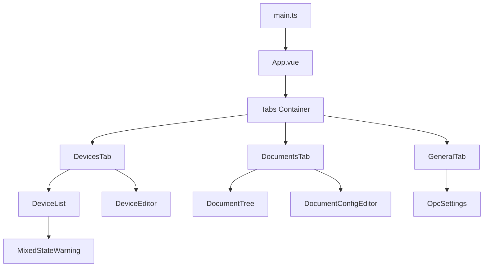
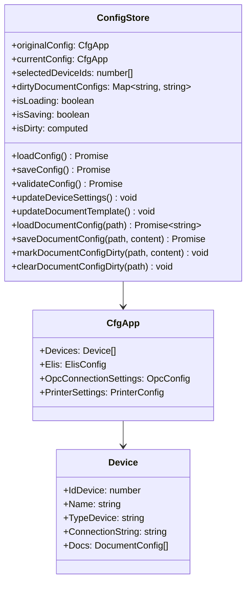
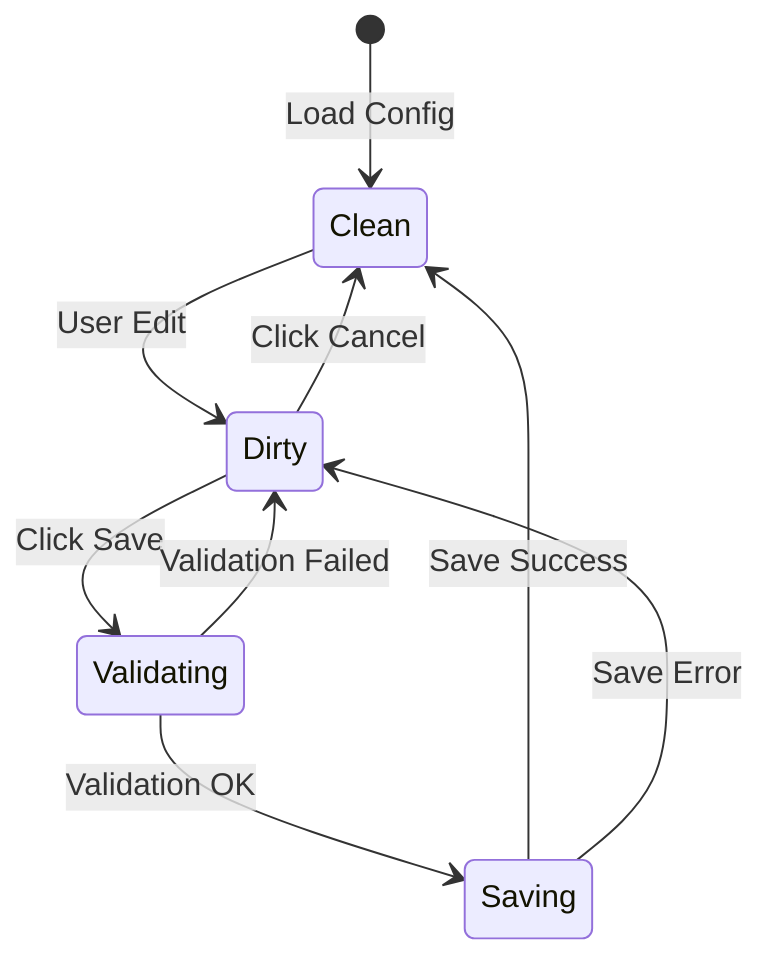
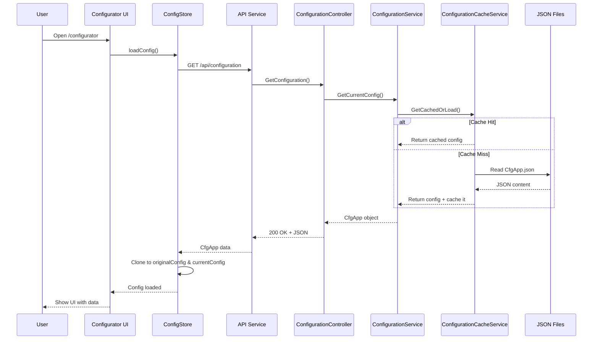
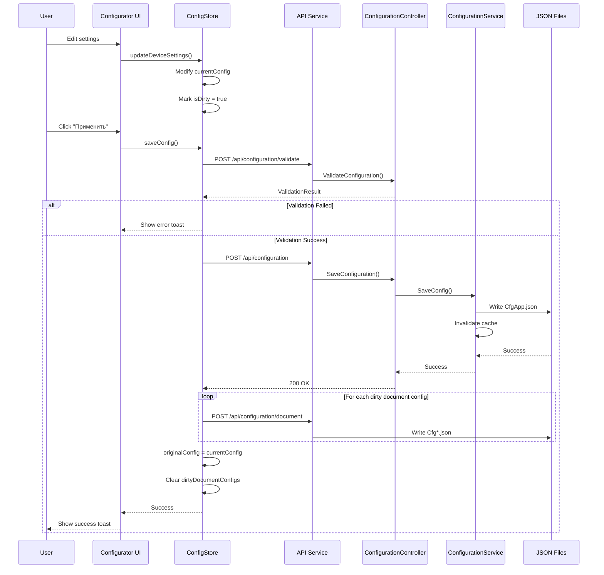
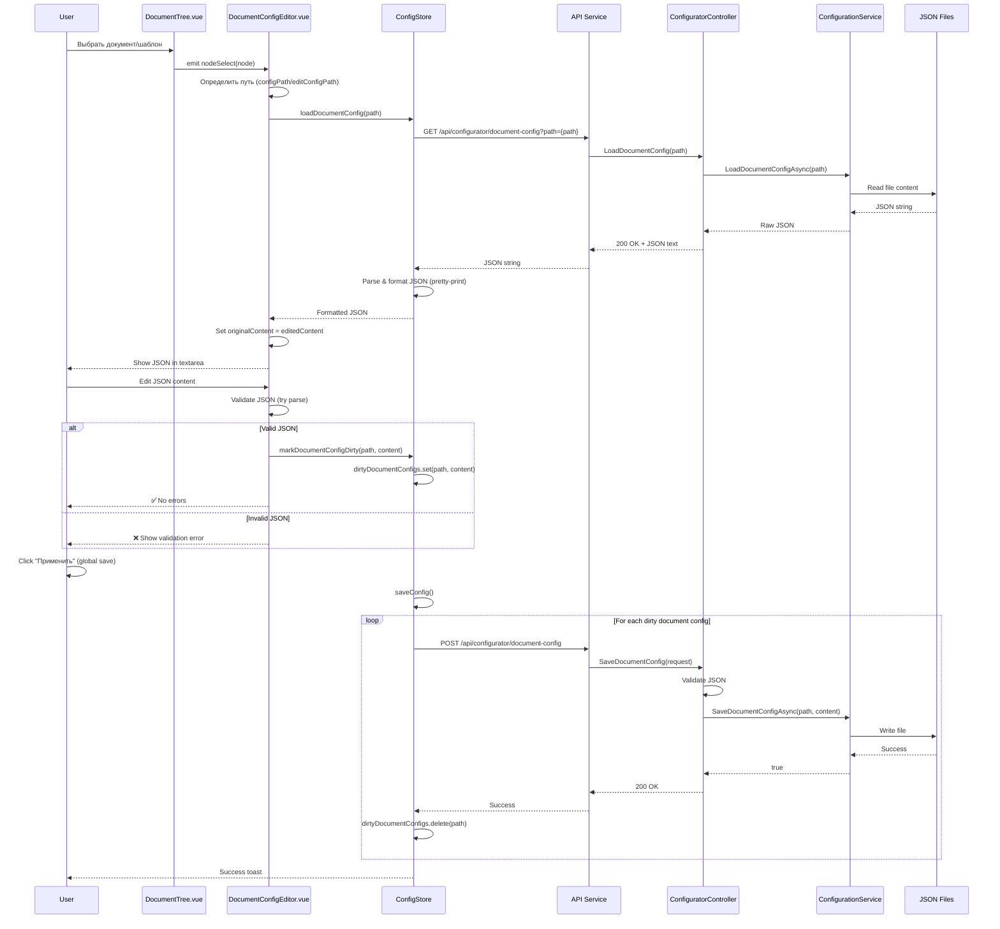
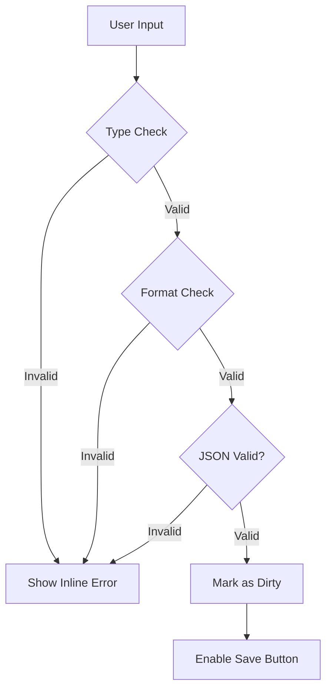
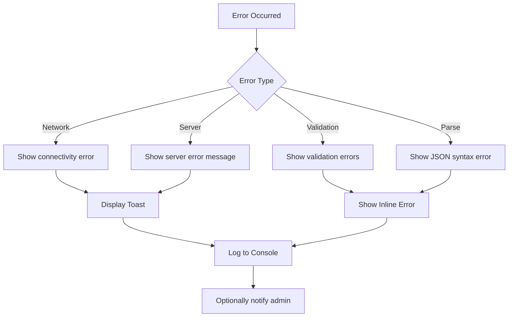
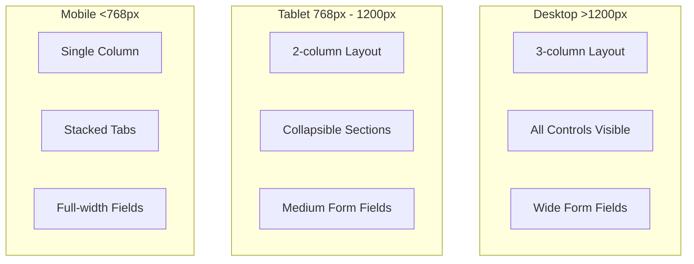

# Configurator Architecture

## Обзор

Configurator — это веб-интерфейс для управления конфигурацией приложения TN_Doc, построенный на **Vue 3 + TypeScript + PrimeVue**. Компонент предоставляет удобный UI для редактирования настроек устройств, документов, ELIS и OPC подключений без необходимости ручного редактирования JSON файлов.

**Статус**: Production (с версии 1.4.2, расширения планируются в 1.4.4)
**URL**: `/configurator`
**Порт dev-сервера**: 5174

## Архитектура компонента

```mermaid
graph TB
    subgraph "Frontend - Vue 3"
        App[App.vue]
        Tabs[Tabs Component]
        GeneralTab[GeneralTab.vue]
        DevicesTab[DevicesTab.vue]
        DocumentsTab[DocumentsTab.vue]
        Store[Pinia ConfigStore]
        ApiService[API Service]
    end

    subgraph "Backend - ASP.NET Core"
        ConfigController[ConfigurationController]
        ConfigService[IConfigurationService]
        ConfigCacheService[IConfigurationCacheService]
    end

    subgraph "Storage"
        CfgApp[CfgApp.json]
        CfgDoc[Cfg{DocumentType}.json]
        CfgEdit[CfgEdit{DocumentType}.json]
    end

    App --> Tabs
    Tabs --> GeneralTab
    Tabs --> DevicesTab
    Tabs --> DocumentsTab

    GeneralTab --> Store
    DevicesTab --> Store
    DocumentsTab --> Store

    Store --> ApiService
    ApiService <-->|HTTP REST| ConfigController

    ConfigController --> ConfigService
    ConfigService --> ConfigCacheService
    ConfigCacheService --> CfgApp
    ConfigCacheService --> CfgDoc
    ConfigCacheService --> CfgEdit
```

## Основные возможности

### 1. Управление общими настройками (GeneralTab)
- **ELIS настройки**: URL подключения, SSL сертификаты, таймауты
- **OPC настройки**: Параметры OPC DA/UA серверов
- **Глобальные параметры**: Пути к файлам, режимы работы

### 2. Управление устройствами (DevicesTab)
- **Список устройств**: Отображение всех ИВК из конфигурации
- **Множественный выбор**: Массовое редактирование параметров
- **Параметры устройства**:
  - Название и идентификатор
  - Строка подключения к БД
  - Настройки печати
  - Привязка к документам

### 3. Управление документами (DocumentsTab) 🚧 Планируется в v1.4.4
- **Дерево документов**: Иерархическое отображение типов документов с фильтрацией по использованию
  - Показываются только активные документы (Use = true)
  - Двухуровневая структура: документ → шаблоны
  - Иконки: 📁 для документов, 📄 для шаблонов
- **Inline редактор конфигураций**:
  - Редактирование `Cfg{DocumentType}.json` для документов
  - Редактирование `CfgEdit{DocumentType}.json` для шаблонов
  - Real-time валидация JSON с подсветкой ошибок
  - Отслеживание несохранённых изменений (dirty state)
- **Split-panel интерфейс**: Дерево слева (30%), редактор справа (70%)
- **Автоматическое форматирование**: JSON форматируется с отступами для удобства чтения

## Frontend Architecture

### Component Hierarchy



### Vue Component Structure

**App.vue** - главный компонент:
```vue
<template>
  <div class="configurator-container">
    <Toast />
    <Tabs>
      <TabList>
        <Tab>Общие</Tab>
        <Tab>Устройства</Tab>
        <Tab>Документы</Tab>
      </TabList>
      <TabPanels>
        <TabPanel><GeneralTab /></TabPanel>
        <TabPanel><DevicesTab /></TabPanel>
        <TabPanel><DocumentsTab /></TabPanel>
      </TabPanels>
    </Tabs>
  </div>
</template>
```

### State Management (Pinia)



### Dirty State Tracking

Конфигуратор отслеживает изменения на двух уровнях:

1. **Основная конфигурация** (`CfgApp.json`):
   - Сравнение `originalConfig` vs `currentConfig` через `lodash.isEqual()`
   - Изменения устройств, общих настроек

2. **Конфигурации документов** (`Cfg*.json`):
   - Отслеживание через `dirtyDocumentConfigs` Map
   - Каждый редактируемый файл помечается как dirty
   - Сохранение всех dirty файлов при нажатии "Применить"



## Data Flow

### Configuration Loading



### Configuration Saving



### Document Configuration Loading (v1.4.4+)



## Backend API Endpoints

### Configuration Management

| Метод | Endpoint | Описание |
|-------|----------|----------|
| GET | `/api/configurator/config` | Получить текущую конфигурацию CfgApp |
| POST | `/api/configurator/config` | Сохранить конфигурацию CfgApp |
| POST | `/api/configurator/validate` | Валидировать конфигурацию CfgApp |
| GET | `/api/configurator/document-config?path={path}` | Загрузить конфигурацию документа (Cfg*.json / CfgEdit*.json) |
| POST | `/api/configurator/document-config` | Сохранить конфигурацию документа |

### Request/Response Examples

**GET /api/configurator/config**
```json
{
  "Devices": [
    {
      "IdDevice": 1,
      "Name": "ИВК-1",
      "TypeDevice": "КМХ",
      "ConnectionString": "Server=localhost;Database=ivk1;...",
      "Docs": [...]
    }
  ],
  "Elis": {
    "Url": "https://elis.example.com",
    "CertPath": "Cert/elis.pfx",
    "Timeout": 5000
  },
  "OpcConnectionSettings": {...}
}
```

**POST /api/configurator/validate**
```json
{
  "IsValid": false,
  "Errors": [
    "Устройство 'ИВК-1': некорректная строка подключения",
    "ELIS URL не может быть пустым"
  ],
  "Warnings": [
    "Сертификат ELIS не найден по пути Cert/elis.pfx"
  ]
}
```

**GET /api/configurator/document-config?path=Cfg/CfgPassport.json** ⭐ NEW в v1.4.4+
```json
{
  "IdDoc": 1,
  "Name": "Паспорт качества",
  "PathToDocConfigFile": "Cfg/CfgPassport.json",
  "PathToDocEditConfigFile": "Cfg/CfgEditPassport.json",
  "TemplateDocs": [
    {
      "Id": 1,
      "Name": "Основной шаблон",
      "PathFile": "Doc/Passport/Passport.frx",
      "Use": true
    }
  ]
}
```

**POST /api/configurator/document-config** ⭐ NEW в v1.4.4+
```json
{
  "path": "Cfg/CfgPassport.json",
  "content": "{\"IdDoc\": 1, \"Name\": \"Паспорт качества\", ...}"
}
```

Response:
```json
{
  "message": "Конфигурация документа успешно сохранена"
}
```

## Key Features Implementation

### 1. Множественное редактирование устройств

**DeviceList.vue** поддерживает выбор нескольких устройств через Checkbox:

```typescript
// При изменении чекбокса
function handleSelectionChange(deviceIds: number[]) {
  configStore.selectDevices(deviceIds);
}

// Массовое обновление параметра
function updateMultipleDevices(field: keyof Device, value: any) {
  configStore.updateMultipleDevicesSettings(
    configStore.selectedDeviceIds,
    field,
    value
  );
}
```

**MixedStateWarning.vue** предупреждает о разных значениях:
```vue
<div v-if="hasMixedValues" class="mixed-state-warning">
  ⚠️ Выбранные устройства имеют разные значения для этого поля
</div>
```

### 2. Inline редактор конфигураций документов (v1.4.4+) ⭐ NEW

**DocumentConfigEditor.vue** позволяет редактировать JSON прямо в UI:

```vue
<template>
  <div class="config-editor">
    <!-- Empty state когда ничего не выбрано -->
    <div v-if="!selectedNode" class="empty-state">
      <i class="pi pi-inbox"></i>
      <p>Выберите документ или шаблон из списка слева</p>
    </div>

    <!-- Редактор конфигурации -->
    <div v-else class="editor-container">
      <div class="editor-header">
        <i :class="selectedNode.icon"></i>
        <h3>{{ selectedNode.label }}</h3>
        <span>{{ currentConfigPath }}</span>
      </div>

      <Textarea
        v-model="editedContent"
        class="json-editor"
        spellcheck="false"
        @input="handleInput"
      />

      <Message v-if="validationError" severity="error">
        <strong>Ошибка JSON:</strong> {{ validationError }}
      </Message>
    </div>
  </div>
</template>

<script setup lang="ts">
function handleInput() {
  try {
    if (editedContent.value.trim()) {
      JSON.parse(editedContent.value); // Валидация JSON
      validationError.value = null;

      // Обновляем dirty state если содержимое изменилось
      if (editedContent.value !== originalContent.value) {
        configStore.markDocumentConfigDirty(currentConfigPath.value, editedContent.value);
      } else {
        configStore.clearDocumentConfigDirty(currentConfigPath.value);
      }
    }
  } catch (e: any) {
    validationError.value = e.message;
  }
}
</script>
```

**Ключевые особенности редактора:**
- **Автоматическое определение типа**: Для документов загружается `PathToDocConfigFile`, для шаблонов - `PathToDocEditConfigFile`
- **Форматирование**: JSON автоматически форматируется с отступами при загрузке
- **Real-time валидация**: Ошибки JSON показываются мгновенно при вводе
- **Dirty state tracking**: Изменения отслеживаются и сохраняются в `dirtyDocumentConfigs` Map
- **Monospace шрифт**: Для удобства редактирования используется `Consolas/Monaco`

### 3. Дерево типов документов (v1.4.4+) ⭐ NEW

**DocumentTree.vue** строит иерархическое дерево документов и шаблонов:

```typescript
// Построение дерева из конфигурации
const treeNodes = computed(() => {
  const nodes: TreeNodeType[] = [];
  const usedDocuments = new Map<number, Set<string>>();

  // Собираем все используемые документы и шаблоны
  for (const device of currentConfig.value.Devices) {
    if (!device.Use || !device.Docs) continue;

    for (const doc of device.Docs) {
      if (!doc.Use) continue;

      if (!usedDocuments.has(doc.IdDoc)) {
        usedDocuments.set(doc.IdDoc, new Set());
      }

      // Добавляем используемые шаблоны
      if (doc.TemplateDocs) {
        for (const template of doc.TemplateDocs) {
          if (template.Use) {
            usedDocuments.get(doc.IdDoc)?.add(`${template.Id}`);
          }
        }
      }
    }
  }

  // Строим дерево только из используемых документов
  return Array.from(documentMap.values());
});
```

**Ключевые особенности дерева:**
- **Фильтрация по использованию**: Показываются только активные документы и шаблоны (`Use = true`)
- **Двухуровневая иерархия**: Документ → Шаблоны
- **Иконки**: `pi-folder` для документов, `pi-file` для шаблонов
- **Единственный выбор**: `selectionMode="single"` - можно выбрать только один элемент
- **Передача данных**: Каждый узел содержит `configPath` и `editConfigPath` для загрузки соответствующих конфигураций

## Validation System

### Client-side Validation



### Server-side Validation

```csharp
public class ConfigurationValidator
{
    public ValidationResult Validate(CfgApp config)
    {
        var result = new ValidationResult { IsValid = true };

        // Проверка устройств
        foreach (var device in config.Devices)
        {
            if (string.IsNullOrEmpty(device.ConnectionString))
                result.Errors.Add($"Устройство '{device.Name}': отсутствует строка подключения");

            // Проверка уникальности IdDevice
            if (config.Devices.Count(d => d.IdDevice == device.IdDevice) > 1)
                result.Errors.Add($"Дублирующийся IdDevice: {device.IdDevice}");
        }

        // Проверка ELIS
        if (config.Elis != null && string.IsNullOrEmpty(config.Elis.Url))
            result.Errors.Add("ELIS URL не может быть пустым");

        result.IsValid = result.Errors.Count == 0;
        return result;
    }
}
```

## Build & Integration

### Build Process

```mermaid
flowchart LR
    Source[Vue Source Files] --> TypeScript[TypeScript Compiler]
    TypeScript --> Vite[Vite Bundler]

    Vite --> Manifest[.vite/manifest.json]
    Vite --> CSS[configurator.[hash].css]
    Vite --> Entry[configurator.[hash].js]
    Vite --> Chunks[configurator.[hash].js (lazy chunks)]
    Vite --> Assets[configurator.[hash].woff2/.ttf/.svg]

    Manifest --> Output[wwwroot/configurator/]
    CSS --> Output[wwwroot/configurator/]
    Entry --> Output
    Chunks --> Output
    Assets --> Output

    Output --> ManifestService[IViteManifestService]
    ManifestService --> Razor[Views/ConfiguratorView/Index.cshtml]
    Razor --> ASPNet[ASP.NET Core Static Files]
```

### Development Workflow

```bash
# Запуск dev-сервера с hot reload
cd TN_Doc/Client
npm run dev:configurator
# Доступен на http://localhost:5174

# Production build
npm run build:configurator
# Выходные файлы: TN_Doc/wwwroot/configurator/
```

### Integration with ASP.NET Core

**Views/ConfiguratorView/Index.cshtml**:
```html
@using TN_Doc.Services
@inject IViteManifestService ViteManifest
@{
    var entryFile = ViteManifest.GetEntryFile("configurator") ?? "configurator.js";
    var cssFile = ViteManifest.GetCssFile("configurator") ?? "configurator.css";
}

<!DOCTYPE html>
<html>
<head>
    <link rel="stylesheet" href="~/configurator/@cssFile" />
</head>
<body>
    <div id="app"></div>
    <script type="module" src="~/configurator/@entryFile"></script>
</body>
</html>
```

**Startup.cs**:
```csharp
services.AddViteManifest();
app.UseStaticFiles(); // Serves wwwroot/configurator/*
```

**Почему без `asp-append-version` для Configurator**:
- Entry и lazy chunks должны иметь одинаковую схему URL (оба с hash в имени), иначе браузер может повторно выполнить `main.ts`.
- Пути к CSS/JS берутся из `manifest.json`, поэтому cache busting сохраняется без query string.

## Security Considerations

### 1. Input Validation
- Все пользовательские вводы проверяются на клиенте и сервере
- JSON валидация перед десериализацией
- Проверка путей к файлам (защита от path traversal)

### 2. Authentication & Authorization
- Доступ к `/configurator` требует аутентификации
- Проверка прав на изменение конфигурации
- Логирование всех изменений конфигурации

### 3. Data Sanitization
```typescript
// Экранирование HTML в отображаемых значениях
function sanitizeHtml(value: string): string {
  const div = document.createElement('div');
  div.textContent = value;
  return div.innerHTML;
}
```

## Performance Optimizations

### 1. Configuration Caching
- **IConfigurationCacheService**: LRU кэш для конфигураций (макс. 50 элементов)
- Инвалидация кэша при сохранении
- Снижение нагрузки на файловую систему

### 2. Lazy Loading
```typescript
// Ленивая загрузка конфигураций документов
async function loadDocumentConfig(path: string) {
  if (!loadedConfigs.has(path)) {
    const content = await apiService.loadDocumentConfig(path);
    loadedConfigs.set(path, content);
  }
  return loadedConfigs.get(path);
}
```

### 3. Debounced Saves
```typescript
import { debounce } from 'lodash';

// Отложенная пометка dirty state при вводе JSON
const debouncedMarkDirty = debounce((path: string, content: string) => {
  configStore.markDocumentConfigDirty(path, content);
}, 500);
```

## Error Handling



### Error Display Strategy

| Тип ошибки | Способ отображения | Пример |
|------------|-------------------|--------|
| **Validation** | Inline под полем | "Некорректный формат email" |
| **Network** | Toast уведомление | "Сервер недоступен, попробуйте позже" |
| **Save Failed** | Toast + подробности | "Не удалось сохранить: недостаточно прав" |
| **JSON Parse** | Inline в редакторе | "Ошибка синтаксиса JSON на строке 15" |

## User Experience Features

### 1. Unsaved Changes Warning

```typescript
// Предупреждение при закрытии вкладки с несохранёнными изменениями
window.addEventListener('beforeunload', (e) => {
  if (configStore.isDirty) {
    e.preventDefault();
    e.returnValue = '';
  }
});

// Подтверждение при нажатии "Отмена"
function handleCancel() {
  if (configStore.isDirty) {
    if (!confirm('У вас есть несохранённые изменения. Закрыть без сохранения?')) {
      return;
    }
  }
  configStore.resetConfig();
  closeConfigurator();
}
```

### 2. Real-time Validation Feedback

- ✅ Зелёная галочка при валидном вводе
- ❌ Красная ошибка при невалидном вводе
- ⚠️ Жёлтое предупреждение для warnings

### 3. Loading States

```vue
<button :disabled="isSaving">
  <i v-if="!isSaving" class="pi pi-save"></i>
  <i v-else class="pi pi-spinner pi-spin"></i>
  {{ isSaving ? 'Сохранение...' : 'Применить' }}
</button>
```

## Responsive Design



## Testing Strategy

### Unit Tests
```typescript
describe('ConfigStore', () => {
  it('should detect dirty state after device update', () => {
    const store = useConfigStore();
    store.loadConfig(); // originalConfig set

    store.updateDeviceSettings(1, 'Name', 'New Name');

    expect(store.isDirty).toBe(true);
  });

  it('should validate JSON before marking dirty', () => {
    const store = useConfigStore();
    const invalidJson = '{ invalid json }';

    expect(() => {
      JSON.parse(invalidJson);
    }).toThrow();
  });
});
```

### Integration Tests
```typescript
describe('Configuration Saving Flow', () => {
  it('should save main config and dirty document configs', async () => {
    const store = useConfigStore();
    await store.loadConfig();

    // Изменяем основную конфигурацию
    store.updateDeviceSettings(1, 'Name', 'Updated Device');

    // Изменяем конфигурацию документа
    store.markDocumentConfigDirty('Cfg/CfgPassport.json', '{"updated": true}');

    await store.saveConfig();

    expect(store.isDirty).toBe(false);
    expect(apiService.saveConfig).toHaveBeenCalled();
    expect(apiService.saveDocumentConfig).toHaveBeenCalledWith(
      'Cfg/CfgPassport.json',
      '{"updated": true}'
    );
  });
});
```

## Logging and Monitoring

```typescript
import { logger } from '@tn-doc/shared';

// Информационные логи
logger.info('ConfigStore: конфигурация успешно загружена', {
  deviceCount: config.Devices.length,
  hasElisConfig: !!config.Elis
});

// Логи ошибок
logger.error('ConfigStore: ошибка сохранения конфигурации', {
  error: e.message,
  configPath: 'CfgApp.json'
});

// Debug логи (только в Development)
logger.debug('ConfigStore: загрузка конфигурации документа', { path });
```

## Bug Fixes (v1.4.4+)

### 1. Исправлено дублирование иконок в дереве документов
**Проблема**: В компоненте DocumentTree иконки отображались дважды - один раз через слот PrimeVue Tree, и второй раз через пользовательский шаблон.

**Решение** (коммит `58359fd`):
```vue
<!-- Было: встроенная иконка Tree + кастомная иконка в слоте -->
<template #default="slotProps">
  <i :class="slotProps.node.icon"></i> <!-- Дублирование! -->
  <span>{{ slotProps.node.label }}</span>
</template>

<!-- Стало: только кастомная иконка из node.data -->
<template #default="slotProps">
  <i v-if="slotProps.node.data?.icon" :class="slotProps.node.data.icon"></i>
  <span>{{ slotProps.node.label }}</span>
</template>
```

### 2. Исправлено двойное парсирование JSON при загрузке конфигурации
**Проблема**: При загрузке конфигурации документа JSON парсился дважды:
1. Axios автоматически парсил JSON-ответ сервера
2. ConfigStore дополнительно вызывал `JSON.parse()` на уже распарсенном объекте → ошибка

**Решение** (коммит `d5abca5`):
```typescript
// Было:
async loadDocumentConfig(configPath: string): Promise<string> {
  const response = await this.api.get('/configurator/document-config', {
    params: { path: configPath }
  });
  return response.data; // Axios уже распарсил JSON в объект!
}

// В ConfigStore:
const content = await apiService.loadDocumentConfig(configPath);
const parsed = JSON.parse(content); // ❌ Ошибка: пытаемся парсить объект!

// Стало:
async loadDocumentConfig(configPath: string): Promise<string> {
  const response = await this.api.get('/configurator/document-config', {
    params: { path: configPath },
    responseType: 'text' // ✅ Получаем сырой JSON-текст
  });
  return response.data; // Теперь это строка!
}

// В ConfigStore:
const content = await apiService.loadDocumentConfig(configPath);
const parsed = JSON.parse(content); // ✅ Парсим строку
return JSON.stringify(parsed, null, 2); // Форматируем
```

**Причина бага**: По умолчанию Axios автоматически парсит JSON-ответы при `Content-Type: application/json`. Чтобы получить сырую строку, нужно явно указать `responseType: 'text'`.

### 3. Исправлено переключение вкладки "Документы" -> "Общие" при клике на паспорт
**Проблема**: при lazy-загрузке визуального редактора браузер повторно выполнял `main.ts`, из-за чего пересоздавался Pinia store и активная вкладка сбрасывалась.

**Причина**: URL entry-модуля в Razor (`?v=...`) не совпадал с URL, который импортировал lazy chunk (без query string).

**Решение** (коммит `16f699fd`):
- В `vite.config.ts` включён `manifest: true`
- Entry/CSS переведены на имена с hash (`configurator.[hash].js/.css`)
- Добавлен `IViteManifestService` для чтения `wwwroot/configurator/.vite/manifest.json`
- `Views/ConfiguratorView/Index.cshtml` подключает файлы из manifest без `asp-append-version`

## Roadmap

### v1.4.5+ Планируемые улучшения
- [ ] Поддержка темной темы
- [ ] История изменений конфигурации (audit log)
- [ ] Импорт/экспорт конфигураций
- [ ] Расширенная валидация с подсказками
- [ ] Diff-view для сравнения изменений
- [ ] Поддержка отмены/повтора действий (undo/redo)
- [ ] Syntax highlighting для JSON в редакторе
- [ ] Поиск по дереву документов

## См. также

- [StatusBar Architecture](./statusbar.md)
- [Document Editor Architecture](./document-editor.md)
- [API Endpoints Documentation](../api/endpoints.md)
- [Configuration System Overview](../development/setup.md)
- [Vue 3 Documentation](https://vuejs.org/)
- [PrimeVue Components](https://primevue.org/)
- [Pinia State Management](https://pinia.vuejs.org/)
