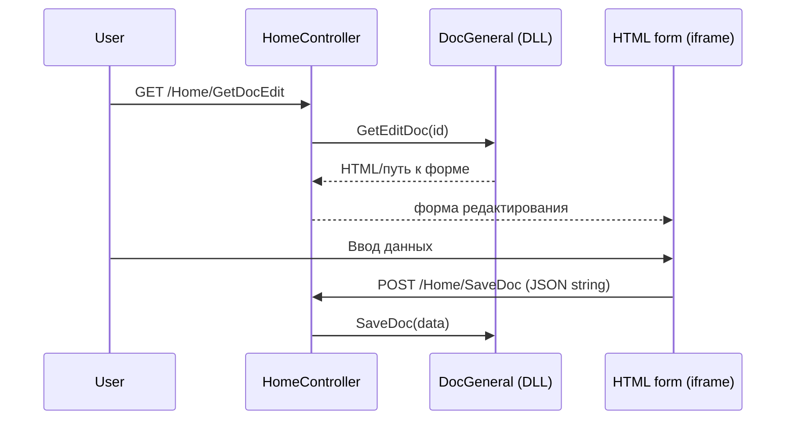

# Редактирование документов (текущий механизм)

## Обзор

В текущей версии TN_Doc редактирование документов реализовано **не через SPA**, а через HTML‑формы, которые загружаются в iframe на главной странице.

**Ключевые элементы:**
- `Home/GetDocEdit` → вызывает `DocGeneral.GetEditDoc()`
- HTML‑форма загружается в iframe (`class="FR"`)
- Сохранение — через `Home/SaveDoc` и (для паспорта) `Home/UpdateDoc`

## Где находится UI

- **Главная страница:** `TN_Doc/Views/Home/Index.cshtml`
- **HTML‑шаблоны:** `TN_Doc/wwwroot/HTML/DocEdit*.html`
- **JS логика:** `TN_Doc/wwwroot/js/EditDoc.js` и `TN_Doc/wwwroot/js/Common.js`

## Поток редактирования

## HTML‑шаблоны

В `wwwroot/HTML/` размещены шаблоны редактирования, например:
- `DocEdit.html`
- `DocEditAct.html`
- `DocEditPassport.html`

Шаблоны подключают скрипт `EditDoc.js`, который собирает значения полей (атрибут `data-edit="1"`) и отправляет их на backend.

## Ограничения

- Редактирование реализовано только для документов, где модуль предоставляет HTML‑форму через `GetEditDoc`.
- Отдельного REST‑API для редактора (как у SPA) в текущей версии нет.

