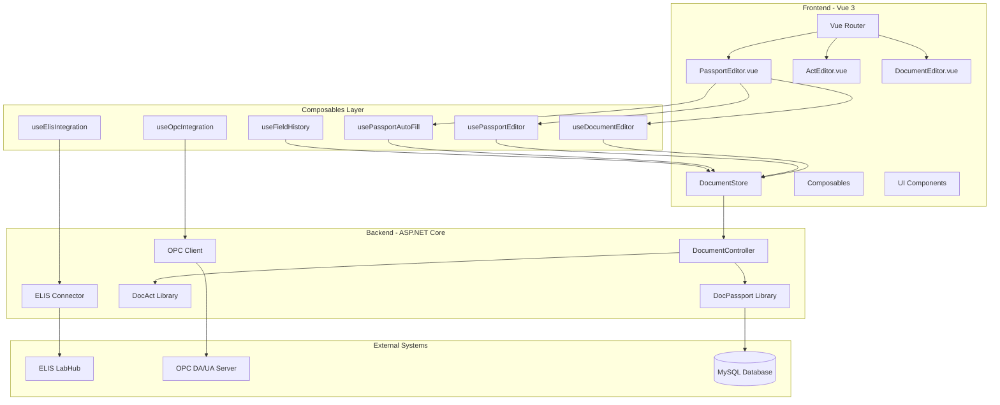
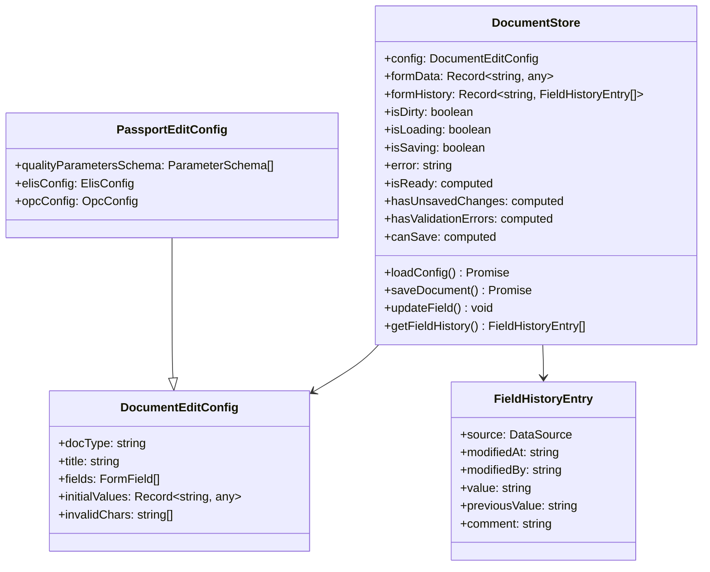
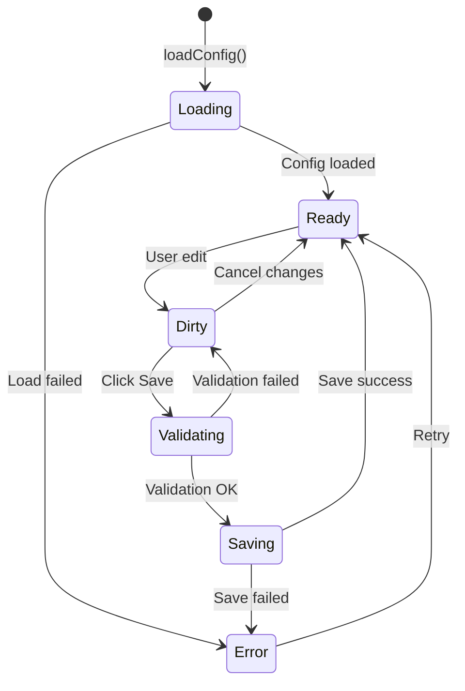
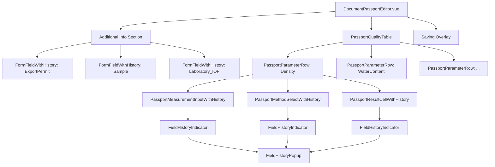
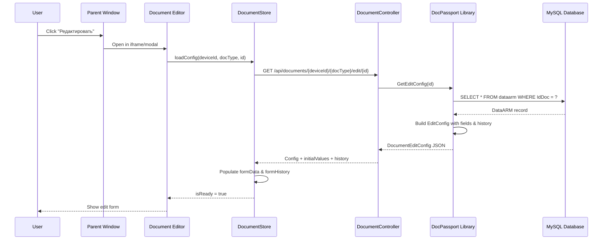
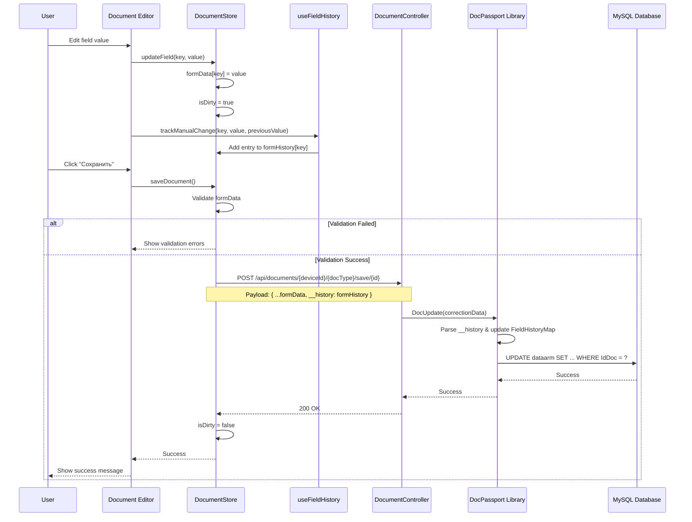
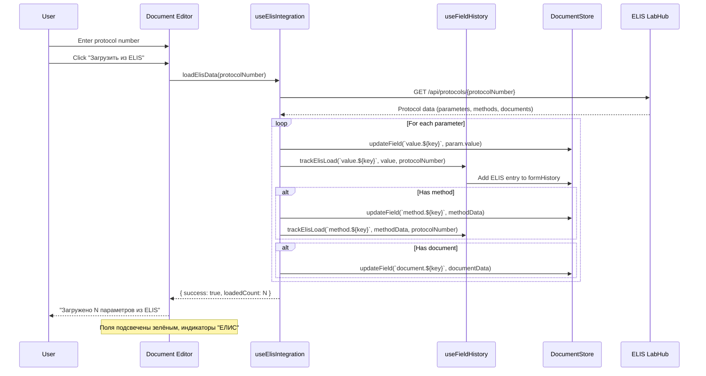
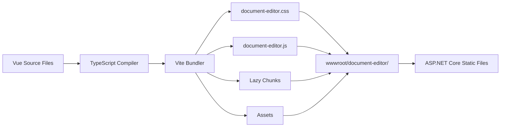

# Document Editor Architecture

## Обзор

Document Editor — это веб-приложение для редактирования документов непосредственно в браузере, построенное на **Vue 3 + TypeScript + PrimeVue + Vue Router**. Компонент предоставляет продвинутый UI для редактирования паспортов качества с поддержкой интеграции с ELIS, OPC, системой истории изменений и автозаполнением зависимых полей.

**Статус**: 🚧 **В разработке** (планируется в v1.4.4)
**Ветка**: `developWork`
**URL**: `/document-editor/edit/{IdDevice}/{IdDoc}/{id}`
**Порт dev-сервера**: 5174
**Production Build**: `TN_Doc/wwwroot/document-editor/`
**Технологии**: Vue 3.5, TypeScript 5.6, PrimeVue 4.2, Pinia 2.2, Vue Router 4.5

## Ключевые возможности

### Планируется в v1.4.4 🚧
- ✅ **Production-ready редактор паспортов качества** - полнофункциональная форма с таблицей параметров
- ✅ **Интеграция с ELIS** - загрузка лабораторных данных из протоколов с визуальной индикацией
- ✅ **Интеграция с OPC** - прямое чтение данных с измерительных приборов ИВК
- ✅ **Система истории изменений полей** - полная трассировка источника данных (ELIS, Manual, IVK)
  - Визуальные индикаторы источника данных (цветные значки)
  - Детальная история до 10 записей на поле в popup окне
  - Автоматическая миграция из устаревшего флага `ElisFilled`
  - Раздельная история для value/method/result/document полей
  - ⚠️ Требует включенного ELIS (`IsUsedElis = true`)
- ✅ **Автозаполнение зависимых параметров** - автоматический расчёт связанных полей с отслеживанием в истории
- ✅ **Валидация в реальном времени** - проверка обязательных полей, формата, округления, некорректных символов
- ✅ **Composables-based архитектура** - модульная структура (useDocumentEditor, usePassportEditor, useFieldHistory, etc.)
- ✅ **Production build pipeline** - автоматическая сборка через npm workspaces
- ✅ **Parent window integration** - postMessage API для взаимодействия с главным окном

### Планируется в v1.4.5+
- 🔄 **Редактирование актов** - специализированный редактор для документов типа Act
- 🔄 **Редактирование других типов документов** - универсальная форма для Report, Journal
- 🔄 **История изменений для всех типов документов** - расширение за пределы Passport
- 🔄 **Улучшенная валидация с подсказками** - контекстные подсказки при ошибках ввода

## Архитектура компонента



## Routing Structure

### URL Pattern

```
/document-editor/edit/{IdDevice}/{IdDoc}/{id}
```

**Примеры:**
- `/document-editor/edit/1/Passport/12345` - Паспорт качества для ИВК-1, документ #12345
- `/document-editor/edit/2/Act/98765` - Акт для ИВК-2, документ #98765
- `/document-editor/edit/3/Report/5555` - Отчет для ИВК-3, документ #5555

### Route Configuration

```typescript
// router/index.ts
const router = createRouter({
  history: createWebHistory(import.meta.env.BASE_URL),
  routes: [
    {
      // Специализированный редактор паспортов качества
      path: '/edit/:deviceId/Passport/:id',
      name: 'passport-editor',
      component: DocumentPassportEditor,
      props: true
    },
    {
      // Специализированный редактор актов
      path: '/edit/:deviceId/Act/:id',
      name: 'act-editor',
      component: DocumentActEditor,
      props: true
    },
    {
      // Общий редактор для других типов документов
      path: '/edit/:deviceId/:docType/:id',
      name: 'editor',
      component: DocumentEditor,
      props: true
    },
    {
      // Страница ошибки
      path: '/error',
      name: 'error',
      component: ErrorPage
    }
  ]
});
```

## State Management (Pinia)

### DocumentStore Architecture



### State Flow



## Component Hierarchy

### Passport Editor View



## Key UI Components

### PassportQualityTable

**Расположение:** `components/passport/PassportQualityTable.vue`

**Функции:**
- Отображение таблицы параметров качества (Edit таблица)
- Управление строками параметров
- Интеграция с ELIS и OPC
- Валидация измерений

**Структура таблицы:**

| Наименование показателя | НД на методы испытаний | Результат испытаний | Результат для печати |
|------------------------|------------------------|---------------------|---------------------|
| Плотность при 20°C     | [Dropdown: ГОСТ 3900] | [Input: 850.567]    | [Auto: 850.57]     |
| Массовая доля воды     | [Dropdown: ГОСТ 2477] | [Input: 0.035]      | [Auto: 0.04]       |

### PassportParameterRow

**Расположение:** `components/passport/PassportParameterRow.vue`

**Props:**
- `parameter: ParameterSchema` - Схема параметра из конфигурации
- `isElisUsed: boolean` - Доступна ли интеграция с ELIS

**Компоненты-потомки:**
1. **PassportMethodSelectWithHistory** - выбор метода испытаний
2. **PassportMeasurementInputWithHistory** - ввод измеренного значения
3. **PassportResultCellWithHistory** - результат для печати (readonly)

### FormFieldWithHistory

**Расположение:** `components/FormFieldWithHistory.vue`

**Функции:**
- Универсальная обёртка для полей с историей изменений
- Поддержка типов: text, number, date, textarea, select
- Валидация некорректных символов
- Отображение индикатора истории

**Типы полей:**
```typescript
type FieldType = 'text' | 'number' | 'date' | 'textarea' | 'select';

interface FormField {
  key: string;
  label: string;
  type: FieldType;
  required: boolean;
  options?: { label: string; value: any }[];
  placeholder?: string;
}
```

### FieldHistoryIndicator & FieldHistoryPopup

См. детальное описание в [История изменений полей](../features/field-history.md)

**FieldHistoryIndicator** - компактный индикатор источника:
- Позиция: правый верхний угол поля
- Размер: 6px для текста, 14px для иконок
- Цвета: Зелёный (ELIS), Синий (Manual), Оранжевый (IVK), Серый (Unknown)

**FieldHistoryPopup** - детальная история в popup:
- Технология: PrimeVue OverlayPanel
- Триггер: Hover на FieldHistoryIndicator
- Содержимое: до 10 последних изменений с датами и значениями

## Composables Architecture

### useDocumentEditor

**Основная логика редактирования документов**

```typescript
export function useDocumentEditor() {
  const store = useDocumentStore();
  const route = useRoute();

  // Загрузка документа
  async function loadDocument() {
    const { deviceId, docType, id } = route.params;
    await store.loadConfig(Number(deviceId), String(docType), Number(id));
  }

  // Сохранение документа
  async function saveDocument() {
    const { deviceId, docType, id } = route.params;
    await store.saveDocument(Number(deviceId), String(docType), Number(id));
  }

  // Экспорт saveDoc для вызова из родительского окна
  function exposeSaveDoc() {
    (window as any).saveDoc = saveDocument;
  }

  // Уведомление родительского окна о состоянии сохранения
  function notifyParentAboutSaveState(canSave: boolean) {
    if (window.parent !== window) {
      window.parent.postMessage({
        action: 'updateSaveButtonState',
        canSave
      }, '*');
    }
  }

  // Предупреждение о несохранённых изменениях
  function setupBeforeUnloadHandler() {
    window.addEventListener('beforeunload', (e) => {
      if (store.hasUnsavedChanges) {
        e.preventDefault();
        e.returnValue = '';
      }
    });
  }

  return {
    store,
    loadDocument,
    saveDocument,
    exposeSaveDoc,
    notifyParentAboutSaveState,
    setupBeforeUnloadHandler
  };
}
```

### usePassportEditor

**Специфичная логика для паспортов качества**

```typescript
export function usePassportEditor() {
  const store = useDocumentStore();

  // Computed свойства для параметров качества
  const qualityParameters = computed(() => {
    const config = store.config as PassportEditConfig;
    return config?.qualityParametersSchema || [];
  });

  const isElisUsed = computed(() => {
    const config = store.config as PassportEditConfig;
    return config?.elisConfig?.isUsed || false;
  });

  const hasQualityParameters = computed(() => qualityParameters.value.length > 0);

  // Обработчики изменений
  function handleMeasurementUpdate(parameterKey: string, value: string) {
    const fieldKey = `value.${parameterKey}`;
    const { trackManualChange } = useFieldHistory();

    const previousValue = store.formData[fieldKey];
    store.updateField(fieldKey, value);
    trackManualChange(fieldKey, value, previousValue);
  }

  function handleMethodUpdate(parameterKey: string, methodData: MethodOption) {
    const fieldKey = `method.${parameterKey}`;
    const { trackManualChange } = useFieldHistory();

    const previousValue = store.formData[fieldKey];
    const newValue = JSON.stringify(methodData);

    store.updateField(fieldKey, newValue);
    trackManualChange(fieldKey, newValue, previousValue);
  }

  function handleResultUpdate(parameterKey: string, value: string) {
    const fieldKey = `result.${parameterKey}`;
    store.updateField(fieldKey, value);
  }

  return {
    qualityParameters,
    isElisUsed,
    hasQualityParameters,
    handleMeasurementUpdate,
    handleMethodUpdate,
    handleResultUpdate
  };
}
```

### usePassportAutoFill

**Автозаполнение зависимых параметров**

```typescript
export function usePassportAutoFill() {
  const store = useDocumentStore();

  function setupAutoFillWatchers() {
    const config = store.config as PassportEditConfig;
    const parameters = config?.qualityParametersSchema || [];

    // Пример: Автозаполнение результата для печати при изменении измерения
    parameters.forEach(param => {
      if (param.roundValue) {
        watch(
          () => store.formData[`value.${param.key}`],
          (newValue) => {
            if (newValue) {
              const rounded = roundToDecimals(newValue, param.roundValue);
              store.updateField(`result.${param.key}`, rounded);
            }
          }
        );
      }
    });

    // Пример: Зависимые параметры (плотность при 15°C → плотность при 20°C)
    if (parameters.some(p => p.key === 'Density15')) {
      watch(
        () => store.formData['value.Density15'],
        (newValue) => {
          if (newValue) {
            // Расчёт плотности при 20°C через таблицу пересчёта
            const density20 = convertDensity15to20(parseFloat(newValue));
            store.updateField('value.Density20', density20.toString());
          }
        }
      );
    }
  }

  return { setupAutoFillWatchers };
}
```

### useElisIntegration

**Интеграция с ELIS для загрузки лабораторных данных**

```typescript
export function useElisIntegration() {
  const store = useDocumentStore();
  const { trackElisLoad } = useFieldHistory();

  async function loadElisData(protocolNumber: string) {
    try {
      const elisData = await elisApi.getProtocol(protocolNumber);

      // Заполнение параметров из ELIS
      elisData.parameters.forEach(param => {
        const parameterKey = mapElisAliasToKey(param.alias);
        if (parameterKey) {
          const fieldKey = `value.${parameterKey}`;
          store.updateField(fieldKey, param.value);

          // Отследить загрузку из ELIS
          trackElisLoad(fieldKey, param.value, protocolNumber);

          // Обновить метод испытаний
          if (param.methodName) {
            const methodKey = `method.${parameterKey}`;
            const methodData = createMethodFromElisData(param);
            store.updateField(methodKey, JSON.stringify(methodData));
            trackElisLoad(methodKey, JSON.stringify(methodData), protocolNumber);
          }

          // Обновить документ ELIS
          if (param.documentNumber) {
            const documentKey = `document.${parameterKey}`;
            const documentData = {
              Number: param.documentNumber,
              Type: param.documentType,
              Date: param.documentDate
            };
            store.updateField(documentKey, JSON.stringify(documentData));
          }
        }
      });

      return { success: true, loadedCount: elisData.parameters.length };
    } catch (error) {
      return { success: false, error: error.message };
    }
  }

  return { loadElisData };
}
```

### useOpcIntegration

**Интеграция с OPC для чтения данных с приборов**

```typescript
export function useOpcIntegration() {
  const store = useDocumentStore();

  async function readOpcTag(tagName: string, parameterKey: string) {
    try {
      const opcData = await opcApi.readTag(tagName);

      const fieldKey = `value.${parameterKey}`;
      store.updateField(fieldKey, opcData.value);

      // Отследить как загрузку из ИВК
      const { trackIVKLoad } = useFieldHistory();
      trackIVKLoad(fieldKey, opcData.value, tagName);

      return { success: true, value: opcData.value };
    } catch (error) {
      return { success: false, error: error.message };
    }
  }

  return { readOpcTag };
}
```

### useFieldHistory

**Управление историей изменений полей**

См. детальное описание в [История изменений полей](../features/field-history.md)

```typescript
export function useFieldHistory() {
  const store = useDocumentStore();

  // Отследить ручное изменение
  function trackManualChange(fieldKey: string, newValue: any, previousValue?: any) {
    const entry: FieldHistoryEntry = {
      source: DataSource.Manual,
      modifiedAt: new Date().toISOString(),
      modifiedBy: 'Пользователь',
      value: normalizeValue(newValue),
      previousValue: previousValue !== undefined ? normalizeValue(previousValue) : undefined,
      comment: 'Отредактировано вручную'
    };

    addHistoryEntry(fieldKey, entry);
  }

  // Отследить загрузку из ELIS
  function trackElisLoad(fieldKey: string, value: any, protocolNumber: string) {
    const entry: FieldHistoryEntry = {
      source: DataSource.ELIS,
      modifiedAt: new Date().toISOString(),
      modifiedBy: 'ELIS',
      value: normalizeValue(value),
      comment: `Загружено из протокола ${protocolNumber}`
    };

    addHistoryEntry(fieldKey, entry);
  }

  // Отследить округление ИВК
  function trackIVKRounding(fieldKey: string, originalValue: any, roundedValue: any, decimals: number) {
    const entry: FieldHistoryEntry = {
      source: DataSource.IVK,
      modifiedAt: new Date().toISOString(),
      modifiedBy: 'ИВК',
      value: normalizeValue(roundedValue),
      previousValue: normalizeValue(originalValue),
      comment: `Округлено до ${decimals} знаков`
    };

    addHistoryEntry(fieldKey, entry);
  }

  return {
    trackManualChange,
    trackElisLoad,
    trackIVKRounding,
    getFieldHistory: (fieldKey: string) => store.formHistory[fieldKey] || [],
    getLastSource: (fieldKey: string) => {
      const history = store.formHistory[fieldKey];
      return history && history.length > 0 ? history[history.length - 1].source : DataSource.Unknown;
    }
  };
}
```

## Data Flow

### Document Loading Flow



### Document Saving Flow



### ELIS Integration Flow



## Validation System

### Client-side Validation Rules

```typescript
// DocumentStore validation
const hasValidationErrors = computed(() => {
  if (!config.value) return false;

  const invalidChars = config.value.invalidChars || [];

  for (const field of config.value.fields) {
    const value = formData.value[field.key];

    // 1. Обязательные поля
    if (field.required && (value === null || value === undefined || value === '')) {
      return true;
    }

    // 2. Некорректные символы
    if (field.type === 'text' && value && typeof value === 'string') {
      for (const char of invalidChars) {
        if (value.includes(char)) {
          return true;
        }
      }
    }
  }

  // 3. Валидация параметров качества (для Passport)
  if (config.value.docType === 'Passport') {
    const passportConfig = config.value as PassportEditConfig;
    const parametersSchema = passportConfig.qualityParametersSchema || [];

    for (const paramSchema of parametersSchema) {
      const measurement = (formData.value[`value.${paramSchema.key}`] ?? '').toString();

      // 3a. Обязательные измерения
      if (paramSchema.requiredFill && !measurement) {
        return true;
      }

      // 3b. Количество знаков после запятой
      if (paramSchema.roundValue && measurement) {
        const normalized = measurement.replace(',', '.');
        const parts = normalized.split('.');
        if (parts.length > 1 && parts[1].length > paramSchema.roundValue) {
          return true;
        }
      }
    }
  }

  return false;
});
```

### Validation Error Display

```mermaid
flowchart TD
    Input[User Input] --> RequiredCheck{Required?}
    RequiredCheck -->|Yes, Empty| ShowRequired[Show "Обязательное поле"]
    RequiredCheck -->|No/Filled| InvalidCharsCheck{Invalid Chars?}

    InvalidCharsCheck -->|Found| ShowInvalidChars["Show 'Недопустимые символы: ...'"]
    InvalidCharsCheck -->|None| NumberCheck{Number field?}

    NumberCheck -->|Yes| DecimalCheck{Too many decimals?}
    DecimalCheck -->|Yes| ShowDecimals["Show 'Максимум N знаков после запятой'"]
    DecimalCheck -->|No| Valid[Valid]

    NumberCheck -->|No| Valid

    ShowRequired --> DisableSave[Disable Save Button]
    ShowInvalidChars --> DisableSave
    ShowDecimals --> DisableSave
    Valid --> EnableSave[Enable Save Button]
```

## Parent Window Integration

Document Editor обычно открывается во вложенном окне (iframe или модальное окно). Связь с родительским окном осуществляется через `postMessage`.

### Messages from Editor to Parent

```typescript
// Уведомление о состоянии кнопки "Сохранить"
window.parent.postMessage({
  action: 'updateSaveButtonState',
  canSave: true  // или false
}, '*');

// Уведомление об успешном сохранении
window.parent.postMessage({
  action: 'documentSaved',
  documentId: 12345
}, '*');

// Запрос на закрытие окна редактора
window.parent.postMessage({
  action: 'closeEditor'
}, '*');
```

### Messages from Parent to Editor

```typescript
// Родительское окно вызывает функцию saveDoc() в iframe
(window.frames[0] as any).saveDoc?.();

// Или через postMessage
editorIframe.contentWindow.postMessage({
  action: 'saveDocument'
}, '*');
```

### Integration Example

```typescript
// В родительском окне (например, главная страница TN_Doc)
const editorIframe = document.getElementById('editor-iframe');

// Обработка сообщений от редактора
window.addEventListener('message', (event) => {
  if (event.data.action === 'updateSaveButtonState') {
    const saveButton = document.getElementById('save-btn');
    saveButton.disabled = !event.data.canSave;
  }

  if (event.data.action === 'documentSaved') {
    // Закрыть модальное окно и обновить список документов
    closeEditorModal();
    refreshDocumentList();
  }
});

// Нажатие на кнопку "Сохранить" в родительском окне
saveButton.addEventListener('click', () => {
  editorIframe.contentWindow.saveDoc();
});
```

## Performance Optimizations

### 1. Lazy Loading Components

```typescript
// Ленивая загрузка редакторов
const DocumentPassportEditor = defineAsyncComponent(() =>
  import('@/views/DocumentPassportEditor.vue')
);

const DocumentActEditor = defineAsyncComponent(() =>
  import('@/views/DocumentActEditor.vue')
);
```

### 2. Debounced Auto-Fill

```typescript
import { debounce } from 'lodash';

// Отложенный расчёт зависимых полей
const debouncedAutoFill = debounce((parameterKey: string, value: string) => {
  // Автозаполнение результата для печати
  const rounded = roundToDecimals(value, param.roundValue);
  store.updateField(`result.${parameterKey}`, rounded);
}, 300);

watch(() => store.formData['value.Density'], (newValue) => {
  debouncedAutoFill('Density', newValue);
});
```

### 3. History Entry Batching

```typescript
// Батчинг записей истории при массовой загрузке из ELIS
const historyBatch: Record<string, FieldHistoryEntry> = {};

elisData.parameters.forEach(param => {
  // Накопление записей
  historyBatch[`value.${param.key}`] = createElisHistoryEntry(param);
});

// Одновременное добавление всех записей
store.addHistoryBatch(historyBatch);
```

## Production Deployment

### Build Process

```bash
# Development с hot reload
cd TN_Doc/Client
npm run dev:editor
# Доступен на http://localhost:5174

# Production build
cd TN_Doc/Client
npm run build:editor

# Или собрать все Vue компоненты одновременно
npm run build:all
```

### Build Output Location

После успешной сборки артефакты располагаются в:
```
TN_Doc/wwwroot/document-editor/
├── index.html
├── assets/
│   ├── index-[hash].js       # Main bundle (~150 KB gzipped)
│   ├── index-[hash].css      # Styles (~50 KB gzipped)
│   ├── vendor-[hash].js      # Vue, PrimeVue, etc. (~200 KB gzipped)
│   └── [lazy-chunks].js      # Route-based code splitting
└── favicon.ico
```

**Важно:**
- Production build автоматически обслуживается ASP.NET Core через `app.UseStaticFiles()`
- При деплое на production сервер необходимо запустить `npm run build:all` перед `dotnet publish`
- Build артефакты включены в `.gitignore` - каждый разработчик собирает локально

### Deployment Checklist

**Перед деплоем на production:**
1. ✅ Убедитесь, что все тесты проходят: `dotnet test`
2. ✅ Соберите Vue компоненты: `cd TN_Doc/Client && npm run build:all`
3. ✅ Проверьте наличие артефактов в `TN_Doc/wwwroot/document-editor/`
4. ✅ Соберите ASP.NET Core приложение: `dotnet publish -c Release`
5. ✅ Проверьте конфигурацию ELIS в `CfgApp.json` (`IsUsedElis = true` для работы истории)
6. ✅ Убедитесь, что база данных имеет актуальную схему с поддержкой `FieldHistoryMap`

### Build Output



### Integration with ASP.NET Core

**Views/Documents/Editor.cshtml**:
```html
<!DOCTYPE html>
<html>
<head>
    <meta charset="utf-8" />
    <meta name="viewport" content="width=device-width, initial-scale=1.0" />
    <title>Редактор документов</title>
    <link rel="stylesheet" href="~/dist/document-editor/document-editor.css" />
</head>
<body>
    <div id="app"></div>
    <script src="~/dist/document-editor/document-editor.js"></script>
</body>
</html>
```

**Startup.cs**:
```csharp
app.UseStaticFiles(); // Serves wwwroot/document-editor/*

app.MapControllerRoute(
    name: "editor",
    pattern: "editor/{*path}",
    defaults: new { controller = "Documents", action = "Editor" }
);
```

## Error Handling

```mermaid
flowchart TD
    Error[Error Occurred] --> Type{Error Type}

    Type -->|Network| NetworkError[Connection error]
    Type -->|Validation| ValidationError[Validation failed]
    Type -->|Server| ServerError[Server error]
    Type -->|ELIS| ElisError[ELIS unavailable]
    Type -->|OPC| OpcError[OPC read failed]

    NetworkError --> Toast1[Toast: "Нет связи с сервером"]
    ValidationError --> Inline[Inline error under field]
    ServerError --> Toast2[Toast: Show server message]
    ElisError --> Toast3[Toast: "ELIS недоступен"]
    OpcError --> Toast4[Toast: "Не удалось прочитать данные с ИВК"]

    Toast1 --> Log[Log to console]
    Inline --> Log
    Toast2 --> Log
    Toast3 --> Log
    Toast4 --> Log

    Log --> Retry{Retryable?}
    Retry -->|Yes| RetryBtn[Show Retry Button]
    Retry -->|No| Support[Show Support Contact]
```

## Security Considerations

### 1. Input Sanitization

```typescript
// Защита от XSS при отображении значений
function sanitizeHtml(value: string): string {
  const div = document.createElement('div');
  div.textContent = value;
  return div.innerHTML;
}

// Валидация недопустимых символов
const invalidChars = ['<', '>', '&', '"', "'", '\\'];
function containsInvalidChars(value: string): boolean {
  return invalidChars.some(char => value.includes(char));
}
```

### 2. CSRF Protection

```typescript
// API Service добавляет CSRF токен к запросам
const documentApi = {
  async saveDocument(deviceId: number, docType: string, id: number, data: any) {
    return axios.post(
      `/api/documents/${deviceId}/${docType}/save/${id}`,
      data,
      {
        headers: {
          'X-CSRF-TOKEN': getCsrfToken()
        }
      }
    );
  }
};
```

### 3. Access Control

```csharp
// Backend проверяет права доступа
[Authorize]
[HttpPost("api/documents/{deviceId}/{docType}/save/{id}")]
public async Task<IActionResult> SaveDocument(int deviceId, string docType, int id)
{
    // Проверка прав на редактирование документов для данного устройства
    if (!User.HasPermission($"documents.{deviceId}.edit"))
    {
        return Forbid();
    }

    // ...
}
```

## Testing Strategy

### Unit Tests

```typescript
// DocumentStore tests
describe('DocumentStore', () => {
  it('should mark document as dirty after field update', () => {
    const store = useDocumentStore();
    store.loadConfig(1, 'Passport', 12345);

    store.updateField('ExportPermit', 'New Value');

    expect(store.isDirty).toBe(true);
  });

  it('should validate required fields', () => {
    const store = useDocumentStore();
    store.config = {
      fields: [{ key: 'ExportPermit', required: true }]
    };
    store.formData = { ExportPermit: '' };

    expect(store.hasValidationErrors).toBe(true);
  });
});

// useFieldHistory tests
describe('useFieldHistory', () => {
  it('should track manual change', () => {
    const { trackManualChange, getFieldHistory } = useFieldHistory();

    trackManualChange('value.Density', '850.567', '850.5');

    const history = getFieldHistory('value.Density');
    expect(history.length).toBe(1);
    expect(history[0].source).toBe(DataSource.Manual);
  });
});
```

### Integration Tests

```typescript
describe('ELIS Integration', () => {
  it('should load data from ELIS and track history', async () => {
    const { loadElisData } = useElisIntegration();
    const { getFieldHistory } = useFieldHistory();

    const result = await loadElisData('ПР-2024-12345');

    expect(result.success).toBe(true);
    const history = getFieldHistory('value.Density');
    expect(history[0].source).toBe(DataSource.ELIS);
    expect(history[0].comment).toContain('ПР-2024-12345');
  });
});
```

## Known Limitations

### v1.4.4 Production Release

**Функциональные ограничения:**
- ⚠️ **История изменений требует включенного ELIS**
  - Необходимо `IsUsedElis = true` в `CfgApp.json`
  - При выключенном ELIS история не сохраняется и не отображается
  - Индикаторы `FieldHistoryIndicator` скрываются автоматически
- ⚠️ **Реализовано только для документа Passport**
  - Act, Report, Journal - в планах на v1.4.5+
  - Универсальный редактор `DocumentEditor.vue` существует, но требует доработки
- ⚠️ **ФИО пользователя недоступно**
  - В истории изменений используется "Пользователь" вместо реального имени
  - Требует интеграции с системой аутентификации ASP.NET Core

**Технические ограничения:**
- ⚠️ **Офлайн режим не поддерживается** - требуется постоянное подключение к серверу
- ⚠️ **Нет мобильной версии** - UI оптимизирован только для desktop (минимум 1024px)
- ⚠️ **Отсутствует Undo/Redo** - нельзя отменить изменения внутри сессии редактирования
- ⚠️ **История ограничена 10 записями** - старые изменения удаляются автоматически (FIFO)

## Roadmap

### ✅ v1.4.4 (Завершено - Январь 2025)
- ✅ Production-ready редактор паспортов качества (DocumentPassportEditor)
- ✅ Система истории изменений полей (ELIS, Manual, IVK tracking)
- ✅ Интеграция с ELIS (загрузка протоколов)
- ✅ Интеграция с OPC (чтение данных с ИВК)
- ✅ Автозаполнение зависимых параметров
- ✅ Валидация в реальном времени
- ✅ UI компоненты истории (FieldHistoryIndicator, FieldHistoryPopup)
- ✅ Composables-based архитектура
- ✅ Parent window integration (postMessage API)
- ✅ Production build pipeline

### 🔄 v1.4.5 (Q1 2025)
- [ ] Редактор актов (DocumentActEditor) - production ready
- [ ] Общий редактор для Report/Journal (DocumentEditor refactoring)
- [ ] История изменений для Act, Report, Journal
- [ ] Улучшенная валидация с контекстными подсказками
- [ ] Интеграция с ASP.NET Core Identity для отображения реального ФИО пользователя

### 🔮 v1.4.6+ (Q2 2025+)
- [ ] Темная тема (dark mode support)
- [ ] Офлайн режим с синхронизацией при восстановлении связи
- [ ] Адаптивная мобильная версия (responsive design)
- [ ] Расширенная интеграция с OPC UA (подписки на изменения)
- [ ] Экспорт/импорт данных из Excel
- [ ] Полный аудит логирование всех изменений
- [ ] Undo/Redo функциональность (локальная история действий)
- [ ] Массовое редактирование документов (bulk edit)
- [ ] Поддержка нескольких языков (i18n)

## См. также

### Внутренняя документация
- [История изменений полей](../features/field-history.md) - детальное описание системы истории изменений
- [StatusBar Architecture](./statusbar.md) - архитектура строки состояния
- [Configurator Architecture](./configurator.md) - архитектура конфигуратора
- [ELIS Integration](../integration/elis.md) - интеграция с ЕЛИС
- [API Endpoints](../api/endpoints.md) - документация API endpoints

### Внешние ресурсы
- [Vue 3 Documentation](https://vuejs.org/) - официальная документация Vue 3
- [PrimeVue Components](https://primevue.org/) - библиотека UI компонентов
- [Pinia State Management](https://pinia.vuejs.org/) - state management для Vue
- [Vue Router](https://router.vuejs.org/) - официальный роутер для Vue
- [TypeScript Documentation](https://www.typescriptlang.org/docs/) - документация TypeScript

---

## История изменений документа

**2025-01-17 - Актуализация для Production Ready (v1.4.4)**
- ✅ Изменён статус с "В активной разработке" на "Production Ready"
- ✅ Переработана секция "Реализовано в v1.4.4" - добавлены детали всех завершённых функций
- ✅ Добавлена секция "Known Limitations" с разделением на функциональные и технические ограничения
- ✅ Обновлён Roadmap - перенесены завершённые задачи из "Планируется" в "Реализовано"
- ✅ Добавлена секция "Production Deployment" с deployment checklist и build output
- ✅ Добавлена ссылка на документацию системы истории изменений полей
- ✅ Актуализирована информация о ветке разработки (developWork)
- ✅ Добавлена информация о версиях технологий (Vue 3.5, TypeScript 5.6, etc.)

**2024-12-15 - Первоначальная версия**
- Базовая архитектурная документация
- Описание composables и компонентов
- Mermaid диаграммы
- Примеры кода
