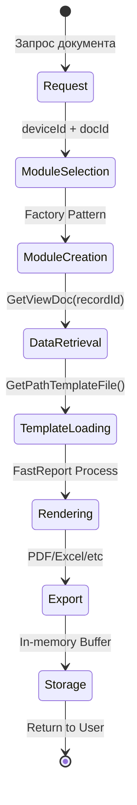
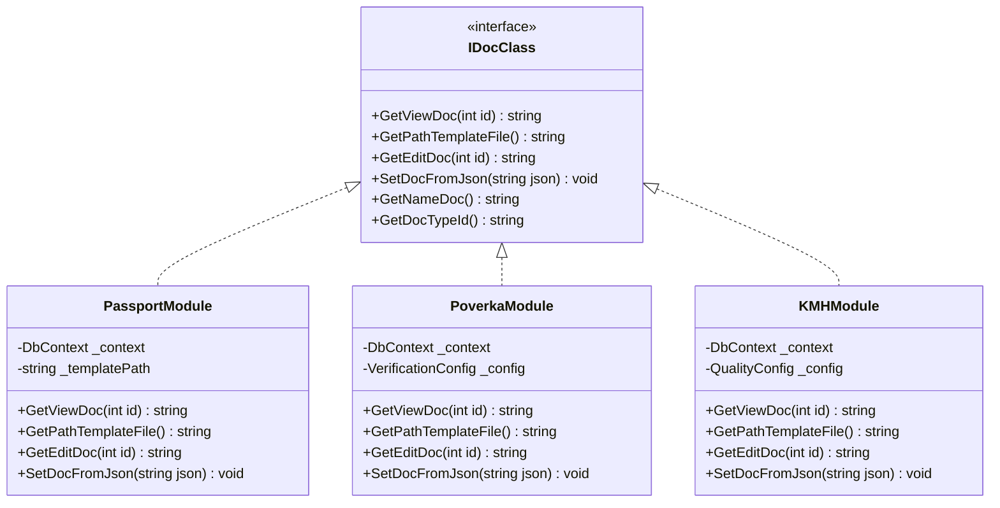
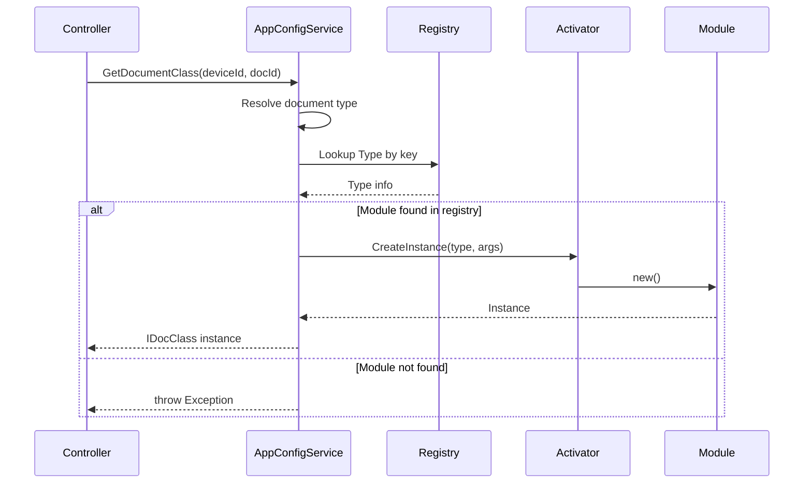
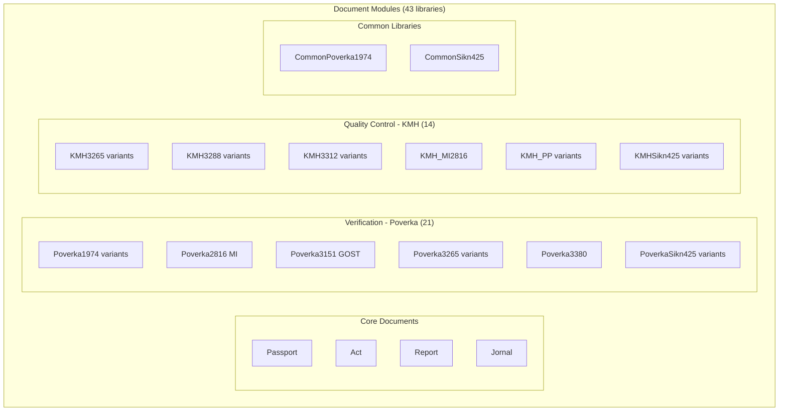
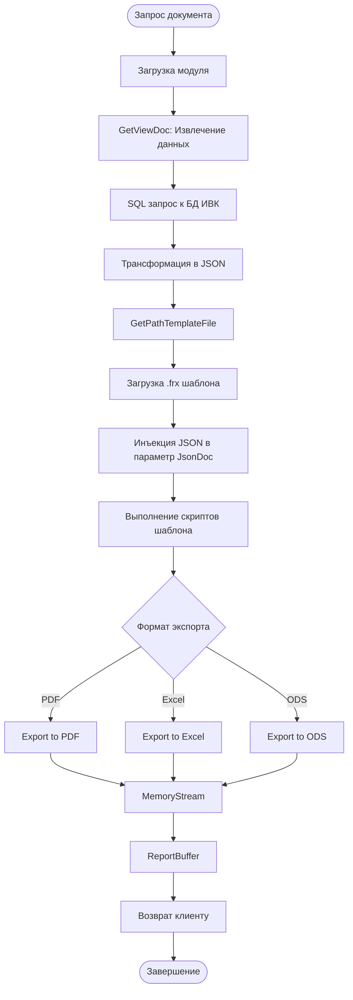
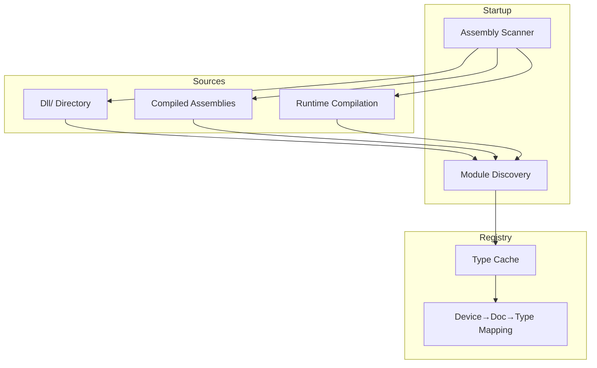
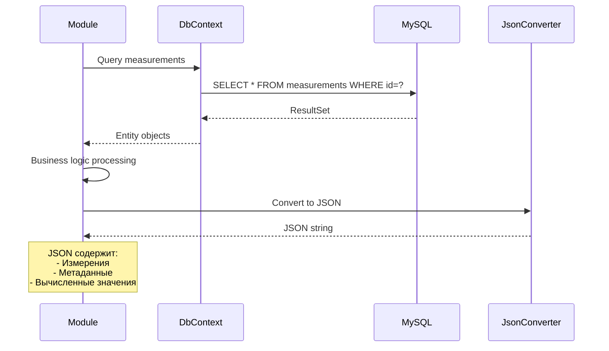
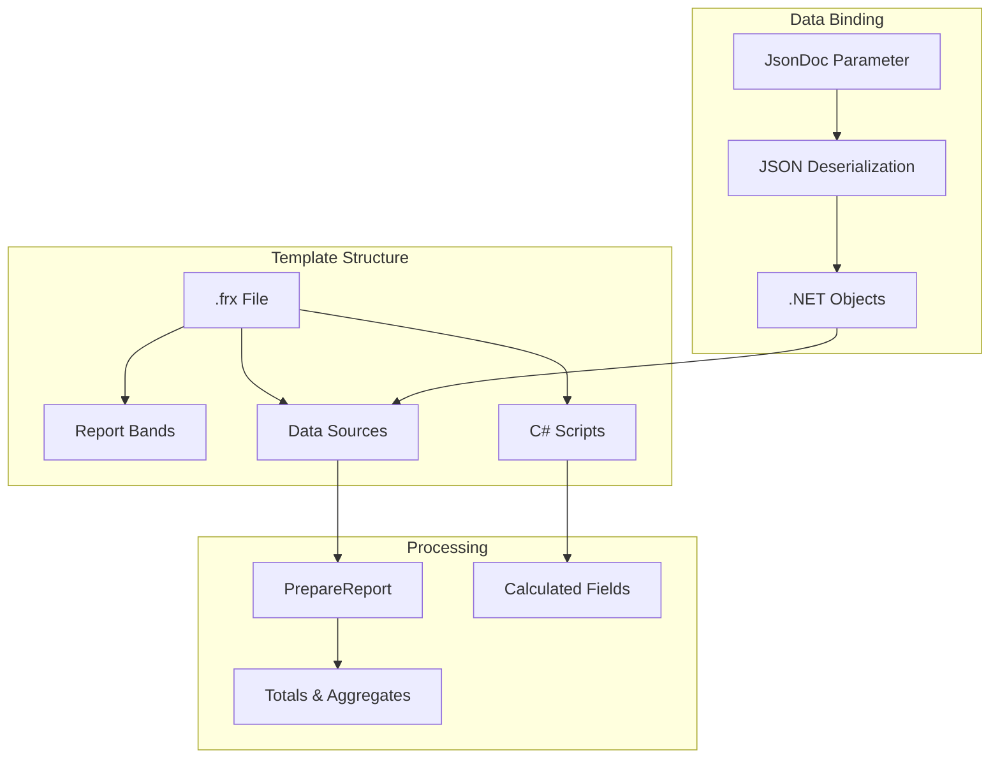
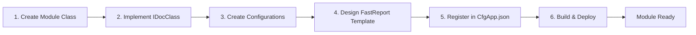

# Архитектура модулей документов

## Обзор

Система генерации документов построена на основе модульной архитектуры с использованием паттерна **Factory** и динамической загрузки модулей.

## Жизненный цикл документа



## Интерфейс модуля документа

Все модули документов реализуют стандартный интерфейс `IDocClass`:



## Фабрика документов



## Структура модулей документов

### Организация по типам



### Категории документов

#### 1. Passport (Паспорта качества)
- **Назначение**: Сертификация качества нефтепродуктов
- **Стандарты**: ГОСТ Р 50.2.040, МИ 3532, EAC
- **Особенности**:
  - Интеграция с ELIS
  - Справочники показателей качества
  - Методы испытаний

#### 2. Poverka (Протоколы поверки) - 21 модуль
- **Назначение**: Поверка измерительных систем
- **Стандарты**:
  - ГОСТ Р 8.1011-2022 (4 варианта 1974)
  - МИ 2816
  - ГОСТ 3151, 3189, 3265, 3267, 3272, 3287, 3288, 3312, 3380
  - SIKN-425 (2 варианта)

#### 3. KMH (Контроль метрологических характеристик) - 14 модулей
- **Назначение**: Текущий контроль точности измерений
- **Типы**:
  - По давлению (PR_PU, PR_PR)
  - По плотности (PP, PP_Areom)
  - По массе/объему (PW, PV)
  - По температуре (TPR)
  - SIKN-425 (2 варианта)

#### 4. Act (Акты приема-сдачи)
- **Назначение**: Документирование приема-передачи нефтепродуктов
- **Особенности**: Автоматическое заполнение из паспортов

#### 5. Report & Jornal (Отчеты и журналы)
- **Назначение**: Сводные отчеты и журналы учета
- **Типы**: По периодам, по показателям

## Конфигурация модулей

### Структура конфигурационных файлов

```mermaid
graph LR
    subgraph "Configuration Files"
        CFG[Cfg{DocType}.json]
        EDIT[CfgEdit{DocType}.json]
        TEMPLATE[{Number}_{DocType}.frx]
    end

    subgraph "Configuration Data"
        PATH[Template Path]
        EXPORT[Export Settings]
        FIELDS[Form Fields]
        VALIDATION[Validation Rules]
    end

    CFG --> PATH
    CFG --> EXPORT
    EDIT --> FIELDS
    EDIT --> VALIDATION
    TEMPLATE --> PATH
```

### Пример конфигурации

**CfgPassport.json:**
```json
{
  "PathTemplateFile": "Doc/Passport/Passport_GOSTR50.2.040(I).frx",
  "ShowEditButton": true,
  "EnableELISIntegration": true,
  "ExportFormats": ["PDF", "Excel"]
}
```

**CfgEditPassport.json:**
```json
{
  "Fields": [
    {
      "Name": "PassportNumber",
      "Type": "String",
      "Required": true,
      "MaxLength": 50
    },
    {
      "Name": "ProductName",
      "Type": "Dictionary",
      "DictionarySource": "Products"
    }
  ]
}
```

## Процесс генерации документа



## Загрузка модулей

### Стратегия загрузки



### Регистрация модулей

**Автоматическая регистрация:**
```csharp
// При старте приложения
foreach (var assembly in LoadedAssemblies)
{
    var documentTypes = assembly.GetTypes()
        .Where(t => typeof(IDocClass).IsAssignableFrom(t))
        .Where(t => !t.IsInterface && !t.IsAbstract);

    foreach (var type in documentTypes)
    {
        var attribute = type.GetCustomAttribute<DocumentTypeAttribute>();
        _registry[attribute.TypeId] = type;
    }
}
```

## Работа с данными

### Извлечение данных из БД



### Формат JSON данных

```json
{
  "DocType": "Passport",
  "Header": {
    "Number": "ПК-2025-001",
    "Date": "2025-10-02",
    "Device": "ИВК-1"
  },
  "Measurements": [
    {
      "Parameter": "Density",
      "Value": 850.5,
      "Unit": "kg/m³",
      "Method": "ГОСТ 3900"
    }
  ],
  "QualityIndicators": {
    "Viscosity": {
      "Value": 5.2,
      "Norm": "5.0 - 6.0",
      "Result": "Соответствует"
    }
  }
}
```

## FastReport Integration



## Расширение системы новым модулем

### Шаги добавления нового модуля

1. **Создать класс модуля:**
```csharp
[DocumentType("NewDoc")]
public class NewDocModule : IDocClass
{
    public string GetViewDoc(int id) { /* ... */ }
    public string GetPathTemplateFile() { /* ... */ }
    public string GetEditDoc(int id) { /* ... */ }
    public void SetDocFromJson(string json) { /* ... */ }
}
```

2. **Создать конфигурацию:**
   - `Cfg/CfgNewDoc.json`
   - `Cfg/CfgEditNewDoc.json`

3. **Создать шаблон FastReport:**
   - `Doc/NewDoc/{Number}_NewDoc.frx`

4. **Зарегистрировать в CfgApp.json:**
```json
{
  "Devices": [
    {
      "IdDevice": "IVK-1",
      "Documents": [
        {
          "IdDoc": "NewDoc",
          "DisplayName": "Новый документ",
          "ModuleAssembly": "TN.NewDoc.dll"
        }
      ]
    }
  ]
}
```



## См. также

- [Architecture Overview](overview.md)
- [FastReport Templates Guide](../development/fastreport-templates.md)
- [Adding New Module Tutorial](../development/new-module-tutorial.md)
