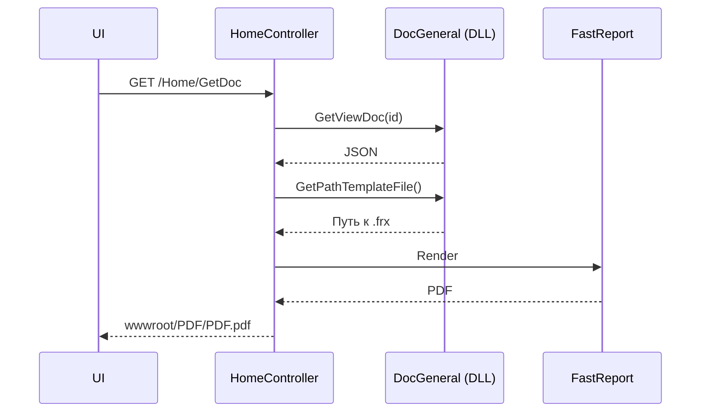

# Архитектура модулей документов

## Обзор

Документы реализованы как отдельные **DLL‑модули**, которые динамически загружаются приложением. Конфигурация модулей хранится в `CfgApp.json` (пути к DLL, конфигам и шаблонам).

**Актуальная версия:** 1.3.8

## Где находятся модули

Подмодуль `tn.docgeneral/` содержит библиотеки документов:
- `Passport`, `Act`, `Jornal`, `Report`
- семейства `Poverka*` и `KMH*`
- вспомогательные общие библиотеки

## Конфигурация (CfgApp.json)

Каждый документ описан в `Devices[].Docs[]`:
- `PathToDocDll` — путь к DLL документа
- `PathToDocConfigFile` — путь к конфигурации документа (Cfg*.json)
- `PathToDocEditConfigFile` — путь к конфигурации формы редактирования (CfgEdit*.json)
- `TemplateDocs[]` — список доступных `.frx` шаблонов

## Базовый класс DocGeneral

Все модули наследуются от `TN.Doc.DocGeneral` (см. `tn.docgeneral/TN.DocGeneral/General.cs`). Ключевые методы:
- `GetList(...)` — список документов
- `GetViewDoc(...)` — данные для отчёта (JSON)
- `GetEditDoc(id)` — HTML‑форма редактирования
- `SaveDoc(jsonData)` — сохранение формы
- `GetPeriodDocument(id)` — период документа

## KMH_PP_Areom: совместимость форматов данных

С обновлением `tn.docgeneral` до `ee8641af` (февраль 2026) модуль `KMH_PP_Areom` поддерживает оба формата входных данных протокола:
- **legacy**: `Protokol.version` пустой или `"0"`
- **new**: `Protokol.version = "1"`

Ключевые изменения:
- В `DocKMH_PP_Areom.GetViewDoc(...)` определяется формат данных и передаётся флаг `isLegacyFormat` в `DataMapper`.
- В `DataMapper` добавлена fallback-логика для полей плотности/температуры и коэффициентов (`Beta/Gama`) между агрегированными значениями и `LabMeas`.
- Для `KMH_TYPE=1/2` (ареометр) сохранён двухстрочный режим отображения; для `KMH_TYPE=0` (плотномер) — однострочный.
- В базовом классе `DocGeneral` логгер `_logger` переведён в `protected`, что позволяет наследникам использовать общий логгер без дублирования полей.

Это позволяет открывать и печатать как «старые» записи БД, так и новые записи без миграции исторических данных.

## Обновление документов

Для паспорта качества используется интерфейс `IDocUpdater`:
- `DocUpdate(string jsonData)` — дополнительная обработка после подтверждения сохранения

`HomeController.UpdateDoc` вызывает этот метод только для `IdDoc.Passport`.

## Поток генерации PDF

## Редактирование документов

Редактирование реализовано через HTML‑формы (см. `docs/architecture/document-editor.md`). SPA‑редактор в текущем коде отсутствует.
