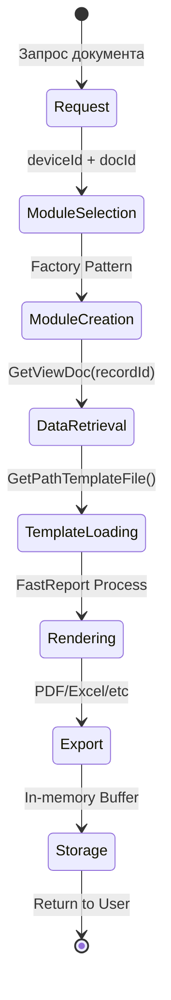
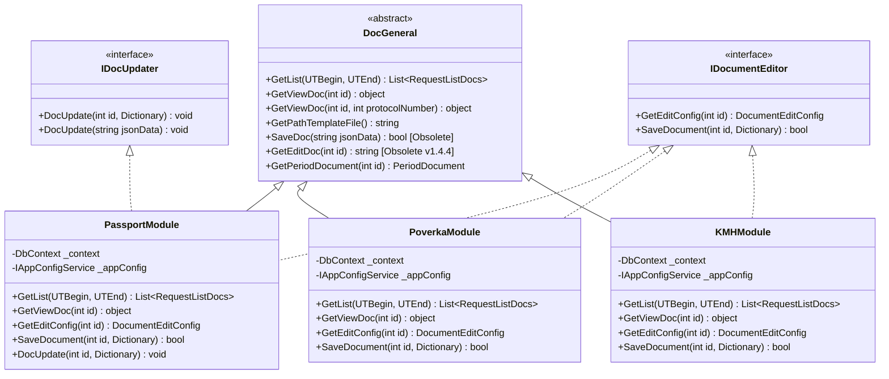
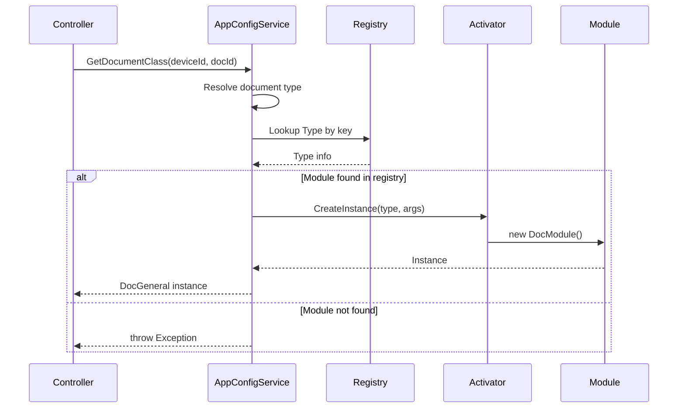
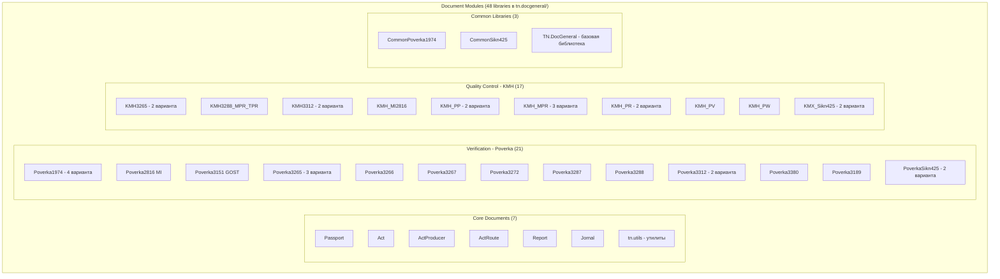
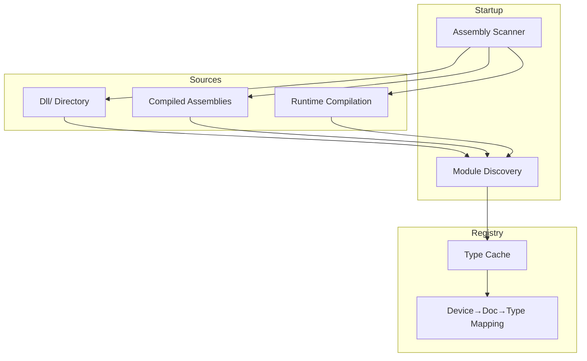
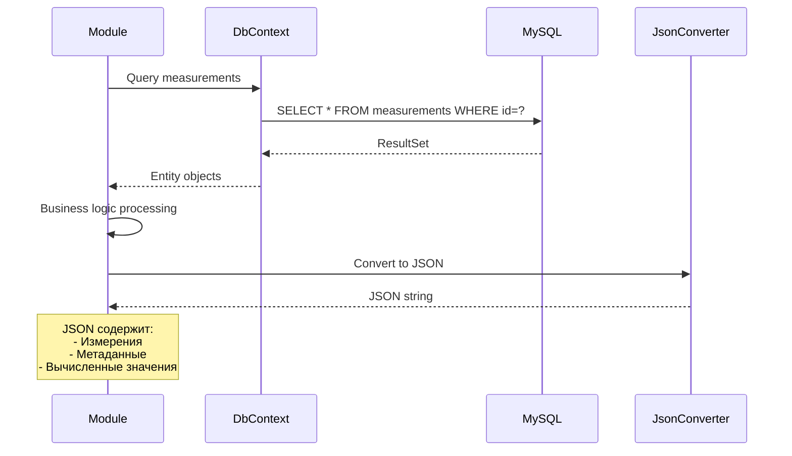
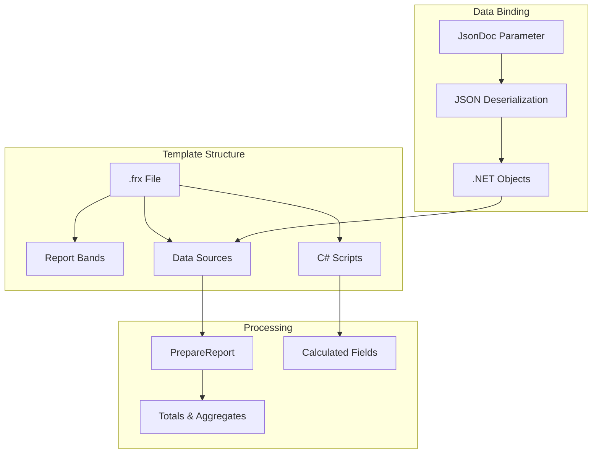
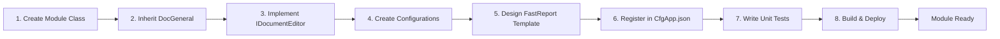

# Архитектура модулей документов

## Обзор

Система генерации документов построена на основе модульной архитектуры с использованием паттерна **Factory** и динамической загрузки модулей.

**Версия документации:** v1.4.4+
**Актуально на:** Ноябрь 2025

### Ключевые изменения в v1.4.4

⚠️ **ВАЖНО:** В версии 1.4.4 произошли существенные изменения в архитектуре модулей документов:

1. **Новый интерфейс IDocumentEditor** заменил концепцию `IDocClass`:
   - `GetEditConfig(int id)` → возвращает конфигурацию для Vue Editor вместо HTML
   - `SaveDocument(int id, Dictionary<string, object> values)` → сохранение из Vue Editor

2. **Устаревшие методы** (помечены `[Obsolete]`):
   - `GetEditDoc(int id)` - генерация HTML форм (заменен на `GetEditConfig()`)
   - `SaveDoc(string jsonData)` - старый формат сохранения (заменен на `SaveDocument()`)

3. **Система истории изменений полей**:
   - Отслеживание источника данных (ELIS, Manual, IVK, Unknown)
   - Хранение истории до 10 последних изменений на поле
   - Визуальные индикаторы в UI (цветные badges)
   - Требует включенного ELIS (`IsUsedElis = true`)

4. **Vue Document Editor**:
   - Полностью на Vue 3 + TypeScript + PrimeVue
   - Интеграция с ELIS и OPC
   - Dev server на порту 5175
   - Build output: `TN_Doc/wwwroot/dist/document-editor/`

## Жизненный цикл документа



## Интерфейсы модулей документов

### Базовый класс DocGeneral

Все модули документов наследуются от базового класса `DocGeneral` и реализуют интерфейс `IDocumentEditor`:



### Основные методы модулей (актуально для v1.4.4+)

#### 1. GetList(long UTBegin, long UTEnd)
Получение списка документов за указанный период времени.

#### 2. GetViewDoc(int id)
Извлечение данных документа из БД ИВК для отображения в FastReport шаблоне. Возвращает объект с данными для рендеринга.

#### 3. GetViewDoc(int id, int protocolNumber)
Перегрузка для документов с несколькими протоколами (например, KMH_MI2816).

#### 4. GetPathTemplateFile()
Возвращает полный путь к файлу шаблона FastReport (.frx).

#### 5. GetEditConfig(int id) *(IDocumentEditor)*
**Новый метод в v1.4.4+**. Возвращает конфигурацию формы редактирования для Vue Document Editor:
```csharp
public DocumentEditConfig GetEditConfig(int id)
{
    return new DocumentEditConfig
    {
        DocId = id,
        DocType = IdDoc,
        DeviceId = _deviceId,
        Fields = BuildFieldsFromConfig(),
        InitialValues = ExtractInitialValues(),
        Dictionaries = LoadDictionaries()
    };
}
```

#### 6. SaveDocument(int id, Dictionary<string, object> values) *(IDocumentEditor)*
**Новый метод в v1.4.4+**. Сохранение изменений из Vue Document Editor. Возвращает `true` при успешном сохранении.

#### Устаревшие методы (deprecated v1.4.4)

- **GetEditDoc(int id)** - помечен как `[Obsolete]`. Использовался для генерации HTML формы редактирования. Заменен на `GetEditConfig()`.
- **SaveDoc(string jsonData)** - устаревший метод сохранения. Заменен на `SaveDocument()`.

## Структуры данных для редактирования

### DocumentEditConfig

Структура конфигурации формы редактирования документа для Vue Editor:

```csharp
public class DocumentEditConfig
{
    public int DocId { get; set; }                               // ID документа
    public IdDoc DocType { get; set; }                           // Тип документа
    public int DeviceId { get; set; }                            // ID устройства ИВК
    public List<FormField> Fields { get; set; } = new();         // Поля формы
    public Dictionary<string, object> InitialValues { get; set; } = new(); // Начальные значения
    public DocumentDictionaries Dictionaries { get; set; }       // Справочники (лицензии, методы и т.д.)
}
```

### FormField

Описание поля формы редактирования:

```csharp
public class FormField
{
    public string Key { get; set; }              // Уникальный ключ поля (например, "ActNumber")
    public string Label { get; set; }            // Отображаемое название ("Номер акта")
    public string Type { get; set; }             // Тип: "select", "text", "number", "date", "textarea"
    public bool Required { get; set; }           // Обязательно ли для заполнения
    public bool Editable { get; set; }           // Редактируемо ли
    public List<SelectOption> Options { get; set; }  // Опции для select полей
    public int? RoundValue { get; set; }         // Округление для числовых полей (знаков после запятой)
    public string Tag { get; set; }              // Тег группы ("AdditionalInfo", "Value" и т.д.)
    public List<string> ElisAlias { get; set; }  // Алиасы для интеграции с ELIS
}
```

### SelectOption

Опция для выпадающего списка:

```csharp
public class SelectOption
{
    public string Value { get; set; }              // Значение опции
    public string Label { get; set; }              // Отображаемый текст
    public bool Selected { get; set; }             // Выбрана ли по умолчанию
    public Dictionary<string, object> Data { get; set; }  // Дополнительные данные
}
```

### DocumentDictionaries

Справочники для формы редактирования:

```csharp
public class DocumentDictionaries
{
    public List<License> Licenses { get; set; } = new();        // Лицензии
    public List<Method> Methods { get; set; } = new();          // Методы испытаний
    public List<Product> Products { get; set; } = new();        // Товарная номенклатура
    public List<Responsible> Responsibles { get; set; } = new(); // Ответственные лица
}
```

## Фабрика документов



## Структура модулей документов

### Организация по типам



### Категории документов

#### 1. Passport (Паспорта качества)
- **Назначение**: Сертификация качества нефтепродуктов
- **Стандарты**: ГОСТ Р 50.2.040, МИ 3532, EAC
- **Особенности**:
  - Интеграция с ELIS
  - Справочники показателей качества
  - Методы испытаний
  - **История изменений полей (v1.4.4+)**:
    - Отслеживание источника изменения (Manual/ELIS/IVK/Unknown)
    - Хранение до 10 последних изменений на поле
    - Визуальные индикаторы источников данных
    - Popup с детальной историей при наведении
    - Автоматическая миграция из старого флага `ElisFilled`

#### 2. Poverka (Протоколы поверки) - 21 модуль
- **Назначение**: Поверка измерительных систем
- **Стандарты**:
  - ГОСТ Р 8.1011-2022 (4 варианта 1974)
  - МИ 2816
  - ГОСТ 3151, 3189, 3265, 3267, 3272, 3287, 3288, 3312, 3380
  - SIKN-425 (2 варианта)

#### 3. KMH (Контроль метрологических характеристик) - 14 модулей
- **Назначение**: Текущий контроль точности измерений
- **Типы**:
  - По давлению (PR_PU, PR_PR)
  - По плотности (PP, PP_Areom)
  - По массе/объему (PW, PV)
  - По температуре (TPR)
  - SIKN-425 (2 варианта)

#### 4. Act (Акты приема-сдачи)
- **Назначение**: Документирование приема-передачи нефтепродуктов
- **Особенности**: Автоматическое заполнение из паспортов

#### 5. Report & Jornal (Отчеты и журналы)
- **Назначение**: Сводные отчеты и журналы учета
- **Типы**: По периодам, по показателям

## Конфигурация модулей

### Структура конфигурационных файлов

```mermaid
graph LR
    subgraph "Configuration Files"
        CFG[Cfg{DocType}.json]
        EDIT[CfgEdit{DocType}.json]
        TEMPLATE[{Number}_{DocType}.frx]
    end

    subgraph "Configuration Data"
        PATH[Template Path]
        EXPORT[Export Settings]
        FIELDS[Form Fields]
        VALIDATION[Validation Rules]
    end

    CFG --> PATH
    CFG --> EXPORT
    EDIT --> FIELDS
    EDIT --> VALIDATION
    TEMPLATE --> PATH
```

### Пример конфигурации

**CfgPassport.json:**
```json
{
  "PathTemplateFile": "Doc/Passport/Passport_GOSTR50.2.040(I).frx",
  "ShowEditButton": true,
  "EnableELISIntegration": true,
  "ExportFormats": ["PDF", "Excel"]
}
```

**CfgEditPassport.json:**
```json
{
  "Fields": [
    {
      "Name": "PassportNumber",
      "Type": "String",
      "Required": true,
      "MaxLength": 50
    },
    {
      "Name": "ProductName",
      "Type": "Dictionary",
      "DictionarySource": "Products"
    }
  ]
}
```

## Процесс генерации документа


## Загрузка модулей

### Стратегия загрузки



### Регистрация модулей

**Автоматическая регистрация:**
```csharp
// При старте приложения
foreach (var assembly in LoadedAssemblies)
{
    var documentTypes = assembly.GetTypes()
        .Where(t => typeof(IDocClass).IsAssignableFrom(t))
        .Where(t => !t.IsInterface && !t.IsAbstract);

    foreach (var type in documentTypes)
    {
        var attribute = type.GetCustomAttribute<DocumentTypeAttribute>();
        _registry[attribute.TypeId] = type;
    }
}
```

## Работа с данными

### Извлечение данных из БД



### Формат JSON данных

```json
{
  "DocType": "Passport",
  "Header": {
    "Number": "ПК-2025-001",
    "Date": "2025-10-02",
    "Device": "ИВК-1"
  },
  "Measurements": [
    {
      "Parameter": "Density",
      "Value": 850.5,
      "Unit": "kg/m³",
      "Method": "ГОСТ 3900"
    }
  ],
  "QualityIndicators": {
    "Viscosity": {
      "Value": 5.2,
      "Norm": "5.0 - 6.0",
      "Result": "Соответствует"
    }
  }
}
```

## FastReport Integration



## Расширение системы новым модулем

### Шаги добавления нового модуля (актуально для v1.4.4+)

1. **Создать класс модуля:**
```csharp
public class NewDocModule : DocGeneral, IDocumentEditor
{
    public NewDocModule(DbContextOptions<DocGeneral> options,
        IAppConfigService appConfig,
        IConfigurationCacheService configCache,
        int idDevice,
        IdDoc idDoc,
        string path)
        : base(options, appConfig, configCache, idDevice, idDoc, path)
    {
        IdDoc = IdDoc.NewDoc;
        PathToDocConfigFile = GetPathConfigFile();
        PathToDocEditConfigFile = GetPathEditConfigFile();
        PathToDocTemplateFile = GetPathTemplateFile();
    }

    // Реализация базовых методов
    public override List<RequestListDocs> GetList(long UTBegin, long UTEnd)
    {
        /* Запрос списка документов из БД */
    }

    public override object GetViewDoc(int id)
    {
        /* Извлечение данных для FastReport */
    }

    // Реализация IDocumentEditor для Vue Editor
    public DocumentEditConfig GetEditConfig(int id)
    {
        /* Конфигурация формы редактирования */
    }

    public bool SaveDocument(int id, Dictionary<string, object> values)
    {
        /* Сохранение изменений из Vue Editor */
    }
}
```

2. **Создать конфигурацию:**
   - `TN_Doc/Cfg/CfgNewDoc.json` - настройки шаблона и экспорта
   - `TN_Doc/Cfg/CfgEditNewDoc.json` - конфигурация полей формы редактирования

3. **Создать шаблон FastReport:**
   - `TN_Doc/Doc/NewDoc/{Number}_NewDoc.frx`
   - Использовать FastReport Designer для создания макета

4. **Зарегистрировать в CfgApp.json:**
```json
{
  "Devices": [
    {
      "IdDevice": "IVK-1",
      "Documents": [
        {
          "IdDoc": "NewDoc",
          "DisplayName": "Новый документ",
          "ModuleAssembly": "TN.NewDoc.dll"
        }
      ]
    }
  ]
}
```

5. **Написать unit тесты:**
   - Создать `Tests/Libraries/NewDoc/NewDocTests.cs`
   - Протестировать методы GetList, GetViewDoc, GetEditConfig, SaveDocument



## Field History Tracking (v1.4.4+)

### Структура DataARM с историей

**Расширенный формат JSON:**
```json
{
  "ExportPermit": "АБВ123",
  "Sample": "Образец №1",
  "LabInfo": [
    {
      "ParameterKey": "Density",
      "Value": "850.57",
      "Metod": {...},
      "Document": {...},
      "ElisFilled": true
    }
  ],
  "FieldHistoryMap": {
    "ExportPermit": [
      {
        "Source": "Manual",
        "ModifiedAt": "2025-01-14T09:00:00",
        "ModifiedBy": "Пользователь",
        "Value": "АБВ123",
        "PreviousValue": null,
        "Comment": null
      }
    ],
    "value.Density": [
      {
        "Source": "ELIS",
        "ModifiedAt": "2025-01-14T10:00:00",
        "ModifiedBy": "ELIS",
        "Value": "850.5",
        "PreviousValue": null,
        "Comment": "Загружено из протокола ПР-2024-12345"
      },
      {
        "Source": "Manual",
        "ModifiedAt": "2025-01-14T10:32:00",
        "ModifiedBy": "Пользователь",
        "Value": "850.567",
        "PreviousValue": "850.5",
        "Comment": "Скорректировано вручную"
      },
      {
        "Source": "IVK",
        "ModifiedAt": "2025-01-14T10:35:00",
        "ModifiedBy": "IVK",
        "Value": "850.57",
        "PreviousValue": "850.567",
        "Comment": "Округлено системой ИВК"
      }
    ],
    "method.Density": [
      {
        "Source": "ELIS",
        "ModifiedAt": "2025-01-14T10:00:00",
        "ModifiedBy": "ELIS",
        "Value": "{\"Name\":\"ГОСТ 3900-85\",\"Id\":5}",
        "PreviousValue": null,
        "Comment": "Метод из протокола ELIS"
      }
    ]
  },
  "ElisProtocol": {...}
}
```

### Ключевые особенности реализации

**Backend (C#):**
- `DataSource` enum: Unknown, ELIS, Manual, IVK
- `FieldHistoryEntry` класс с полями Source, ModifiedAt, ModifiedBy, Value, PreviousValue, Comment
- `DataARM.FieldHistoryMap` - Dictionary<string, List<FieldHistoryEntry>>
- `DataARM.AddFieldHistoryEntry()` - автоматический FIFO (max 10 записей)
- `DataARM.GetLastSourceForControl()` - получение последнего источника

**Frontend (Vue 3 + TypeScript):**
- `useFieldHistory.ts` композабл для работы с историей
- `FieldHistoryIndicator.vue` - индикатор источника (14-16px badge)
- `FieldHistoryPopup.vue` - popup с детальной историей (PrimeVue OverlayPanel)
- `FormFieldWithHistory.vue` - обёртка для AdditionalInfo полей
- Специальные компоненты для таблицы параметров качества:
  - `PassportMeasurementInputWithHistory.vue` (для value.*)
  - `PassportMethodSelectWithHistory.vue` (для method.*)
  - `PassportResultCellWithHistory.vue` (для result.*)

**Раздельные ключи истории:**
- AdditionalInfo: прямые ключи (`ExportPermit`, `Sample`, `Laboratory_IOF` и т.д.)
- Параметры качества:
  - `value.{ParameterKey}` - измеренное значение
  - `result.{ParameterKey}` - результат для печати
  - `method.{ParameterKey}` - метод испытаний
  - `document.{ParameterKey}` - номер документа ELIS

**Миграция:**
- Автоматическое создание записи истории из старого `ElisFilled` при первой загрузке
- Обратная совместимость: `ElisFilled` автоматически пересчитывается на основе последнего источника

**Примеры использования:**

```typescript
// Frontend: Отслеживание ручного изменения
import { useFieldHistory } from '@/composables/useFieldHistory';

const { trackManualChange } = useFieldHistory();

function handleValueChange(fieldKey: string, newValue: any, oldValue: any) {
  trackManualChange(fieldKey, newValue, oldValue);
  // ... остальная логика
}

// Frontend: Отслеживание загрузки из ELIS
const { trackElisLoad } = useFieldHistory();

function loadFromElis(fieldKey: string, elisValue: any, protocolNumber: string) {
  trackElisLoad(fieldKey, elisValue, protocolNumber);
  // ... остальная логика
}
```

```csharp
// Backend: Добавление записи истории в DocUpdate
foreach (var item in correctionData.Values.Where(x => x.Tag == "Value"))
{
    // ... обработка значения

    if (item.History != null && item.History.Count > 0)
    {
        foreach (var historyEntry in item.History)
        {
            if (historyEntry.Source == DataSource.Manual &&
                string.IsNullOrWhiteSpace(historyEntry.ModifiedBy))
            {
                historyEntry.ModifiedBy = "Пользователь";
            }

            dataArm.AddFieldHistoryEntry(item.Key, historyEntry);
            _logger.Info($"История параметра {parameterKey}: {historyEntry.Source} от {historyEntry.ModifiedBy}");
        }
    }
}
```

## См. также

### Архитектура
- [Architecture Overview](overview.md) - общий обзор архитектуры системы
- [TN.DocGeneral/DESIGN_DOCUMENTATION.md](../../tn.docgeneral/DESIGN_DOCUMENTATION.md) - проектная документация базовой библиотеки

### Разработка
- [FastReport Templates Guide](../development/fastreport-templates.md) - руководство по работе с шаблонами FastReport
- [Adding New Module Tutorial](../development/new-module-tutorial.md) - туториал по добавлению нового модуля документа
- [CLAUDE.md](../../CLAUDE.md) - основная документация проекта для разработчиков

### История изменений полей (v1.4.4+)
- [Field History Implementation Plan](../../tech_debt/FIELD_HISTORY_IMPLEMENTATION_PLAN.md) - план внедрения системы истории
- [Field History Tracking Prompt](../../tech_debt/FIELD_HISTORY_TRACKING_PROMPT.md) - техническое описание реализации

### API и интеграция
- [API Documentation](../api/) - документация REST API
- [ELIS Integration Guide](../integration/elis.md) - интеграция с ELIS
- [OPC Integration Guide](../integration/opc.md) - интеграция с OPC DA/UA

### История версий
- [CHANGELOG.md](../../CHANGELOG.md) - журнал изменений версий
- [TN_Doc/changes.md](../../TN_Doc/changes.md) - детальная история изменений
