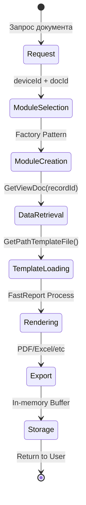
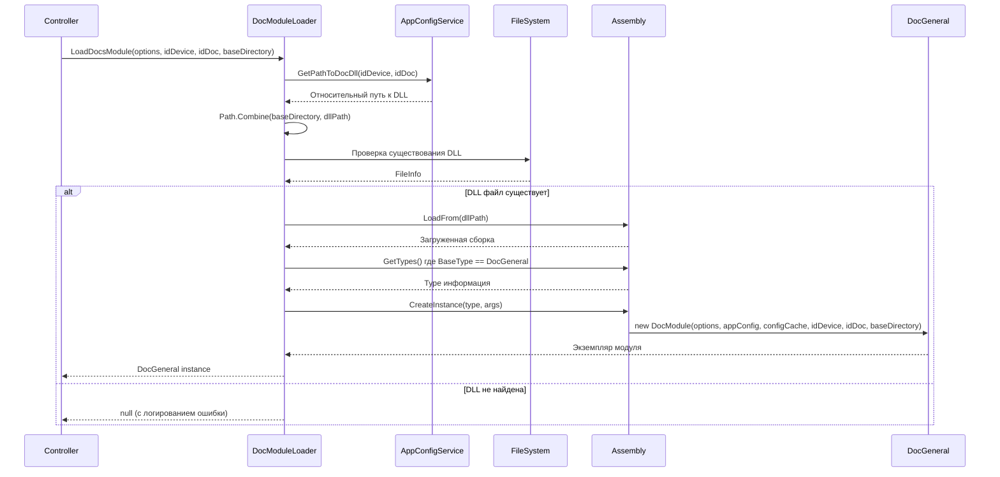
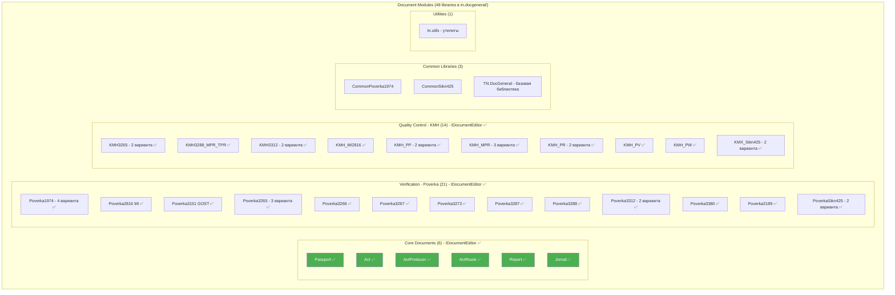
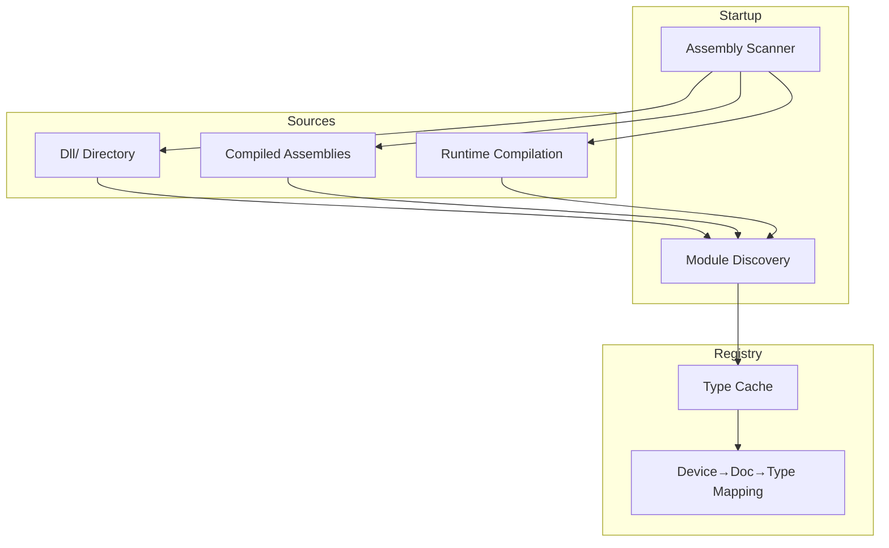
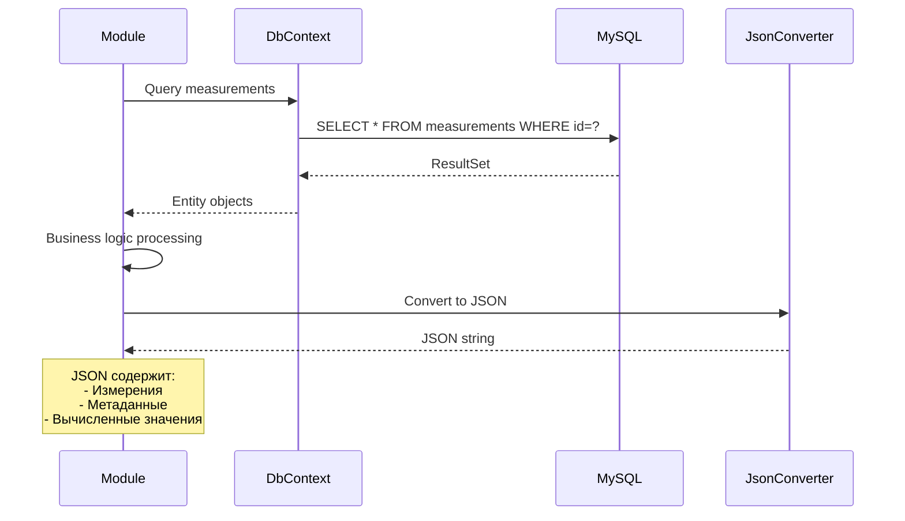
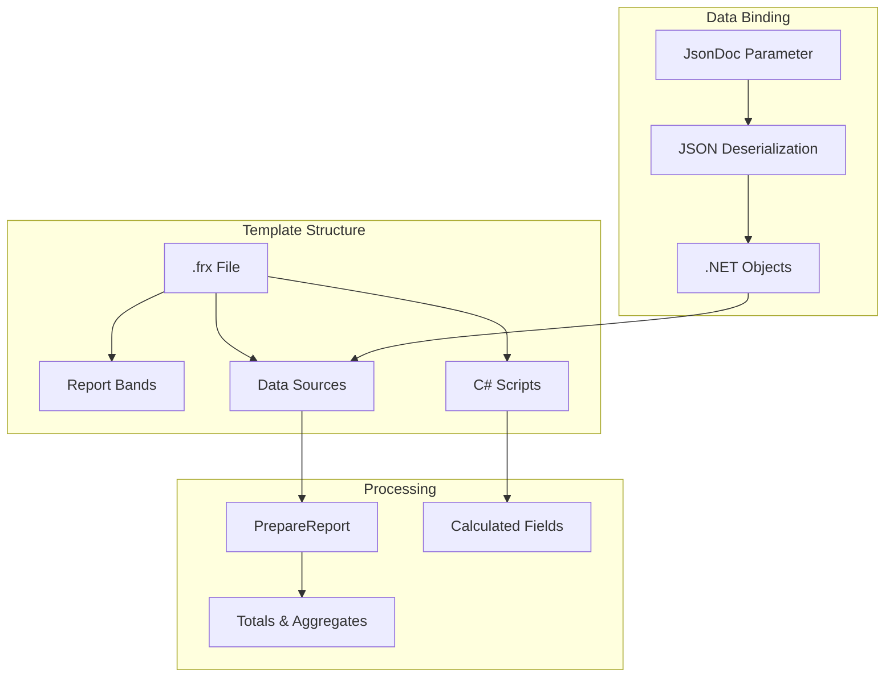
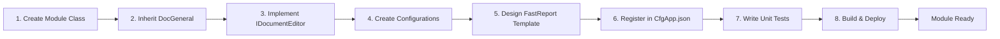

# Архитектура модулей документов

## Обзор

Система генерации документов построена на основе модульной архитектуры с использованием паттерна **Factory** и динамической загрузки модулей.

**Версия документации:** v1.4.3
**Актуально на:** Ноябрь 2025

### Текущая версия (v1.4.3)

Текущая версия использует классическую архитектуру с GetEditDoc/SetDocFromJson.

### Планируемые изменения в v1.4.4 (в разработке)

⚠️ **ВАЖНО:** В версии 1.4.4 планируются существенные изменения в архитектуре модулей документов:

1. **Массовая миграция на IDocumentEditor** - **ВСЕ 41 библиотека документов** мигрированы на новый интерфейс:
   - ✅ **4 основных документа**: Passport, Act, Report, Jornal
   - ✅ **2 дополнительных акта**: ActProducer, ActRoute
   - ✅ **21 протокол поверки**: Poverka1974 (4 варианта), Poverka2816, Poverka3151, Poverka3189, Poverka3265 (3 варианта), Poverka3266, Poverka3267, Poverka3272, Poverka3287, Poverka3288, Poverka3312 (2 варианта), Poverka3380, PoverkaSikn425 (2 варианта)
   - ✅ **14 документов КМХ**: KMH3265 (2 варианта), KMH3288_MPR_TPR, KMH3312 (2 варианта), KMH_MI2816, KMH_PP (2 варианта), KMH_MPR (3 варианта), KMH_PR (2 варианта), KMH_PV, KMH_PW, KMX_Sikn425 (2 варианта)

2. **Новый интерфейс IDocumentEditor** заменил концепцию `IDocClass`:
   - `GetEditConfig(int id)` → возвращает конфигурацию для Vue Editor вместо HTML
   - `SaveDocument(int id, Dictionary<string, object> values)` → сохранение из Vue Editor
   - Все 41 библиотека реализуют оба метода

3. **Устаревшие методы** (помечены `[Obsolete]` во всех библиотеках):
   - `GetEditDoc(int id)` - генерация HTML форм (заменен на `GetEditConfig()`)
   - `SaveDoc(string jsonData)` - старый формат сохранения (заменен на `SaveDocument()`)
   - ⚠️ Методы оставлены для обратной совместимости, но не рекомендуются к использованию
   - Удаление планируется в версии 2.0.0

4. **Система истории изменений полей** (FieldHistoryMap):
   - Отслеживание источника данных (ELIS, Manual, IVK, Unknown)
   - Хранение истории до 10 последних изменений на поле
   - Визуальные индикаторы в UI (цветные badges)
   - Раздельная история для value/method/result/document полей
   - Автоматическая миграция из старого флага `ElisFilled`
   - Требует включенного ELIS (`IsUsedElis = true`)

5. **Исправление дублирования LabInfo** (см. [passport-labinfo-fix.md](../passport-labinfo-fix.md)):
   - Устранено тройное дублирование данных для каждого параметра качества
   - Размер JSON сокращен в ~3 раза
   - Единообразный формат: один элемент LabInfo на параметр
   - Обратная совместимость со старыми данными сохранена

6. **Vue Document Editor**:
   - Полностью на Vue 3 + TypeScript + PrimeVue
   - Интеграция с ELIS и OPC
   - Dev server на порту 5174
   - Build output: `TN_Doc/wwwroot/document-editor/`

## Жизненный цикл документа



## Интерфейсы модулей документов

### Базовый класс DocGeneral

Все модули документов наследуются от базового класса `DocGeneral` и реализуют интерфейс `IDocumentEditor`:

```mermaid
classDiagram
    class DocGeneral {
        <<abstract>>
        +GetList(UTBegin, UTEnd) List~RequestListDocs~
        +GetViewDoc(int id) object
        +GetViewDoc(int id, int protocolNumber) object
        +GetPathTemplateFile() string
        +GetPeriodDocument(int id) PeriodDocument
        +SaveDoc(string jsonData) bool [Obsolete v1.4.4]
        +GetEditDoc(int id) string [Obsolete v1.4.4]
    }

    class IDocumentEditor {
        <<interface>>
        +GetEditConfig(int id) DocumentEditConfig
        +SaveDocument(int id, Dictionary~string,object~) bool
    }

    class IDocUpdater {
        <<interface>>
        +DocUpdate(int id, Dictionary~string,object~) void
        +DocUpdate(string jsonData) void
    }

    class DocumentEditConfig {
        +int DocId
        +IdDoc DocType
        +int DeviceId
        +List~FormField~ Fields
        +Dictionary~string,object~ InitialValues
        +DocumentDictionaries Dictionaries
    }

    class FormField {
        +string Key
        +string Label
        +string Type
        +bool Required
        +bool Editable
        +List~SelectOption~ Options
        +int? RoundValue
        +string Tag
        +List~string~ ElisAlias
    }

    class PassportModule {
        -DbContext _context
        -IAppConfigService _appConfig
        -IConfigurationCacheService _configCache
        +GetList(UTBegin, UTEnd) List~RequestListDocs~
        +GetViewDoc(int id) object
        +GetEditConfig(int id) DocumentEditConfig ✅
        +SaveDocument(int id, Dictionary) bool ✅
        +DocUpdate(int id, Dictionary) void
        +GetEditDoc(int id) string [Obsolete]
    }

    class PoverkaModule {
        -DbContext _context
        -IAppConfigService _appConfig
        -IConfigurationCacheService _configCache
        +GetList(UTBegin, UTEnd) List~RequestListDocs~
        +GetViewDoc(int id) object
        +GetEditConfig(int id) DocumentEditConfig ✅
        +SaveDocument(int id, Dictionary) bool ✅
        +GetEditDoc(int id) string [Obsolete]
    }

    class KMHModule {
        -DbContext _context
        -IAppConfigService _appConfig
        -IConfigurationCacheService _configCache
        +GetList(UTBegin, UTEnd) List~RequestListDocs~
        +GetViewDoc(int id) object
        +GetEditConfig(int id) DocumentEditConfig ✅
        +SaveDocument(int id, Dictionary) bool ✅
        +GetEditDoc(int id) string [Obsolete]
    }

    class ActModule {
        -DbContext _context
        -IAppConfigService _appConfig
        +GetEditConfig(int id) DocumentEditConfig ✅
        +SaveDocument(int id, Dictionary) bool ✅
        +GetEditDoc(int id) string [Obsolete]
    }

    class ReportModule {
        -DbContext _context
        -IAppConfigService _appConfig
        +GetEditConfig(int id) DocumentEditConfig ✅
        +SaveDocument(int id, Dictionary) bool ✅
        +GetEditDoc(int id) string [Obsolete]
    }

    class JornalModule {
        -DbContext _context
        -IAppConfigService _appConfig
        +GetEditConfig(int id) DocumentEditConfig ✅
        +SaveDocument(int id, Dictionary) bool ✅
        +GetEditDoc(int id) string [Obsolete]
    }

    DocGeneral <|-- PassportModule
    DocGeneral <|-- PoverkaModule
    DocGeneral <|-- KMHModule
    DocGeneral <|-- ActModule
    DocGeneral <|-- ReportModule
    DocGeneral <|-- JornalModule

    IDocumentEditor <|.. PassportModule : implements
    IDocumentEditor <|.. PoverkaModule : implements
    IDocumentEditor <|.. KMHModule : implements
    IDocumentEditor <|.. ActModule : implements
    IDocumentEditor <|.. ReportModule : implements
    IDocumentEditor <|.. JornalModule : implements

    IDocUpdater <|.. PassportModule : implements

    IDocumentEditor ..> DocumentEditConfig : returns
    DocumentEditConfig *-- FormField : contains
```



**Примечания к диаграмме:**
- ✅ - метод реализован в рамках миграции на IDocumentEditor (v1.4.4)
- `[Obsolete]` - методы помечены как устаревшие, но работают для обратной совместимости
- Все 41 библиотека документов реализуют интерфейс `IDocumentEditor`
- `IDocUpdater` реализован только в `PassportModule` для сложной логики обновления данных

### Основные методы модулей (актуально для v1.4.4+)

#### 1. GetList(long UTBegin, long UTEnd)
Получение списка документов за указанный период времени.

#### 2. GetViewDoc(int id)
Извлечение данных документа из БД ИВК для отображения в FastReport шаблоне. Возвращает объект с данными для рендеринга.

#### 3. GetViewDoc(int id, int protocolNumber)
Перегрузка для документов с несколькими протоколами (например, KMH_MI2816).

#### 4. GetPathTemplateFile()
Возвращает полный путь к файлу шаблона FastReport (.frx).

#### 5. GetEditConfig(int id) *(IDocumentEditor)*
**Новый метод в v1.4.4+**. Возвращает конфигурацию формы редактирования для Vue Document Editor:

```csharp
public DocumentEditConfig GetEditConfig(int id)
{
    _logger.Trace($"GetEditConfig вызван для документа {IdDoc} (id={id})");

    var dataArm = GetDataARM(id); // Получение данных из БД
    var editConfig = LoadEditConfigFromFile(); // Загрузка CfgEdit*.json

    var config = new DocumentEditConfig
    {
        DocId = id,
        DocType = IdDoc,
        DeviceId = _idDevice,
        Fields = BuildFieldsFromEditConfig(editConfig), // Построение полей из конфигурации
        InitialValues = ExtractInitialValues(dataArm),   // Извлечение начальных значений из DataARM
        Dictionaries = new DocumentDictionaries
        {
            Licenses = LoadLicenses() // Загрузка справочников
        }
    };

    // Добавление истории полей (v1.4.4+)
    if (dataArm.FieldHistoryMap != null && dataArm.FieldHistoryMap.Count > 0)
    {
        config.InitialValues["__fieldHistory"] = dataArm.FieldHistoryMap;
    }

    _logger.Trace($"GetEditConfig завершен: {config.Fields.Count} полей, {config.InitialValues.Count} начальных значений");

    return config;
}

private List<FormField> BuildFieldsFromEditConfig(EditConfigRoot editConfig)
{
    var fields = new List<FormField>();

    foreach (var fieldConfig in editConfig.Fields)
    {
        fields.Add(new FormField
        {
            Key = fieldConfig.Name,
            Label = fieldConfig.Label,
            Type = fieldConfig.Type,
            Required = fieldConfig.Required,
            Editable = fieldConfig.Editable,
            Tag = fieldConfig.Tag,
            ElisAlias = fieldConfig.ElisAlias,
            RoundValue = fieldConfig.RoundValue
        });
    }

    return fields;
}

private Dictionary<string, object> ExtractInitialValues(DataARM dataArm)
{
    var values = new Dictionary<string, object>
    {
        ["ExportPermit"] = dataArm.ExportPermit ?? "",
        ["Sample"] = dataArm.Sample ?? "",
        ["Laboratory_IOF"] = dataArm.Laboratory_IOF ?? "",
        // ... остальные поля AdditionalInfo
    };

    // Добавление параметров качества (для Passport)
    if (dataArm.LabInfo != null)
    {
        foreach (var labInfo in dataArm.LabInfo)
        {
            values[$"value.{labInfo.ParameterKey}"] = labInfo.Value ?? "";
            values[$"method.{labInfo.ParameterKey}"] = labInfo.Metod;
            values[$"result.{labInfo.ParameterKey}"] = labInfo.Value ?? "";
            values[$"document.{labInfo.ParameterKey}"] = labInfo.Document;
        }
    }

    return values;
}
```

#### 6. SaveDocument(int id, Dictionary<string, object> values) *(IDocumentEditor)*
**Новый метод в v1.4.4+**. Сохранение изменений из Vue Document Editor. Возвращает `true` при успешном сохранении.

```csharp
public bool SaveDocument(int id, Dictionary<string, object> values)
{
    try
    {
        _logger.Info($"SaveDocument вызван для документа {IdDoc} (id={id})");

        // Извлечение истории изменений полей (v1.4.4+)
        Dictionary<string, List<FieldHistoryEntry>> fieldHistory = null;
        if (values.ContainsKey("__fieldHistory"))
        {
            fieldHistory = JsonConvert.DeserializeObject<Dictionary<string, List<FieldHistoryEntry>>>(
                values["__fieldHistory"].ToString()
            );
            values.Remove("__fieldHistory"); // Удаляем из values
        }

        // Формирование JSON для метода DocUpdate
        var correctionData = new CorrectionData
        {
            Values = values.Select(kv => new EditData
            {
                Key = kv.Key,
                Value = kv.Value?.ToString() ?? "",
                Tag = DetermineTag(kv.Key), // AdditionalInfo, Value, Metod, PrintValue
                History = fieldHistory?.ContainsKey(kv.Key) == true
                    ? fieldHistory[kv.Key]
                    : null
            }).ToList()
        };

        var jsonData = JsonConvert.SerializeObject(correctionData);

        // Вызов существующего метода обновления
        DocUpdate(jsonData);

        _logger.Info($"Документ {IdDoc} (id={id}) успешно сохранен");
        return true;
    }
    catch (Exception ex)
    {
        _logger.Error($"Ошибка сохранения документа {IdDoc} (id={id}): {ex.Message}");
        _logger.Error(ex.StackTrace);
        return false;
    }
}

private string DetermineTag(string key)
{
    if (key.StartsWith("value.")) return "Value";
    if (key.StartsWith("method.")) return "Metod";
    if (key.StartsWith("result.")) return "PrintValue";
    if (key.StartsWith("document.")) return "Document";
    return "AdditionalInfo";
}
```

#### Устаревшие методы (deprecated v1.4.4)

- **GetEditDoc(int id)** - помечен как `[Obsolete]`. Использовался для генерации HTML формы редактирования. Заменен на `GetEditConfig()`.
- **SaveDoc(string jsonData)** - устаревший метод сохранения. Заменен на `SaveDocument()`.

## Структуры данных для редактирования

### DocumentEditConfig

Структура конфигурации формы редактирования документа для Vue Editor:

```csharp
public class DocumentEditConfig
{
    public int DocId { get; set; }                               // ID документа
    public IdDoc DocType { get; set; }                           // Тип документа
    public int DeviceId { get; set; }                            // ID устройства ИВК
    public List<FormField> Fields { get; set; } = new();         // Поля формы
    public Dictionary<string, object> InitialValues { get; set; } = new(); // Начальные значения
    public DocumentDictionaries Dictionaries { get; set; }       // Справочники (лицензии, методы и т.д.)
}
```

### FormField

Описание поля формы редактирования:

```csharp
public class FormField
{
    public string Key { get; set; }              // Уникальный ключ поля (например, "ActNumber")
    public string Label { get; set; }            // Отображаемое название ("Номер акта")
    public string Type { get; set; }             // Тип: "select", "text", "number", "date", "textarea"
    public bool Required { get; set; }           // Обязательно ли для заполнения
    public bool Editable { get; set; }           // Редактируемо ли
    public List<SelectOption> Options { get; set; }  // Опции для select полей
    public int? RoundValue { get; set; }         // Округление для числовых полей (знаков после запятой)
    public string Tag { get; set; }              // Тег группы ("AdditionalInfo", "Value" и т.д.)
    public List<string> ElisAlias { get; set; }  // Алиасы для интеграции с ELIS
}
```

### SelectOption

Опция для выпадающего списка:

```csharp
public class SelectOption
{
    public string Value { get; set; }              // Значение опции
    public string Label { get; set; }              // Отображаемый текст
    public bool Selected { get; set; }             // Выбрана ли по умолчанию
    public Dictionary<string, object> Data { get; set; }  // Дополнительные данные
}
```

### DocumentDictionaries

Справочники для формы редактирования:

```csharp
public class DocumentDictionaries
{
    public List<License> Licenses { get; set; } = new();        // Лицензии
    public List<Method> Methods { get; set; } = new();          // Методы испытаний
    public List<Product> Products { get; set; } = new();        // Товарная номенклатура
    public List<Responsible> Responsibles { get; set; } = new(); // Ответственные лица
}
```

## Загрузка модулей документов

Модули документов динамически загружаются через сервис `IDocModuleLoader`, который использует reflection для создания экземпляров `DocGeneral` из отдельных DLL библиотек.

### Схема загрузки модулей



### Интерфейс IDocModuleLoader

```csharp
public interface IDocModuleLoader
{
    DocGeneral LoadDocsModule(
        DbContextOptions<DocGeneral> options,
        int idDevice,
        IdDoc idDoc,
        string baseDirectory);
}
```

**Параметры:**
- `options` — настройки подключения к базе данных (Entity Framework)
- `idDevice` — идентификатор устройства ИВК
- `idDoc` — тип документа (`IdDoc` enum)
- `baseDirectory` — базовый каталог приложения (обычно `AppContext.BaseDirectory`)

**Возвращаемое значение:**
- Экземпляр `DocGeneral` (базовый класс для всех модулей документов)
- `null` в случае ошибки (путь не найден, DLL отсутствует, ошибка загрузки)

### Пример использования в контроллерах

```csharp
// HomeController.cs
var doc = _docModuleLoader.LoadDocsModule(_options, IdDevice, IdDoc, AppContext.BaseDirectory);
if (doc is null)
{
    _logger.LogError($"Не удалось загрузить DLL для документа {IdDoc}");
    return StatusCode(500, "Ошибка загрузки модуля документа");
}

// Использование загруженного модуля
var viewData = doc.GetViewDoc(id);
var html = doc.GetEditDoc(id);
doc.SetDocFromJson(jsonData);
```

### Конфигурация путей к DLL

Путь к каждому модулю определяется в `CfgApp.json` через конфигурацию устройства и документа:

```json
{
  "Devices": [
    {
      "IdDevice": 1,
      "Documents": [
        {
          "IdDoc": 2,
          "DllPath": "tn.docgeneral/Passport/TN.Passport.dll"
        }
      ]
    }
  ]
}
```

Метод `IAppConfigService.GetPathToDocDll(idDevice, idDoc)` возвращает относительный путь к соответствующей DLL.

### Кэширование и оптимизация (v1.4.2+)

- Загруженные сборки кэшируются .NET Runtime автоматически
- Конфигурационные файлы документов кэшируются через `IConfigurationCacheService`
- При создании экземпляра модуля передаётся `IConfigurationCacheService` для повторного использования конфигураций

## Структура модулей документов

### Организация по типам



**Легенда:**
- ✅ - Библиотека мигрирована на IDocumentEditor (v1.4.4+)
- Зеленый цвет - Основные документы с полной поддержкой Document Editor

**Статистика миграции:**
- **Всего библиотек документов**: 41 из 48
- **Мигрировано на IDocumentEditor**: 41 (100%)
- **Основные документы**: 6/6 (100%)
- **Протоколы поверки**: 21/21 (100%)
- **Документы КМХ**: 14/14 (100%)
- **Вспомогательные библиотеки**: 7 (Common*, tn.utils, TN.DocGeneral)

### Категории документов

#### 1. Passport (Паспорта качества) ✅ IDocumentEditor
- **Назначение**: Сертификация качества нефтепродуктов
- **Стандарты**: ГОСТ Р 50.2.040, МИ 3532, EAC
- **Миграция v1.4.4**: GetEditConfig + SaveDocument + FieldHistory
- **Особенности**:
  - Полная интеграция с ELIS (загрузка данных лаборатории)
  - Справочники показателей качества
  - Динамические методы испытаний
  - **История изменений полей (v1.4.4+)**:
    - Отслеживание источника изменения (Manual/ELIS/IVK/Unknown)
    - Хранение до 10 последних изменений на поле
    - Визуальные индикаторы источников данных
    - Popup с детальной историей при наведении
    - Автоматическая миграция из старого флага `ElisFilled`
  - **Исправление дублирования LabInfo (v1.4.3)**:
    - Устранено тройное дублирование данных параметров
    - Размер JSON сокращен в ~3 раза
    - См. [passport-labinfo-fix.md](../passport-labinfo-fix.md)

#### 2. Poverka (Протоколы поверки) ✅ IDocumentEditor - 21 модуль
- **Назначение**: Поверка измерительных систем
- **Миграция v1.4.4**: Все 21 модуль мигрированы на IDocumentEditor
- **Стандарты**:
  - ГОСТ Р 8.1011-2022 (4 варианта 1974: 04, 89, 95, базовый)
  - МИ 2816
  - ГОСТ 3151, 3189, 3265 (3 варианта), 3266, 3267, 3272, 3287, 3288, 3312 (2 варианта), 3380
  - SIKN-425 (2 варианта: PR_PR, PR_PU)
- **Модули**:
  - Poverka1974_04, Poverka1974_89, Poverka1974_95, Poverka1974
  - Poverka2816, Poverka3151, Poverka3189
  - Poverka3265_PR_PU, Poverka3265_UPR_PR, Poverka3265_UPR_PU
  - Poverka3266, Poverka3267, Poverka3272, Poverka3287, Poverka3288
  - Poverka3312_PR_PU, Poverka3312_UPR_PR
  - Poverka3380
  - PoverkaSikn425_PR_PR, PoverkaSikn425_PR_PU

#### 3. KMH (Контроль метрологических характеристик) ✅ IDocumentEditor - 14 модулей
- **Назначение**: Текущий контроль точности измерений
- **Миграция v1.4.4**: Все 14 модулей мигрированы на IDocumentEditor
- **Типы контроля**:
  - По давлению: KMH_PR_PU, KMH_PR_PR
  - По плотности: KMH_PP, KMH_PP_Areom
  - По массе/объему: KMH_PW, KMH_PV
  - По температуре: KMH_MPR_TPR, KMH3288_MPR_TPR
  - Многопараметровые: KMH_MPR_MPR, KMH_MPR_PU
  - SIKN-425: KMX_Sikn425_PR_PR, KMX_Sikn425_PR_PU
  - По ГОСТ: KMH3265_PR_PU, KMH3265_UPR_PR, KMH3312_PR_PU, KMH3312_UPR_PR
  - Специализированные: KMH_MI2816 (обновлен для ИВК 7.12.14.3000)

#### 4. Act (Акты приема-сдачи) ✅ IDocumentEditor
- **Назначение**: Документирование приема-передачи нефтепродуктов
- **Миграция v1.4.4**: Act, ActProducer, ActRoute мигрированы
- **Особенности**:
  - Автоматическое заполнение из паспортов
  - Поддержка смен и времени пробоотбора
  - Интеграция с номенклатурой продуктов

#### 5. Report (Отчеты) ✅ IDocumentEditor
- **Назначение**: Сводные отчеты по измерениям
- **Миграция v1.4.4**: Полная поддержка IDocumentEditor
- **Типы**: По периодам, по показателям, аналитические

#### 6. Jornal (Журналы) ✅ IDocumentEditor
- **Назначение**: Журналы учета и регистрации
- **Миграция v1.4.4**: Полная поддержка IDocumentEditor
- **Исправления v1.4.3**: Печатная форма журнала регистрации СИ (совместимость с DataARM)
- **Особенности**: Подписанты из локальных справочников пользователей

## Конфигурация модулей

### Структура конфигурационных файлов

```mermaid
graph LR
    subgraph "Configuration Files"
        CFG[Cfg{DocType}.json]
        EDIT[CfgEdit{DocType}.json]
        TEMPLATE[{Number}_{DocType}.frx]
    end

    subgraph "Configuration Data"
        PATH[Template Path]
        EXPORT[Export Settings]
        FIELDS[Form Fields]
        VALIDATION[Validation Rules]
    end

    CFG --> PATH
    CFG --> EXPORT
    EDIT --> FIELDS
    EDIT --> VALIDATION
    TEMPLATE --> PATH
```

### Пример конфигурации

**CfgPassport.json:**
```json
{
  "PathTemplateFile": "Doc/Passport/Passport_GOSTR50.2.040(I).frx",
  "ShowEditButton": true,
  "EnableELISIntegration": true,
  "ExportFormats": ["PDF", "Excel"]
}
```

**CfgEditPassport.json:**
```json
{
  "Fields": [
    {
      "Name": "PassportNumber",
      "Type": "String",
      "Required": true,
      "MaxLength": 50
    },
    {
      "Name": "ProductName",
      "Type": "Dictionary",
      "DictionarySource": "Products"
    }
  ]
}
```

## Процесс генерации документа


## Загрузка модулей

### Стратегия загрузки



### Загрузка модулей

**Динамическая загрузка через IDocModuleLoader:**
```csharp
// Сервис для загрузки модулей документов из DLL
public class DocModuleLoader : IDocModuleLoader
{
    public DocGeneral LoadDocsModule(DbContextOptions<DocGeneral> options,
        int idDevice, IdDoc idDoc, string baseDirectory)
    {
        var dllPath = _appConfig.GetPathToDocDll(idDevice, idDoc);
        var pathToDll = Path.Combine(baseDirectory, dllPath.TrimStart('/', '\\'));

        var assembly = Assembly.LoadFrom(pathToDll);
        var docType = assembly.GetTypes()
            .Single(x => x.BaseType?.Name == nameof(DocGeneral));

        return (DocGeneral)assembly.CreateInstance(
            docType.FullName,
            false,
            BindingFlags.Default,
            null,
            new object[] { options, _appConfig, _configCache, idDevice, idDoc, baseDirectory },
            null,
            null);
    }
}

// Пример использования в контроллере
var docInstance = _moduleLoader.LoadDocsModule(options, idDevice, idDoc, baseDirectory);
if (docInstance is IDocumentEditor editor)
{
    var editHtml = editor.GetEditDoc(id);
}
```

**Базовая структура модуля:**
```csharp
public class DocPassport : DocGeneral, IDocUpdater, IDocumentEditor
{
    public DocPassport(DbContextOptions<DocGeneral> options,
        IAppConfigService appConfig,
        IConfigurationCacheService configCache,
        int idDevice, IdDoc idDoc, string path)
        : base(options, appConfig, configCache, idDevice, idDoc, path)
    {
        IdDoc = IdDoc.Passport;
        PathToDocConfigFile = GetPathConfigFile();
        PathToDocEditConfigFile = GetPathEditConfigFile();
        PathToDocTemplateFile = GetPathTemplateFile();
    }

    // Реализация методов IDocumentEditor...
}
```

## Работа с данными

### Извлечение данных из БД



### Формат JSON данных

```json
{
  "DocType": "Passport",
  "Header": {
    "Number": "ПК-2025-001",
    "Date": "2025-10-02",
    "Device": "ИВК-1"
  },
  "Measurements": [
    {
      "Parameter": "Density",
      "Value": 850.5,
      "Unit": "kg/m³",
      "Method": "ГОСТ 3900"
    }
  ],
  "QualityIndicators": {
    "Viscosity": {
      "Value": 5.2,
      "Norm": "5.0 - 6.0",
      "Result": "Соответствует"
    }
  }
}
```

## FastReport Integration



## Расширение системы новым модулем

### Шаги добавления нового модуля (актуально для v1.4.4+)

1. **Создать класс модуля:**
```csharp
public class NewDocModule : DocGeneral, IDocumentEditor
{
    public NewDocModule(DbContextOptions<DocGeneral> options,
        IAppConfigService appConfig,
        IConfigurationCacheService configCache,
        int idDevice,
        IdDoc idDoc,
        string path)
        : base(options, appConfig, configCache, idDevice, idDoc, path)
    {
        IdDoc = IdDoc.NewDoc;
        PathToDocConfigFile = GetPathConfigFile();
        PathToDocEditConfigFile = GetPathEditConfigFile();
        PathToDocTemplateFile = GetPathTemplateFile();
    }

    // Реализация базовых методов
    public override List<RequestListDocs> GetList(long UTBegin, long UTEnd)
    {
        /* Запрос списка документов из БД */
    }

    public override object GetViewDoc(int id)
    {
        /* Извлечение данных для FastReport */
    }

    // Реализация IDocumentEditor для Vue Editor
    public DocumentEditConfig GetEditConfig(int id)
    {
        /* Конфигурация формы редактирования */
    }

    public bool SaveDocument(int id, Dictionary<string, object> values)
    {
        /* Сохранение изменений из Vue Editor */
    }
}
```

2. **Создать конфигурацию:**
   - `TN_Doc/Cfg/CfgNewDoc.json` - настройки шаблона и экспорта
   - `TN_Doc/Cfg/CfgEditNewDoc.json` - конфигурация полей формы редактирования

3. **Создать шаблон FastReport:**
   - `TN_Doc/Doc/NewDoc/{Number}_NewDoc.frx`
   - Использовать FastReport Designer для создания макета

4. **Зарегистрировать в CfgApp.json:**
```json
{
  "Devices": [
    {
      "IdDevice": "IVK-1",
      "Documents": [
        {
          "IdDoc": "NewDoc",
          "DisplayName": "Новый документ",
          "ModuleAssembly": "TN.NewDoc.dll"
        }
      ]
    }
  ]
}
```

5. **Написать unit тесты:**
   - Создать `Tests/Libraries/NewDoc/NewDocTests.cs`
   - Протестировать методы GetList, GetViewDoc, GetEditConfig, SaveDocument



## Field History Tracking (v1.4.4+)

### Структура DataARM с историей (v1.4.4+)

**Расширенный формат JSON:**
```json
{
  "ExportPermit": "АБВ123",
  "Sample": "Образец №1",
  "LabInfo": [
    {
      "ParameterKey": "Density",
      "Value": "850.57",
      "Metod": {...},
      "Document": {...},
      "ElisFilled": true
    }
  ],
  "FieldHistoryMap": {
    "ExportPermit": [
      {
        "Source": "Manual",
        "ModifiedAt": "2025-01-14T09:00:00",
        "ModifiedBy": "Пользователь",
        "Value": "АБВ123",
        "PreviousValue": null,
        "Comment": null
      }
    ],
    "value.Density": [
      {
        "Source": "ELIS",
        "ModifiedAt": "2025-01-14T10:00:00",
        "ModifiedBy": "ELIS",
        "Value": "850.5",
        "PreviousValue": null,
        "Comment": "Загружено из протокола ПР-2024-12345"
      },
      {
        "Source": "Manual",
        "ModifiedAt": "2025-01-14T10:32:00",
        "ModifiedBy": "Пользователь",
        "Value": "850.567",
        "PreviousValue": "850.5",
        "Comment": "Скорректировано вручную"
      },
      {
        "Source": "IVK",
        "ModifiedAt": "2025-01-14T10:35:00",
        "ModifiedBy": "IVK",
        "Value": "850.57",
        "PreviousValue": "850.567",
        "Comment": "Округлено системой ИВК"
      }
    ],
    "method.Density": [
      {
        "Source": "ELIS",
        "ModifiedAt": "2025-01-14T10:00:00",
        "ModifiedBy": "ELIS",
        "Value": "{\"Name\":\"ГОСТ 3900-85\",\"Id\":5}",
        "PreviousValue": null,
        "Comment": "Метод из протокола ELIS"
      }
    ]
  },
  "ElisProtocol": {...}
}
```

### Ключевые особенности реализации

**Backend (C#):**
- `DataSource` enum: Unknown, ELIS, Manual, IVK
- `FieldHistoryEntry` класс с полями:
  - `Source` (DataSource) - источник изменения
  - `ModifiedAt` (DateTime) - время изменения
  - `ModifiedBy` (string) - кто изменил
  - `Value` (string) - новое значение
  - `PreviousValue` (string) - предыдущее значение
  - `Comment` (string) - комментарий к изменению
- `DataARM.FieldHistoryMap` - Dictionary<string, List<FieldHistoryEntry>>
- `DataARM.AddFieldHistoryEntry(string fieldKey, FieldHistoryEntry entry)` - автоматический FIFO (max 10 записей на поле)
- `DataARM.GetLastSourceForControl(string fieldKey)` - получение последнего источника для поля
- Автоматическая миграция из старого флага `ElisFilled` при первой загрузке

**Frontend (Vue 3 + TypeScript):**
- `useFieldHistory.ts` композабл для работы с историей:
  - `trackManualChange(fieldKey, newValue, oldValue)` - запись ручного изменения
  - `trackElisLoad(fieldKey, elisValue, protocolNumber)` - запись загрузки из ELIS
  - `trackIvkRounding(fieldKey, roundedValue, originalValue)` - запись округления ИВК
  - `getFieldHistory(fieldKey)` - получение истории поля
  - `getLastSource(fieldKey)` - получение последнего источника
- `FieldHistoryIndicator.vue` - индикатор источника (14-16px badge):
  - 🟢 ELIS - зеленый badge
  - 🔵 Manual - синий badge
  - 🟡 IVK - желтый badge
  - ⚪ Unknown - серый badge
- `FieldHistoryPopup.vue` - popup с детальной историей (PrimeVue OverlayPanel):
  - Показывает до 10 последних изменений
  - Отображает дату/время, источник, пользователя
  - Показывает старое → новое значение
  - Включает комментарии к изменениям
- `FormFieldWithHistory.vue` - обёртка для AdditionalInfo полей
- Специальные компоненты для таблицы параметров качества:
  - `PassportMeasurementInputWithHistory.vue` (для value.*)
  - `PassportMethodSelectWithHistory.vue` (для method.*)
  - `PassportResultCellWithHistory.vue` (для result.*)
  - `PassportDocumentCellWithHistory.vue` (для document.*)

**Раздельные ключи истории:**
- **AdditionalInfo**: прямые ключи без префиксов
  - Примеры: `ExportPermit`, `Sample`, `Laboratory_IOF`, `Recipient_Num`, `Recipient_Date`
- **Параметры качества**: ключи с префиксами по типу данных
  - `value.{ParameterKey}` - измеренное значение
  - `result.{ParameterKey}` - результат для печати (текстовое представление)
  - `method.{ParameterKey}` - метод испытаний (JSON объект Metod)
  - `document.{ParameterKey}` - номер документа ELIS

**Миграция данных (обратная совместимость):**
1. **Автоматическая миграция из ElisFilled**:
   - При первой загрузке паспорта с флагом `ElisFilled = true` создается запись истории с источником ELIS
   - Старый формат данных без `FieldHistoryMap` автоматически преобразуется при сохранении
2. **Обновление ElisFilled при сохранении**:
   - `ElisFilled` автоматически пересчитывается на основе последнего источника из истории
   - Если последний источник ELIS → `ElisFilled = true`
   - Иначе → `ElisFilled = false`
3. **Поддержка старых данных**:
   - Документы без `FieldHistoryMap` корректно отображаются
   - При первом редактировании создается история изменений

**Примеры использования:**

```typescript
// Frontend: Отслеживание ручного изменения
import { useFieldHistory } from '@/composables/useFieldHistory';

const { trackManualChange } = useFieldHistory();

function handleValueChange(fieldKey: string, newValue: any, oldValue: any) {
  trackManualChange(fieldKey, newValue, oldValue);
  // ... остальная логика
}

// Frontend: Отслеживание загрузки из ELIS
const { trackElisLoad } = useFieldHistory();

function loadFromElis(fieldKey: string, elisValue: any, protocolNumber: string) {
  trackElisLoad(fieldKey, elisValue, protocolNumber);
  // ... остальная логика
}
```

```csharp
// Backend: Добавление записи истории в DocUpdate
foreach (var item in correctionData.Values.Where(x => x.Tag == "Value"))
{
    // ... обработка значения

    if (item.History != null && item.History.Count > 0)
    {
        foreach (var historyEntry in item.History)
        {
            if (historyEntry.Source == DataSource.Manual &&
                string.IsNullOrWhiteSpace(historyEntry.ModifiedBy))
            {
                historyEntry.ModifiedBy = "Пользователь";
            }

            dataArm.AddFieldHistoryEntry(item.Key, historyEntry);
            _logger.Info($"История параметра {parameterKey}: {historyEntry.Source} от {historyEntry.ModifiedBy}");
        }
    }
}
```

## Миграция на IDocumentEditor (v1.4.4+)

### Порядок миграции модуля

Для миграции существующего модуля на новый интерфейс IDocumentEditor выполните следующие шаги:

1. **Добавьте реализацию интерфейса:**
   ```csharp
   public class YourDocModule : DocGeneral, IDocumentEditor
   {
       // ... существующий код
   }
   ```

2. **Реализуйте метод GetEditConfig:**
   ```csharp
   public DocumentEditConfig GetEditConfig(int id)
   {
       var config = new DocumentEditConfig
       {
           DocId = id,
           DocType = IdDoc,
           DeviceId = _idDevice,
           Fields = BuildFieldsFromConfig(),
           InitialValues = LoadInitialValues(id),
           Dictionaries = LoadDictionaries()
       };
       return config;
   }
   ```

3. **Реализуйте метод SaveDocument:**
   ```csharp
   public bool SaveDocument(int id, Dictionary<string, object> values)
   {
       try
       {
           // Преобразуйте Dictionary в формат для сохранения
           var jsonData = JsonConvert.SerializeObject(values);

           // Используйте существующий метод DocUpdate
           DocUpdate(jsonData);

           return true;
       }
       catch (Exception ex)
       {
           _logger.Error($"Ошибка сохранения документа {id}: {ex.Message}");
           return false;
       }
   }
   ```

4. **Пометьте старые методы как устаревшие:**
   ```csharp
   [Obsolete("Используйте GetEditConfig() для Vue Document Editor", false)]
   public override string GetEditDoc(int id)
   {
       // Существующий код для обратной совместимости
   }

   [Obsolete("Используйте SaveDocument() для Vue Document Editor", false)]
   public bool SaveDoc(string jsonData)
   {
       // Существующий код для обратной совместимости
   }
   ```

5. **Добавьте поддержку истории изменений** (для документов с редактируемыми данными):
   ```csharp
   // В методе SaveDocument добавьте обработку истории
   if (item.History != null && item.History.Count > 0)
   {
       foreach (var historyEntry in item.History)
       {
           dataArm.AddFieldHistoryEntry(item.Key, historyEntry);
       }
   }
   ```

### Статус миграции всех модулей

**✅ Завершено (41/41 библиотек - 100%)**

| Категория | Библиотеки | Статус | Примечания |
|-----------|-----------|--------|------------|
| Core Documents | Passport, Act, ActProducer, ActRoute, Report, Jornal | ✅ Мигрировано | Полная поддержка Document Editor |
| Poverka | Все 21 библиотека | ✅ Мигрировано | GetEditConfig + SaveDocument реализованы |
| KMH | Все 14 библиотек | ✅ Мигрировано | GetEditConfig + SaveDocument реализованы |

**Устаревшие методы:**
- `GetEditDoc(int id)` - помечен `[Obsolete]` во всех 41 библиотеках
- `SaveDoc(string jsonData)` - помечен `[Obsolete]` во всех 41 библиотеках
- Планируется полное удаление в версии 2.0.0

### Обратная совместимость

Все мигрированные модули сохраняют полную обратную совместимость:

1. **Старые методы работают**: `GetEditDoc()` и `SaveDoc()` продолжают функционировать
2. **Существующие данные поддерживаются**: документы без `FieldHistoryMap` корректно обрабатываются
3. **Автоматическая миграция**: при первом сохранении создается история изменений
4. **Dual API**: можно использовать как старый, так и новый интерфейс параллельно

## См. также

### Архитектура
- [Architecture Overview](overview.md) - общий обзор архитектуры системы
- [TN.DocGeneral/DESIGN_DOCUMENTATION.md](../../tn.docgeneral/DESIGN_DOCUMENTATION.md) - проектная документация базовой библиотеки

### Разработка
- [FastReport Templates Guide](../development/fastreport-templates.md) - руководство по работе с шаблонами FastReport
- [Adding New Module Tutorial](../development/new-module-tutorial.md) - туториал по добавлению нового модуля документа
- [CLAUDE.md](../../CLAUDE.md) - основная документация проекта для разработчиков

### История изменений полей (v1.4.4+)
- [Field History Implementation Plan](../../tech_debt/FIELD_HISTORY_IMPLEMENTATION_PLAN.md) - план внедрения системы истории
- [Field History Tracking Prompt](../../tech_debt/FIELD_HISTORY_TRACKING_PROMPT.md) - техническое описание реализации
- [Passport LabInfo Fix](../passport-labinfo-fix.md) - исправление дублирования данных в паспортах качества

### API и интеграция
- [API Documentation](../api/) - документация REST API
- [ELIS Integration Guide](../integration/elis.md) - интеграция с ELIS
- [OPC Integration Guide](../integration/opc.md) - интеграция с OPC DA/UA

### История версий
- [CHANGELOG.md](../../CHANGELOG.md) - журнал изменений версий (v1.4.4 - миграция IDocumentEditor)
- [TN_Doc/changes.md](../../TN_Doc/changes.md) - детальная история изменений
