# Архитектура TN_Doc

## Обзор

TN_Doc построен на основе многослойной архитектуры с четким разделением ответственности между компонентами.

## Общая архитектура системы

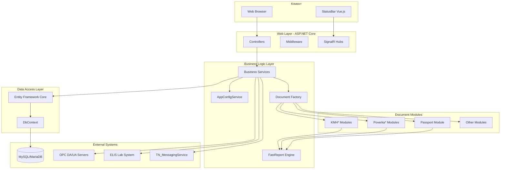

## Слои приложения

### 1. Presentation Layer (Представление)

**Компоненты:**
- ASP.NET Core MVC Controllers
- Razor Views
- Vue.js StatusBar (SPA)
- SignalR Hubs для real-time обновлений

**Ответственность:**
- Обработка HTTP запросов
- Рендеринг пользовательского интерфейса
- Real-time обновления статусов
- Валидация входных данных

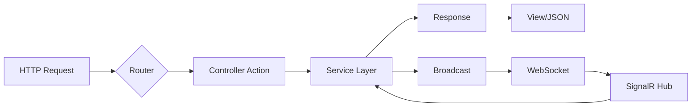

### 2. Business Logic Layer (Бизнес-логика)

**Компоненты:**
- `IAppConfigService` - управление конфигурацией и фабрика документов
- `PrinterService` - управление печатью
- `DirectoryService` - работа с файловой системой
- `StatusProvider` - мониторинг статусов
- `IReportBuffer` - буфер для PDF в памяти

**Ответственность:**
- Бизнес-правила генерации документов
- Управление конфигурацией
- Создание экземпляров модулей документов
- Мониторинг здоровья системы

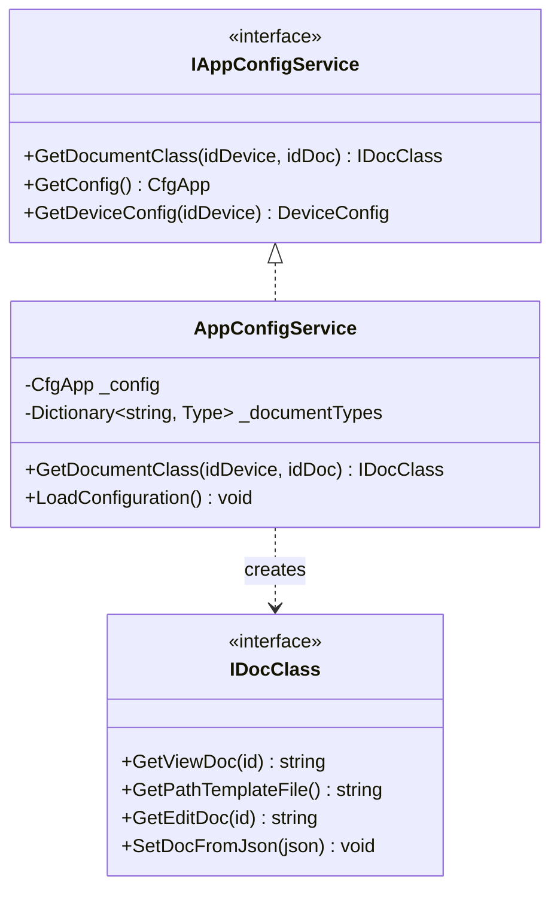

### 3. Data Access Layer (Доступ к данным)

**Компоненты:**
- Entity Framework Core
- DbContext implementations
- Repository Pattern (опционально)

**Ответственность:**
- Взаимодействие с базами данных
- ORM mapping
- Миграции схемы

### 4. Document Generation Layer

**Архитектура генерации документов:**

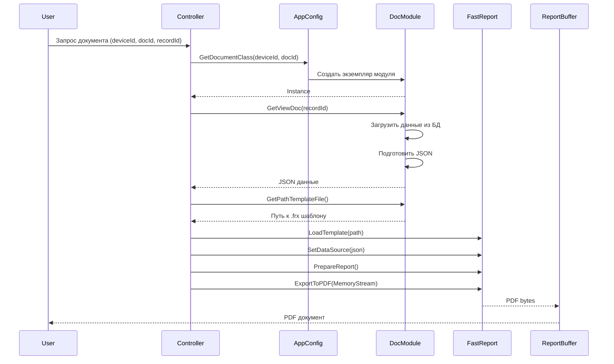

## Dependency Injection Architecture

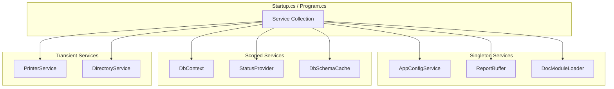

## Configuration Architecture

```mermaid
graph TB
    subgraph "Configuration Files"
        AS[appsettings.json]
        ASE[appsettings.Environment.json]
        CA[CfgApp.json]
        CD[Cfg{DocType}.json]
        CE[CfgEdit{DocType}.json]
    end

    subgraph "Configuration Loading"
        Builder[ConfigurationBuilder]
        Options[IOptions Pattern]
    end

    subgraph "Application"
        Services[Services]
        DocModules[Document Modules]
    end

    AS --> Builder
    ASE --> Builder
    CA --> Builder
    Builder --> Options
    Options --> Services
    CD --> DocModules
    CE --> DocModules
```

### Иерархия конфигурации

1. **appsettings.json** - базовые настройки ASP.NET Core
   - Kestrel настройки
   - Logging конфигурация
   - CORS policies

2. **CfgApp.json** - основная конфигурация приложения
   - Настройки устройств ИВК
   - Строки подключения к БД
   - ELIS интеграция
   - OPC серверы
   - Флаги безопасности

3. **Cfg{DocType}.json** - конфигурация типа документа
   - Путь к шаблону
   - Настройки отчета
   - Параметры экспорта

4. **CfgEdit{DocType}.json** - конфигурация форм редактирования
   - Поля формы
   - Валидация
   - Маппинг данных

## StatusBar Real-time Architecture

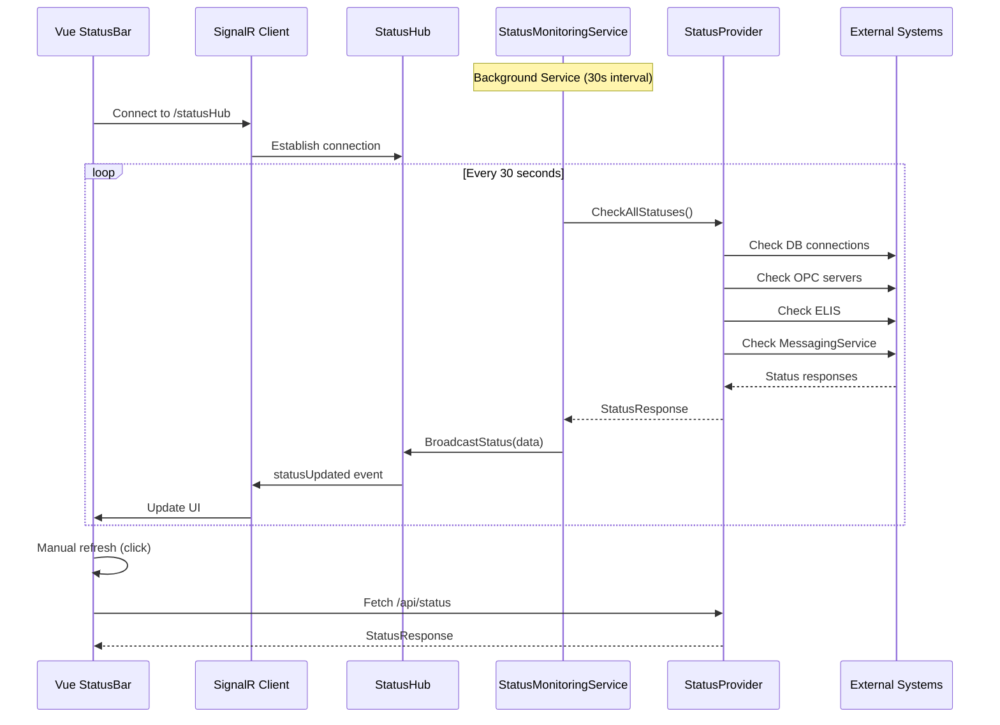

## Module Loading Architecture

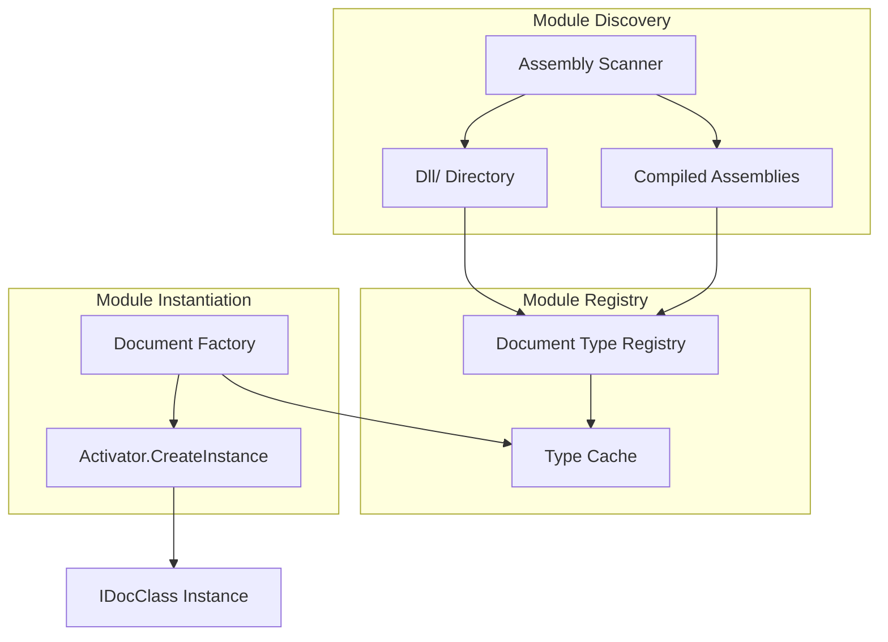

## Security & Error Handling

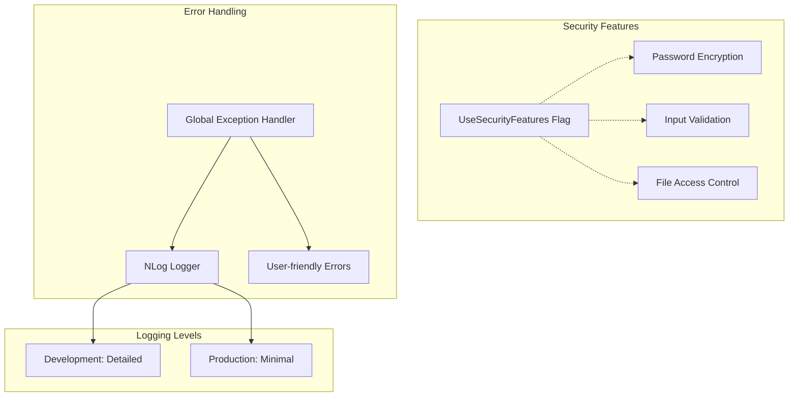

## Platform-specific Architecture

```mermaid
graph TB
    subgraph "Platform Detection"
        Runtime[RuntimeInformation]
    end

    subgraph "Windows"
        WinService[Windows Service]
        WinPrinter[winprutil.exe]
        WinLogs[TN_Doc/logs]
    end

    subgraph "Linux"
        Systemd[Systemd Service]
        CUPS[CUPS Printing]
        LinuxLogs[/opt/TN_Doc/logs]
    end

    Runtime --> WinService
    Runtime --> Systemd
    WinService --> WinPrinter
    WinService --> WinLogs
    Systemd --> CUPS
    Systemd --> LinuxLogs
```

## Field History Tracking Architecture (v1.4.4+)

Система отслеживания истории изменений полей паспорта качества для аудита источников данных.

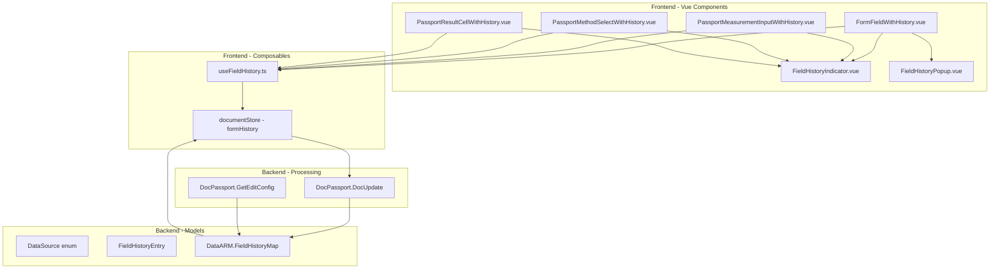

### Структура данных истории

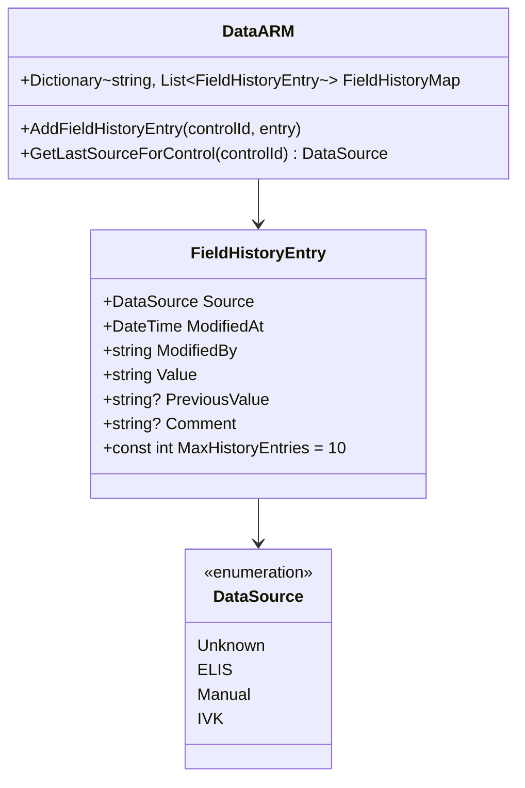

### Поток данных истории изменений

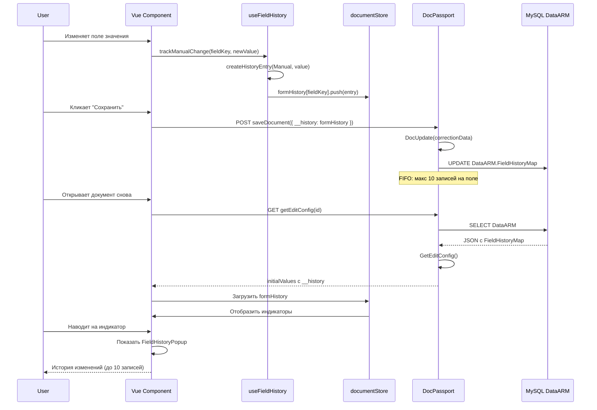

### Ключи истории для разных полей

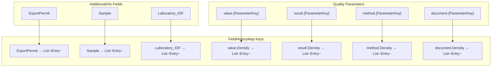

### UI Компоненты истории

**FieldHistoryIndicator (14-16px badge):**
- Отображает последний источник изменения
- Цвета: ELIS (зелёный #4CAF50), Manual (синий #2196F3), IVK (оранжевый #FF9800)
- Позиция: правый верхний угол поля (absolute, top: 4px, right: 4px)
- Триггер popup: hover на индикаторе

**FieldHistoryPopup (max 400px height):**
- PrimeVue OverlayPanel с прокруткой
- История изменений: последнее изменение сверху
- Формат: Источник + Дата/время + Старое → Новое значение
- Закрытие: клик вне области, ESC

### Миграция из ElisFilled

```mermaid
flowchart LR
    OldData[labInfo.ElisFilled = true] --> Check{Есть запись в\nFieldHistoryMap?}
    Check -->|Нет| Create[Создать запись:\nSource=ELIS\nModifiedAt=MinValue\nComment=Миграция]
    Check -->|Да| Skip[Пропустить]
    Create --> Store[Сохранить в\nvalue.{ParameterKey}]
    Store --> Flag[Обновить\nElisFilled из истории]
```

**Логика миграции в GetEditConfig:**
```csharp
if (labInfo.ElisFilled && !dataArm.FieldHistoryMap.ContainsKey($"value.{parameterKey}"))
{
    dataArm.AddFieldHistoryEntry($"value.{parameterKey}", new FieldHistoryEntry
    {
        Source = DataSource.ELIS,
        ModifiedAt = DateTime.MinValue,
        ModifiedBy = "ELIS",
        Value = labInfo.Value,
        Comment = "Миграция из ElisFilled"
    });
}
```

### Ограничения и оптимизация

**Лимиты:**
- Максимум 10 записей истории на поле (FIFO очередь)
- При добавлении 11-й записи удаляется самая старая

**Производительность:**
- История хранится в JSON поле DataARM
- Индексация не требуется (в памяти Dictionary)
- Размер записи ~150-200 байт

**Обратная совместимость:**
- Поле `ElisFilled` (bool) помечено как `[Obsolete]` но сохранено
- Автоматический пересчёт `ElisFilled` на основе последнего источника в истории
- Миграция старых документов при первой загрузке

## См. также

- [Document Modules Architecture](document-modules.md)
- [StatusBar Architecture](statusbar.md)
- [API Endpoints](../api/endpoints.md)
- [Deployment Guide](../deployment/linux.md)
- [Field History Feature Documentation](../features/field-history.md)
