# Архитектура TN_Doc

## Обзор

TN_Doc построен на основе многослойной архитектуры с четким разделением ответственности между компонентами.

**Текущая версия**: 1.3.8
**Основные компоненты**: ASP.NET Core 8.0 backend + Vue 3 frontend (Configurator, Document Editor)

**Ключевые возможности**:
- **Configurator (Vue SPA)** для управления конфигурацией приложения
- **Document Editor (Vue SPA)** для редактирования документов (в разработке)
- **FastReport** для генерации PDF отчётов
- **Интеграция с ELIS** для загрузки лабораторных данных
- **Система модулей документов** (~48 библиотек)

## Общая архитектура системы

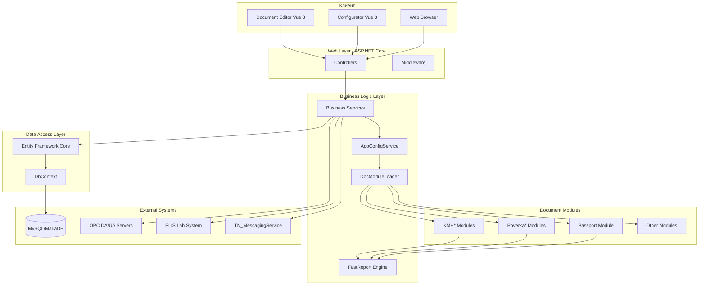

## Слои приложения

### 1. Presentation Layer (Представление)

**Компоненты:**
- ASP.NET Core MVC Controllers
- Razor Views
- Vue 3 Components (Configurator, Document Editor)

**Vue Components:**
- **Configurator** (`TN_Doc/Client/configurator/`) - веб-интерфейс управления конфигурацией
  - Framework: Vue 3 + TypeScript + PrimeVue
  - Dev server: port 5174
  - Build output: `wwwroot/configurator/`
  - Вкладки: General, Devices, Documents, OPC Connections, ELIS Connections
  - Статус: Production
- **Document Editor** (`TN_Doc/Client/document-editor/`) - редактирование документов
  - Framework: Vue 3 + TypeScript + PrimeVue
  - Dev server: port 5175
  - Build output: `wwwroot/document-editor/`
  - Функции: редактирование полей, ELIS интеграция
  - Статус: В активной разработке

**Ответственность:**
- Обработка HTTP запросов
- Рендеринг пользовательского интерфейса
- Валидация входных данных

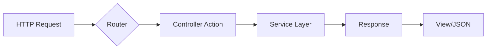

### 2. Business Logic Layer (Бизнес-логика)

**Компоненты:**
- `AppConfigService` - управление конфигурацией приложения
- `PrinterService` - управление печатью
- `DirectoryService` - работа с файловой системой
- `LoggingPathService` - централизованное управление путями логов

**Ответственность:**
- Бизнес-правила генерации документов
- Управление конфигурацией приложения
- Управление печатью документов
- Работа с файловой системой

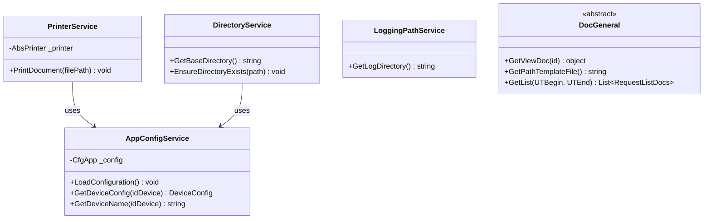

### 3. Data Access Layer (Доступ к данным)

**Компоненты:**
- Entity Framework Core
- DbContext implementations
- Repository Pattern (опционально)

**Ответственность:**
- Взаимодействие с базами данных
- ORM mapping
- Миграции схемы

### 4. Document Generation Layer

**Архитектура генерации документов (через HomeController):**

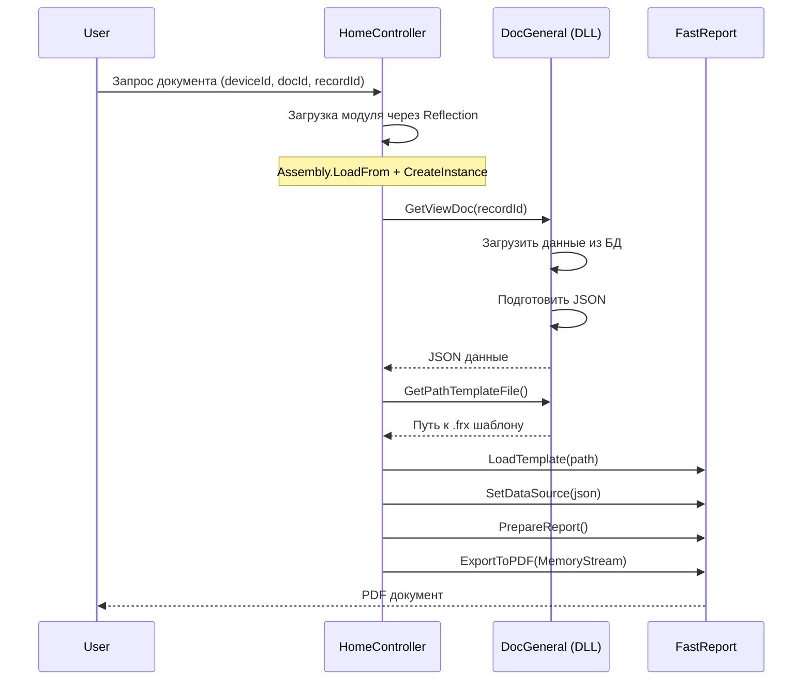

**Архитектура редактирования документов (через DirEditorController):**

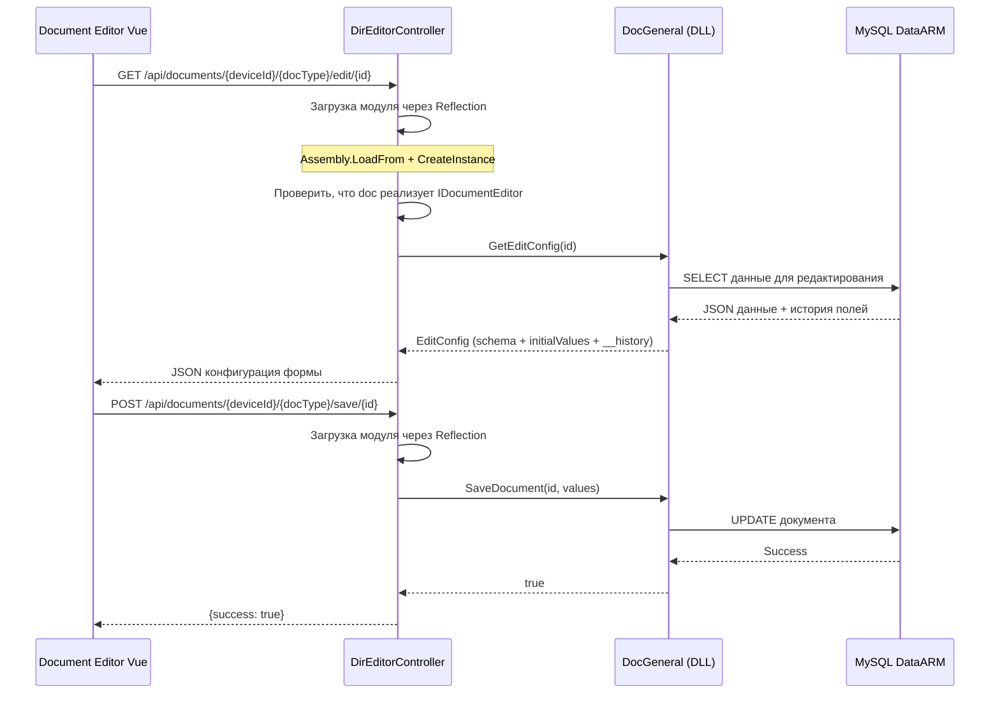

## Dependency Injection Architecture

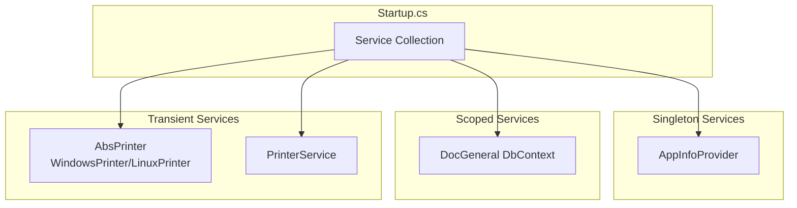

## Configuration Architecture

```mermaid
graph TB
    subgraph "Configuration Files"
        AS[appsettings.json]
        ASE[appsettings.Environment.json]
        CA[CfgApp.json]
        CD[Cfg{DocType}.json]
        CE[CfgEdit{DocType}.json]
    end

    subgraph "Configuration Loading"
        Builder[ConfigurationBuilder]
        Options[IOptions Pattern]
    end

    subgraph "Application"
        Services[Services]
        DocModules[Document Modules]
    end

    AS --> Builder
    ASE --> Builder
    CA --> Builder
    Builder --> Options
    Options --> Services
    CD --> DocModules
    CE --> DocModules
```

### Иерархия конфигурации

1. **appsettings.json** - базовые настройки ASP.NET Core
   - Kestrel настройки
   - Logging конфигурация
   - CORS policies

2. **CfgApp.json** - основная конфигурация приложения
   - Настройки устройств ИВК
   - Строки подключения к БД
   - ELIS интеграция
   - OPC серверы
   - Флаги безопасности

3. **Cfg{DocType}.json** - конфигурация типа документа
   - Путь к шаблону
   - Настройки отчета
   - Параметры экспорта

4. **CfgEdit{DocType}.json** - конфигурация форм редактирования
   - Поля формы
   - Валидация
   - Маппинг данных
   - Настройки истории изменений полей

**Примечание**: В текущей версии проекта отсутствуют централизованные сервисы для кэширования конфигурации и загрузки модулей. Модули документов загружаются напрямую в контроллерах через Reflection.

## Контроллеры приложения

```mermaid
sequenceDiagram
    participant Client as Web Client
    participant Controller as HomeController
    participant Service as Business Service
    participant DB as Database
    participant External as External Systems

    Note over Service: Business Logic Layer

    Client->>Controller: HTTP Request
    Controller->>Service: Call business method
    Service->>DB: Query data
        Provider->>External: Check OPC servers
        Provider->>External: Check ELIS
        Provider->>External: Check MessagingService
        External-->>Provider: Status responses
        Provider-->>Monitor: StatusResponse
        Monitor->>Hub: BroadcastStatus(data)
        Hub->>SignalR: statusUpdated event
        SignalR->>Vue: Update UI
    end

    Vue->>Vue: Manual refresh (click)
    Vue->>Provider: Fetch /api/status
    Provider-->>Vue: StatusResponse
```

## Document Editor Architecture (v1.4.4+)

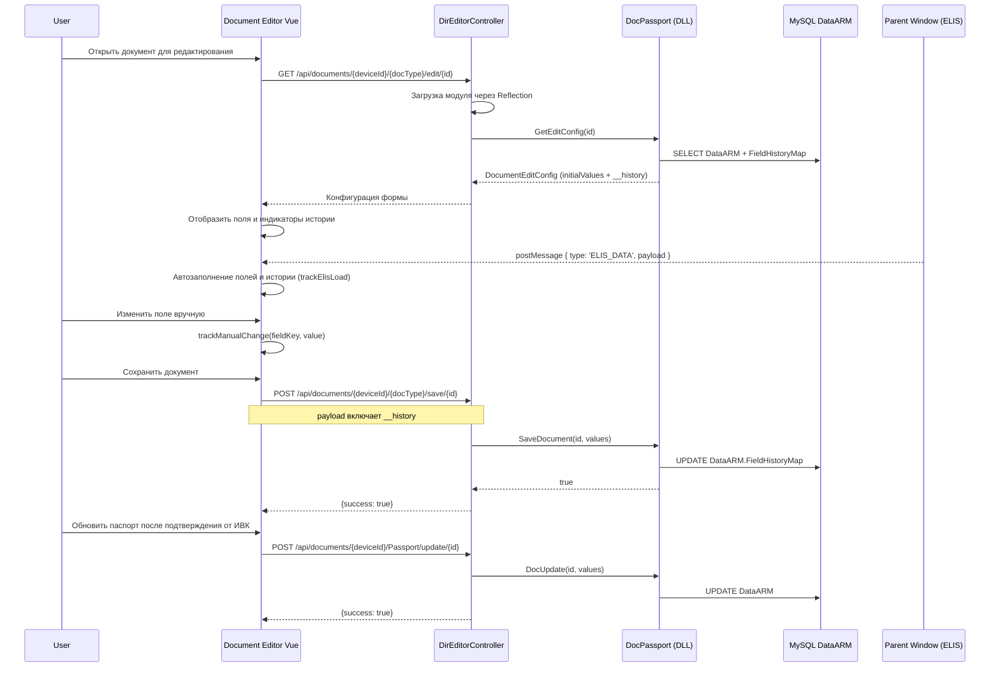

## Module Loading Architecture

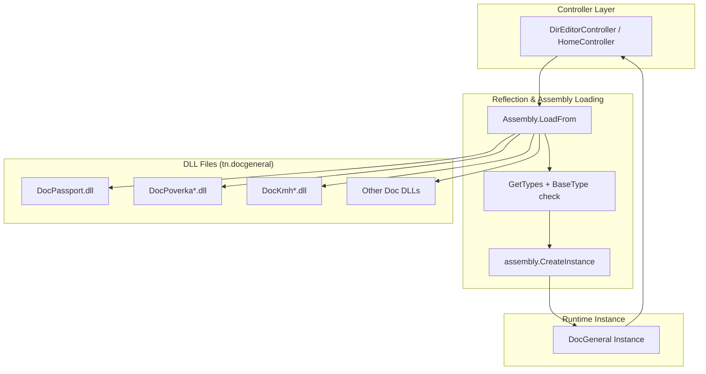

## UI Theme & Styling Architecture (v1.4.3+)

### Централизация цветов через CSS переменные

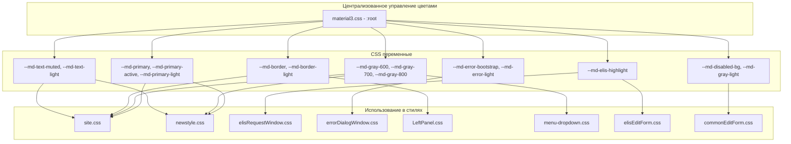

**Принципы:**
- Все цвета определены в `/TN_Doc/wwwroot/css/material3.css` в блоке `:root`
- Запрещено использовать hardcoded HEX-коды в других файлах стилей
- Изменение темы оформления - единственная точка редактирования (material3.css)
- CSS переменные используются через синтаксис `var(--md-variable-name)`

**Ключевые CSS переменные:**
- `--md-primary` (#1976D2) - основной цвет приложения
- `--md-primary-active` (#1565C0) - активное состояние
- `--md-gray-*` (#616161, #757575, #9E9E9E) - градации серого
- `--md-elis-highlight` (#e8f5e9) - подсветка данных ELIS
- `--md-error-*` (#d32f2f, #ffebee) - состояния ошибок
- `--md-border-*` (#e0e0e0, #f5f5f5) - границы элементов

## Security & Error Handling

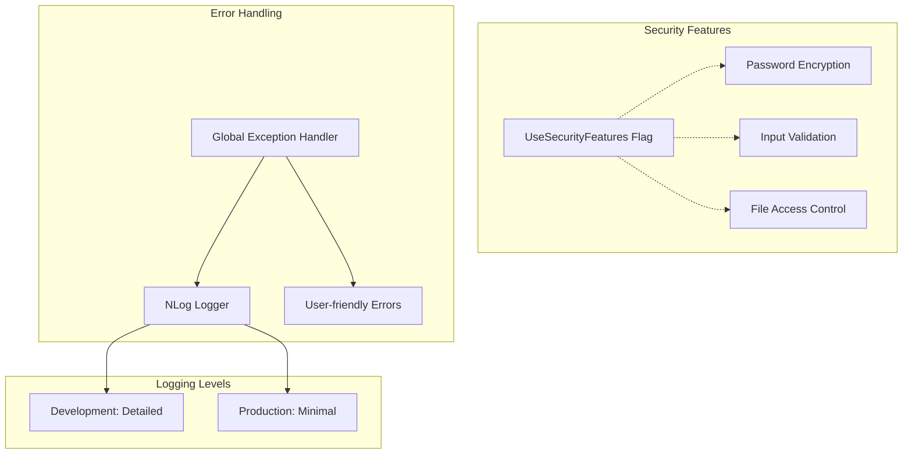

## Platform-specific Architecture

```mermaid
graph TB
    subgraph "Platform Detection"
        Runtime[RuntimeInformation]
    end

    subgraph "Windows"
        WinService[Windows Service]
        WinPrinter[winprutil.exe]
        WinLogs[TN_Doc/logs]
    end

    subgraph "Linux"
        Systemd[Systemd Service]
        CUPS[CUPS Printing]
        LinuxLogs[/opt/TN_Doc/logs]
    end

    Runtime --> WinService
    Runtime --> Systemd
    WinService --> WinPrinter
    WinService --> WinLogs
    Systemd --> CUPS
    Systemd --> LinuxLogs
```

## Field History Tracking Architecture (v1.4.4+)

Система отслеживания истории изменений полей паспорта качества для аудита источников данных.

**Требования:**
- ⚠️ **Требует включенного ELIS** в конфигурации (`CfgApp.json`: `Elis.Use = true`)
- Работает с паспортами качества (Passport document type)
- История хранится в поле `FieldHistoryMap` таблицы `DataARM` (JSON)
- Максимум 10 записей на поле (FIFO очередь)

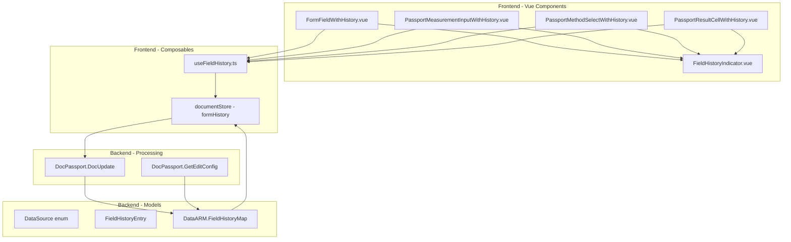

### Структура данных истории

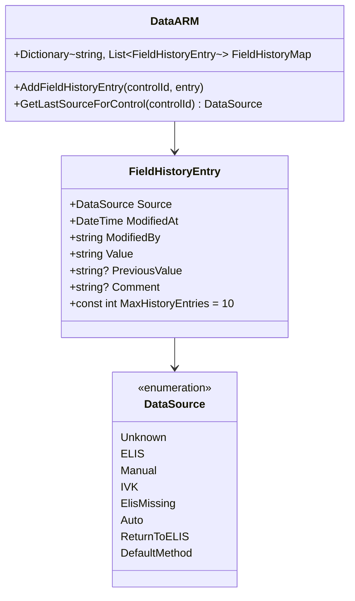

### Поток данных истории изменений

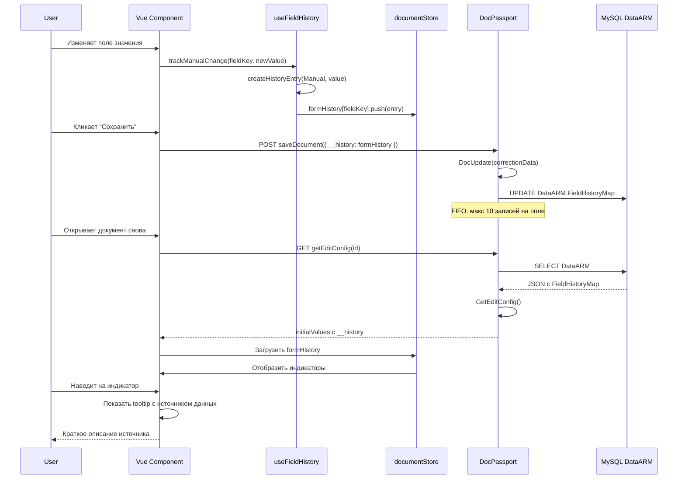

### Ключи истории для разных полей

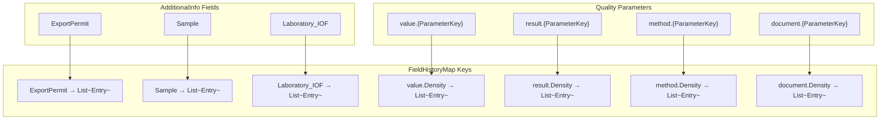

### UI Компоненты истории

**FieldHistoryIndicator (14-16px badge):**
- Отображает последний источник изменения
- Цвета: ELIS (зелёный #4CAF50), Manual (синий #2196F3), IVK (оранжевый #FF9800)
- Позиция: правый верхний угол поля (absolute, top: 4px, right: 4px)
- Подсказка отображается через `v-tooltip` (краткое описание источника)

### Миграция из ElisFilled

```mermaid
flowchart LR
    OldData[labInfo.ElisFilled = true] --> Check{Есть запись в\nFieldHistoryMap?}
    Check -->|Нет| Create[Создать запись:\nSource=ELIS\nModifiedAt=MinValue\nComment=Миграция]
    Check -->|Да| Skip[Пропустить]
    Create --> Store[Сохранить в\nvalue.{ParameterKey}]
    Store --> Flag[Обновить\nElisFilled из истории]
```

**Логика миграции в GetEditConfig:**
```csharp
if (labInfo.ElisFilled && !dataArm.FieldHistoryMap.ContainsKey($"value.{parameterKey}"))
{
    dataArm.AddFieldHistoryEntry($"value.{parameterKey}", new FieldHistoryEntry
    {
        Source = DataSource.ELIS,
        ModifiedAt = DateTime.MinValue,
        ModifiedBy = "ELIS",
        Value = labInfo.Value,
        Comment = "Миграция из ElisFilled"
    });
}
```

### Ограничения и оптимизация

**Лимиты:**
- Максимум 10 записей истории на поле (FIFO очередь)
- При добавлении 11-й записи удаляется самая старая

**Производительность:**
- История хранится в JSON поле DataARM
- Индексация не требуется (в памяти Dictionary)
- Размер записи ~150-200 байт

**Обратная совместимость:**
- Поле `ElisFilled` (bool) помечено как `[Obsolete]` но сохранено
- Автоматический пересчёт `ElisFilled` на основе последнего источника в истории
- Миграция старых документов при первой загрузке

## Recent Changes

### v1.4.4 (Текущая версия - в разработке)

**Архитектурные улучшения:**
- ✅ **Рефакторинг DocPassport** - разделение на partial классы:
  - `DocPassport.cs` - основная логика и конструктор
  - `DocPassport.Editor.cs` - методы редактирования (GetEditConfig, SaveDocument)
  - `DocPassport.Listing.cs` - методы получения списков документов
  - `DocPassport.Update.cs` - методы обновления данных (DocUpdate)
- ✅ **Оптимизация DocUpdate** - выделение сервисов обработки обновлений в pipeline
- ✅ **Рефакторинг Poverka** - разнесение сервисов DocUpdate для всех модулей поверки
- ✅ **Улучшение HomeController** - использование IDocModuleLoader для унифицированной загрузки модулей

**Document Editor:**
- ✅ Редактор паспортов качества и актов (Vue 3 SPA)
- ✅ Модальные окна для редактирования результатов и методов (ResultEditDialog, ManualMethodDialog)
- ✅ Компоненты с историей изменений (FieldHistoryIndicator + tooltip)
- ✅ ELIS автозаполнение через postMessage
- ✅ Автозаполнение связанных параметров (LinkedParameter/SlaveKey)

**Система истории изменений полей:**
- Отслеживание источника данных (ELIS, ручное редактирование, округление ИВК)
- Визуальные индикаторы источников в UI (цветные значки: зелёный/синий/оранжевый)
- История хранится в `FieldHistoryMap` (до 10 записей на поле)
- Автоматическая миграция из старого флага `ElisFilled`
- Раздельная история для value/method/result/document полей
- ⚠️ Требует включенного ELIS в конфигурации (`Elis.Use = true`)

**Configurator Enhancements:**
- Добавлена вкладка Documents - управление конфигурацией типов документов
- Расширены вкладки OPC Connections и ELIS Connections
- Настройки измерительных приборов (СИ)

**UI Theme Improvements:**
- Централизация цветов через CSS переменные в material3.css
- Все hardcoded HEX коды заменены на CSS переменные
- Новые переменные: `--md-primary-active`, `--md-gray-*`, `--md-elis-highlight`, `--md-error-*`
- Единая точка изменения темы оформления

**Journal Report Fix:**
- Исправлена форма печати журнала регистрации СИ (совместимость с DataARM)

**Dependencies:**
- Обновлён docgeneral до версии 1.2.3

### v1.4.3 (October 2024)

**Configurator Basic Version:**
- Веб-интерфейс управления конфигурацией (`/configurator`)
- Вкладки: General, Devices, OPC Connections, ELIS Connections

### v1.4.2 (September 2024)

**Configuration Caching:**
- `IConfigurationCacheService` с LRU eviction (максимум 50 файлов)
- Автоматическая инвалидация кэша при изменении файлов

**Document Module Loading:**
- `IDocModuleLoader` для кэширования загрузки DLL документов
- Оптимизация производительности при создании экземпляров

**In-memory HTML Generation:**
- GetEditDoc теперь работает в памяти (исключено построение HTML из файла)
- Улучшена производительность и устранены race conditions

**Protocol Updates:**
- Обновлён KMH_MI2816 для поддержки ИВК версии 7.12.14.3000

**Removed Components:**
- Удалён проект TN.Tools (устаревшая функциональность)
- Удалён дублирующий шаблон `Act_GOSTR50.2.040(G)_ShiftTime.frx`

### v1.4.1 (August 2024)

**In-memory PDF Generation:**
- `IReportBuffer` для хранения PDF в памяти
- Исключены дисковые I/O операции
- Устранены ошибки "file in use" при параллельных запросах

**Configuration Improvements:**
- Локальные директории пользователей для подписантов
- Отчёты и журналы используют локальные ссылки на пользователей

**LoggingPathService Refactoring:**
- Перенесён в `TN.DocGeneral/Services/` для переиспользования
- Централизованное управление путями логов

## См. также

- [Document Modules Architecture](document-modules.md)
- [Document Editor Architecture](document-editor.md)
- [Configurator Architecture](configurator.md)
- [Passport Editor Logic](passport-editor.md)
- [Field History Feature Documentation](../features/field-history.md)
- [Deployment Guide](../deployment/linux.md)
