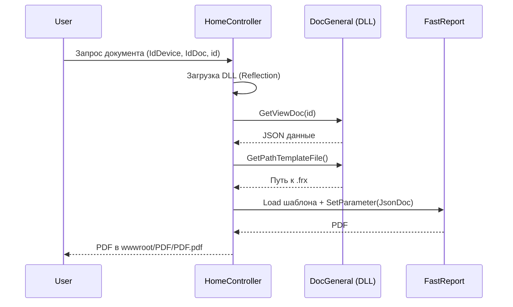

# Архитектура TN_Doc

## Обзор

TN_Doc — ASP.NET Core 8.0 MVC‑приложение для генерации технических документов и отчётов ИВК. Генерация PDF выполняется через **FastReport**, а документы формируются динамически из модулей (`tn.docgeneral`) и шаблонов `.frx`.

**Текущая версия:** 1.3.8

**Стек UI:** Razor‑представления + статические JS/CSS (Bootstrap/jQuery/DataTables). Отдельных SPA (Vue) в текущем коде нет.

## Основные компоненты

- **ASP.NET Core MVC**: контроллеры + Razor‑представления
- **FastReport**: генерация PDF
- **DocGeneral‑модули**: динамическая загрузка DLL документов
- **CfgApp.json**: конфигурация устройств/документов
- **DirEditor**: модальное редактирование справочников и конфигурации паспортов качества
- **OPC/ELIS**: частичная интеграция (см. `docs/integration/elis.md`)

## Общая схема

```mermaid
graph TB
    subgraph "Client"
        Browser[Browser + Razor UI]
    end

    subgraph "ASP.NET Core"
        Controllers[Controllers]
        Views[Razor Views]
        Static[wwwroot (JS/CSS/HTML)]
    end

    subgraph "Services"
        AppConfig[AppConfigService]
        DocLoader[Doc module loader]
        Printer[PrinterService]
        FastReport[FastReport Engine]
    end

    subgraph "Document Modules"
        DocGeneral[DocGeneral DLLs]
    end

    subgraph "External"
        DB[(MySQL/MariaDB)]
        OPC[OPC DA/UA]
        ELIS[ELIS]
    end

    Browser --> Views
    Views --> Controllers
    Static --> Views
    Controllers --> AppConfig
    Controllers --> DocLoader
    DocLoader --> DocGeneral
    DocGeneral --> FastReport
    DocGeneral --> DB
    Controllers --> Printer
    Controllers --> OPC
    Controllers --> ELIS
```

## Presentation Layer (UI)

**Ключевые файлы UI:**
- `TN_Doc/Views/Home/Index.cshtml` — главная страница (выбор устройства/документа, просмотр PDF, модальные окна)
- `TN_Doc/wwwroot/js/Common.js` — логика UI, загрузка документов, переключение режимов
- `TN_Doc/wwwroot/js/TN_MessagingService.js` — чтение/запись OPC-тегов и работа с кэшем OPC-клиента
- `TN_Doc/wwwroot/js/Logger.js` — отправка клиентских логов в backend (`/api/ClientLog/logging`)
- `TN_Doc/wwwroot/js/DirEditorComponentScript.js` — редактор справочников (DirEditor)
- `TN_Doc/wwwroot/HTML/*.html` — HTML‑шаблоны редактирования (загружаются в iframe)

**Редактирование документа:**
- `Home/GetDocEdit` вызывает `DocGeneral.GetEditDoc()`
- HTML‑форма редактирования подгружается в iframe (класс `FR`)
- Сохранение выполняется через `Home/SaveDoc` / `Home/UpdateDoc`

**Клиентское чтение OPC кэша (актуализация 2026-02):**
- `ReadTagCache` (`TN_MessagingService.js`) и `ReadTagCacheARM` (`Common.js`) используют синхронные AJAX GET на `http://localhost:5010/api/OPCClientCache/...`.
- Для ответов `404/500` и исключений JavaScript выполняется логирование через `logError(...)` в `Logger.js`.
- Если `CurrentDeviceName` не задан, `ReadTagCache` возвращает `undefined` и пишет предупреждение через `logWarn(...)`.

## Business Logic Layer

- **AppConfigService** — загрузка/кэш конфигурации (`CfgApp.json`, `Cfg*.json`)
- **PrinterService** — печать PDF
- **LoggingPathService** — путь логов по ОС
- **DocGeneral‑модули** — получение списков, данных и шаблонов документов

## Генерация документа (поток)



## Контроллеры

- `HomeController` — основной UI + генерация/экспорт/редактирование документов
- `DirEditorController` — работа со справочниками и конфигурацией паспортов качества
- `PrintController` — печать последнего PDF
- `ExportController` — список форматов экспорта (частичная реализация)
- `ElisController` — логирование сообщений ELIS

## Интеграция с ELIS (статус)

В текущем коде присутствуют модели ELIS и контроллер для логирования ошибок, но отсутствуют REST‑эндпоинты загрузки протоколов и фронтенд‑редактор. Детали — в `docs/integration/elis.md`.
