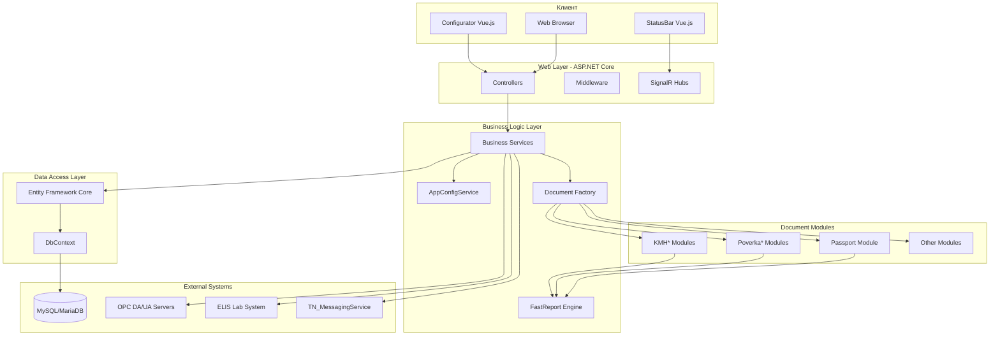
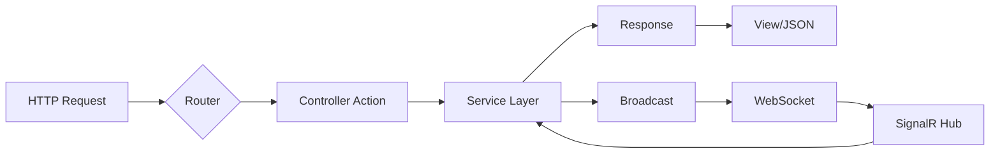
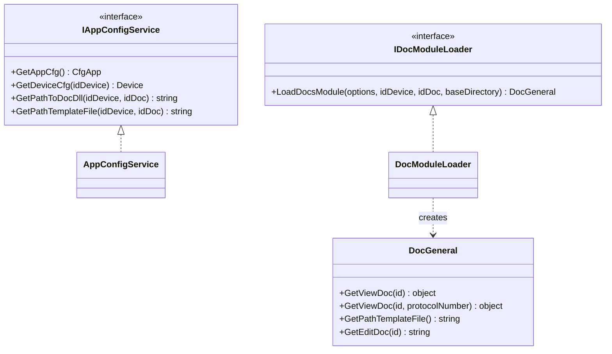
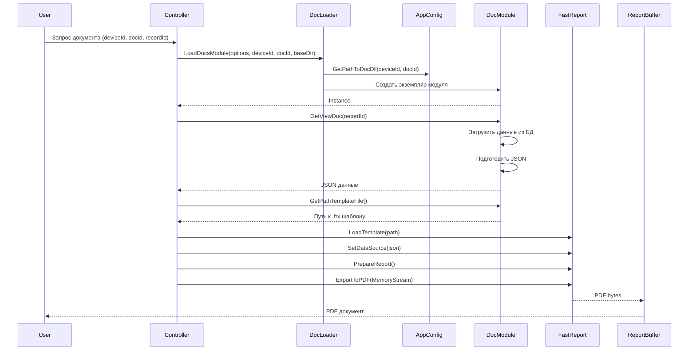
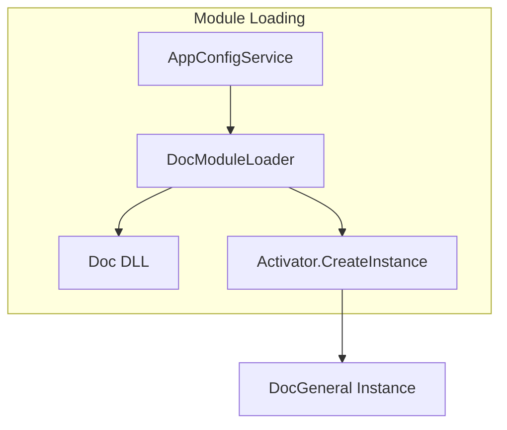
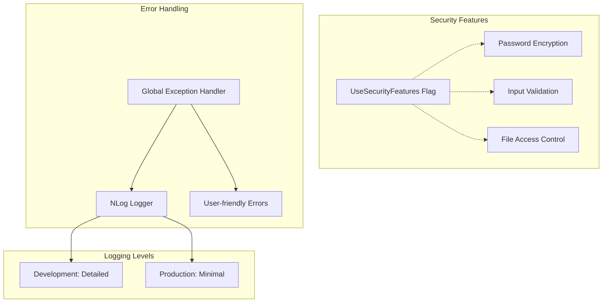

# Архитектура TN_Doc

## Обзор

TN_Doc построен на основе многослойной архитектуры с четким разделением ответственности между компонентами.

## Общая архитектура системы



## Слои приложения

### 1. Presentation Layer (Представление)

**Компоненты:**
- ASP.NET Core MVC Controllers
- Razor Views
- Vue.js StatusBar и Configurator (SPA)
- SignalR Hubs для real-time обновлений

**Ответственность:**
- Обработка HTTP запросов
- Рендеринг пользовательского интерфейса
- Real-time обновления статусов
- Валидация входных данных



### 2. Business Logic Layer (Бизнес-логика)

**Компоненты:**
- `IAppConfigService` - управление конфигурацией + фабрика документов
- `IDocModuleLoader` - динамическая загрузка модулей документов (LRU, макс. 5)
- `IConfigurationCacheService` - кэш JSON-конфигов (LRU, макс. 50)
- `IConfigurationService` - управление конфигурацией и документами (веб)
- `IDeviceConnectionDiagnosticService` - диагностика подключений устройств
- `StatusMonitoringService` - BackgroundService: периодическая проверка + SignalR push
- `IStatusProvider` - мониторинг здоровья системы (многоканальный)
- `PrinterService` - платформо-зависимая печать
- `IReportBuffer` - in-memory PDF хранилище
- `LoggingPathService` - кросс-платформенное определение путей логирования

**Ответственность:**
- Бизнес-правила генерации документов
- Управление конфигурацией
- Создание экземпляров модулей документов
- Мониторинг здоровья системы
- Диагностика подключений к устройствам ИВК
- Кэширование конфигурационных файлов



### 3. Data Access Layer (Доступ к данным)

**Компоненты:**
- Entity Framework Core
- DbContext implementations
- Repository Pattern (опционально)

**Ответственность:**
- Взаимодействие с базами данных
- ORM mapping
- Миграции схемы

### 4. Document Generation Layer

**Архитектура генерации документов:**



## Dependency Injection Architecture

```mermaid
graph TB
    subgraph "Startup.cs / Program.cs"
        SC[Service Collection]
    end

    subgraph "Singleton Services"
        AppConfig[AppConfigService]
        ReportBuffer[ReportBuffer]
        DocLoader[CachedDocModuleLoader]
        ConfigCache[ConfigurationCacheService]
        LogPath[LoggingPathService]
        DiagSvc[DeviceConnectionDiagnosticService]
        DbSchema[DbSchemaCache]
        ClientTracker[AppClientTracker]
    end

    subgraph "Scoped Services"
        StatusProv[StatusProvider]
        ConfigSvc[ConfigurationService]
    end

    subgraph "Hosted Services"
        Monitor[StatusMonitoringService]
    end

    subgraph "Transient Services"
        Printer[PrinterService]
    end

    SC --> AppConfig
    SC --> ReportBuffer
    SC --> DocLoader
    SC --> ConfigCache
    SC --> LogPath
    SC --> DiagSvc
    SC --> DbSchema
    SC --> ClientTracker
    SC --> StatusProv
    SC --> ConfigSvc
    SC --> Monitor
    SC --> Printer
```



## Configuration Architecture

```mermaid
graph TB
    subgraph "Configuration Files"
        AS[appsettings.json]
        ASE[appsettings.Environment.json]
        CA[CfgApp.json]
        CD[Cfg{DocType}.json]
        CE[CfgEdit{DocType}.json]
    end

    subgraph "Configuration Loading"
        Builder[ConfigurationBuilder]
        Options[IOptions Pattern]
    end

    subgraph "Application"
        Services[Services]
        DocModules[Document Modules]
    end

    AS --> Builder
    ASE --> Builder
    CA --> Builder
    Builder --> Options
    Options --> Services
    CD --> DocModules
    CE --> DocModules
```

### Иерархия конфигурации

1. **appsettings.json** - базовые настройки ASP.NET Core
   - Kestrel настройки
   - Logging конфигурация
   - CORS policies

2. **CfgApp.json** - основная конфигурация приложения
   - Настройки устройств ИВК (Devices, UsedSI)
   - Строки подключения к БД (DBConnectionStrings)
   - ELIS интеграция
   - OPC серверы (ARM и per-device)
   - Флаги безопасности (UseSecurityFeatures)
   - Диагностика подключений (DeviceConnectionDiagnostic)

3. **Cfg{DocType}.json** - конфигурация типа документа
   - Путь к шаблону
   - Настройки отчета
   - Параметры экспорта

4. **CfgEdit{DocType}.json** - конфигурация форм редактирования
   - Поля формы
   - Валидация
   - Маппинг данных

## StatusBar Real-time Architecture


## Module Loading Architecture



## Security & Error Handling



## Platform-specific Architecture

```mermaid
graph TB
    subgraph "Platform Detection"
        Runtime[RuntimeInformation]
    end

    subgraph "Windows"
        WinService[Windows Service]
        WinPrinter[winprutil.exe]
        WinLogs[TN_Doc/logs]
    end

    subgraph "Linux"
        Systemd[Systemd Service]
        CUPS[CUPS Printing]
        LinuxLogs[/opt/TN_Doc/logs]
    end

    Runtime --> WinService
    Runtime --> Systemd
    WinService --> WinPrinter
    WinService --> WinLogs
    Systemd --> CUPS
    Systemd --> LinuxLogs
```

## См. также

- [Document Modules Architecture](document-modules.md)
- [StatusBar Architecture](statusbar.md)
- [API Endpoints](../api/endpoints.md)
- [Deployment Guide](../deployment/linux.md)
