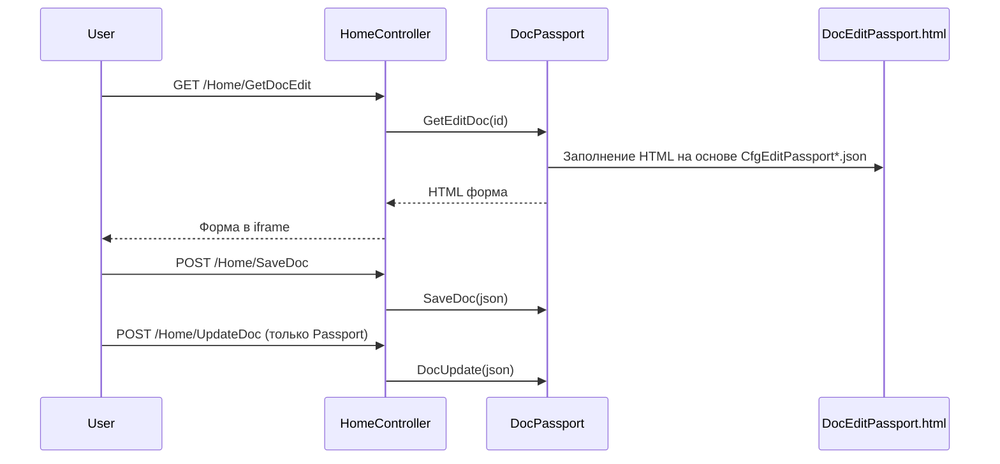

# Редактирование паспорта качества (текущий механизм)

## Обзор

Паспорт качества редактируется через HTML‑форму, которую генерирует модуль `DocPassport` на основе конфигурации и данных из БД. Отдельного SPA‑редактора нет.

**Ключевые файлы:**
- `tn.docgeneral/Passport/DocPassport.cs` — логика формирования формы и сохранения
- `TN_Doc/wwwroot/HTML/DocEditPassport.html` — HTML‑шаблон
- `TN_Doc/wwwroot/js/EditDoc.js` — сбор данных и отправка на backend

## Поток редактирования

## Источники данных формы

- **Конфигурация**: `TN_Doc/Cfg/Passport/CfgEditPassport*.json`
- **Справочники**: из `CfgApp.json` (Users, Licenses и др.)
- **Данные паспорта**: из БД, через `DocPassport.GetViewDoc()`

## ELIS

В текущей версии:
- есть модели ELIS (`tn.docgeneral/Passport/Elis/*`)
- есть контроллер `ElisController` для логирования ошибок
- **нет** REST‑эндпойнтов загрузки протоколов и SPA‑редактора

Подробности: `docs/integration/elis.md`.

