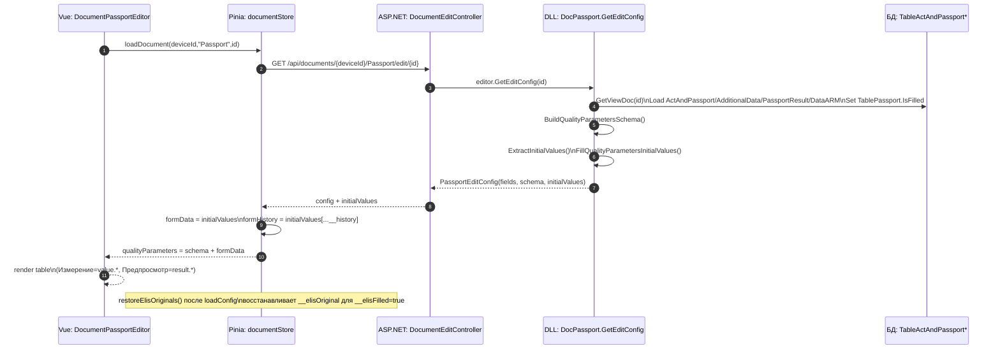
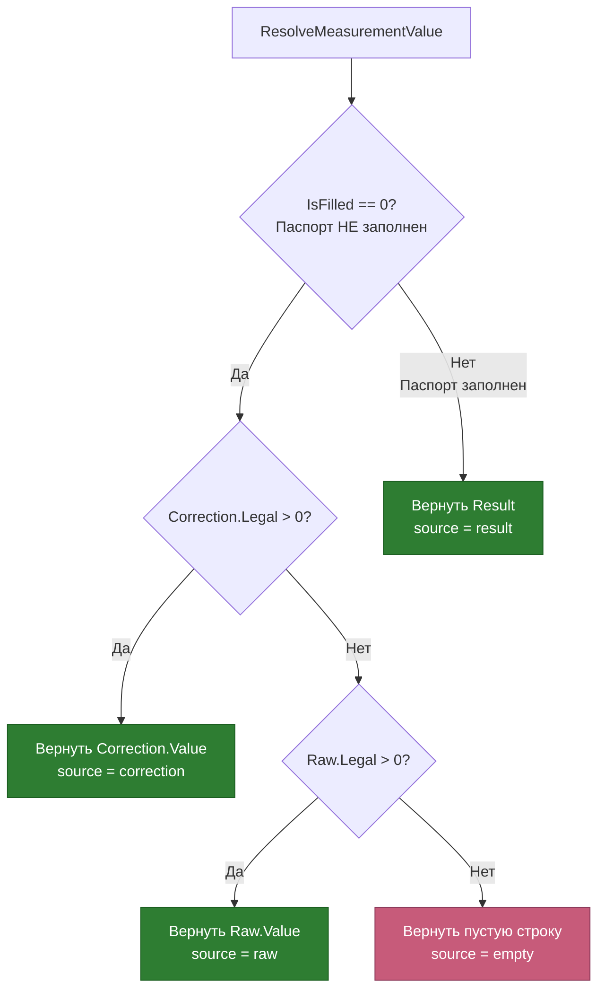
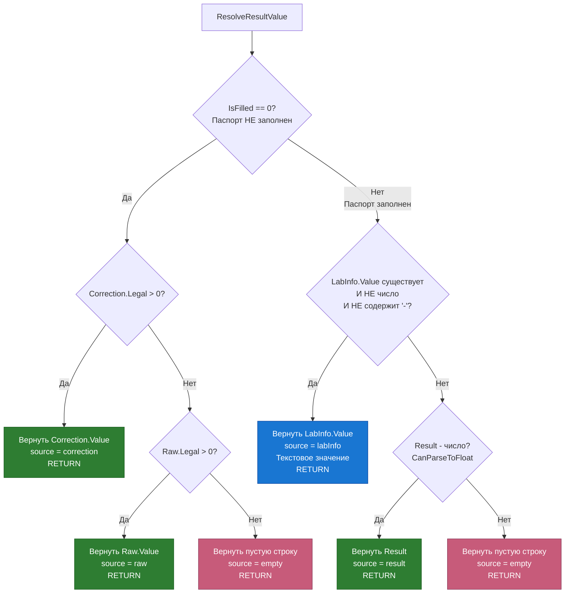
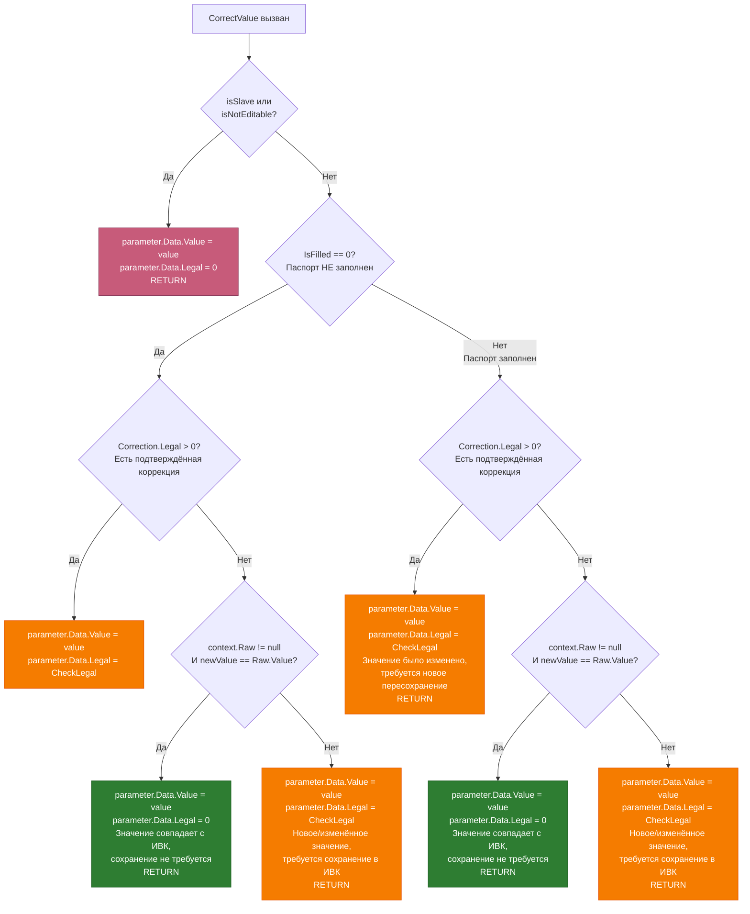

# Паспорт качества: логика отображения, редактирования и сохранения (Document Editor)

Документ описывает фактическую реализацию паспорта качества в **Vue Document Editor** и бэкенд‑модуле **DocPassport**: отображение формы, применение данных ELIS, редактирование параметров, сохранение и этап обновления после подтверждения ИВК (OPC).

## Область применения

- **UI редактирования**: `TN_Doc/Client/document-editor/src/views/DocumentPassportEditor.vue`
- **API редактирования**: `TN_Doc/Controllers/DocumentEditController.cs`
- **Модуль паспорта (DLL)**: `tn.docgeneral/Passport/DocPassport.cs` + partial‑классы
  - `tn.docgeneral/Passport/DocPassport.Editor.cs` (GetEditConfig/SaveDocument)
  - `tn.docgeneral/Passport/DocPassport.Update.cs` (DocUpdate/BuildCorrectionData/нормализация/мерж истории)
  - сервисы обновления: `tn.docgeneral/Passport/Service/*`

## Технологии и компоненты

### Frontend (Document Editor)

- Vue 3 + TypeScript + Pinia + PrimeVue
- Ключевые файлы:
  - View: `TN_Doc/Client/document-editor/src/views/DocumentPassportEditor.vue`
  - Store: `TN_Doc/Client/document-editor/src/stores/documentStore.ts`
  - Composables:
    - `TN_Doc/Client/document-editor/src/composables/useDocumentEditor.ts` (загрузка, интеграция с родительским окном, SaveDoc)
    - `TN_Doc/Client/document-editor/src/composables/usePassportEditor.ts` (логика редактирования таблицы качества)
    - `TN_Doc/Client/document-editor/src/composables/usePassportSave.ts` (сохранение паспорта с OPC polling и update)
    - `TN_Doc/Client/document-editor/src/composables/useElisIntegration.ts` (приём ELIS через `postMessage`)
    - `TN_Doc/Client/document-editor/src/composables/useFieldHistory.ts` (формирование истории на фронтенде)
    - `TN_Doc/Client/document-editor/src/composables/usePassportNormalization.ts` (нормализация десятичных разрядов)
  - Компоненты:
    - `FormFieldWithHistory` / `SignerFieldGroup` / `DateRangeFieldGroup`
    - `PassportQualityTable` и его вложенные компоненты (ввод измерений, выбор метода, модалки)

### Backend (ASP.NET Core + модуль документов)

- Контроллер API: `TN_Doc/Controllers/DocumentEditController.cs`
- Модуль паспорта: `tn.docgeneral/Passport/DocPassport.*.cs`
- Правила тегирования/флагов:
  - `tn.docgeneral/Passport/Extensions/PassportExtensions.cs` (`ResolveTag`, `ExtractElisFlag`)

## Контракты и ключи данных

### Маршрут редактора

- Редактор паспорта открывается по пути вида: `/document-editor/edit/{deviceId}/Passport/{id}`
- Внутри SPA тип документа фиксирован как `Passport` (`DocumentPassportEditor.vue`).

### API endpoints (фактическое использование)

- `GET /api/documents/{deviceId}/Passport/edit/{id}` → конфигурация формы + `initialValues`
- `POST /api/documents/{deviceId}/Passport/save/{id}` → “первичное” сохранение (без этапа подтверждения ИВК)
- `POST /api/documents/{deviceId}/Passport/update/{id}` → обновление после подтверждения ИВК (DocUpdate, история, ELIS протокол)

### Ключи полей (controlId)

#### AdditionalInfo

- Простой ключ, например: `ExportPermit`, `Sample`, `Laboratory_IOF`, `PassportPeriodDT.Begin`.
- Поля‑подписанты представлены как select:
  - Значение в форме: `Laboratory_IOF = "<userId>"`, а реальный текст хранится как `Laboratory_IOF__label = "И. О. Фамилия"`.

#### Параметры качества (таблица)

Ключи параметров всегда составные:

- `value.{ParameterKey}` — измерение (measurement)
- `result.{ParameterKey}` — результат для печати (print/result)
- `method.{ParameterKey}` — метод испытаний (JSON строки)
- `document.{ParameterKey}` — документ ELIS (JSON строки)

#### Метаданные и служебные ключи

Используются для флагов/интеграции и не превращаются напрямую в `EditData` при сборке `CorrectionData`:

- `{controlId}__elisFilled` — текущий флаг “значение соответствует ELIS/ReturnToELIS”
- `{controlId}__elisOriginal` — сохранённое “оригинальное” значение для механизма “возврата к ELIS”
- `{controlId}__elisMissing` — поле ожидалось из ELIS, но не найдено
- `{controlId}__label` — label для select (подписанты)
- `method.{key}__elisOption` — полный объект метода из ELIS (для возврата/сравнения)
- `result.{key}__manualOverride` — признак ручной правки результата (для non‑ballast)
- `__elisProtocol` — полный протокол ELIS (JSON), отправляется на бэкенд в update‑шаге
- `__history` — история изменений полей (JSON), отправляется на бэкенд в update‑шаге

## Frontend: логика отображения

### Состояния страницы

`DocumentPassportEditor.vue` показывает:

- `store.isLoading` → спиннер и текст “Загрузка формы…”
- `store.error` → `Message` с ошибкой
- `store.isReady` → редактор
- `store.isSaving` → оверлей “Сохранение…” поверх UI

### AdditionalInfo: таблица полей

`displayRows` в `DocumentPassportEditor.vue` формирует отображение **в исходном порядке из конфигурации**, но с группировками:

1. **Диапазон дат**: если встречается `PassportPeriodDT.Begin`, то `Begin` и `End` объединяются в `DateRangeFieldGroup`.
2. **Группы подписантов**: если встречается `*_Post`, то собирается тройка полей:
   - `{prefix}_Post`, `{prefix}_Factory`, `{prefix}_IOF` → один `SignerFieldGroup`
   - Заголовок строки берётся из label поля `*_IOF` и “очищается” от суффикса в скобках.
3. Остальные поля рендерятся как `FormFieldWithHistory`.

### Таблица качественных показателей

`PassportQualityTable` отображается, если `hasQualityParameters == true`.

Список строк таблицы формируется в `usePassportEditor` на базе `qualityParametersSchema` + `store.formData`:

- **Slave‑параметры исключены** из UI (`role === 'Slave'`) и из валидации (`documentStore.ts`).

## Frontend: интеграция с ELIS

### Как данные ELIS попадают в редактор

Встроенный редактор слушает `window.postMessage`:

- `useElisIntegration` ждёт сообщение формата `{ type: 'ELIS_DATA', payload: <ElisPassportData> }`
- После получения данные “обогащаются” (`enrichElisData`) и передаются в `handleElisData` (`DocumentPassportEditor.vue`).

### Применение ELIS данных (`handleElisData`)

Если конфигурация ещё не загружена (`store.config`/`store.fields` пусты), данные кладутся в `pendingElisData` и применяются после `loadDocument()`.

Дальше формируется bulk‑payload `updates` и применяется через `store.bulkUpdateFields(updates)`.

#### 1) AdditionalInfo

Для каждого поля с `elisAlias` выполняется поиск значения (fallback):

1) корень `elisData`, 2) `elisData.labInfo`, 3) `elisData.signers.laboratory`.

Особенности:

- Для `list`/`select` поля ищется опция по `label`. Если опции нет — она добавляется в `field.options`.
- Для `Laboratory_IOF` дополнительно извлекается `UserData` (post/factory) и кладётся в `option.data` для автозаполнения.

При успехе:

- выставляется `{key} = value` и `{key}__elisFilled = true`
- сохраняется `{key}__elisOriginal`
- пишется история `trackElisLoad(key, value, protocolNumber)`

Если значение не найдено:

- выставляется `{key}__elisMissing = true`
- пишется `trackElisMissing(key, protocolNumber)`

#### 2) Параметры качества

Для каждого `paramSchema`:

- `role === 'Slave'` → пропуск (не заполняется из ELIS)
- вычисляются ключи `valueKey/methodKey/resultKey/documentKey`
- параметр ищется в `elisData.parameters` по массиву `elisAlias`

Measurement (`value.*`):

- нормализуется по `roundValue`: если знаков меньше — дополняется нулями, если больше — оставляется “как есть” (чтобы валидация подсветила ошибку)
- ставится `__elisFilled = true`, сохраняется `__elisOriginal`, создаётся история `ELIS`

Result (`result.*`):

- если параметр **балластный** (`IsBallast`), результат считается автозаполнением:
  - `result.__elisFilled = false`
  - история: `trackAutoFill`
- если не балластный:
  - если `valueString` отличается от measurement (с учётом нормализации) → `result.__elisFilled = true` и `trackElisLoad`
  - иначе → `result.__elisFilled = false` и `trackAutoFill`

Method (`method.*`):

- создаётся из `testMethodName` + парсинг `valueString` (limitValue/operator)
- если метод отсутствует в локальном списке — создаётся временная `MethodOption`
- сохраняется JSON‑строка метода, `__elisFilled = true`, `__elisOriginal = <name>`, `__elisOption = <object>`
- история: `trackElisLoad(methodKey, methodName, protocolNumber)` (в историю пишется только имя)

Document (`document.*`):

- собирается JSON `{Number, Type?, Date?}`
- `__elisFilled = true`, `__elisOriginal = payload`, история `ELIS`

Если параметр не найден в ELIS — выставляются `__elisMissing` для value/method/document, и `trackElisMissing` для соответствующих controlId.

#### 3) Сохранение “полного ELIS протокола”

В `updates` всегда добавляется:

- `__elisProtocol = JSON.stringify(elisData)`

Этот ключ:

- **не участвует** в построении `CorrectionData` (игнорируется как служебный),
- **извлекается** на бэкенде в update‑шаге (`DocPassportUpdatePayloadService`).

## Frontend: логика редактирования

### Базовые операции со значениями

`documentStore.updateField()`:

- обновляет `formData[key]`
- ставит `isDirty = true`
- если существует `{key}__elisOriginal`, то сравнивает нормализованные значения и выставляет `{key}__elisFilled` (механизм “возврата к ELIS”)

`documentStore.bulkUpdateFields()`:

- массово обновляет `formData` (используется при применении ELIS данных и при синхронизации связанных полей)

### Изменение measurement (`usePassportEditor.handleMeasurementUpdate`)

- Для **балластных** параметров:
  - используется `store.syncBallastParameter(paramKey, value, { source })`
  - measurement и result синхронизируются
  - result нормализуется по `RoundValue` (в т.ч. пустое значение → `0` с нужным числом знаков)
  - `result.__elisFilled` принудительно `false`
  - пишется история (Manual или ReturnToELIS) + автозаполнение результата
- Для **обычных** параметров:
  - measurement обновляется, пишется история Manual/ReturnToELIS
  - если параметр редактируемый — пересчитывается result (нормализация по `RoundValue`), сбрасывается `result.__manualOverride`, пишется история AutoFill

### Изменение результата (`usePassportEditor.handleResultUpdate`)

- Используется `store.markManualOverride(paramKey, value, { source: Manual })`:
  - выставляет `result.__manualOverride = true`
  - корректно проставляет `result.__elisFilled` (в т.ч. ReturnToELIS)
  - пишет историю результата (Manual/ReturnToELIS)

### Изменение метода (`usePassportEditor.handleMethodUpdate`)

- Метод хранится как JSON строка в `store.formData['method.{key}']`.
- В истории фиксируется **только имя** метода.
- Если в схеме есть `linkedParameter`, метод синхронизируется в связанный параметр (на фронте) и помечается в истории как AutoFill для ведомого.
- Отдельно поддерживается механизм “метод отсутствует в справочнике” через `localMethodNames` и `addMethodToLocalDictionary()`.

## Сохранение паспорта: фактический двухэтапный процесс (Save → OPC → Update)

Сохранение вызывается **не кнопкой внутри SPA**, а главным окном:

- `useDocumentEditor.exposeSaveDoc()` регистрирует `window.SaveDoc()`
- главное окно включает/выключает кнопку сохранения по `postMessage`:
  - `'ButtonSaveOn'` / `'ButtonSaveOff'` (на основе `store.canSave`)

### Алгоритм сохранения (frontend)

Реализация: `TN_Doc/Client/document-editor/src/composables/usePassportSave.ts`

1) **Save**: `POST /api/documents/{deviceId}/Passport/save/{id}`
   - отправляется **только** `store.formData`
2) **OPC trigger + polling** (если переданы `opcParams` в URL):
   - запись `ARM.ARM_FillActAndPassport = true`
   - ожидание увеличения `ARM.ARM_FillActAndPassportResult` (timeout 10s)
3) **Merge localStorage**:
   - добавляются данные из `localStorage['dataPassport']` (наследие старого клиента)
4) **Update**: `POST /api/documents/{deviceId}/Passport/update/{id}`
   - в payload добавляется `__history` (схлопнутая до последней записи на поле)
   - `__elisProtocol` попадает автоматически, т.к. хранится в `store.formData`

Если `opcParams` отсутствуют или polling завершился по таймауту — update‑шаг **не выполняется**.

## Backend: отображение (GetEditConfig)

Точка входа: `DocumentEditController.GetEditConfig()` → `DocPassport.GetEditConfig()`.

`DocPassport.GetEditConfig()` (`tn.docgeneral/Passport/DocPassport.Editor.cs`):

1) Загружает документ через `GetViewDoc(id)`.
2) Загружает `CfgEditPassport` и вычисляет роли параметров (`ResolveParameterRoles()`).
3) Формирует:
   - `Fields` (AdditionalInfo) через `BuildAdditionalInfoFields()`
   - `QualityParametersSchema` через `BuildQualityParametersSchema()` (роль Master/Slave/Independent, `linkedParameter`, доступные методы, `ElisAlias` только для non‑Slave)
   - `InitialValues` через `ExtractInitialValues()`:
     - `value.* / result.* / method.* / document.*`
     - `{controlId}__elisFilled` — на основе `DataARM.GetLastSourceForControl()` (ELIS и ReturnToELIS считаются ELIS‑источником для UI)
     - `{controlId}__history` — возвращается только при включенном ELIS
     - `__elisProtocol` (если сохранён в DataARM)

### Что считается «не заполненным» паспортом (IsFilled = 0)

В контексте **редактора** “пустой/ещё не заполненный паспорт” — это документ, у которого в данных ИВК/БД выставлено:

- `TablePassport.IsFilled == 0` (поле копируется в `GetViewDoc()` из списка документов: `TableActAndPassportList.IsFilled → TablePassport.IsFilled`).

Этот флаг влияет на вычисление значений при первоначальной загрузке формы (см. ниже) и на служебную историю методов (DefaultMethod).

### Диаграмма: открытие редактора и получение initialValues



### Как заполняются «Измерение» и «Предпросмотр» при загрузке (initialValues)

В таблице качественных показателей колонки привязаны к ключам:

- **Измерение** → `value.{ParameterKey}`
- **Предпросмотр** → `result.{ParameterKey}`

Эти значения **первично** приходят с бэкенда в составе `initialValues` (формируются в `FillQualityParametersInitialValues()`).

#### Алгоритм выбора значений из данных ИВК/БД (BuildParameterValues)

Логика реализована в `BasePassportQualityStrategy.cs` (`tn.docgeneral/Passport/PassportQualityStrategy/`) и использует два метода:

1. **ResolveMeasurementValue** - определяет значение для колонки "Измерение" (`value.*`)
2. **ResolveResultValue** - определяет значение для колонки "Предпросмотр" (`result.*`)

##### Структура входных данных (ParameterValuesContext)

```csharp
public record ParameterValuesContext(
    string ParameterKey,           // Ключ параметра (например, "DensCorrection")
    LegalValue Raw,                // Raw значение: { Value: double, Legal: int }
    LegalValue Correction,         // Correction значение: { Value: double, Legal: int }
    string Result,                 // Значение из PassportResult
    LabInfo LabInfo,               // Данные из DataARM.LabInfo (пользовательский ввод)
    long IsFilled                  // Флаг заполненности паспорта (0 или 1)
);
```

**Важно**: `Legal > 0` означает, что значение было подтверждено ИВК (прошло валидацию). `Legal = 0` означает неподтверждённое значение.

##### Алгоритм ResolveMeasurementValue (колонка "Измерение")



**Логика (приоритет сверху вниз):**

1. **Если паспорт НЕ заполнен** (`IsFilled = 0`):
   - `Correction.Value` (если `Legal > 0`) — подтверждённое ИВК значение с коррекцией
   - `Raw.Value` (если `Legal > 0`) — подтверждённое ИВК сырое значение
   - Пустая строка (Result НЕ проверяется для незаполненных паспортов)

2. **Если паспорт заполнен** (`IsFilled > 0`):
   - `Result` — всегда возвращается значение из PassportResult (без проверки на число)

##### Алгоритм ResolveResultValue (колонка "Предпросмотр")



**Логика (приоритет сверху вниз):**

1. **Если паспорт НЕ заполнен** (`IsFilled = 0`):
   - `Correction.Value` (если `Legal > 0`) — подтверждённое ИВК значение с коррекцией → **RETURN**
   - `Raw.Value` (если `Legal > 0`) — подтверждённое ИВК сырое значение → **RETURN**
   - Пустая строка → **RETURN** (LabInfo и Result НЕ проверяются для незаполненных паспортов)

2. **Если паспорт заполнен** (`IsFilled > 0`):
   - `LabInfo.Value` (если текстовое значение без "-") — **пользовательский ввод** из прошлых редактирований → **RETURN**
   - `Result` (если является числом) — значение из PassportResult → **RETURN**
   - Пустая строка → **RETURN**

**Особенность LabInfo.Value:**
- Это поле используется для хранения **текстовых** значений результата (например, "соответствует", "не соответствует")
- Проверяется **только для заполненных паспортов** (`IsFilled > 0`)
- Игнорируется, если значение является числом или содержит символ "-"
- Имеет приоритет над `Result` при проверке

##### Вспомогательная функция CanParseToFloat

```csharp
protected static bool CanParseToFloat(string value)
{
    return !string.IsNullOrWhiteSpace(value)
        && float.TryParse(value.Replace(',', '.'), NumberStyles.Float, CultureInfo.InvariantCulture, out _);
}
```

Проверяет, является ли строка числом (с учётом замены запятой на точку для совместимости с русской локалью).

**Примечание**: Функция `CanParseToFloat` больше **не используется** в методе `ResolveMeasurementValue` (упрощение логики в v1.4.4). Она остаётся в коде для использования в методе `ResolveResultValue`.

##### Итоговая обработка значений

```csharp
public virtual ParameterValues BuildParameterValues(ParameterValuesContext context)
{
    var measurementValue = ResolveMeasurementValue(context, out var measurementSource);
    var resultValue = ResolveResultValue(context, out var resultSource);

    _logger.Trace($"BuildParameterValues [{context.ParameterKey}]: measurement={measurementValue} ({measurementSource}) | result={resultValue} ({resultSource})");

    return new ParameterValues
    {
        Measurement = measurementValue?.Replace('.', ',') ?? string.Empty,  // Точка → запятая для русской локали
        Result = resultValue?.Replace('.', ',') ?? string.Empty
    };
}
```

**Примечания:**

- Значения извлекаются из разных источников (`jsonDoc`, `DataARM`) в методе `GetRawValue/GetCorrectionValue` (`DocPassport.Editor.cs`)
- В конце значения приводятся к русской записи: `'.' → ','`
- Источник значения логируется для диагностики (уровень Trace)
- **Дополнительная нормализация на фронтенде**: после получения `initialValues` значения в колонке "Предпросмотр" (`result.*`) нормализуются согласно `RoundValue` из схемы параметров (см. раздел "Нормализация десятичных разрядов" ниже)

### Как «Измерение» и «Предпросмотр» переписываются из ELIS (после получения протокола)

После загрузки формы значения могут быть обновлены сообщением ELIS (frontend `handleElisData()`).

Ключевой момент: ELIS заполняет **те же** controlId (`value.*` и `result.*`) и выставляет служебные флаги `__elisFilled/__elisOriginal`, влияющие на подсветку и механику “возврата к ELIS”.

```mermaid
flowchart TD
    A[ELIS postMessage] --> B{config/fields загружены?}
    B -->|нет| B1[pendingElisData\nприменить после loadDocument]
    B -->|да| C[handleElisData()]
    C --> D[для каждого параметра schema]
    D --> E{role == Slave?}
    E -->|да| D
    E -->|нет| F{elisAlias есть?}
    F -->|нет| D
    F -->|да| G{найден elisParam?}
    G -->|нет| H[__elisMissing\nvalue/method/document]
    G -->|да| I[value.<key>=elisParam.value\nvalue.__elisFilled=true\nvalue.__elisOriginal=value]
    I --> J{valueString есть?}
    J -->|нет| D
    J -->|да| K{isBallast?}
    K -->|да| L[result.<key>=valueString\nresult.__elisFilled=false\nhistory AutoFill]
    K -->|нет| M{valueString != measurement?}
    M -->|да| N[result.__elisFilled=true\nresult.__elisOriginal=valueString\nhistory ELIS]
    M -->|нет| O[result.__elisFilled=false\nhistory AutoFill]
    H --> D
    L --> D
    N --> D
    O --> D
```

### Нормализация десятичных разрядов при загрузке (Frontend)

После получения `initialValues` от бэкенда, значения в колонке "Предпросмотр" (`result.*`) могут отображаться без правильного количества знаков после запятой. Например, если в БД хранится `"871"`, а `RoundValue=1`, то должно отображаться `"871,0"`.

**Проблема**: Бэкенд возвращает raw данные "как есть" в БД (например, `"871"` вместо `"871,0"`), что приводит к визуальной несогласованности с данными, загруженными из ELIS или введёнными пользователем.

**Решение**: Нормализация на фронтенде после загрузки конфигурации.

#### Реализация (с v1.4.4)

**1. Централизованная утилита нормализации**

`TN_Doc/Client/document-editor/src/composables/usePassportNormalization.ts`:

```typescript
export function normalizeDecimalValue(
  value: string | number | null | undefined,
  roundValue: number | null | undefined
): string {
  if (value === null || value === undefined) {
    return '';
  }

  const stringValue = String(value);
  const trimmedValue = stringValue.trim();
  if (trimmedValue === '') {
    return '';
  }

  // Проверка на числовое значение (с учётом +/- и десятичной части)
  const numericPattern = /^[+-]?\d+(?:[.,]\d+)?$/;
  if (!numericPattern.test(trimmedValue)) {
    return stringValue; // Не числовое значение — возвращаем как есть
  }

  const normalized = trimmedValue.replace(',', '.');
  const numValue = parseFloat(normalized);
  if (isNaN(numValue)) {
    return stringValue;
  }

  if (!roundValue || roundValue <= 0) {
    return normalized.replace('.', ',');
  }

  const parts = normalized.split('.');
  const currentDecimalPlaces = parts.length > 1 ? parts[1].length : 0;

  // Если знаков меньше — дополняем нулями
  // Если знаков больше — оставляем как есть (для показа ошибки валидации)
  if (currentDecimalPlaces < roundValue) {
    return numValue.toFixed(roundValue).replace('.', ',');
  }

  return normalized.replace('.', ',');
}
```

**2. Нормализация initialValues при загрузке**

`TN_Doc/Client/document-editor/src/stores/documentStore.ts` (метод `loadConfig()`):

```typescript
// Инициализируем formData начальными значениями
formData.value = { ...loadedConfig.initialValues };

// Нормализуем значения result.* для паспортов
if (loadedConfig.docType === 'Passport') {
  const passportConfig = loadedConfig as PassportEditConfig;
  const parametersSchema = passportConfig.qualityParametersSchema || [];

  for (const paramSchema of parametersSchema) {
    const roundValue = paramSchema.roundValue ?? (paramSchema as any).RoundValue ?? 0;
    const resultKey = `result.${paramSchema.key}`;
    const resultValue = formData.value[resultKey];

    if (resultValue === undefined || resultValue === null || resultValue === '') {
      continue;
    }

    const normalizedResult = normalizeDecimalValue(resultValue, roundValue);
    if (normalizedResult !== resultValue) {
      formData.value[resultKey] = normalizedResult;
    }
  }
}
```

**3. Использование утилиты в других местах**

Функция `normalizeDecimalValue()` также переиспользуется в:

- **`PassportMeasurementInput.vue`** — нормализация при вводе пользователем (событие `handleValueChange`)
- **`DocumentPassportEditor.vue`** — нормализация при обработке ELIS данных (`handleElisData`)
- **`usePassportEditor.recalculateResult()`** — нормализация `result.*` при ручном редактировании measurement
- **`documentStore.syncBallastParameter()`** — нормализация `result.*` для балластных параметров при синхронизации с measurement

Это обеспечивает единообразную логику нормализации во всех точках входа данных.

#### Примеры работы

**Пример 1: Загрузка из БД**
- В БД: `result.Dens20Correction = "871"`
- Конфигурация: `RoundValue = 1`
- После нормализации: `"871,0"`
- Отображение: `871,0` в колонке "Предпросмотр"

**Пример 2: Загрузка ELIS**
- ELIS передаёт: `value = 17.2`
- Конфигурация: `RoundValue = 4`
- После нормализации: `"17,2000"`
- Отображение: `17,2000` в колонке "Измерение"

**Пример 3: Пользовательский ввод**
- Пользователь вводит: `875.5`
- Конфигурация: `RoundValue = 1`
- После нормализации: `"875,5"`
- Отображение: `875,5`

**Пример 4: Некорректное значение (валидация)**
- В БД: `result.Value = "12.345678"`
- Конфигурация: `RoundValue = 4`
- После нормализации: `"12,345678"` (оставлено как есть)
- Отображение: `12,345678` (валидация подсветит ошибку — слишком много знаков)

#### Важные моменты

- **Нормализация `result.*` в нескольких местах**: при загрузке `initialValues`, при пересчёте результата из measurement и при синхронизации балластных параметров. Пустое measurement отображается как нормализованный `0`.
- **`value.*` остаётся как ввели**: измерение нормализуется на входе (ELIS/ручной ввод), а в `formData` хранится введённая строка.
- **Валидация `RoundValue` учитывает только значащие знаки**: хвостовые нули в дробной части игнорируются (`1,10` при `RoundValue = 1` считается валидным).
- **Не влияет на бэкенд**: Бэкенд продолжает возвращать raw данные. Нормализация — чисто UI-логика.
- **Совместимость с ELIS**: Нормализация применяется **до** обработки ELIS данных, поэтому ELIS может перезаписать значения своими (уже нормализованными).
- **История изменений**: Нормализация при загрузке не создаёт записей (до инициализации истории). При пересчёте/синхронизации история пишется в обычном порядке (AutoFill/Manual).

## Backend: первичное сохранение (SaveDocument)

Точка входа: `DocumentEditController.SaveDocument()` → `DocPassport.SaveDocument()` (`tn.docgeneral/Passport/DocPassport.Editor.cs`).

### Что делает SaveDocument

1) Строит `CorrectionData` из плоского payload:
   - теги определяются `PassportExtensions.ResolveTag()` (`value.*` → `Value`, `method.*` → `Metod`, …)
   - служебные ключи, содержащие `__`, игнорируются при сборке `EditData` (`DocPassport.Update.cs`)
   - `ElisFilled` для `EditData` читается из `{controlId}__elisFilled` (`PassportExtensions.ExtractElisFlag`)
2) Нормализует некоторые значения:
   - для полей подписантов (IOF) выбирается текст IOF по userId/`__label` (`DocPassport.Update.cs: NormalizeValue`)
3) Обновляет:
   - `FillingTableActAndPassport` (Correction/AdditionalData, бинарные поля)
   - `TableActAndPassportData.DataARM` (JSON)
4) Для параметров качества определяет флаг достоверности `Legal` (см. алгоритм CorrectValue ниже)
5) Синхронизирует метод по `LinkedParameter` на бэкенде (ведущий → ведомый), если у ведущего **нет** `SlaveKey`.

### Алгоритм определения достоверности значений (CorrectValue)

Метод `CorrectValue` отвечает за сохранение значения параметра качества и установку флага `Legal`, который определяет:
- `Legal > 0` — значение **достоверно** (подтверждено ИВК, требует повторного подтверждения при изменении)
- `Legal = 0` — значение **недостоверно** (не требует подтверждения ИВК, может быть изменено оператором)

**Примечание (v1.4.4)**: Ранее в начале метода была проверка на пустое значение, которая устанавливала `Value=0.0, Legal=0` и возвращала управление. Эта проверка закомментирована — теперь метод обрабатывает пустые значения через основную логику алгоритма.

#### Входные данные

```csharp
private void CorrectValue(
    IQualityParameter parameter,      // Параметр качества из Correction
    string value,                      // Новое значение от пользователя
    ParameterValuesContext context,    // Контекст текущих значений из БД
    bool isNotEditable = false,        // Параметр нередактируемый (Edit=false)
    bool isSlave = false,               // Параметр вычисляется от Master (Role=Slave)
    string rounding = null              // Точность округления (RoundValue из конфигурации)
)
```

**ParameterValuesContext** содержит:
- `IsFilled` — состояние паспорта (0 = не заполнен, 1+ = заполнен)
- `Raw` — сырое значение ИВК (`{ParameterKey}Raw.Value`, `Legal`)
- `Correction` — скорректированное значение ИВК (`{ParameterKey}Correction.Data.Value`, `Legal`)
- `Result` — итоговое значение из `PassportResult`
- `LabInfo` — данные пользовательского ввода из `DataARM`

#### Алгоритм (диаграмма)



#### Логика принятия решения

**1. Slave и нередактируемые параметры** → `Legal = 0` всегда
   - Эти параметры не требуют подтверждения ИВК
   - Значение может свободно изменяться

**2. Паспорт НЕ заполнен (IsFilled = 0):**
   - **Есть подтверждённая коррекция** (`Correction.Legal > 0`) → **Legal = CheckLegal(value)**
     - Бессмысленно на пустом паспорте, но технически возможно
     - Требует повторного подтверждения при изменении
   - **Значение совпадает с Raw из ИВК** (с учётом округления) → **Legal = 0**
     - ИВК уже "видел" это значение, подтверждение не требуется
     - Сравнение через `IsEqualAsString(newValue, Raw.Value, roundValue)`
   - **Новое/изменённое значение** → **Legal = CheckLegal(value)**
     - Требует подтверждения ИВК

**3. Паспорт заполнен (IsFilled > 0):**
   - **Есть подтверждённая коррекция** (`Correction.Legal > 0`) → **Legal = CheckLegal(value)**
     - Изменение подтверждённого значения требует нового подтверждения
   - **Значение совпадает с Raw из ИВК** (с учётом округления) → **Legal = 0**
     - Возврат к значению ИВК, подтверждение не требуется
   - **Новое/изменённое значение** → **Legal = CheckLegal(value)**
     - Требует подтверждения ИВК

#### Вспомогательные функции

**IsEqualAsString** — сравнение чисел с учётом точности округления:

```csharp
public static bool IsEqualAsString(this double a, double b, int decimals)
{
    return a.ToString($"F{decimals}", CultureInfo.InvariantCulture)
           == b.ToString($"F{decimals}", CultureInfo.InvariantCulture);
}
```

**CheckLegal** — проверка валидности значения:
- Если значение валидно (не пустое, корректный формат) → возвращает `1`
- Иначе → возвращает `0`

#### Точность округления (RoundValue)

- Параметр `rounding` берётся из конфигурации (`CfgEditPassport.Parameters[].RoundValue`)
- По умолчанию используется `round = 4` знака после запятой
- Влияет на сравнение значений при определении совпадения с Raw/Correction
- **Важно**: в методе `SaveDocument` RoundValue теперь корректно извлекается:
  ```csharp
  var paramKey = item.Key.Replace("value.", "");  // Убираем префикс
  var rounding = editCfg.Parameters.FirstOrDefault(x => x.Key == paramKey)?.RoundValue;
  ```

#### Примеры работы алгоритма

**Пример 1: Новый паспорт, значение совпадает с ИВК**
- `IsFilled = 0`, `Raw.Value = 17.2`, `newValue = 17.2`, `Correction.Legal = 0`
- Результат: `Legal = 0` (не требует подтверждения)

**Пример 2: Новый паспорт, оператор изменил значение**
- `IsFilled = 0`, `Raw.Value = 17.2`, `newValue = 17.5`, `Correction.Legal = 0`
- Результат: `Legal = 1` (требует подтверждения ИВК)

**Пример 3: Заполненный паспорт, есть подтверждённая коррекция, оператор изменил**
- `IsFilled = 1`, `Correction.Legal = 1`, `Correction.Value = 17.3`, `newValue = 17.5`
- Результат: `Legal = 1` (изменение подтверждённого значения требует нового подтверждения)

**Пример 4: Slave-параметр**
- `isSlave = true`, любые другие условия
- Результат: `Legal = 0` (Slave-параметры всегда недостоверны)

### Важное граничное условие: даты PassportPeriodDT

При сохранении `PassportPeriodDT.Begin/End`:

- если значение пустое — обновление **пропускается** (старое значение в БД сохраняется).

## Backend: обновление после подтверждения ИВК (DocUpdate / update endpoint)

Точка входа: `DocumentEditController.UpdateDocument()` → `DocPassport.DocUpdate()` (`tn.docgeneral/Passport/DocPassport.Update.cs`).

### Подготовка payload

`DocPassportUpdatePayloadService` (`tn.docgeneral/Passport/Service/DocPassportUpdatePayloadService.cs`):

- извлекает `__elisProtocol` и десериализует в `QualityPassport`
- извлекает `__history` (только если ELIS включен, `Elis.Use = true`)
- строит `CorrectionData` через `BuildCorrectionData(id, values, historyFromFrontend)`

### Обработка DataARM и истории

`DocPassportDataArmService` (`tn.docgeneral/Passport/Service/DocPassportDataArmService.cs`):

- применяет значения по тегам `AdditionalInfo/Metod/Value/PrintValue/DocNum`
- добавляет записи истории в `DataARM.FieldHistoryMap` (только при ELIS)
- вычисляет `IsFullyFilledFromElis` (все поля с `ElisAlias` должны иметь последний источник строго `ELIS`)
- выполняет проверки/дополнения для payload балластных параметров и “manual overrides ELIS”

`DocPassport.DocUpdate()` дополнительно:

- при отсутствии `__elisProtocol` в запросе сохраняет предыдущий протокол из БД,
- делает `MergeFieldHistory()` — защищает историю от потери, т.к. фронт отправляет только “последнюю” запись на поле после схлопывания.

## Граничные условия и наблюдения (как есть в коде)

- История изменений работает только при включенном ELIS (`Elis.Use = true`) на фронте и бэке.
- Двухэтапное сохранение: без вызова `POST .../update/{id}` (нет OPC параметров или polling timeout) история и ELIS протокол могут не сохраниться/не обновиться.
- Slave‑параметры:
  - не показываются в таблице,
  - не валидируются,
  - не заполняются из ELIS,
  - имеют `Legal=0`.
- `LinkedParameter` работает только если у параметра нет `SlaveKey` (приоритет `SlaveKey`).
- Поле документа ELIS (`document.*`) приходит/уходит как JSON; на бэкенде парсинг tolerant (объект/строка/число).
