# StatusBar Architecture

## Обзор

StatusBar — это real-time компонент мониторинга здоровья системы, построенный на **Vue 3 + TypeScript + PrimeVue** с использованием **SignalR** для двусторонней связи.

**Статус**: Production (с версии 1.4.2+)
**Последнее обновление**: v1.4.4+
**Ключевые особенности**:
- Автоматическое переподключение SignalR с умной стратегией retry
- Централизованное логирование через `@tn-doc/shared/logger`
- Fallback на HTTP polling при проблемах с WebSocket
- 4 визуальных состояния индикаторов (online, offline, ndv, warning)

## Архитектура компонента

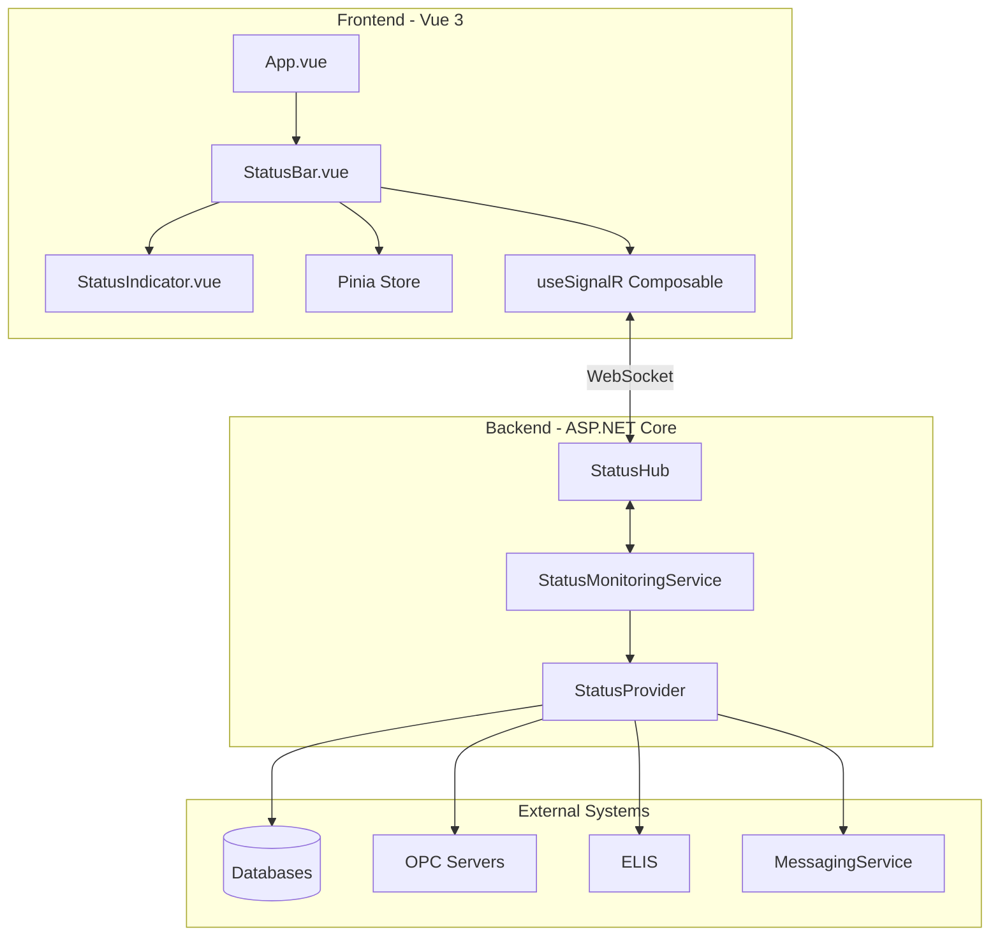

## Frontend Architecture

### Component Hierarchy

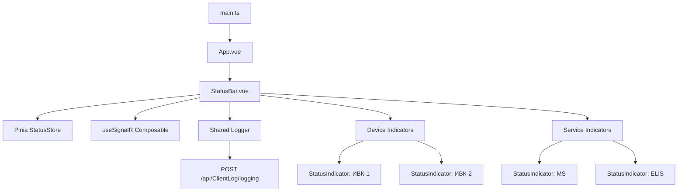

### Vue Component Structure

**StatusBar.vue** (упрощенная версия):
```vue
<template>
  <div class="status-bar">
    <div class="status-bar__container">
      <!-- Device Indicators -->
      <div v-if="store.devices.length > 0" class="status-bar__section">
        <StatusIndicator
          v-for="device in store.devices"
          :key="device.id"
          :label="device.name"
          :status="getDeviceStatus(device)"
          :tooltip="`${device.name}: ${device.isConnected ? 'Подключено' : 'Отключено'}`"
          @click="handleDeviceClick(device)"
        />
      </div>

      <!-- Service Indicators -->
      <div class="status-bar__section status-bar__section--services">
        <StatusIndicator
          label="MS"
          :status="getServiceStatus(store.services.messagingService)"
          tooltip="Messaging Service"
        />
        <StatusIndicator
          v-if="store.services.elis"
          label="ELIS"
          :status="getServiceStatus(store.services.elis)"
          tooltip="Лабораторная система"
        />
      </div>
    </div>
  </div>
</template>

<script setup lang="ts">
import { onMounted } from 'vue';
import { logger } from '@tn-doc/shared'; // Централизованный логгер
import { useStatusStore } from '../stores/statusStore';
import { useSignalR } from '../composables/useSignalR';
import { useIntervalFn } from '@vueuse/core';

const store = useStatusStore();
const { connectionState, on } = useSignalR('/statusHub');

// Fallback polling каждые 10 секунд если SignalR не подключен
const { pause, resume } = useIntervalFn(() => {
  if (connectionState.value !== 'connected') {
    store.fetchStatus();
  }
}, 10000);

// SignalR real-time обновления
on('statusUpdated', (data: StatusResponse) => {
  store.updateFromSignalR(data);
  logger.trace('StatusBar: получено обновление через SignalR', {
    deviceCount: data.devices?.length || 0
  });
});

// Начальная загрузка с задержкой 2 секунды
onMounted(() => {
  logger.debug('StatusBar: компонент монтирован');
  setTimeout(() => store.fetchStatus(), 2000);
});
</script>
```

**Ключевые изменения в v1.4.4+**:
- Использование `logger` из `@tn-doc/shared` вместо console.log
- Fallback HTTP polling с интервалом 10 секунд
- Задержка начальной загрузки 2 секунды для готовности сервера
- Условный рендеринг ELIS индикатора (опциональный сервис)

### State Management (Pinia)

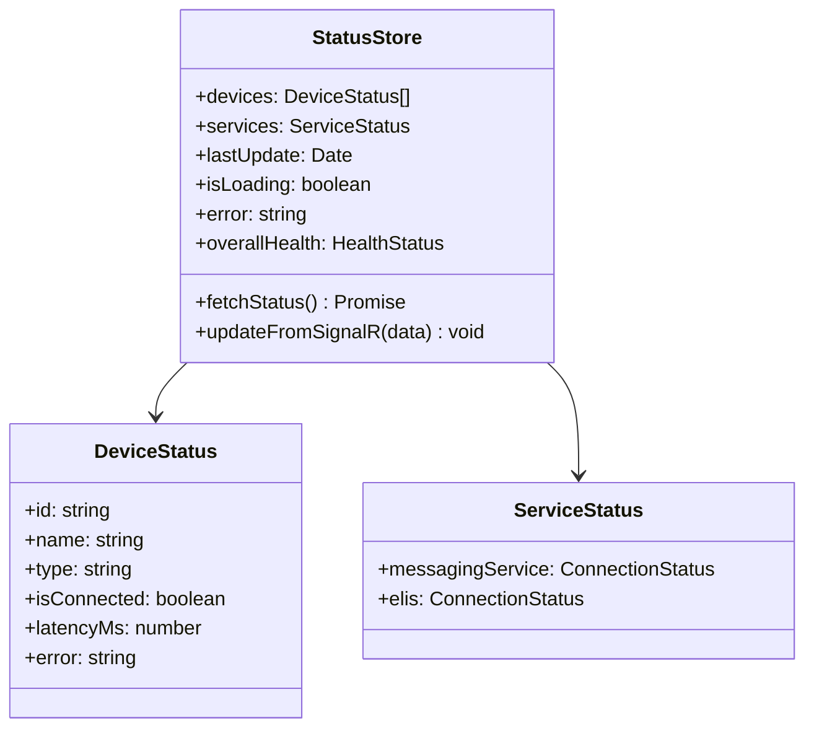

## Indicator Status States

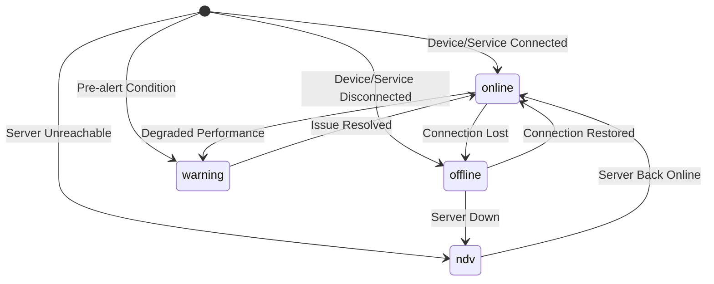

### Status States

| State | Color | Icon | Description | CSS Variables |
|-------|-------|------|-------------|---------------|
| **online** | Зеленый | `pi-link` | Устройство/сервис подключено | `--p-green-100` (bg), `--p-green-700` (text) |
| **offline** | Красный (мигание) | `pi-times-circle` | Устройство/сервис не на связи | `--p-red-100` (bg), `--p-red-700` (text) |
| **ndv** | Серый | `pi-question-circle` | Недостоверно (нет связи с сервером) | `--p-surface-100` (bg), `--p-surface-700` (text) |
| **warning** | Желтый | `pi-exclamation-triangle` | Предаварийная ситуация | `--p-yellow-100` (bg), `--p-yellow-700` (text) |

**Логика определения состояния** (TN_Doc/Client/statusbar/src/components/StatusBar.vue:81-102):
```typescript
function getDeviceStatus(device: DeviceStatus): IndicatorStatus {
  if (device.isConnected) {
    return 'online';
  }
  // Если есть ошибка "Нет связи с сервером", то это ndv
  if (device.error?.includes('Нет связи с сервером')) {
    return 'ndv';
  }
  // Иначе устройство просто не на связи
  return 'offline';
}
```

**Цвета индикаторов**:
- Все цвета определены через CSS переменные в `/TN_Doc/wwwroot/css/material3.css:84-94`
- Использует PrimeVue совместимую палитру для консистентного UI
- Анимация мигания для состояния `offline`: `@keyframes blink` (opacity 1 → 0.3 → 1, период 1.5s)

### Visual States Animation

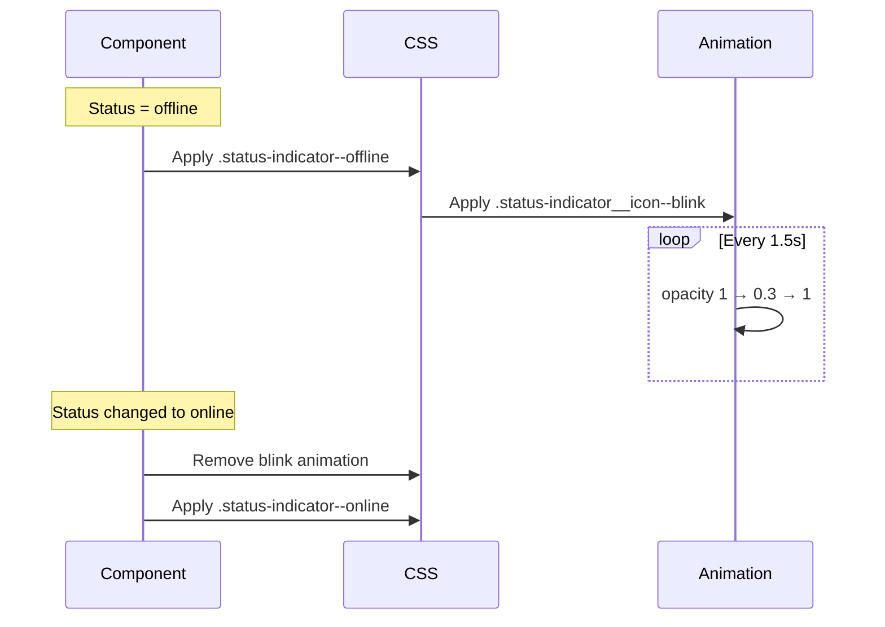

## Real-time Communication

### SignalR Flow

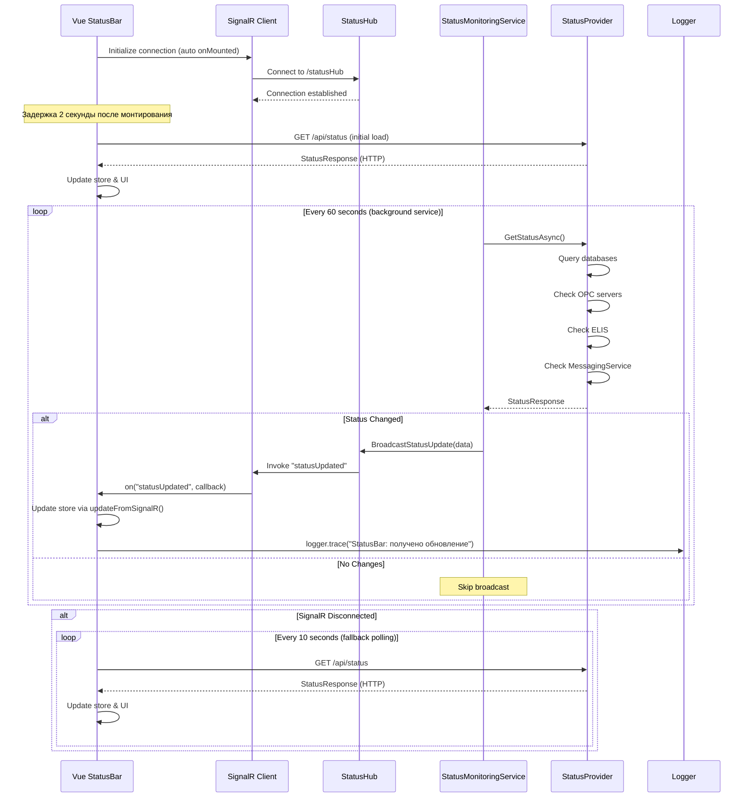

**Ключевые изменения в v1.4.4+**:
- **Backend интервал**: 60 секунд (изменено с 30 секунд) - см. TN_Doc/Services/StatusMonitoringService.cs:24
- **Fallback polling**: 10 секунд при потере SignalR соединения
- **Начальная задержка**: 2 секунды перед первым запросом статуса
- **Оптимизация broadcast**: отправка только при изменении статуса (метод `HasStatusChanged`)
- **Пропуск проверок**: если нет активных SignalR клиентов (оптимизация нагрузки)

### useSignalR Composable

```typescript
export function useSignalR(hubUrl: string) {
  const connection = ref<signalR.HubConnection | null>(null);
  const connectionState = ref<ConnectionState>('disconnected');
  const error = ref<string | null>(null);
  const pendingSubscriptions = new Map<string, ((...args: any[]) => void)[]>();

  async function connect() {
    try {
      connectionState.value = 'connecting';
      logger.debug(`SignalR: попытка подключения к хабу`, { hubUrl });

      connection.value = new signalR.HubConnectionBuilder()
        .withUrl(hubUrl, {
          withCredentials: true,
          skipNegotiation: false
        })
        .withAutomaticReconnect({
          nextRetryDelayInMilliseconds: retryContext => {
            // 5 секунд в первую минуту, 30 секунд после
            const delay = retryContext.elapsedMilliseconds < 60000 ? 5000 : 30000;
            logger.warn(`SignalR: попытка переподключения #${retryContext.previousRetryCount + 1}`);
            return delay;
          }
        })
        .configureLogging(signalR.LogLevel.Warning)
        .build();

      // Обработчики событий переподключения
      connection.value.onreconnecting((err) => {
        connectionState.value = 'connecting';
        logger.warn('SignalR: соединение потеряно, попытка переподключения');
      });

      connection.value.onreconnected((connectionId) => {
        connectionState.value = 'connected';
        logger.debug('SignalR: успешно переподключен', { connectionId });
      });

      connection.value.onclose((err) => {
        connectionState.value = 'disconnected';
        if (err) {
          logger.error('SignalR: соединение закрыто с ошибкой', { error: err.message });
        }
      });

      await connection.value.start();
      connectionState.value = 'connected';
      logger.debug('SignalR: успешно подключен', { hubUrl, connectionId: connection.value.connectionId });

      // Применяем отложенные подписки
      if (pendingSubscriptions.size > 0) {
        pendingSubscriptions.forEach((callbacks, eventName) => {
          callbacks.forEach(callback => connection.value!.on(eventName, callback));
        });
        pendingSubscriptions.clear();
      }
    } catch (err) {
      connectionState.value = 'disconnected';
      logger.error('SignalR: ошибка подключения', { error: err.message });
    }
  }

  function on(eventName: string, callback: (...args: any[]) => void) {
    // Отложенная подписка если соединение еще не готово
    if (!connection.value || connectionState.value !== 'connected') {
      if (!pendingSubscriptions.has(eventName)) {
        pendingSubscriptions.set(eventName, []);
      }
      pendingSubscriptions.get(eventName)!.push(callback);
      logger.debug(`SignalR: подписка на событие ${eventName} отложена`);
      return;
    }

    connection.value.on(eventName, callback);
    logger.debug(`SignalR: подписка на событие ${eventName} активна`);
  }

  onMounted(() => connect());
  onUnmounted(() => disconnect());

  return { connection, connectionState, error, connect, disconnect, on, off };
}
```

**Ключевые особенности** (TN_Doc/Client/statusbar/src/composables/useSignalR.ts):
- **Автоматическое переподключение**: умная стратегия retry (5s первую минуту, затем 30s)
- **Отложенные подписки**: события можно подписывать до установки соединения
- **Централизованное логирование**: все события логируются через shared logger
- **Graceful degradation**: при проблемах автоматически переключается на HTTP polling
- **Автоподключение**: connect() вызывается в onMounted() автоматически

## Backend Architecture

### StatusMonitoringService (Background Service)

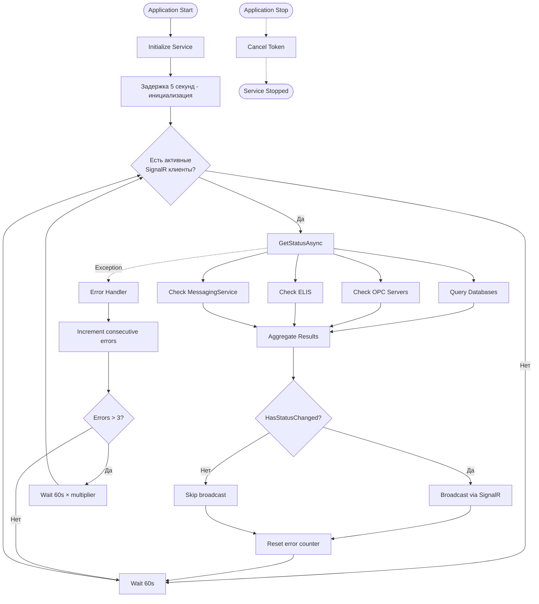

**Оптимизации в v1.4.4+** (TN_Doc/Services/StatusMonitoringService.cs):
- **Интервал проверки**: 60 секунд (строка 24: `TimeSpan.FromSeconds(60)`)
- **Пропуск при отсутствии клиентов**: проверка `AppClientTracker.HasActiveClients` (строки 56-61)
- **Broadcast только при изменениях**: метод `HasStatusChanged()` (строки 135-177)
- **Умная обработка ошибок**: экспоненциальный backoff при повторяющихся ошибках (строки 116-121)
- **Начальная задержка**: 5 секунд после старта приложения (строка 49)

### StatusProvider Implementation

```csharp
public class StatusProvider : IStatusProvider
{
    public async Task<StatusResponse> GetAllStatuses()
    {
        var devices = await CheckDatabaseConnections();
        var services = new ServiceStatus
        {
            MessagingService = await CheckMessagingService(),
            Elis = await CheckElisService()
        };

        return new StatusResponse
        {
            Devices = devices,
            Services = services,
            Timestamp = DateTime.UtcNow
        };
    }

    private async Task<List<DeviceStatus>> CheckDatabaseConnections()
    {
        var devices = new List<DeviceStatus>();
        foreach (var deviceConfig in _appConfig.Devices)
        {
            var status = new DeviceStatus
            {
                Id = deviceConfig.IdDevice,
                Name = deviceConfig.Name,
                Type = "database"
            };

            var sw = Stopwatch.StartNew();
            try
            {
                await _dbContext.Database.CanConnectAsync();
                status.IsConnected = true;
                status.LatencyMs = sw.ElapsedMilliseconds;
            }
            catch (Exception ex)
            {
                status.IsConnected = false;
                status.Error = ex.Message;
            }

            devices.Add(status);
        }
        return devices;
    }
}
```

## HTTP Clients Configuration

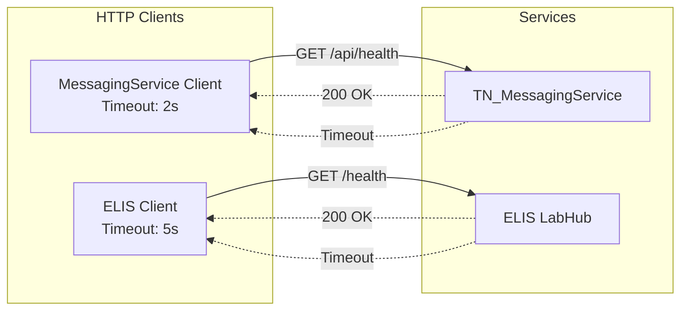

## Build & Integration

### Build Process

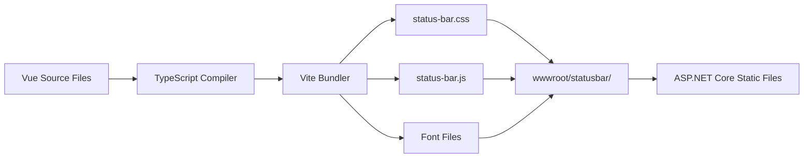

### Integration with ASP.NET Core

```html
<!-- _Layout.cshtml -->
<link rel="stylesheet" href="~/statusbar/status-bar.css" />
<div id="status-bar-app"></div>
<script src="~/statusbar/status-bar.js"></script>
```

## Performance Considerations

### Optimization Strategy

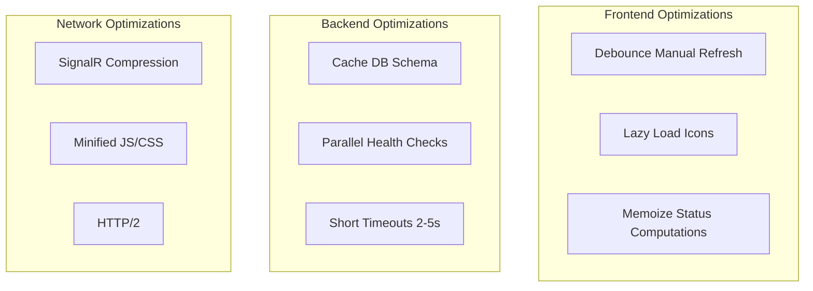

### Metrics

| Метрика | Значение | Примечание |
|---------|----------|------------|
| **Bundle size** | ~300KB | Initial load (minified + gzipped) |
| **Backend check interval** | 60s | StatusMonitoringService (v1.4.4+) |
| **Fallback polling** | 10s | HTTP polling при отсутствии SignalR |
| **Initial delay** | 2s | Задержка перед первым запросом |
| **Backend startup delay** | 5s | Задержка старта фонового сервиса |
| **UI update time** | <100ms | Время обновления индикаторов |
| **Timeout (MS)** | 2s | MessagingService health check |
| **Timeout (ELIS)** | 5s | ELIS Lab System health check |
| **SignalR retry (initial)** | 5s | Первая минута после разрыва |
| **SignalR retry (extended)** | 30s | После первой минуты |
| **Error backoff** | 60s × (errors - 2) | Max 5x multiplier |

**Оптимизации производительности** (v1.4.4+):
- Пропуск проверок при отсутствии активных SignalR клиентов
- Broadcast только при изменении статуса (экономия трафика)
- История обновлений: хранение последних 10 статусов в Pinia store
- Умная обработка ошибок с экспоненциальным backoff

## Централизованное логирование (v1.4.4+)

StatusBar использует shared logger из пакета `@tn-doc/shared` для унифицированного логирования клиентских событий.

### Logger API

```typescript
import { logger } from '@tn-doc/shared';

// Доступные уровни логирования
logger.trace('Детальная трассировка', { data: {} });  // Самый подробный
logger.debug('Отладочная информация', { step: 1 });   // Разработка
logger.info('Информационное сообщение');               // Основные события
logger.warn('Предупреждение', { reason: 'timeout' }); // Потенциальные проблемы
logger.error('Ошибка выполнения', { error: err });    // Ошибки

// Логирование исключений с stack trace
logger.exception(new Error('Критическая ошибка'), 'Контекст ошибки', { userId: 123 });
```

### Конфигурация

**TN_Doc/Client/shared/src/logger.ts**:
- **Endpoint**: `POST /api/ClientLog/logging`
- **Console logging**: автоматически включен в dev режиме (`import.meta.env.DEV`)
- **Global context**: можно добавить глобальный контекст (userId, app version)
- **Server fallback**: при ошибке отправки логирует в консоль

### Примеры использования в StatusBar

```typescript
// StatusBar.vue
import { logger } from '@tn-doc/shared';

onMounted(() => {
  logger.debug('StatusBar: компонент монтирован, загрузка статусов через 2 секунды');
  setTimeout(() => store.fetchStatus(), 2000);
});

on('statusUpdated', (data: StatusResponse) => {
  store.updateFromSignalR(data);
  logger.trace('StatusBar: получено обновление через SignalR', {
    deviceCount: data.devices?.length || 0
  });
});

// StatusStore.ts
logger.info('StatusStore: статусы успешно загружены', {
  deviceCount: response.devices.length,
  connectedDevices: response.devices.filter(d => d.isConnected).length
});

logger.error('StatusStore: ошибка загрузки статусов', {
  error: err instanceof Error ? err.message : String(err)
});

// useSignalR.ts
logger.debug('SignalR: успешно подключен', {
  hubUrl,
  connectionId: connection.value.connectionId
});

logger.warn(`SignalR: попытка переподключения #${retryContext.previousRetryCount + 1}`);
```

### Архитектура логирования

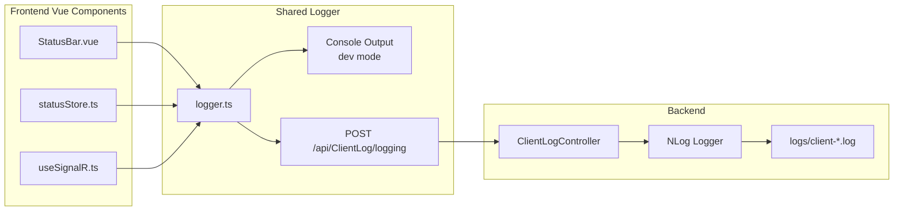

**Преимущества централизованного логирования**:
- Единый формат логов для всех Vue компонентов
- Автоматическая отправка на сервер с контекстом
- Возможность отслеживания клиентских ошибок в production
- Унифицированное логирование в dev и prod окружениях
- Типобезопасность через TypeScript

## Error Handling

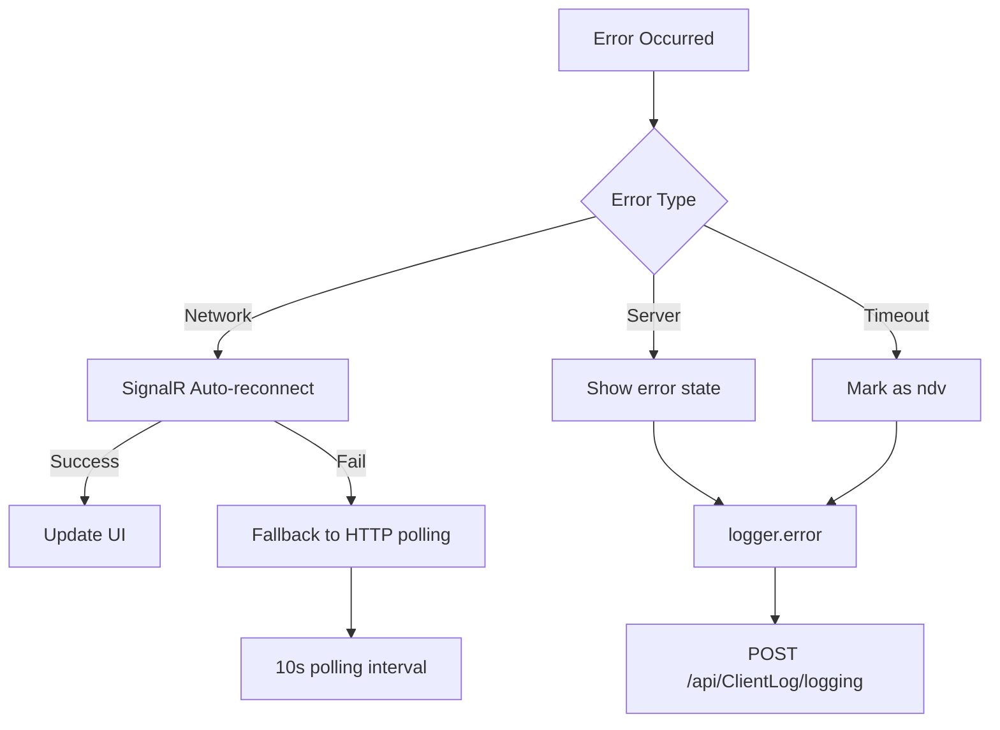

**Обработка ошибок в v1.4.4+**:
- **SignalR разрыв**: автоматический retry с умной стратегией (5s → 30s)
- **HTTP ошибки**: fallback на polling каждые 10 секунд
- **Нет связи с сервером**: все индикаторы переходят в состояние `ndv`
- **Логирование**: все ошибки отправляются на сервер через shared logger
- **Backend ошибки**: экспоненциальный backoff (до 5x увеличение интервала)

## Development Workflow

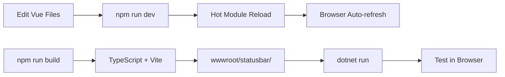

## Responsive Design

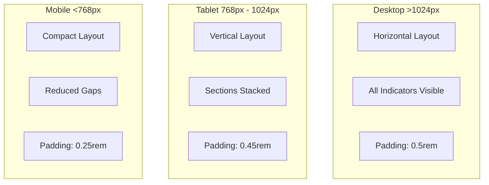

## История изменений

### v1.4.4+ (Текущая версия)

**Основные улучшения**:
- ✅ Интервал backend проверки увеличен с 30s до 60s (оптимизация нагрузки)
- ✅ Централизованное логирование через `@tn-doc/shared/logger`
- ✅ Умная стратегия переподключения SignalR (5s → 30s)
- ✅ Fallback HTTP polling с интервалом 10s
- ✅ Оптимизация: пропуск проверок при отсутствии клиентов
- ✅ Broadcast только при изменении статуса (экономия трафика)
- ✅ История обновлений (последние 10) в Pinia store
- ✅ Экспоненциальный backoff при ошибках backend
- ✅ Все цвета через CSS переменные (material3.css)

**Удаленные элементы**:
- ❌ Кнопка ручного обновления (автоматизация через SignalR + polling)
- ❌ Индикатор состояния SignalR (упрощение UI)

### v1.4.2 (Production Release)

**Первый production release**:
- ✅ Базовая функциональность мониторинга
- ✅ 4 состояния индикаторов (online, offline, ndv, warning)
- ✅ SignalR real-time обновления
- ✅ Интеграция с PrimeVue
- ✅ Responsive design

## Известные ограничения

1. **Визуальные индикаторы**: состояние `warning` в настоящее время не используется (зарезервировано для будущих функций)
2. **Детализация устройств**: клик по индикатору пока не показывает модальное окно с деталями (будущая функция)
3. **ELIS зависимость**: индикатор ELIS отображается только если `Elis.Use = true` в конфигурации
4. **Latency метрики**: latency отображается только для устройств, но не для сервисов

## Планы развития

- [ ] Модальное окно с детальной информацией об устройстве при клике на индикатор
- [ ] Графики исторических данных latency и uptime
- [ ] Уведомления при изменении критических статусов
- [ ] Настраиваемые пороги для состояния `warning`
- [ ] Поддержка дополнительных сервисов (OPC, KMH)
- [ ] Экспорт истории статусов в CSV/JSON

## См. также

- [Vue 3 Documentation](https://vuejs.org/)
- [PrimeVue Components](https://primevue.org/)
- [SignalR Client](https://docs.microsoft.com/aspnet/core/signalr/)
- [Pinia State Management](https://pinia.vuejs.org/)
- [Configurator Architecture](./configurator.md) - конфигурация приложения
- [Document Editor Architecture](./document-editor.md) - редактирование документов
