# StatusBar Architecture

## Обзор

StatusBar — это real-time компонент мониторинга здоровья системы, построенный на **Vue 3 + TypeScript + PrimeVue** с использованием **SignalR** для двусторонней связи.

## Архитектура компонента

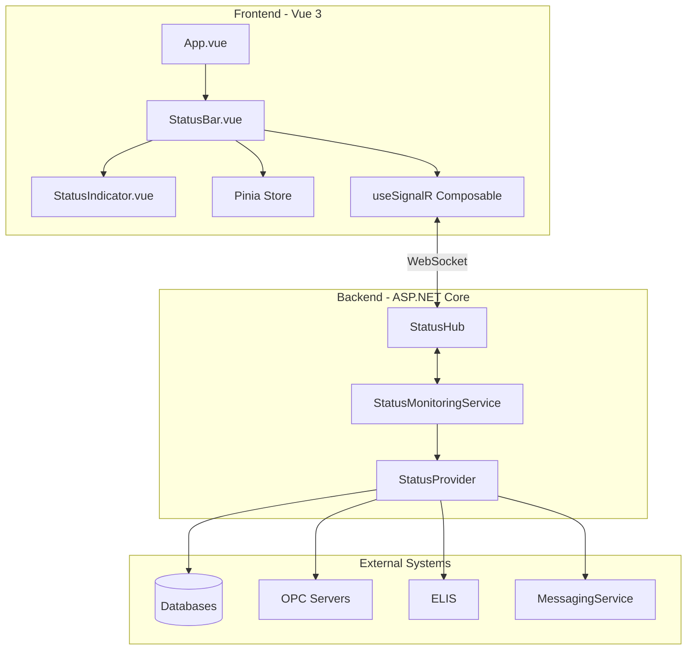

## Frontend Architecture

### Component Hierarchy

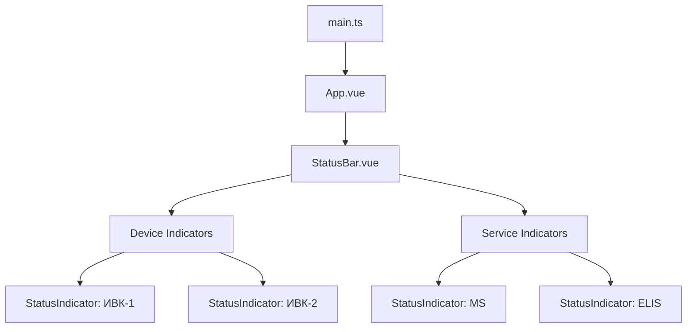

### Vue Component Structure

**StatusBar.vue:**
```vue
<template>
  <div class="status-bar">
    <div class="status-bar__container">
      <!-- Device Indicators -->
      <div class="status-bar__section">
        <StatusIndicator
          v-for="device in devices"
          :key="device.id"
          :label="device.name"
          :status="getDeviceStatus(device)"
        />
      </div>

      <!-- Service Indicators -->
      <div class="status-bar__section">
        <StatusIndicator label="MS" :status="msStatus" />
        <StatusIndicator label="ELIS" :status="elisStatus" />
      </div>
    </div>
  </div>
</template>
```

### State Management (Pinia)

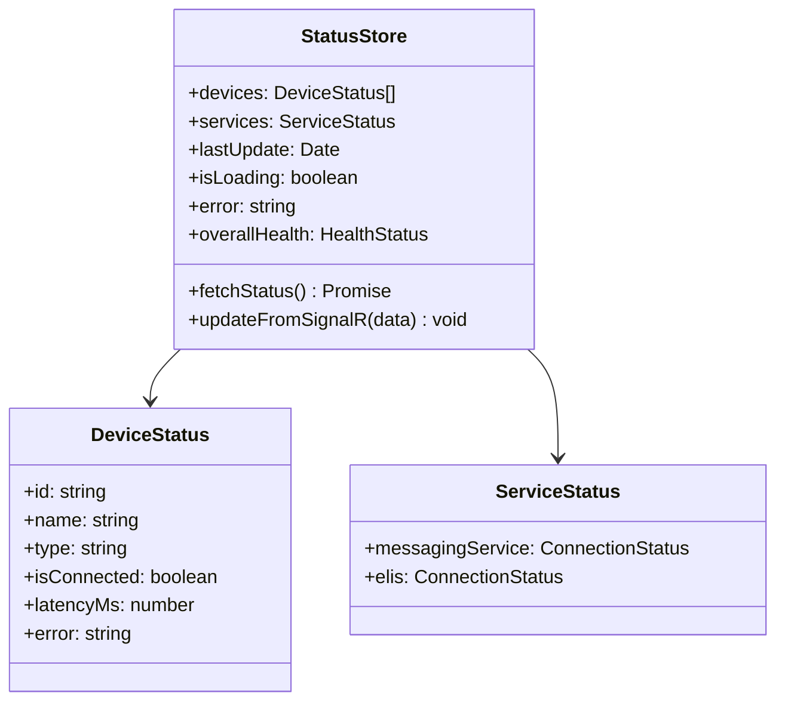

## Indicator Status States

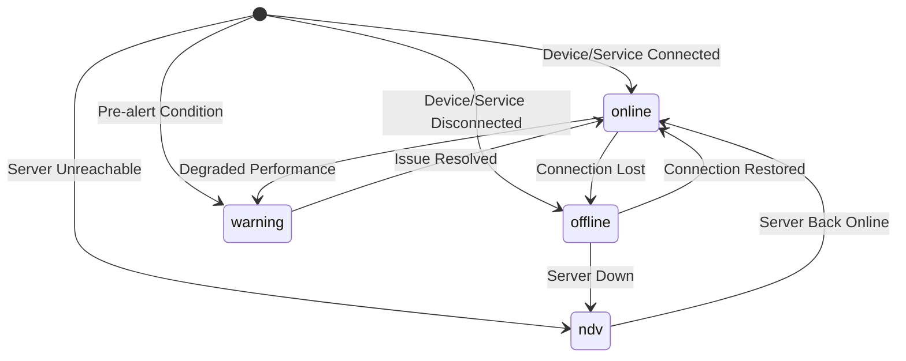

### Status States

| State | Color | Icon | Description |
|-------|-------|------|-------------|
| **online** | Зеленый | `pi-link` | Устройство/сервис подключено |
| **offline** | Красный (мигание) | `pi-times-circle` | Устройство/сервис не на связи |
| **ndv** | Серый | `pi-question-circle` | Недостоверно (нет связи с сервером) |
| **warning** | Желтый | `pi-exclamation-triangle` | Предаварийная ситуация |

### Visual States Animation

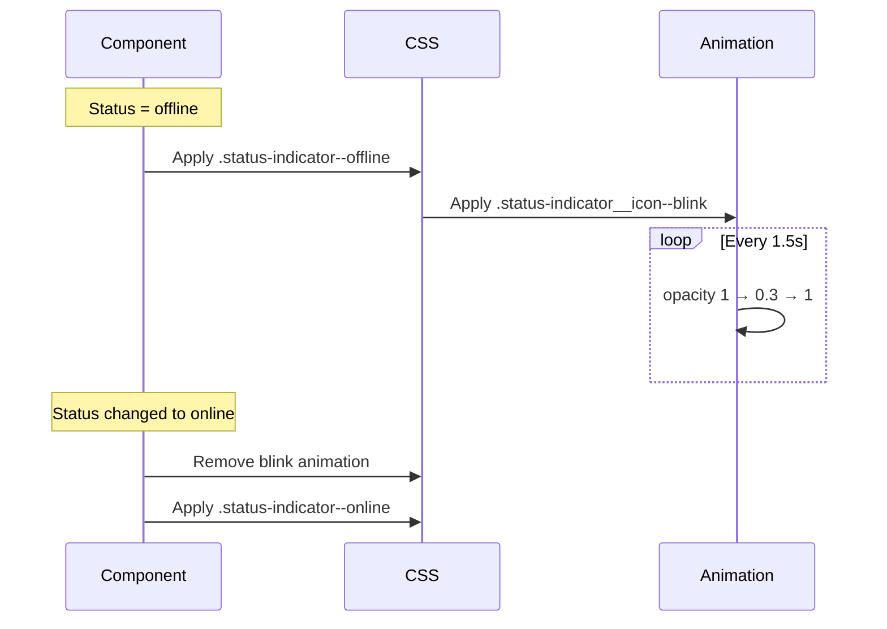

## Real-time Communication

### SignalR Flow

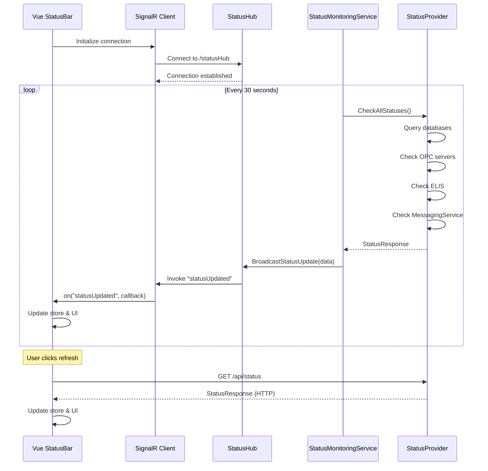

### useSignalR Composable

```typescript
export function useSignalR(hubUrl: string) {
  const connectionState = ref<ConnectionState>('disconnected');
  const connection = new HubConnectionBuilder()
    .withUrl(hubUrl)
    .withAutomaticReconnect()
    .build();

  const on = (eventName: string, callback: Function) => {
    connection.on(eventName, callback);
  };

  const start = async () => {
    connectionState.value = 'connecting';
    await connection.start();
    connectionState.value = 'connected';
  };

  return { connectionState, on, start };
}
```

## Backend Architecture

### StatusMonitoringService (Background Service)

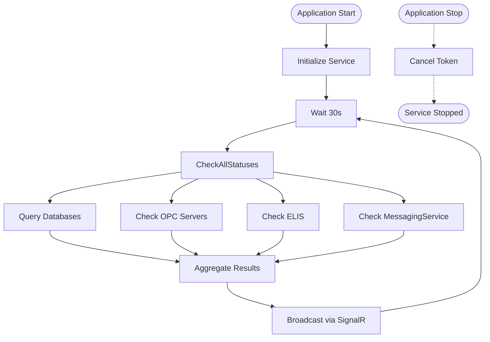

### StatusProvider Implementation

```csharp
public class StatusProvider : IStatusProvider
{
    public async Task<StatusResponse> GetAllStatuses()
    {
        var devices = await CheckDatabaseConnections();
        var services = new ServiceStatus
        {
            MessagingService = await CheckMessagingService(),
            Elis = await CheckElisService()
        };

        return new StatusResponse
        {
            Devices = devices,
            Services = services,
            Timestamp = DateTime.UtcNow
        };
    }

    private async Task<List<DeviceStatus>> CheckDatabaseConnections()
    {
        var devices = new List<DeviceStatus>();
        foreach (var deviceConfig in _appConfig.Devices)
        {
            var status = new DeviceStatus
            {
                Id = deviceConfig.IdDevice,
                Name = deviceConfig.Name,
                Type = "database"
            };

            var sw = Stopwatch.StartNew();
            try
            {
                await _dbContext.Database.CanConnectAsync();
                status.IsConnected = true;
                status.LatencyMs = sw.ElapsedMilliseconds;
            }
            catch (Exception ex)
            {
                status.IsConnected = false;
                status.Error = ex.Message;
            }

            devices.Add(status);
        }
        return devices;
    }
}
```

## HTTP Clients Configuration

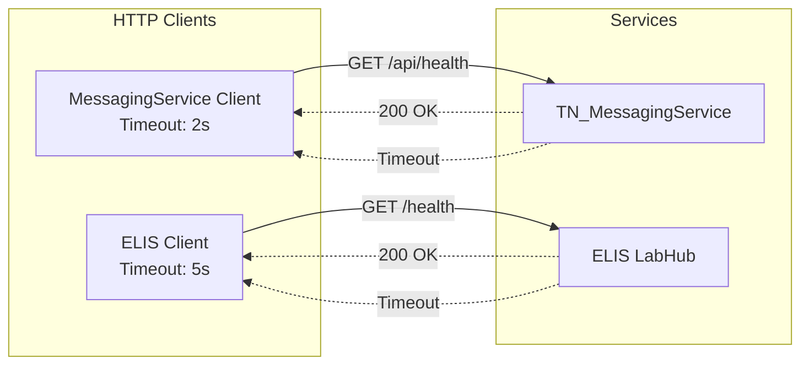

## Build & Integration

### Build Process

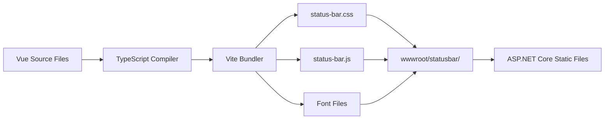

### Integration with ASP.NET Core

```html
<!-- _Layout.cshtml -->
<link rel="stylesheet" href="~/statusbar/status-bar.css" />
<div id="status-bar-app"></div>
<script src="~/statusbar/status-bar.js"></script>
```

## Performance Considerations

### Optimization Strategy

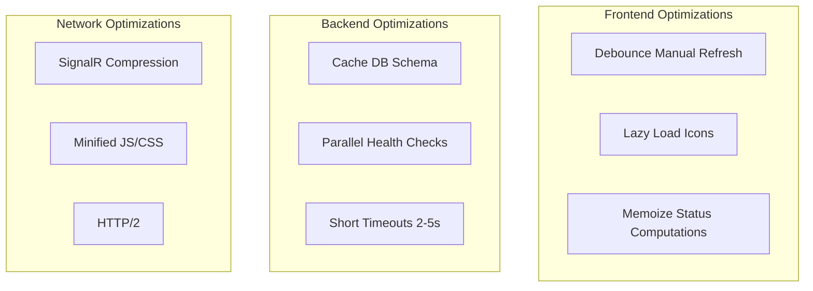

### Metrics

| Метрика | Значение | Цель |
|---------|----------|------|
| Initial Load | ~300KB | Bundle size |
| Update Interval | 60s | Background check (StatusMonitoringService) |
| Response Time | <100ms | UI update |
| Timeout (MS) | 2s | MessagingService |
| Timeout (ELIS) | 5s | ELIS Lab System |

> **Примечание (v1.4.2+)**: Удалена кнопка ручного обновления статусов, удалён индикатор SignalR соединения, убрано отображение времени последнего обновления.

## Error Handling

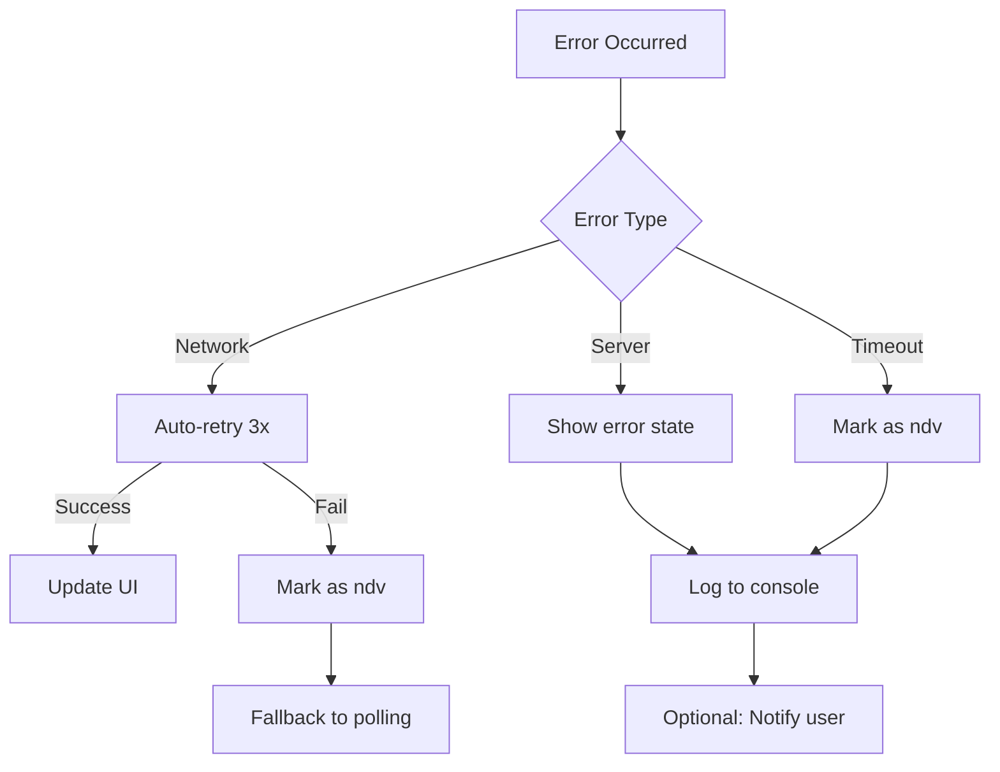

## Development Workflow

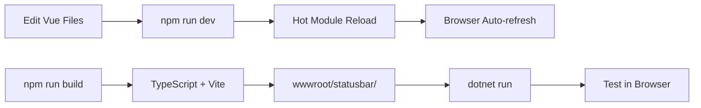

## Responsive Design

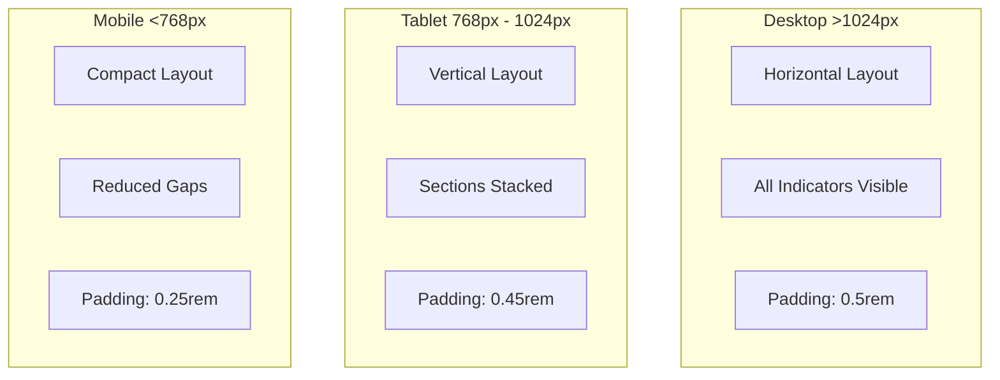

## См. также

- [Vue 3 Documentation](https://vuejs.org/)
- [PrimeVue Components](https://primevue.org/)
- [SignalR Client](https://docs.microsoft.com/aspnet/core/signalr/)
- [Pinia State Management](https://pinia.vuejs.org/)
