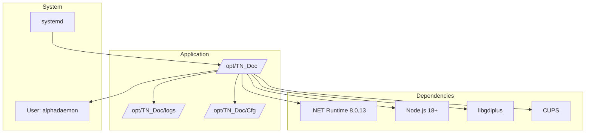
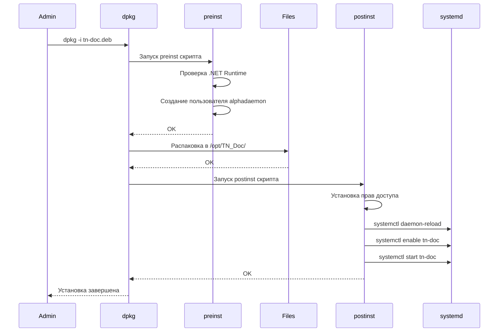

# Развертывание на Linux

## Системные требования

| Компонент | Требование |
|-----------|------------|
| ОС | Ubuntu 20.04+, Debian 11+, RHEL 8+ |
| .NET Runtime | 8.0.13 или выше |
| Node.js | 18.0 или выше (для сборки Vue компонентов) |
| npm | 8.0 или выше |
| Память | 1 GB минимум, 2 GB рекомендуется |
| Дисковое пространство | 500 MB |
| Пользователь | `alphadaemon` (создается автоматически) |

## Архитектура развертывания



## Установка из .deb пакета

### 1. Скачать пакет

```bash
# Скачать с сервера сборки
wget http://build-server/tn-doc_1.4.4_amd64.deb

# Или скопировать с локальной машины
scp tn-doc_1.4.4_amd64.deb user@server:/tmp/
```

### 2. Установить зависимости

```bash
# Установить .NET Runtime
wget https://packages.microsoft.com/config/ubuntu/$(lsb_release -rs)/packages-microsoft-prod.deb
sudo dpkg -i packages-microsoft-prod.deb
sudo apt-get update
sudo apt-get install -y aspnetcore-runtime-8.0

# Установить Node.js 18+ и npm
curl -fsSL https://deb.nodesource.com/setup_18.x | sudo -E bash -
sudo apt-get install -y nodejs

# Проверить версии
node --version  # должна быть 18.x или выше
npm --version   # должна быть 8.x или выше

# Установить системные библиотеки
sudo apt-get install -y libgdiplus libc6-dev cups
```

### 3. Установить пакет

```bash
sudo dpkg -i tn-doc_1.4.4_amd64.deb

# Если есть зависимости, выполните
sudo apt-get install -f
```

### 4. Собрать Vue компоненты (опционально, если не включены в .deb)

```bash
# Перейти в директорию клиентских приложений
cd /opt/TN_Doc/Client

# Установить зависимости npm (для всех Vue компонентов)
sudo -u alphadaemon npm install

# Собрать все Vue компоненты (statusbar, configurator, document-editor)
sudo -u alphadaemon npm run build:all

# Вернуться в корень
cd /opt/TN_Doc
```

**Примечание**: Если .deb пакет уже содержит собранные Vue компоненты в `wwwroot/dist/`, этот шаг можно пропустить.

## Процесс установки



## Структура установки

```
/opt/TN_Doc/
├── TN_Doc                      # Исполняемый файл
├── TN_Doc.dll                  # Основная библиотека
├── appsettings.json            # Конфигурация ASP.NET
├── Cfg/
│   ├── CfgApp.json            # Основная конфигурация
│   ├── Cfg*.json              # Конфигурации документов
│   ├── CfgEdit*.json          # Конфигурации форм редактирования (v1.4.2+)
│   └── ...
├── Doc/                        # FastReport шаблоны
├── wwwroot/                    # Статические файлы
│   ├── css/                   # Стили (включая material3.css с CSS переменными)
│   ├── dist/                  # Собранные Vue компоненты (v1.4.1+)
│   │   ├── statusbar/         # Строка состояния
│   │   ├── configurator/      # Веб-конфигуратор
│   │   └── document-editor/   # Редактор документов (в разработке)
│   └── ...
├── logs/                       # Логи приложения
└── ...

/etc/systemd/system/
└── tn-doc.service             # Systemd unit файл
```

## Systemd Service

### tn-doc.service

```ini
[Unit]
Description=TN_Doc - Document Generation Service
After=network.target mysql.service

[Service]
Type=notify
User=alphadaemon
WorkingDirectory=/opt/TN_Doc
ExecStart=/opt/TN_Doc/TN_Doc
Restart=on-failure
RestartSec=10
Environment=ASPNETCORE_ENVIRONMENT=Production
Environment=DOTNET_PRINT_TELEMETRY_MESSAGE=false

[Install]
WantedBy=multi-user.target
```

### Управление службой

```bash
# Запуск
sudo systemctl start tn-doc

# Остановка
sudo systemctl stop tn-doc

# Перезапуск
sudo systemctl restart tn-doc

# Статус
sudo systemctl status tn-doc

# Автозапуск
sudo systemctl enable tn-doc

# Отключить автозапуск
sudo systemctl disable tn-doc

# Просмотр логов
sudo journalctl -u tn-doc -f
```

## Конфигурация

### Основной конфиг: /opt/TN_Doc/Cfg/CfgApp.json

```json
{
  "Devices": [
    {
      "IdDevice": "IVK-1",
      "Name": "ИВК №1 - Узел учета",
      "TypeDevice": 7,
      "ConnectionString": "Server=localhost;Database=ivk1;User=ivk_user;Password=***;",
      "UseSecurityFeatures": true
    }
  ],
  "Elis": {
    "UseElis": true,
    "Url": "https://elis-server/api",
    "CertificatePath": "/opt/TN_Doc/Cert/elis.crt"
  },
  "OpcConnectionSettings": {
    "MessagingServiceUrl": "http://localhost:5000"
  }
}
```

### Конфигурации форм редактирования: /opt/TN_Doc/Cfg/CfgEdit*.json

С версии 1.4.2+ добавлены отдельные конфигурационные файлы для форм редактирования документов:

- `CfgEditPassport.json` - настройки формы редактирования паспортов качества
- `CfgEditAct.json` - настройки формы редактирования актов
- `CfgEditReport.json` - настройки формы редактирования отчетов
- И другие CfgEdit*.json файлы для каждого типа документа

Эти файлы определяют структуру HTML-форм редактирования, включая поля, их типы, валидацию и зависимости между полями.

### Логирование: /opt/TN_Doc/nlog.config

```xml
<nlog xmlns="http://www.nlog-project.org/schemas/NLog.xsd">
  <targets>
    <target name="logfile"
            xsi:type="File"
            fileName="/opt/TN_Doc/logs/tn-doc-${shortdate}.log" />
  </targets>
  <rules>
    <logger name="*" minlevel="Info" writeTo="logfile" />
  </rules>
</nlog>
```

## Безопасность

### Права доступа

```bash
# Установить владельца
sudo chown -R alphadaemon:alphadaemon /opt/TN_Doc

# Права на директории
sudo chmod 750 /opt/TN_Doc
sudo chmod 750 /opt/TN_Doc/Cfg
sudo chmod 770 /opt/TN_Doc/logs

# Права на конфиги
sudo chmod 640 /opt/TN_Doc/Cfg/CfgApp.json
```

### Firewall

```bash
# Открыть порт (если нужен внешний доступ)
sudo ufw allow 38509/tcp

# Для HTTPS
sudo ufw allow 44357/tcp
```

## Мониторинг

### Проверка здоровья

```bash
# HTTP endpoint
curl http://localhost:38509/api/status

# Проверка процесса
ps aux | grep TN_Doc

# Использование ресурсов
systemctl status tn-doc | grep Memory
```

### Логи

```bash
# Логи приложения
tail -f /opt/TN_Doc/logs/tn-doc-$(date +%Y-%m-%d).log

# Логи systemd
sudo journalctl -u tn-doc -n 100 --no-pager

# Логи за последний час
sudo journalctl -u tn-doc --since "1 hour ago"
```

## Обновление

```bash
# Остановить службу
sudo systemctl stop tn-doc

# Установить новый пакет
sudo dpkg -i tn-doc_1.4.4_amd64.deb

# Пересобрать Vue компоненты (если они не включены в .deb или были изменения)
cd /opt/TN_Doc/Client
sudo -u alphadaemon npm install
sudo -u alphadaemon npm run build:all
cd /opt/TN_Doc

# Запустить службу
sudo systemctl start tn-doc

# Проверить статус
sudo systemctl status tn-doc

# Проверить логи на наличие ошибок
sudo journalctl -u tn-doc -n 50 --no-pager
```

**Важно**: При обновлении всегда делайте резервную копию конфигурационных файлов:

```bash
# Создать резервную копию конфигураций перед обновлением
sudo cp -r /opt/TN_Doc/Cfg /opt/TN_Doc/Cfg.backup-$(date +%Y%m%d)
```

## Удаление

```bash
# Удалить пакет (сохранить конфиги)
sudo dpkg -r tn-doc

# Полное удаление (включая конфиги)
sudo dpkg --purge tn-doc

# Удалить директорию вручную (если нужно)
sudo rm -rf /opt/TN_Doc
```

## Диагностика проблем

### Служба не запускается

```bash
# Проверить логи systemd
sudo journalctl -u tn-doc -n 50

# Проверить конфигурацию
sudo /opt/TN_Doc/TN_Doc --check-config

# Проверить права
ls -la /opt/TN_Doc
```

### Проблемы с подключением к БД

```bash
# Проверить подключение из под пользователя alphadaemon
sudo -u alphadaemon mysql -h localhost -u ivk_user -p

# Проверить настройки в CfgApp.json
cat /opt/TN_Doc/Cfg/CfgApp.json | grep ConnectionString
```

### Ошибка "libgdiplus not found"

```bash
sudo apt-get install libgdiplus
sudo systemctl restart tn-doc
```

### Vue компоненты не загружаются

```bash
# Проверить наличие собранных файлов
ls -la /opt/TN_Doc/wwwroot/dist/statusbar/
ls -la /opt/TN_Doc/wwwroot/dist/configurator/
ls -la /opt/TN_Doc/wwwroot/dist/document-editor/

# Если директории пусты, пересобрать компоненты
cd /opt/TN_Doc/Client
sudo -u alphadaemon npm install
sudo -u alphadaemon npm run build:all

# Проверить права доступа
sudo chown -R alphadaemon:alphadaemon /opt/TN_Doc/wwwroot/dist/

# Перезапустить службу
sudo systemctl restart tn-doc
```

## См. также

- [Windows Deployment](windows.md)
- [Configuration Guide](configuration.md)
- [Troubleshooting](../troubleshooting.md)
