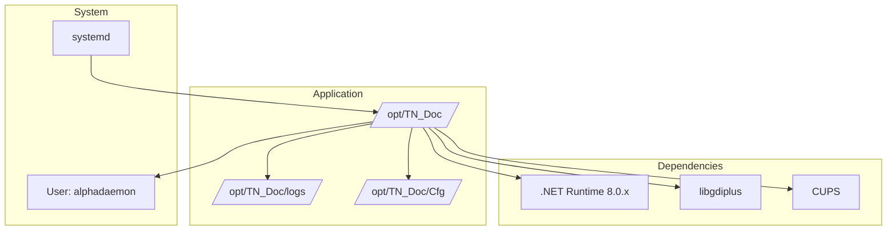
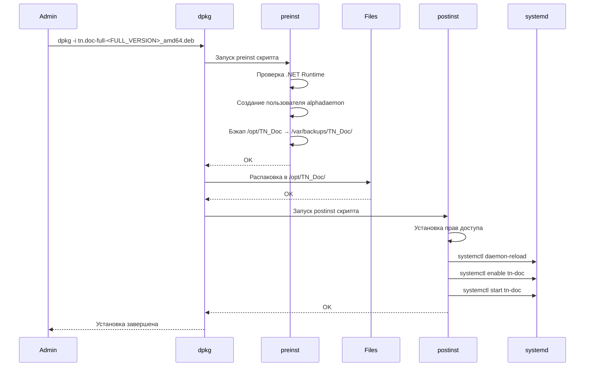

# Развертывание на Linux

## Системные требования

| Компонент | Требование |
|-----------|------------|
| ОС | Ubuntu 20.04+, Debian 11+, RHEL 8+ |
| .NET Runtime | 8.0.x (LTS) или выше |
| Память | 1 GB минимум, 2 GB рекомендуется |
| Дисковое пространство | 500 MB |
| Пользователь | `alphadaemon` (создается автоматически) |

## Архитектура развертывания



## Установка из .deb пакета

### 1. Скачать пакет

```bash
# Скачать с сервера сборки (полный пакет с runtime)
wget http://build-server/tn.doc-full-<FULL_VERSION>_amd64.deb

# Минимальный пакет (нужен установленный .NET Runtime и шрифты)
# wget http://build-server/tn.doc-<FULL_VERSION>_amd64.deb

# Или скопировать с локальной машины
scp tn.doc-full-<FULL_VERSION>_amd64.deb user@server:/tmp/
```

`<FULL_VERSION>` задается при сборке пакета (например, `1.4.3`). Если используется CI, версия может формироваться в пайплайне вашей инфраструктуры.

### 2. Установить зависимости

```bash
# Установить .NET Runtime
wget https://packages.microsoft.com/config/ubuntu/$(lsb_release -rs)/packages-microsoft-prod.deb
sudo dpkg -i packages-microsoft-prod.deb
sudo apt-get update
sudo apt-get install -y aspnetcore-runtime-8.0

# Установить системные библиотеки
sudo apt-get install -y libgdiplus libc6-dev cups
```

### 3. Установить пакет

```bash
sudo dpkg -i tn.doc-full-<FULL_VERSION>_amd64.deb

# Если есть зависимости, выполните
sudo apt-get install -f
```

## Процесс установки



## Структура установки

```
/opt/TN_Doc/
├── TN_Doc                      # Исполняемый файл
├── TN_Doc.dll                  # Основная библиотека
├── appsettings.json            # Конфигурация ASP.NET
├── Cfg/
│   ├── CfgApp.json            # Основная конфигурация
│   ├── Cfg*.json              # Конфигурации документов
│   └── ...
├── Doc/                        # FastReport шаблоны
├── wwwroot/                    # Статические файлы
├── logs/                       # Логи приложения
└── ...

/etc/systemd/system/
└── tn-doc.service             # Systemd unit файл
```

## Systemd Service

### tn-doc.service

```ini
[Unit]
Description=TN_Doc - Document Generation Service
After=network.target mysql.service

[Service]
Type=notify
User=alphadaemon
WorkingDirectory=/opt/TN_Doc
ExecStart=/opt/TN_Doc/TN_Doc
Restart=on-failure
RestartSec=10
Environment=ASPNETCORE_ENVIRONMENT=Production
Environment=DOTNET_PRINT_TELEMETRY_MESSAGE=false

[Install]
WantedBy=multi-user.target
```

### Управление службой

```bash
# Запуск
sudo systemctl start tn-doc

# Остановка
sudo systemctl stop tn-doc

# Перезапуск
sudo systemctl restart tn-doc

# Статус
sudo systemctl status tn-doc

# Автозапуск
sudo systemctl enable tn-doc

# Отключить автозапуск
sudo systemctl disable tn-doc

# Просмотр логов
sudo journalctl -u tn-doc -f
```

## Конфигурация

### Основной конфиг: /opt/TN_Doc/Cfg/CfgApp.json

```json
{
  "Devices": [
    {
      "Use": true,
      "IdDevice": 1,
      "Name": "ИВК №1 - Узел учета",
      "Description": "",
      "DBConnectionStrings": [
        {
          "Use": true,
          "GuidDevice": 1,
          "Server": "localhost",
          "Userid": "ivk_user",
          "Password": "***",
          "Database": "ivk1",
          "ConnectionTimeout": 30
        }
      ],
      "OpcConnectionSettings": {
        "Type": 1,
        "DaSettings": {
          "StartPrefix": "Root.PLC1.IVK_TN_01",
          "Host": "localhost",
          "ProgId": "psregulopcda_01",
          "UpdateRate": 500
        },
        "UaSettings": {
          "ConfigFilename": "Config.xml",
          "UpdateRate": 500,
          "StartPrefix": "IVK_TN_01"
        }
      }
    }
  ],
  "Elis": {
    "Use": true,
    "OstKey": "ostKey",
    "SiknKey": "siknKey",
    "ClientName": "clientName",
    "ClientToken": ""
  },
  "UseSecurityFeatures": false,
  "ArmOpcConnectionSettings": {
    "Type": 1,
    "DaSettings": {
      "StartPrefix": "Root.ARM.Reports",
      "Host": "localhost",
      "ProgId": "psregulopcda_01",
      "UpdateRate": 500
    },
    "UaSettings": {
      "ConfigFilename": "Config.xml",
      "UpdateRate": 500,
      "StartPrefix": "root.ARM.Reports"
    }
  }
}
```

### Логирование: /opt/TN_Doc/nlog.config

```xml
<nlog xmlns="http://www.nlog-project.org/schemas/NLog.xsd">
  <targets>
    <target name="logfile"
            xsi:type="File"
            fileName="/opt/TN_Doc/logs/tn-doc-${shortdate}.log" />
  </targets>
  <rules>
    <logger name="*" minlevel="Info" writeTo="logfile" />
  </rules>
</nlog>
```

## Безопасность

### Права доступа

```bash
# Установить владельца
sudo chown -R alphadaemon:alphadaemon /opt/TN_Doc

# Права на директории
sudo chmod 750 /opt/TN_Doc
sudo chmod 750 /opt/TN_Doc/Cfg
sudo chmod 770 /opt/TN_Doc/logs

# Права на конфиги
sudo chmod 640 /opt/TN_Doc/Cfg/CfgApp.json
```

### Firewall

```bash
# Открыть порт (если нужен внешний доступ)
sudo ufw allow 38509/tcp

# Для HTTPS
sudo ufw allow 44357/tcp
```

## Мониторинг

### Проверка здоровья

```bash
# HTTP endpoint
curl http://localhost:38509/api/status

# Проверка процесса
ps aux | grep TN_Doc

# Использование ресурсов
systemctl status tn-doc | grep Memory
```

### Логи

```bash
# Логи приложения
tail -f /opt/TN_Doc/logs/tn-doc-$(date +%Y-%m-%d).log

# Логи systemd
sudo journalctl -u tn-doc -n 100 --no-pager

# Логи за последний час
sudo journalctl -u tn-doc --since "1 hour ago"
```

## Обновление

При установке нового пакета preinst скрипт автоматически создаёт бэкап текущей версии в `/var/backups/TN_Doc/` (архив tar.gz, логи исключаются).

```bash
# Установить новый пакет (бэкап создаётся автоматически)
sudo dpkg -i tn.doc-full-<FULL_VERSION>_amd64.deb

# Проверить статус
sudo systemctl status tn-doc

# При необходимости — восстановление из бэкапа
ls /var/backups/TN_Doc/
sudo tar -xzf /var/backups/TN_Doc/TN_Doc_backup_<timestamp>.tar.gz -C /opt
```

## Удаление

```bash
# Удалить пакет (сохранить конфиги)
sudo dpkg -r tn-doc

# Полное удаление (включая конфиги)
sudo dpkg --purge tn-doc

# Удалить директорию вручную (если нужно)
sudo rm -rf /opt/TN_Doc
```

## Диагностика проблем

### Служба не запускается

```bash
# Проверить логи systemd
sudo journalctl -u tn-doc -n 50

# Проверить права
ls -la /opt/TN_Doc
```

### Проблемы с подключением к БД

```bash
# Проверить подключение из под пользователя alphadaemon
sudo -u alphadaemon mysql -h localhost -u ivk_user -p

# Проверить настройки в CfgApp.json
grep -nE '"Server"|"Database"|"Userid"' /opt/TN_Doc/Cfg/CfgApp.json
```

### Ошибка "libgdiplus not found"

```bash
sudo apt-get install libgdiplus
sudo systemctl restart tn-doc
```

## См. также

- [Configuration Guide](configuration.md)
- [Сборка проекта](../development/building.md)
- [Руководство разработчика](../development/setup.md)
