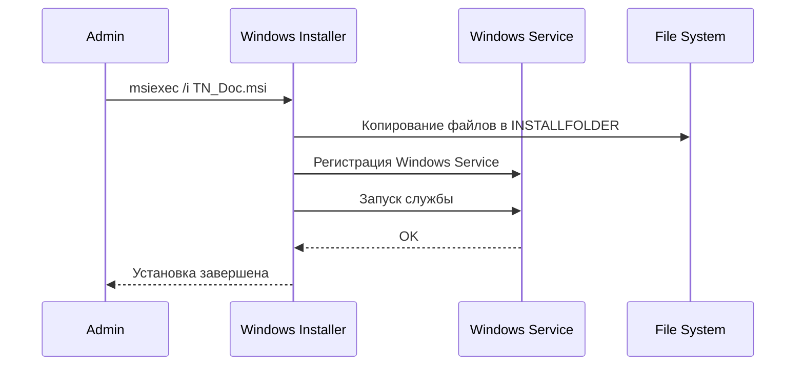

# Развертывание на Windows

## Системные требования

| Компонент | Требование |
|-----------|------------|
| ОС | Windows 10+ / Windows Server 2016+ |
| .NET Runtime | 8.0.13+ (включён в full-пакет, требуется для minimal) |
| Память | 1 GB минимум, 2 GB рекомендуется |
| Дисковое пространство | 500 MB |
| Права | Администратор (для установки службы) |

## Архитектура развертывания

```mermaid
graph TB
    subgraph "System"
        SCM[Windows Service Control Manager]
        Admin[Administrator]
    end

    subgraph "Application"
        App["C:\ProjectVU\DotNetComponents\"]
        Logs["C:\ProjectVU\DotNetComponents\logs\"]
        Config["C:\ProjectVU\DotNetComponents\Cfg\"]
    end

    subgraph "Backup"
        Backup["C:\ProgramData\TN_Doc\backups\"]
    end

    SCM --> App
    App --> Logs
    App --> Config
    App -.->|установка/обновление| Backup
```

## Варианты MSI пакетов

| Пакет | Описание | Размер |
|-------|----------|--------|
| `tn.doc-full-*_win-x64.msi` | Self-contained: включает .NET Runtime | ~55 MB |
| `tn.doc-*_win-x64.msi` | Minimal: требует установленный .NET Runtime 8.0.13+ | ~15 MB |

## Получение MSI из GitLab CI

MSI пакеты собираются в основном pipeline:
- `build-windows-job` публикует `win-x64` бинарники (full + minimal)
- `package-msi-full-job` собирает `tn.doc-full-*_win-x64.msi`
- `package-msi-minimal-job` собирает `tn.doc-*_win-x64.msi`

Артефакты MSI сохраняются в `./packages/*.msi` и прикладываются к уведомлению `notify-telegram-job` (опционально).

Для MSI job'ов используется Windows `shell` runner (без Docker image в job). На runner требуются `.NET SDK 8` и `WiX Toolset v6`.

## Установка из MSI пакета

### Графическая установка

```cmd
msiexec /i tn.doc-full-<FULL_VERSION>_win-x64.msi
```

Мастер установки позволяет настроить:
- **Путь установки** (по умолчанию `C:\ProjectVU\DotNetComponents\TN_Doc`)
- **Имя Windows Service** (по умолчанию `tn.doc`)

Интерфейс установщика на русском языке.
Цепочка диалогов: Приветствие → Выбор пути → Имя службы → Подтверждение → Установка → Завершение.
Перед установкой автоматически создаётся бэкап существующих файлов (если директория не пуста), затем директория очищается.

### Тихая установка

```cmd
:: С параметрами по умолчанию
msiexec /i tn.doc-full-<FULL_VERSION>_win-x64.msi /quiet

:: С пользовательскими параметрами
msiexec /i tn.doc-full-<FULL_VERSION>_win-x64.msi /quiet ^
  INSTALLFOLDER="C:\ProjectVU\DotNetComponents\TN_Doc" ^
  SERVICENAME="tn.doc"

:: С логированием (для диагностики)
msiexec /i tn.doc-full-<FULL_VERSION>_win-x64.msi /quiet /l*v install.log
```

`<FULL_VERSION>` формируется при сборке CI (например, `1.5.1-b42-a1b2c3d4`).

### Параметры установки

| Параметр | По умолчанию | Описание |
|----------|-------------|----------|
| `INSTALLFOLDER` | `C:\ProjectVU\DotNetComponents\TN_Doc` | Путь установки приложения |
| `SERVICENAME` | `tn.doc` | Имя Windows Service |
| `BACKUPDIR` | `C:\ProgramData\TN_Doc\backups` | Директория для бэкапов |

## Процесс установки



## Структура установки

```
C:\ProjectVU\DotNetComponents\
├── TN_Doc.exe                  # Исполняемый файл
├── TN_Doc.dll                  # Основная библиотека
├── appsettings.json            # Конфигурация ASP.NET
├── Cfg/
│   ├── CfgApp.json            # Основная конфигурация
│   ├── Cfg*.json              # Конфигурации документов
│   └── ...
├── Doc/                        # FastReport шаблоны
├── wwwroot/                    # Статические файлы
├── Scripts/
│   └── Backup.ps1             # Скрипт бэкапа
├── logs/                       # Логи приложения
└── ...

C:\ProgramData\TN_Doc\
└── backups\                    # Бэкапы перед установкой/обновлением
```

## Управление службой

### Через sc.exe

```cmd
:: Статус
sc query tn.doc

:: Запуск
sc start tn.doc

:: Остановка
sc stop tn.doc

:: Перезапуск
sc stop tn.doc && sc start tn.doc
```

### Через PowerShell

```powershell
# Статус
Get-Service -Name "tn.doc"

# Запуск
Start-Service -Name "tn.doc"

# Остановка
Stop-Service -Name "tn.doc"

# Перезапуск
Restart-Service -Name "tn.doc"

# Просмотр логов событий
Get-EventLog -LogName Application -Source "tn.doc" -Newest 20
```

## Конфигурация

### Основной конфиг: Cfg\CfgApp.json

Аналогичен Linux-версии. Подробнее: [Configuration Guide](configuration.md)

### Логирование: nlog.config

```xml
<nlog xmlns="http://www.nlog-project.org/schemas/NLog.xsd">
  <targets>
    <target name="logfile"
            xsi:type="File"
            fileName="${basedir}/logs/tn-doc-${shortdate}.log" />
  </targets>
  <rules>
    <logger name="*" minlevel="Info" writeTo="logfile" />
  </rules>
</nlog>
```

Логи записываются в `<INSTALLFOLDER>\logs\`.

## Обновление

При установке/обновлении через MSI автоматически:
1. Останавливается текущая служба (если была установлена)
2. Создаётся бэкап в `C:\ProgramData\TN_Doc\backups\` (если директория установки не пуста, исключая `logs/`)
3. Очищается директория установки
4. Устанавливаются новые файлы
5. Удаляется старая версия (MajorUpgrade)
6. Запускается служба

```cmd
:: Обновление (графическое)
msiexec /i tn.doc-full-<NEW_VERSION>_win-x64.msi

:: Обновление (тихое)
msiexec /i tn.doc-full-<NEW_VERSION>_win-x64.msi /quiet
```

### Ручной бэкап

```powershell
# Запуск скрипта бэкапа вручную
powershell -ExecutionPolicy Bypass -File "C:\ProjectVU\DotNetComponents\Scripts\Backup.ps1" `
  -InstallDir "C:\ProjectVU\DotNetComponents" `
  -BackupDir "C:\ProgramData\TN_Doc\backups" `
  -Version "1.5.1"
```

## Удаление

```cmd
:: Через панель управления
:: Панель управления → Программы → Удаление программ → TN_Doc

:: Через командную строку
msiexec /x {ProductCode} /quiet

:: Или по имени MSI
msiexec /x tn.doc-full-<FULL_VERSION>_win-x64.msi /quiet
```

## Мониторинг

### Проверка здоровья

```cmd
:: HTTP endpoint
curl http://localhost:5000/api/status

:: Проверка процесса
tasklist /fi "imagename eq TN_Doc.exe"
```

### Логи

```powershell
# Последние строки лога
Get-Content "C:\ProjectVU\DotNetComponents\logs\tn-doc-$(Get-Date -Format 'yyyy-MM-dd').log" -Tail 50

# Следить за логом в реальном времени
Get-Content "C:\ProjectVU\DotNetComponents\logs\tn-doc-$(Get-Date -Format 'yyyy-MM-dd').log" -Wait

# Логи Windows Event Log
Get-EventLog -LogName Application -Source "tn.doc" -Newest 20
```

## Диагностика проблем

### Служба не запускается

```powershell
# Проверить статус и сообщение об ошибке
Get-Service -Name "tn.doc" | Format-List *

# Проверить логи приложения
Get-Content "C:\ProjectVU\DotNetComponents\logs\*.log" -Tail 50

# Проверить Event Log
Get-EventLog -LogName Application -EntryType Error -Newest 10
```

### Проблемы с установкой MSI

```cmd
:: Установка с подробным логированием
msiexec /i tn.doc-full-<FULL_VERSION>_win-x64.msi /l*v install.log

:: Просмотр лога
notepad install.log
```

### Проблемы с подключением к БД

```powershell
# Проверить настройки в CfgApp.json
Get-Content "C:\ProjectVU\DotNetComponents\Cfg\CfgApp.json" | Select-String "Server|Database|Userid"

# Проверить доступность MySQL
Test-NetConnection -ComputerName localhost -Port 3306
```

## См. также

- [Configuration Guide](configuration.md)
- [Linux Deployment](linux.md)
- [Сборка проекта](../development/building.md)
