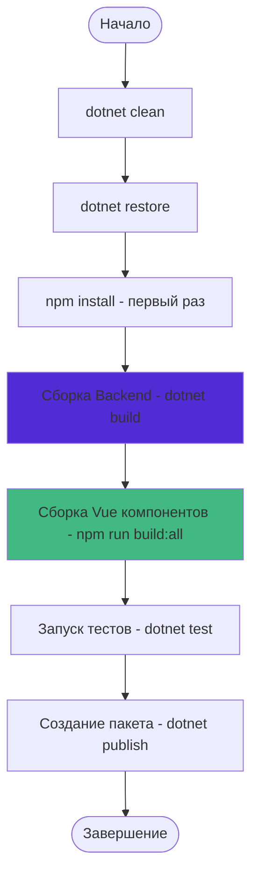
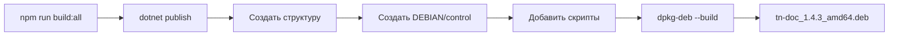

# Руководство по сборке проекта

## Обзор процесса сборки

TN_Doc v1.4.3+ объединяет backend на ASP.NET Core 8.0 и три frontend SPA на Vue 3:

- **Backend**: .NET 8.0 приложение с FastReport и бизнес-логикой
- **Frontend**: StatusBar, Configurator, Document Editor (npm workspaces)
- **Интеграция**: Vue компоненты публикуются в `wwwroot/{statusbar|configurator|document-editor}/`



**Обязательные требования:**
- .NET SDK 9.0+ (для разработки) или .NET Runtime 8.0.13+ (для запуска)
- Node.js 18.0+ и npm 8.0+
- Сборка Vue компонентов обязательна для production builds

## Быстрая сборка

### Первая сборка (полная установка)

```bash
# 1. Восстановить .NET зависимости
dotnet restore

# 2. Установить npm зависимости для всех Vue компонентов (первый раз)
cd TN_Doc/Client
npm install
cd ../..

# 3. Собрать backend
dotnet build

# 4. Собрать все Vue компоненты (StatusBar, Configurator, Document Editor)
cd TN_Doc/Client
npm run build:all
cd ../..

# 5. Запустить приложение
cd TN_Doc
dotnet run
# Приложение доступно на http://localhost:38509
```

### Последующие сборки

```bash
# Быстрая сборка после изменений
dotnet build && cd TN_Doc/Client && npm run build:all && cd ../..

# Только backend (если Vue компоненты не менялись)
dotnet build

# Только Vue компоненты (если C# код не менялся)
cd TN_Doc/Client && npm run build:all && cd ../..

# Production сборка для развёртывания
dotnet build -c Release && cd TN_Doc/Client && npm run build:all && cd ../..
```

## Детальные команды сборки

### 1. Очистка

```bash
# Очистить выходные директории
dotnet clean

# Очистить NuGet кэш (если нужно)
dotnet nuget locals all --clear
```

### 2. Восстановление пакетов

```bash
# Восстановить все NuGet пакеты
dotnet restore

# Для конкретного проекта
dotnet restore TN_Doc/TN_Doc.csproj
```

### 3. Сборка решения

```bash
# Сборка всего решения
dotnet build

# Сборка в режиме Release
dotnet build -c Release

# Сборка с детальным выводом
dotnet build -v detailed

# Сборка конкретного проекта
dotnet build TN_Doc/TN_Doc.csproj
```

### 4. Сборка Vue компонентов (npm workspaces)

TN_Doc использует **npm workspaces** для управления тремя Vue 3 SPA компонентами:

| Компонент | Статус | Порт dev | Назначение |
|-----------|--------|----------|------------|
| **statusbar** | Production | 5173 | Мониторинг состояния системы в реальном времени (SignalR) |
| **configurator** | Production | 5174 | Веб-интерфейс для управления конфигурацией приложения |
| **document-editor** | Активная разработка | 5174 | Редактор документов с поддержкой истории изменений |

#### Технологический стек Vue компонентов

- **Framework**: Vue 3 + TypeScript + Vite
- **UI Library**: PrimeVue (Material Design 3 компоненты)
- **State Management**: Pinia
- **HTTP Client**: Axios
- **Real-time**: SignalR (StatusBar)

#### Установка зависимостей (первый раз)

```bash
cd TN_Doc/Client

# Устанавливает зависимости для всех трёх workspaces одной командой
npm install

# Структура node_modules:
# - TN_Doc/Client/node_modules/ - общие зависимости
# - statusbar/node_modules/ - специфичные для StatusBar
# - configurator/node_modules/ - специфичные для Configurator
# - document-editor/node_modules/ - специфичные для Document Editor
```

#### Development режим (с hot reload)

```bash
cd TN_Doc/Client

# StatusBar - dev server на http://localhost:5173
npm run dev

# Configurator - dev server на http://localhost:5174
npm run dev:configurator

# Document Editor - dev server на http://localhost:5174
npm run dev:editor

# Важно: Configurator и Document Editor используют один порт (5174).
# Запускайте их по очереди или измените port в соответствующем vite.config.ts.
```

**Важно**: В development режиме запускайте ASP.NET Core приложение параллельно:

```bash
# Terminal 1: Backend
cd TN_Doc && ASPNETCORE_ENVIRONMENT=Development dotnet run

# Terminal 2: Frontend (например, StatusBar)
cd TN_Doc/Client && npm run dev
```

#### Production сборка

```bash
cd TN_Doc/Client

# Собрать все три компонента (рекомендуется)
npm run build:all

# Или по отдельности:
npm run build              # только statusbar
npm run build:configurator # только configurator
npm run build:editor       # только document-editor
```

**Результат сборки**: скомпилированные JavaScript/CSS бандлы публикуются в `TN_Doc/wwwroot/`:

```
TN_Doc/wwwroot/
├── statusbar/
│   ├── index.html
│   ├── status-bar.js
│   ├── status-bar.css
│   └── status-bar.[hash].js
├── configurator/
│   ├── index.html
│   ├── configurator.js
│   ├── configurator.css
│   └── configurator.[hash].js
└── document-editor/
    ├── index.html
    ├── assets/
    │   ├── index-[hash].js
    │   └── index-[hash].css
    └── ...
```

#### Очистка артефактов сборки

```bash
cd TN_Doc/Client

# Удаляет node_modules в workspaces
npm run clean

# Если нужно очистить собранные бандлы, удалите директории:
# TN_Doc/wwwroot/statusbar/
# TN_Doc/wwwroot/configurator/
# TN_Doc/wwwroot/document-editor/

# После очистки нужно переустановить зависимости:
npm install
```

#### Проверка качества кода

```bash
cd TN_Doc/Client

# TypeScript type checking (без сборки)
npm run type-check -w statusbar
```

## Конфигурации сборки

### Debug Configuration

```xml
<PropertyGroup Condition="'$(Configuration)' == 'Debug'">
  <DefineConstants>DEBUG;TRACE</DefineConstants>
  <Optimize>false</Optimize>
  <DebugSymbols>true</DebugSymbols>
  <DebugType>full</DebugType>
</PropertyGroup>
```

Особенности:
- Включены отладочные символы
- Копируются `*.Development.json` файлы
- Подробное логирование

### Release Configuration

```xml
<PropertyGroup Condition="'$(Configuration)' == 'Release'">
  <DefineConstants>RELEASE</DefineConstants>
  <Optimize>true</Optimize>
  <DebugSymbols>false</DebugSymbols>
  <TreatWarningsAsErrors>true</TreatWarningsAsErrors>
</PropertyGroup>
```

Особенности:
- Оптимизация кода
- Development конфиги исключены
- Минимальное логирование

## Публикация

⚠️ **Важно**: Перед публикацией обязательно соберите Vue компоненты!

### Полная последовательность публикации

```bash
# 1. Собрать Vue компоненты в production режиме
cd TN_Doc/Client
npm run build:all
cd ../..

# 2. Опционально: запустить тесты
dotnet test -c Release

# 3. Опубликовать приложение
dotnet publish TN_Doc/TN_Doc.csproj -c Release -o ./publish
```

### Linux (Self-contained)

```bash
# Сначала Vue компоненты
cd TN_Doc/Client && npm run build:all && cd ../..

# Затем публикация
dotnet publish TN_Doc/TN_Doc.csproj \
  -c Release \
  -r linux-x64 \
  --self-contained false \
  -o ./publish/linux
```

**Проверка результата**:
```bash
# wwwroot/ должен содержать собранные Vue компоненты
ls -la ./publish/linux/wwwroot/
# Ожидается: statusbar/, configurator/, document-editor/
```

### Windows (Self-contained)

```bash
# Сначала Vue компоненты
cd TN_Doc/Client && npm run build:all && cd ../..

# Затем публикация
dotnet publish TN_Doc/TN_Doc.csproj \
  -c Release \
  -r win-x64 \
  --self-contained false \
  -o ./publish/windows
```

### Framework-dependent

```bash
# Сначала Vue компоненты
cd TN_Doc/Client && npm run build:all && cd ../..

# Затем публикация
dotnet publish TN_Doc/TN_Doc.csproj \
  -c Release \
  -o ./publish/framework-dependent
```

### Что включается в публикацию

```
publish/
├── TN_Doc.dll                    # Основное приложение
├── TN_Doc.deps.json              # Зависимости
├── TN_Doc.runtimeconfig.json     # Конфигурация runtime
├── appsettings.json              # Конфигурация приложения
├── wwwroot/
│   ├── statusbar/               # ✅ Собранные Vue компоненты
│   ├── configurator/
│   └── document-editor/
│   ├── css/                      # Статические стили
│   ├── js/                       # Статические скрипты
│   └── lib/                      # Библиотеки третьих сторон
├── Cfg/                          # Конфигурационные файлы
│   ├── CfgApp.json
│   ├── Cfg*.json
│   └── CfgEdit*.json
├── Doc/                          # FastReport шаблоны (.frx)
└── tn.docgeneral/                # Библиотеки документов (48 DLL)
```

## Создание .deb пакета (Linux)



**Полная последовательность**:

```bash
# 1. Собрать Vue компоненты
cd TN_Doc/Client
npm ci  # CI-friendly установка зависимостей
npm run build:all
cd ../..

# 2. Опубликовать .NET приложение
dotnet publish TN_Doc/TN_Doc.csproj \
  -c Release \
  -r linux-x64 \
  --self-contained false \
  -o ./publish/linux

# 3. Создать структуру пакета
# (см. .gitlab-ci.yml для детальной настройки)

# 4. Собрать .deb пакет
dpkg-deb --build ./package tn-doc_1.4.3_amd64.deb
```

См. `.gitlab-ci.yml` для полного процесса автоматической сборки.

## Автоматическая сборка (CI/CD)

### GitLab CI Pipeline

```yaml
stages:
  - build
  - test
  - package
  - deploy

variables:
  DOTNET_CLI_TELEMETRY_OPTOUT: 1
  NODE_VERSION: "18"

build-backend:
  stage: build
  image: mcr.microsoft.com/dotnet/sdk:9.0
  script:
    - dotnet restore
    - dotnet build -c Release
  artifacts:
    paths:
      - TN_Doc/bin/Release/
      - tn.docgeneral/*/bin/Release/
    expire_in: 1 hour

build-frontend:
  stage: build
  image: node:18
  script:
    - cd TN_Doc/Client
    - npm ci  # CI-friendly установка (чище и быстрее npm install)
    - npm run build:all
  artifacts:
    paths:
      - TN_Doc/wwwroot/statusbar/
      - TN_Doc/wwwroot/configurator/
      - TN_Doc/wwwroot/document-editor/
    expire_in: 1 hour
  cache:
    key: ${CI_COMMIT_REF_SLUG}
    paths:
      - TN_Doc/Client/node_modules/
      - TN_Doc/Client/*/node_modules/

test:
  stage: test
  image: mcr.microsoft.com/dotnet/sdk:9.0
  dependencies:
    - build-backend
  script:
    - dotnet test -c Release --no-build --logger "trx;LogFileName=test_results.xml"
  artifacts:
    when: always
    reports:
      junit: "**/test_results.xml"

package-deb:
  stage: package
  image: mcr.microsoft.com/dotnet/sdk:9.0
  dependencies:
    - build-backend
    - build-frontend
  script:
    - dotnet publish TN_Doc/TN_Doc.csproj -c Release -r linux-x64 --no-build -o ./publish/linux
    # Проверка наличия Vue компонентов
    - test -d ./publish/linux/wwwroot/statusbar || exit 1
    - test -d ./publish/linux/wwwroot/configurator || exit 1
    # Создание .deb пакета (детали в .gitlab-ci.yml)
    - dpkg-deb --build ./package tn-doc_1.4.3_amd64.deb
  artifacts:
    paths:
      - tn-doc_1.4.3_amd64.deb
    expire_in: 1 week
```

**Важные моменты CI/CD**:

- **Параллельная сборка**: Backend и Frontend собираются параллельно для ускорения pipeline
- **npm ci**: Используется вместо `npm install` для детерминированной установки
- **Кэширование node_modules**: Ускоряет последующие сборки
- **Проверка артефактов**: Валидируется наличие Vue компонентов перед упаковкой
- **Артефакты**: Backend и Frontend передаются между стадиями через artifacts

## Оптимизация сборки

### Ускорение сборки

```bash
# Параллельная сборка
dotnet build -m

# Пропустить тесты при сборке
dotnet build --no-restore

# Инкрементальная сборка
dotnet build /p:BuildInParallel=true
```

### Минимизация размера

```bash
# Публикация с обрезкой (trimming)
dotnet publish -c Release \
  -r linux-x64 \
  -p:PublishTrimmed=true \
  -p:TrimMode=link

# Компрессия assemblies
dotnet publish -c Release \
  -p:CompressionEnabled=true
```

## Диагностика проблем сборки

### Проблемы с .NET Backend

```bash
# Детальный вывод сборки
dotnet build -v detailed > build.log 2>&1

# Проверка зависимостей
dotnet list package

# Поиск устаревших пакетов
dotnet list package --outdated

# Проверка уязвимых пакетов
dotnet list package --vulnerable

# Очистка и пересборка
dotnet clean && dotnet nuget locals all --clear && dotnet restore && dotnet build
```

### Проблемы с Vue компонентами (npm)

```bash
cd TN_Doc/Client

# Проверка версий Node.js и npm
node --version  # Должен быть >= 18.0
npm --version   # Должен быть >= 8.0

# Полная переустановка зависимостей
rm -rf node_modules */node_modules package-lock.json
npm install

# Детальная диагностика сборки конкретного компонента
npm run build -w statusbar -- --mode development

# Проверка TypeScript ошибок
npm run type-check -w statusbar
npm run type-check -w configurator
npm run type-check -w document-editor

# Проверка установленных пакетов
npm list --all

# Проверка целостности зависимостей
npm audit
npm audit fix  # Автоматическое исправление уязвимостей
```

### Типичные проблемы и решения

| Проблема | Причина | Решение |
|----------|---------|---------|
| `ENOENT: no such file or directory` | Отсутствует `node_modules/` | `npm install` |
| `Cannot find module 'vue'` | Некорректная установка зависимостей | `npm run clean && npm install` |
| `TypeScript errors in build` | Несоответствие типов | Проверить `npm run type-check` |
| `Module not found in workspaces` | Неправильная конфигурация workspaces | Проверить `package.json` в корне Client/ |
| `Сборка не создает файлы` | Сборка не завершилась успешно | Проверить логи сборки на ошибки |
| `Port 5173 already in use` | Dev server уже запущен | `pkill -f vite` или изменить порт |
| `Vue компоненты не копируются` | Неправильный output в vite.config | Проверить `build.outDir` в конфигах Vite |

### Проверка результатов сборки Vue

```bash
cd TN_Doc/Client

# Проверить наличие собранных файлов
ls -la ../wwwroot/statusbar/
ls -la ../wwwroot/configurator/
ls -la ../wwwroot/document-editor/

# Ожидаемая структура каждого компонента:
# ├── index.html
# ├── assets/
# │   ├── index-[hash].js
# │   └── index-[hash].css
# └── favicon.ico (опционально)

# Проверить размер бандлов (должны быть оптимизированы)
du -sh ../wwwroot/statusbar/assets/*.js ../wwwroot/configurator/assets/*.js ../wwwroot/document-editor/assets/*.js
```

### Логи сборки

**Development**:
```bash
# Backend логи
tail -f TN_Doc/bin/Debug/net8.0/logs/tn-doc-*.log

# Vue dev server логи
# Выводятся в терминал где запущен npm run dev
```

**CI/CD**:
```bash
# GitLab CI artifacts
# Скачать build.log из artifacts pipeline
```

## Артефакты сборки

### Выходные директории Backend (.NET)

```
TN_Doc/
├── bin/
│   └── Debug/net8.0/          # или Release/net8.0/
│       ├── TN_Doc.dll         # Основной исполняемый файл
│       ├── TN_Doc.pdb         # Символы отладки
│       ├── TN_Doc.deps.json   # Граф зависимостей
│       ├── appsettings.json   # Конфигурация
│       ├── wwwroot/           # Статические файлы
│       │   ├── statusbar/     # ✅ Собранные Vue компоненты
│       │   ├── configurator/
│       │   ├── document-editor/
│       │   ├── css/
│       │   ├── js/
│       │   └── lib/
│       ├── Cfg/               # Конфигурационные файлы
│       ├── Doc/               # FastReport шаблоны
│       └── tn.docgeneral/     # Библиотеки документов (48 DLL)
└── obj/
    └── Debug/net8.0/
        ├── TN_Doc.csproj.nuget.g.props
        └── ... (временные файлы компиляции)
```

### Выходные директории Frontend (Vue)

```
TN_Doc/wwwroot/
├── statusbar/                 # StatusBar production build
│   ├── index.html             # Точка входа
│   ├── status-bar.js          # Главный JavaScript бандл
│   ├── status-bar.css         # Стили
│   └── status-bar.[hash].js   # Chunked модули (code-splitting)
├── configurator/              # Configurator production build
│   ├── index.html
│   ├── configurator.js
│   ├── configurator.css
│   └── configurator.[hash].js
└── document-editor/           # Document Editor production build
    ├── index.html
    └── assets/
        ├── index-[hash].js
        └── index-[hash].css
```

**Примечания**:
- `[hash]` - уникальный хэш для cache busting (например, `index-a7b3c4d5.js`)
- Production builds минифицированы и оптимизированы
- Source maps (`.map` файлы) не включаются в production builds

### Публикация (dotnet publish)

```
publish/
├── TN_Doc.dll                    # Основное приложение
├── TN_Doc.deps.json              # Зависимости runtime
├── TN_Doc.runtimeconfig.json     # Конфигурация .NET runtime
├── appsettings.json              # Конфигурация приложения
├── web.config                    # IIS конфигурация (Windows)
├── wwwroot/
│   ├── statusbar/               # ✅ ОБЯЗАТЕЛЬНО: Vue компоненты
│   ├── configurator/
│   └── document-editor/
│   ├── css/                      # Статические стили
│   ├── js/                       # Статические скрипты
│   └── lib/                      # jQuery, Bootstrap и др.
├── Cfg/                          # Конфигурационные файлы
│   ├── CfgApp.json
│   ├── Cfg*.json                 # Конфиги документов (48 файлов)
│   └── CfgEdit*.json             # Конфиги форм редактирования
├── Doc/                          # FastReport шаблоны
│   ├── Act/
│   ├── Passport/
│   ├── Report/
│   ├── KMH/
│   └── ...                       # ~150 .frx файлов
├── tn.docgeneral/                # Библиотеки документов
│   ├── Act.dll
│   ├── Passport.dll
│   ├── KmhFlow.dll
│   └── ...                       # 48 DLL файлов
├── FastReport.*.dll              # FastReport зависимости
├── SkiaSharp.dll                 # Графический движок
└── ... (остальные .NET библиотеки)
```

### Размеры артефактов (примерно)

| Компонент | Размер |
|-----------|--------|
| Backend (.NET DLLs) | ~150 MB |
| FastReport + SkiaSharp | ~50 MB |
| Vue компоненты (wwwroot/*) | ~5-10 MB |
| FastReport шаблоны (.frx) | ~20 MB |
| Конфигурационные файлы | ~5 MB |
| **Итого** | **~230-245 MB** |

## Лучшие практики сборки

### Development Workflow

1. **Первый запуск в новой среде**:
   ```bash
   # Один раз после git clone
   dotnet restore
   cd TN_Doc/Client && npm install && cd ../..
   ```

2. **Ежедневная разработка**:
   ```bash
   # Terminal 1: Backend с горячей перезагрузкой
   cd TN_Doc && dotnet watch run

   # Terminal 2: Frontend с Vite HMR
   cd TN_Doc/Client && npm run dev
   ```

3. **Перед коммитом**:
   ```bash
   # Проверить что всё собирается
   dotnet build -c Release
   cd TN_Doc/Client && npm run build:all && cd ../..

   # Запустить тесты
   dotnet test
   ```

### Production Build Checklist

- [ ] Обновлена версия в `CHANGELOG.md` и `TN_Doc.csproj`
- [ ] Собраны Vue компоненты: `npm run build:all`
- [ ] Все тесты проходят: `dotnet test -c Release`
- [ ] Проверена публикация: `dotnet publish -c Release`
- [ ] Проверено наличие `wwwroot/{statusbar,configurator,document-editor}/` в выходной директории
- [ ] Конфигурационные файлы актуальны (особенно `CfgApp.json`)
- [ ] FastReport шаблоны скопированы корректно

### Безопасность сборки

⚠️ **НЕ коммитите**:
- `*.Development.json` файлы в production ветки
- `node_modules/`
- `bin/` и `obj/` директории
- `publish/` и прочие временные артефакты сборки
- Файлы с паролями и сертификатами (`Cert/`, `*.pfx`)

✅ **Коммитите при изменениях**:
- `package.json` и workspace конфигурации
- `package-lock.json` (фиксирует версии зависимостей)
- Vite конфигурации (`vite.config.ts`)
- TypeScript конфигурации (`tsconfig.json`)
- `.gitignore` обновления
- `TN_Doc/wwwroot/{statusbar,configurator,document-editor}/` (артефакты Vue, обновлять через `npm run build:all`)

### Мониторинг размера сборки

```bash
# Проверить размер production builds
cd TN_Doc/Client
npm run build:all
du -sh ../wwwroot/statusbar/ ../wwwroot/configurator/ ../wwwroot/document-editor/

# Если бандлы слишком большие (>2 MB на компонент):
# - Проверить tree-shaking (неиспользуемый код должен удаляться)
# - Рассмотреть lazy loading для крупных компонентов
# - Использовать bundle analyzer: npm install -D rollup-plugin-visualizer
```

### Устранение типичных ошибок

**"Vue components are missing in production"**:
```bash
# Убедитесь что сборка Vue выполнена ПЕРЕД dotnet publish
cd TN_Doc/Client && npm run build:all && cd ../..
dotnet publish -c Release
```

**"npm ERR! missing script: build:all"**:
```bash
# Проверьте что находитесь в правильной директории
pwd  # Должно быть: /path/to/tn_doc/TN_Doc/Client
cat package.json | grep build:all
```

**"FastReport templates not found"**:
```bash
# Убедитесь что .frx файлы копируются в output
# Проверить TN_Doc.csproj: <ItemGroup> с <None Include="Doc/**/*.frx" />
```

## Дополнительные ресурсы

### Документация

- [Setup Guide](setup.md) - Начальная настройка окружения
- [Testing](testing.md) - Руководство по тестированию
- [Deployment - Linux](../deployment/linux.md) - Развёртывание на Linux
- [Deployment - Windows](../deployment/windows.md) - Развёртывание на Windows
- [Architecture Overview](../architecture/overview.md) - Архитектура проекта

### Технологии

- [.NET 8.0 Documentation](https://learn.microsoft.com/dotnet/core/whats-new/dotnet-8)
- [Vue 3 Documentation](https://vuejs.org/)
- [Vite Documentation](https://vitejs.dev/)
- [npm Workspaces](https://docs.npmjs.com/cli/v8/using-npm/workspaces)
- [FastReport Documentation](https://www.fast-report.com/en/documentation/)

### Поддержка

- **Issues**: Используйте GitLab Issues для багов и feature requests
- **Logs**: Проверяйте `TN_Doc/logs/` для диагностики проблем
- **CI/CD**: Смотрите `.gitlab-ci.yml` для деталей автоматической сборки
