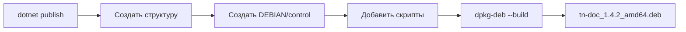

# Руководство по сборке проекта

## Обзор процесса сборки


## Быстрая сборка

```bash
# Полная сборка с нуля
dotnet clean && dotnet restore && dotnet build

# Сборка всех Vue компонентов (npm workspaces)
cd TN_Doc/Client && npm run build:all && cd ../..

# Сборка и запуск
cd TN_Doc && dotnet run
```

## Детальные команды сборки

### 1. Очистка

```bash
# Очистить выходные директории
dotnet clean

# Очистить NuGet кэш (если нужно)
dotnet nuget locals all --clear
```

### 2. Восстановление пакетов

```bash
# Восстановить все NuGet пакеты
dotnet restore

# Для конкретного проекта
dotnet restore TN_Doc/TN_Doc.csproj
```

### 3. Сборка решения

```bash
# Сборка всего решения
dotnet build

# Сборка в режиме Release
dotnet build -c Release

# Сборка с детальным выводом
dotnet build -v detailed

# Сборка конкретного проекта
dotnet build TN_Doc/TN_Doc.csproj
```

### 4. Сборка Vue компонентов (npm workspaces)

TN_Doc использует npm workspaces для управления тремя Vue 3 компонентами:
- **statusbar** - мониторинг состояния системы (production)
- **configurator** - веб-интерфейс для управления конфигурацией (production)
- **document-editor** - редактор документов в браузере (в разработке)

```bash
cd TN_Doc/Client

# Установка зависимостей для всех workspaces (первый раз)
npm install

# Development сборка StatusBar с watch
npm run dev

# Development сборка Configurator с watch
npm run dev:configurator

# Development сборка Document Editor с watch
npm run dev:editor

# Production сборка всех компонентов
npm run build:all

# Production сборка отдельных компонентов
npm run build              # только statusbar
npm run build:configurator # только configurator
npm run build:editor       # только document-editor
```

## Конфигурации сборки

### Debug Configuration

```xml
<PropertyGroup Condition="'$(Configuration)' == 'Debug'">
  <DefineConstants>DEBUG;TRACE</DefineConstants>
  <Optimize>false</Optimize>
  <DebugSymbols>true</DebugSymbols>
  <DebugType>full</DebugType>
</PropertyGroup>
```

Особенности:
- Включены отладочные символы
- Копируются `*.Development.json` файлы
- Подробное логирование

### Release Configuration

```xml
<PropertyGroup Condition="'$(Configuration)' == 'Release'">
  <DefineConstants>RELEASE</DefineConstants>
  <Optimize>true</Optimize>
  <DebugSymbols>false</DebugSymbols>
  <TreatWarningsAsErrors>true</TreatWarningsAsErrors>
</PropertyGroup>
```

Особенности:
- Оптимизация кода
- Development конфиги исключены
- Минимальное логирование

## Публикация

### Linux (Self-contained)

```bash
dotnet publish TN_Doc/TN_Doc.csproj \
  -c Release \
  -r linux-x64 \
  --self-contained false \
  -o ./publish/linux
```

### Windows (Self-contained)

```bash
dotnet publish TN_Doc/TN_Doc.csproj \
  -c Release \
  -r win-x64 \
  --self-contained false \
  -o ./publish/windows
```

### Framework-dependent

```bash
dotnet publish TN_Doc/TN_Doc.csproj \
  -c Release \
  -o ./publish/framework-dependent
```

## Создание .deb пакета (Linux)



См. `.gitlab-ci.yml` для полного процесса.

## Автоматическая сборка (CI/CD)

### GitLab CI Pipeline

```yaml
stages:
  - build
  - test
  - package
  - deploy

build:
  stage: build
  script:
    - dotnet restore
    - dotnet build -c Release
    - cd TN_Doc/Client/statusbar && npm ci && npm run build

test:
  stage: test
  script:
    - dotnet test --no-build

package:
  stage: package
  script:
    - dotnet publish -c Release -r linux-x64
    - dpkg-deb --build ./package
```

## Оптимизация сборки

### Ускорение сборки

```bash
# Параллельная сборка
dotnet build -m

# Пропустить тесты при сборке
dotnet build --no-restore

# Инкрементальная сборка
dotnet build /p:BuildInParallel=true
```

### Минимизация размера

```bash
# Публикация с обрезкой (trimming)
dotnet publish -c Release \
  -r linux-x64 \
  -p:PublishTrimmed=true \
  -p:TrimMode=link

# Компрессия assemblies
dotnet publish -c Release \
  -p:CompressionEnabled=true
```

## Диагностика проблем сборки

```bash
# Детальный вывод
dotnet build -v detailed > build.log 2>&1

# Проверка зависимостей
dotnet list package

# Поиск устаревших пакетов
dotnet list package --outdated

# Проверка уязвимых пакетов
dotnet list package --vulnerable
```

## Артефакты сборки

### Выходные директории

```
TN_Doc/
├── bin/
│   └── Debug/
│       └── net8.0/
│           ├── TN_Doc.dll
│           ├── TN_Doc.pdb
│           └── wwwroot/
└── obj/
    └── Debug/
        └── net8.0/
```

### Публикация

```
publish/
├── TN_Doc.dll
├── TN_Doc.deps.json
├── TN_Doc.runtimeconfig.json
├── appsettings.json
├── wwwroot/
├── Cfg/
├── Doc/
└── ...
```

## См. также

- [Setup Guide](setup.md)
- [Testing](testing.md)
- [Deployment](../deployment/linux.md)
