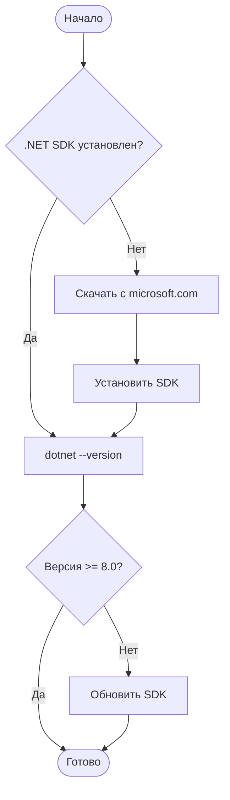
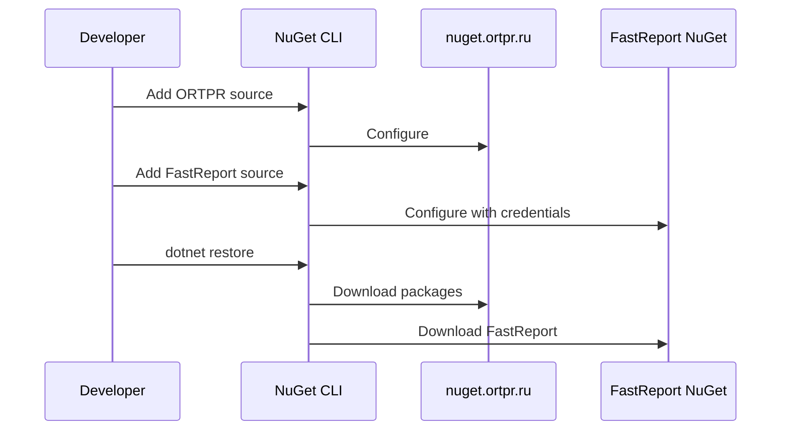
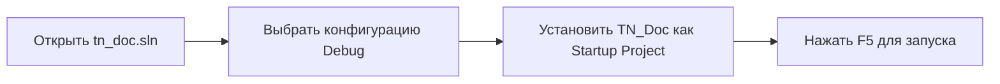
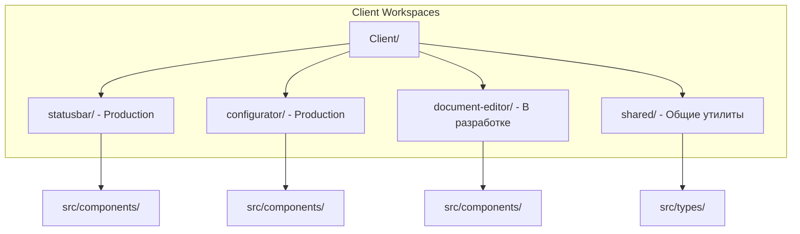

# Настройка окружения разработки

## Системные требования

### Минимальные требования

| Компонент | Требование |
|-----------|------------|
| ОС | Windows 10/11, Ubuntu 20.04+, macOS 12+ |
| .NET SDK | 8.0 или выше |
| .NET Runtime | 8.0.13 или выше |
| RAM | 4 GB (рекомендуется 8 GB) |
| Дисковое пространство | 2 GB |
| IDE | Visual Studio 2022, VS Code, Rider |

### Дополнительные компоненты

**Для разработки:**
- Git
- Node.js 18+ и npm 8+ (для Vue компонентов: StatusBar, Configurator, Document Editor)
- Docker (опционально, для тестирования)

**Для Linux:**
```bash
sudo apt-get install libgdiplus
```

## Установка .NET SDK



### Проверка установки

```bash
# Проверить версию SDK
dotnet --version

# Показать информацию о runtime
dotnet --info

# Список установленных SDK
dotnet --list-sdks

# Список установленных runtimes
dotnet --list-runtimes
```

Ожидаемый вывод:
```
$ dotnet --version
8.0.100

$ dotnet --list-runtimes
Microsoft.AspNetCore.App 8.0.13 [/usr/share/dotnet/shared/Microsoft.AspNetCore.App]
Microsoft.NETCore.App 8.0.13 [/usr/share/dotnet/shared/Microsoft.NETCore.App]
```

## Клонирование репозитория

```bash
# Основной репозиторий
git clone http://192.168.100.100/orpovy/ivk/tn_doc.git
cd tn_doc

# Связанные проекты (опционально, для полной разработки)
cd ..
git clone http://192.168.100.100/orpovy/ivk/tn_kmh.git
git clone http://192.168.100.100/orpovy/ivk/tn_messagingservice.git
git clone http://192.168.100.100/orpovy/ivk/tn.elisconnector.git
```

### Структура рабочей директории

```
workspace/
├── tn_doc/              # Основной проект
├── tn_kmh/              # KMH модуль
├── tn_messagingservice/ # OPC сервис
└── tn.elisconnector/    # ELIS интеграция
```

## Настройка NuGet источников



### Команды настройки

```bash
# Добавить источник ORTPR
dotnet nuget add source "https://nuget.ortpr.ru/v3/index.json" \
  --name ortpr

# Добавить источник FastReport (требуются учетные данные)
dotnet nuget add source "https://nuget.fast-report.com/api/v3/index.json" \
  --name fr_nuget \
  --username "<YOUR_USERNAME>" \
  --password "<YOUR_PASSWORD>" \
  --store-password-in-clear-text

# Проверить список источников
dotnet nuget list source
```

Ожидаемый результат:
```
Registered Sources:
  1.  nuget.org [Enabled]
      https://api.nuget.org/v3/index.json
  2.  ortpr [Enabled]
      https://nuget.ortpr.ru/v3/index.json
  3.  fr_nuget [Enabled]
      https://nuget.fast-report.com/api/v3/index.json
```

## Восстановление зависимостей

```bash
cd tn_doc

# Восстановить все пакеты NuGet
dotnet restore

# Если возникают ошибки, попробуйте очистить кэш
dotnet nuget locals all --clear
dotnet restore
```

## Настройка базы данных

### Создание тестовой БД (опционально)

```sql
CREATE DATABASE tn_doc_test;
CREATE USER 'tn_doc_user'@'localhost' IDENTIFIED BY 'password';
GRANT ALL PRIVILEGES ON tn_doc_test.* TO 'tn_doc_user'@'localhost';
FLUSH PRIVILEGES;
```

### Настройка строки подключения

Создайте файл `TN_Doc/Cfg/CfgApp.Development.json`:

```json
{
  "Devices": [
    {
      "IdDevice": "TEST-IVK-1",
      "Name": "Тестовое устройство",
      "TypeDevice": 7,
      "ConnectionString": "Server=localhost;Database=tn_doc_test;User=tn_doc_user;Password=password;",
      "UseSecurityFeatures": false
    }
  ],
  "UseSecurityFeatures": false
}
```

## Настройка IDE

### Visual Studio 2022



**Рекомендуемые расширения:**
- ReSharper (опционально)
- Web Essentials
- GitLens

### Visual Studio Code

**Установите расширения:**
```bash
code --install-extension ms-dotnettools.csharp
code --install-extension ms-dotnettools.vscode-dotnet-runtime
code --install-extension vue.volar
code --install-extension dbaeumer.vscode-eslint
```

**Создайте `.vscode/launch.json`:**
```json
{
  "version": "0.2.0",
  "configurations": [
    {
      "name": ".NET Core Launch (web)",
      "type": "coreclr",
      "request": "launch",
      "preLaunchTask": "build",
      "program": "${workspaceFolder}/TN_Doc/bin/Debug/net8.0/TN_Doc.dll",
      "args": [],
      "cwd": "${workspaceFolder}/TN_Doc",
      "env": {
        "ASPNETCORE_ENVIRONMENT": "Development"
      },
      "sourceFileMap": {
        "/Views": "${workspaceFolder}/TN_Doc/Views"
      }
    }
  ]
}
```

### JetBrains Rider

1. Открыть `tn_doc.sln`
2. Выбрать конфигурацию **Debug**
3. Run Configuration → Edit → Environment variables:
   ```
   ASPNETCORE_ENVIRONMENT=Development
   ```

## Настройка Vue компонентов (npm workspaces)

TN_Doc использует npm workspaces для управления тремя Vue 3 компонентами:

```bash
cd TN_Doc/Client

# Установить зависимости для всех компонентов
npm install

# Запустить dev сервер StatusBar с hot reload
npm run dev

# Или запустить Configurator
npm run dev:configurator

# Или запустить Document Editor (в разработке)
npm run dev:editor

# В другом терминале запустить основное приложение
cd ..
dotnet run
```

### Структура Vue проектов



## Проверка установки

```bash
# Собрать проект
dotnet build

# Запустить тесты
dotnet test

# Запустить приложение
cd TN_Doc
ASPNETCORE_ENVIRONMENT=Development dotnet run
```

Откройте браузер: `http://localhost:38509`

### Checklist готовности

- [ ] .NET SDK 8.0+ установлен
- [ ] Node.js 18+ и npm 8+ установлены
- [ ] NuGet источники настроены (ortpr, FastReport)
- [ ] Проект клонирован
- [ ] `dotnet restore` выполнен успешно
- [ ] `dotnet build` проходит без ошибок
- [ ] Vue компоненты собраны (`npm run build:all` в TN_Doc/Client/)
- [ ] Приложение запускается и открывается в браузере
- [ ] Тесты проходят (`dotnet test`)

## Частые проблемы

### Ошибка: "Unable to load the service index for source ortpr"

```bash
# Проверить доступность источника
curl https://nuget.ortpr.ru/v3/index.json

# Если недоступно, работайте без него (если пакеты закэшированы)
dotnet restore --source https://api.nuget.org/v3/index.json
```

### Ошибка: "Could not load file or assembly 'FastReport.Web'"

Убедитесь, что FastReport NuGet источник настроен с корректными учетными данными.

### Ошибка: "libgdiplus not found" (Linux)

```bash
sudo apt-get update
sudo apt-get install libgdiplus
```

### Ошибка компиляции Vue проектов

```bash
cd TN_Doc/Client

# Очистить все зависимости
npm run clean

# Переустановить зависимости
npm install

# Собрать все компоненты
npm run build:all
```

## Следующие шаги

- [Сборка проекта](building.md)
- [Тестирование](testing.md)
- [Coding Standards](coding-standards.md)
- [Contributing Guide](contributing.md)

## См. также

- [.NET Installation Guide](https://dotnet.microsoft.com/download)
- [Node.js Installation](https://nodejs.org/)
- [Git Basics](https://git-scm.com/book/en/v2/Getting-Started-Git-Basics)
