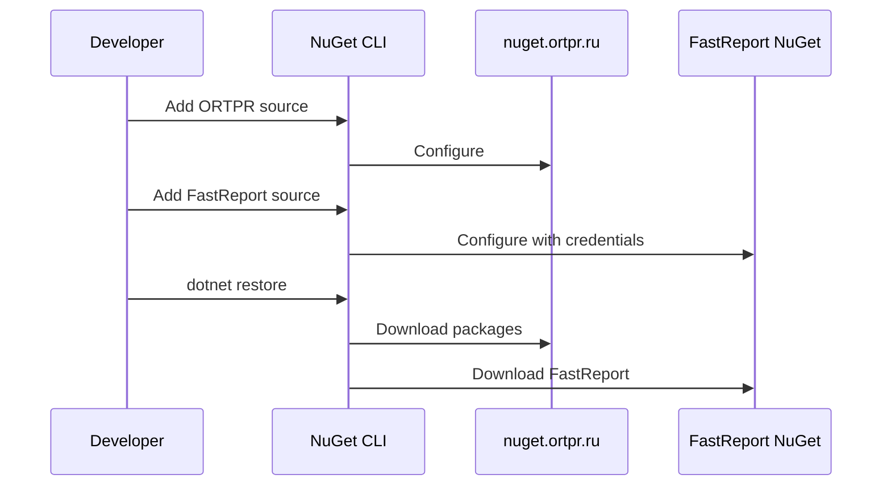
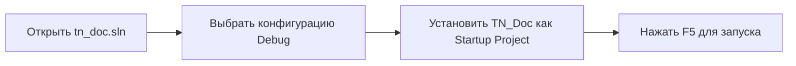
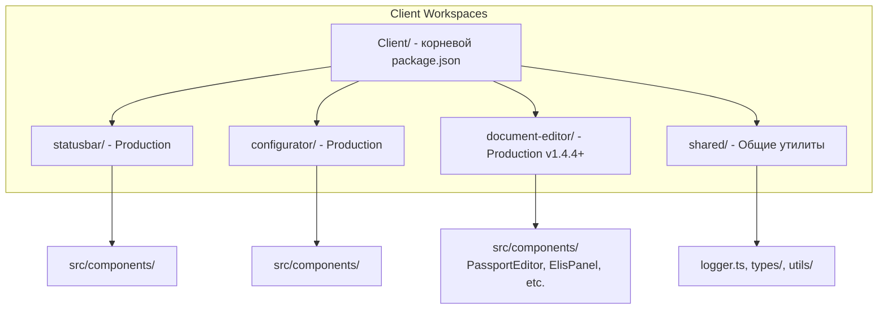

# Настройка окружения разработки

## Системные требования

### Минимальные требования

| Компонент | Требование |
|-----------|------------|
| ОС | Windows 10/11, Ubuntu 20.04+, macOS 12+ |
| .NET SDK | 9.0 или выше (для разработки) |
| .NET Runtime | 8.0.13 или выше (для запуска) |
| Node.js | 18.0 или выше (обязательно) |
| npm | 8.0 или выше (обязательно) |
| RAM | 4 GB (рекомендуется 8 GB) |
| Дисковое пространство | 2 GB |
| IDE | Visual Studio 2022, VS Code, Rider |

### Дополнительные компоненты

**Для разработки:**
- Git
- Docker (опционально, для тестирования)

**Для Linux:**
```bash
sudo apt-get install libgdiplus
```

### Проверка требований

```bash
# Проверить .NET SDK
dotnet --version
# Ожидается: 9.0.100 или выше

# Проверить .NET Runtime
dotnet --list-runtimes | grep "Microsoft.AspNetCore.App 8.0"
# Ожидается: 8.0.13 или выше

# Проверить Node.js
node --version
# Ожидается: v18.0.0 или выше

# Проверить npm
npm --version
# Ожидается: 8.0.0 или выше
```

## Установка .NET SDK


### Проверка установки

```bash
# Проверить версию SDK
dotnet --version

# Показать информацию о runtime
dotnet --info

# Список установленных SDK
dotnet --list-sdks

# Список установленных runtimes
dotnet --list-runtimes
```

Ожидаемый вывод:
```
$ dotnet --version
9.0.100

$ dotnet --list-runtimes
Microsoft.AspNetCore.App 8.0.13 [/usr/share/dotnet/shared/Microsoft.AspNetCore.App]
Microsoft.NETCore.App 8.0.13 [/usr/share/dotnet/shared/Microsoft.NETCore.App]
```

**Важно:** Для разработки требуется .NET SDK 9.0+, но приложение компилируется под .NET 8.0 Runtime.

## Установка Node.js и npm

Node.js и npm обязательны для работы с Vue компонентами (StatusBar, Configurator, Document Editor).

### Проверка установки

```bash
# Проверить версию Node.js
node --version

# Проверить версию npm
npm --version
```

Ожидаемый вывод:
```
$ node --version
v18.0.0 (или выше)

$ npm --version
8.0.0 (или выше)
```

### Установка (если не установлены)

**Linux (через nvm - рекомендуется):**
```bash
# Установить nvm
curl -o- https://raw.githubusercontent.com/nvm-sh/nvm/v0.39.0/install.sh | bash

# Перезагрузить оболочку
source ~/.bashrc

# Установить Node.js 18 LTS
nvm install 18
nvm use 18
nvm alias default 18
```

**Ubuntu/Debian (через apt):**
```bash
# Добавить NodeSource репозиторий
curl -fsSL https://deb.nodesource.com/setup_18.x | sudo -E bash -

# Установить Node.js и npm
sudo apt-get install -y nodejs

# Проверить установку
node --version
npm --version
```

**Windows:**
1. Скачайте установщик LTS версии с https://nodejs.org/
2. Запустите установщик
3. Проверьте установку в PowerShell: `node --version`

**macOS (через Homebrew):**
```bash
brew install node@18
brew link node@18
```

## Клонирование репозитория

```bash
# Основной репозиторий
git clone http://192.168.100.100/orpovy/ivk/tn_doc.git
cd tn_doc

# Связанные проекты (опционально, для полной разработки)
cd ..
git clone http://192.168.100.100/orpovy/ivk/tn_kmh.git
git clone http://192.168.100.100/orpovy/ivk/tn_messagingservice.git
git clone http://192.168.100.100/orpovy/ivk/tn.elisconnector.git
```

### Структура рабочей директории

```
workspace/
├── tn_doc/              # Основной проект
├── tn_kmh/              # KMH модуль
├── tn_messagingservice/ # OPC сервис
└── tn.elisconnector/    # ELIS интеграция
```

## Настройка NuGet источников



### Команды настройки

```bash
# Добавить источник ORTPR
dotnet nuget add source "https://nuget.ortpr.ru/v3/index.json" \
  --name ortpr

# Добавить источник FastReport (требуются учетные данные)
dotnet nuget add source "https://nuget.fast-report.com/api/v3/index.json" \
  --name fr_nuget \
  --username "<YOUR_USERNAME>" \
  --password "<YOUR_PASSWORD>" \
  --store-password-in-clear-text

# Проверить список источников
dotnet nuget list source
```

Ожидаемый результат:
```
Registered Sources:
  1.  nuget.org [Enabled]
      https://api.nuget.org/v3/index.json
  2.  ortpr [Enabled]
      https://nuget.ortpr.ru/v3/index.json
  3.  fr_nuget [Enabled]
      https://nuget.fast-report.com/api/v3/index.json
```

## Восстановление зависимостей

```bash
cd tn_doc

# Восстановить все пакеты NuGet
dotnet restore

# Если возникают ошибки, попробуйте очистить кэш
dotnet nuget locals all --clear
dotnet restore
```

## Настройка базы данных

### Создание тестовой БД (опционально)

```sql
CREATE DATABASE tn_doc_test;
CREATE USER 'tn_doc_user'@'localhost' IDENTIFIED BY 'password';
GRANT ALL PRIVILEGES ON tn_doc_test.* TO 'tn_doc_user'@'localhost';
FLUSH PRIVILEGES;
```

### Настройка строки подключения

Создайте файл `TN_Doc/Cfg/CfgApp.Development.json`:

```json
{
  "Devices": [
    {
      "IdDevice": "TEST-IVK-1",
      "Name": "Тестовое устройство",
      "TypeDevice": 7,
      "ConnectionString": "Server=localhost;Database=tn_doc_test;User=tn_doc_user;Password=password;",
      "UseSecurityFeatures": false
    }
  ],
  "UseSecurityFeatures": false
}
```

## Настройка IDE

### Visual Studio 2022



**Рекомендуемые расширения:**
- ReSharper (опционально)
- Web Essentials
- GitLens

### Visual Studio Code

**Установите расширения:**
```bash
code --install-extension ms-dotnettools.csharp
code --install-extension ms-dotnettools.vscode-dotnet-runtime
code --install-extension vue.volar
code --install-extension dbaeumer.vscode-eslint
```

**Создайте `.vscode/launch.json`:**
```json
{
  "version": "0.2.0",
  "configurations": [
    {
      "name": ".NET Core Launch (web)",
      "type": "coreclr",
      "request": "launch",
      "preLaunchTask": "build",
      "program": "${workspaceFolder}/TN_Doc/bin/Debug/net8.0/TN_Doc.dll",
      "args": [],
      "cwd": "${workspaceFolder}/TN_Doc",
      "env": {
        "ASPNETCORE_ENVIRONMENT": "Development"
      },
      "sourceFileMap": {
        "/Views": "${workspaceFolder}/TN_Doc/Views"
      }
    }
  ]
}
```

### JetBrains Rider

1. Открыть `tn_doc.sln`
2. Выбрать конфигурацию **Debug**
3. Run Configuration → Edit → Environment variables:
   ```
   ASPNETCORE_ENVIRONMENT=Development
   ```

## Настройка Vue компонентов (npm workspaces)

TN_Doc использует npm workspaces для управления тремя Vue 3 компонентами:
- **statusbar** - мониторинг состояния системы в реальном времени (production)
- **configurator** - веб-интерфейс управления конфигурацией (production)
- **document-editor** - редактор документов в браузере (production с v1.4.4+)

### Установка зависимостей

```bash
cd TN_Doc/Client

# Установить зависимости для всех workspaces одной командой
npm install

# npm workspaces автоматически установит зависимости для:
#   - TN_Doc/Client/statusbar/
#   - TN_Doc/Client/configurator/
#   - TN_Doc/Client/document-editor/
#   - TN_Doc/Client/shared/
```

### Запуск dev серверов

```bash
# Запустить StatusBar dev сервер с hot reload (порт 5173)
npm run dev

# Или запустить Configurator dev сервер (порт 5174)
npm run dev:configurator

# Или запустить Document Editor dev сервер (порт 5175)
npm run dev:editor

# В другом терминале запустить основное приложение
cd ..
ASPNETCORE_ENVIRONMENT=Development dotnet run
```

### Сборка для production

```bash
cd TN_Doc/Client

# Собрать все компоненты (statusbar, configurator, document-editor)
npm run build:all

# Или собрать только один компонент
npm run build              # StatusBar
npm run build:configurator # Configurator
npm run build:editor       # Document Editor

# Очистить все артефакты сборки
npm run clean
```

### Структура Vue проектов



### Общая инфраструктура (shared/)

Все компоненты используют централизованное логирование через `shared/logger.ts`:

```typescript
import { logger } from '../shared/logger';

// Уровни логирования: trace, debug, info, warn, error
logger.info('Компонент инициализирован');
logger.error('Ошибка загрузки данных', error);
```

**Преимущества:**
- Единый формат логов для всех Vue компонентов
- Автоматическое добавление временных меток
- Настраиваемый уровень логирования через environment variables

## Проверка установки

```bash
# 1. Восстановить зависимости
dotnet restore

# 2. Собрать проект
dotnet build

# 3. Запустить тесты
dotnet test

# 4. Собрать Vue компоненты
cd TN_Doc/Client
npm install
npm run build:all
cd ../..

# 5. Запустить приложение
cd TN_Doc
ASPNETCORE_ENVIRONMENT=Development dotnet run
```

Откройте браузер: `http://localhost:38509`

### Checklist готовности

- [ ] .NET SDK 9.0+ установлен и проверен (`dotnet --version`)
- [ ] .NET Runtime 8.0.13+ установлен (`dotnet --list-runtimes`)
- [ ] Node.js 18+ установлен (`node --version`)
- [ ] npm 8+ установлен (`npm --version`)
- [ ] NuGet источники настроены (ortpr, FastReport)
- [ ] Проект клонирован из репозитория
- [ ] `dotnet restore` выполнен успешно
- [ ] `dotnet build` проходит без ошибок
- [ ] npm workspaces установлены (`npm install` в TN_Doc/Client/)
- [ ] Vue компоненты собраны (`npm run build:all` в TN_Doc/Client/)
- [ ] Приложение запускается и открывается в браузере
- [ ] Тесты проходят (`dotnet test`)
- [ ] StatusBar доступен на главной странице
- [ ] Configurator доступен по адресу `/configurator`
- [ ] Document Editor доступен при редактировании документов

## Частые проблемы

### Ошибка: "Unable to load the service index for source ortpr"

```bash
# Проверить доступность источника
curl https://nuget.ortpr.ru/v3/index.json

# Если недоступно, работайте без него (если пакеты закэшированы)
dotnet restore --source https://api.nuget.org/v3/index.json
```

### Ошибка: "Could not load file or assembly 'FastReport.Web'"

Убедитесь, что FastReport NuGet источник настроен с корректными учетными данными.

### Ошибка: "libgdiplus not found" (Linux)

```bash
sudo apt-get update
sudo apt-get install libgdiplus
```

### Ошибка компиляции Vue проектов

```bash
cd TN_Doc/Client

# Очистить все зависимости
npm run clean

# Переустановить зависимости
npm install

# Собрать все компоненты
npm run build:all
```

### Node.js или npm не найдены

Убедитесь, что Node.js 18+ установлен:

```bash
# Проверить версию Node.js
node --version

# Проверить версию npm
npm --version

# Если версия устарела, обновите Node.js
# Linux/macOS (через nvm):
nvm install 18
nvm use 18

# Windows: скачайте установщик с https://nodejs.org/
```

### Ошибка: "ENOENT: no such file or directory" при сборке Vue

Убедитесь, что вы запускаете команды из правильной директории:

```bash
# Команды npm должны выполняться из TN_Doc/Client/
cd TN_Doc/Client
npm install
npm run build:all

# НЕ из корня проекта!
```

### Ошибка: "Cannot find module 'vite'" или другие зависимости

```bash
cd TN_Doc/Client

# Удалить node_modules и package-lock.json
rm -rf node_modules package-lock.json
rm -rf statusbar/node_modules configurator/node_modules document-editor/node_modules

# Переустановить зависимости
npm install
```

### Hot reload не работает для Vue компонентов

```bash
# Убедитесь, что dev сервер запущен на правильном порту
cd TN_Doc/Client

# StatusBar - порт 5173
npm run dev

# Configurator - порт 5174
npm run dev:configurator

# Document Editor - порт 5175
npm run dev:editor

# Проверьте, что ASP.NET Core app настроен на проксирование запросов к Vite dev server
```

### Shared logger не работает

Убедитесь, что импорт использует правильный путь:

```typescript
// Правильно (из компонентов statusbar/configurator/document-editor)
import { logger } from '../shared/logger';

// Неправильно
import { logger } from '@/shared/logger';
```

## Быстрый справочник команд

### .NET команды

| Команда | Описание |
|---------|----------|
| `dotnet --version` | Проверить версию SDK |
| `dotnet --list-runtimes` | Показать установленные runtimes |
| `dotnet restore` | Восстановить NuGet пакеты |
| `dotnet build` | Собрать проект |
| `dotnet test` | Запустить тесты |
| `dotnet run` | Запустить приложение (из TN_Doc/) |
| `dotnet format` | Форматировать код |
| `dotnet nuget list source` | Показать NuGet источники |

### npm команды (из TN_Doc/Client/)

| Команда | Описание |
|---------|----------|
| `npm install` | Установить зависимости для всех workspaces |
| `npm run dev` | Запустить StatusBar dev server (порт 5173) |
| `npm run dev:configurator` | Запустить Configurator dev server (порт 5174) |
| `npm run dev:editor` | Запустить Document Editor dev server (порт 5175) |
| `npm run build:all` | Собрать все компоненты |
| `npm run build` | Собрать только StatusBar |
| `npm run build:configurator` | Собрать только Configurator |
| `npm run build:editor` | Собрать только Document Editor |
| `npm run clean` | Очистить все артефакты сборки |

### Переменные окружения

| Переменная | Значение | Назначение |
|------------|----------|------------|
| `ASPNETCORE_ENVIRONMENT` | `Development` | Режим разработки с подробным логированием |
| `ASPNETCORE_ENVIRONMENT` | `Production` | Производственный режим |

### Порты приложения

| Компонент | Порт | URL |
|-----------|------|-----|
| ASP.NET Core | 38509 | http://localhost:38509 |
| StatusBar (dev) | 5173 | http://localhost:5173 |
| Configurator (dev) | 5174 | http://localhost:5174 |
| Document Editor (dev) | 5175 | http://localhost:5175 |

## Следующие шаги

- [Сборка проекта](building.md)
- [Тестирование](testing.md)
- [Coding Standards](coding-standards.md)
- [Contributing Guide](contributing.md)

## См. также

- [.NET Installation Guide](https://dotnet.microsoft.com/download)
- [Node.js Installation](https://nodejs.org/)
- [Git Basics](https://git-scm.com/book/en/v2/Getting-Started-Git-Basics)
- [npm Workspaces Documentation](https://docs.npmjs.com/cli/v8/using-npm/workspaces)
