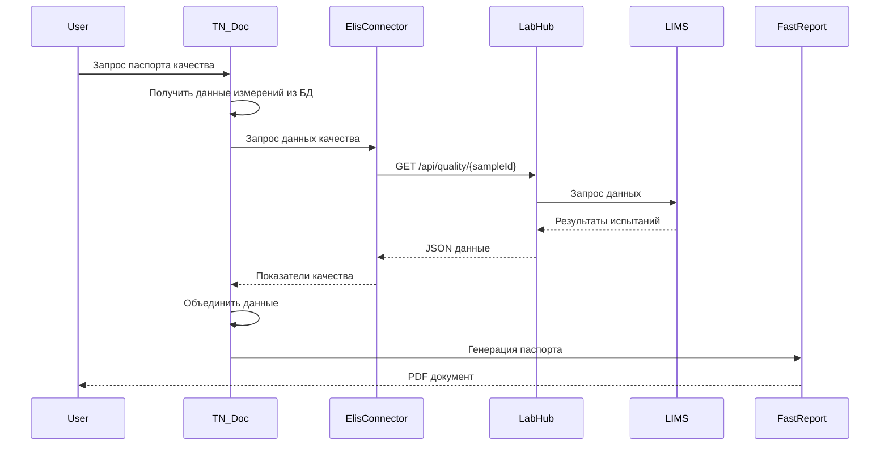
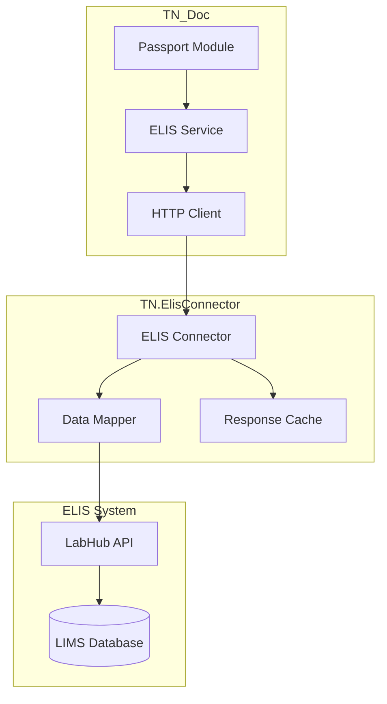
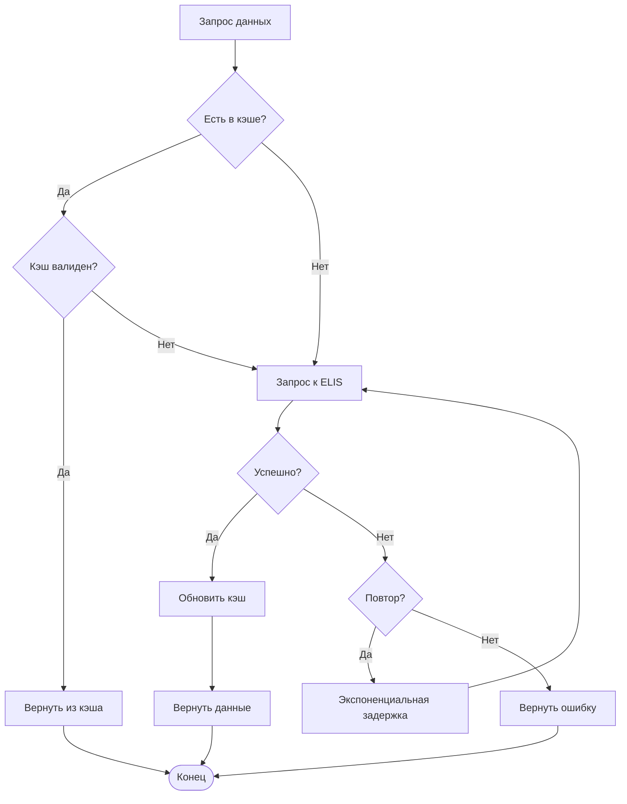

# Интеграция с ELIS

## Обзор

ELIS (Единая Лабораторная Информационная Система) — это система управления лабораторными данными, которая предоставляет данные показателей качества для автоматического заполнения паспортов качества продукции.

## Архитектура интеграции



## Компоненты интеграции



## Конфигурация

### CfgApp.json

```json
{
  "Elis": {
    "Use": true,
    "OstKey": "OST-001",
    "SiknKey": "SIKN-001",
    "ClientName": "TN_Doc_Client",
    "ClientToken": ""
  },
  "Devices": [
    {
      "IdDevice": 1,
      "Elis": {
        "Use": true,
        "OstKey": "OST-001",
        "SiknKey": "SIKN-001",
        "ClientName": "IVK-1",
        "ClientToken": ""
      }
    }
  ]
}
```

### Параметры конфигурации

| Параметр | Описание | По умолчанию | Configurator |
|----------|----------|--------------|--------------|
| `Use` | Включить интеграцию | `false` | ✅ |
| `OstKey` | Ключ ОСТ (операционная станция) | - | ✅ |
| `SiknKey` | Ключ СИКН | - | ✅ |
| `ClientName` | Имя клиента для идентификации | - | ✅ |
| `ClientToken` | Ключ, выдаваемый TN.ElisConnector | - | 👁️ |

> **Примечание**: Параметры с ✅ настраиваются через веб-интерфейс Configurator (`/configurator`). Параметр с 👁️ отображается, но не редактируется.

Параметры подключения к LabHub (URL, сертификаты, таймауты) настраиваются в сервисе TN.ElisConnector.

## Формат данных

### Запрос к ELIS

```http
GET /api/quality/samples/{sampleId} HTTP/1.1
Host: labhub.company.com
Authorization: Bearer {token}
Accept: application/json
```

### Ответ от ELIS

```json
{
  "sampleId": "SAMPLE-2025-001",
  "productName": "Нефть сырая",
  "samplingDate": "2025-10-02T14:30:00Z",
  "parameters": [
    {
      "name": "Плотность при 20°C",
      "value": 850.5,
      "unit": "кг/м³",
      "method": "ГОСТ 3900-85",
      "testDate": "2025-10-02T16:00:00Z",
      "result": "Соответствует",
      "norm": {
        "min": 840.0,
        "max": 860.0
      }
    },
    {
      "name": "Вязкость кинематическая при 20°C",
      "value": 5.2,
      "unit": "мм²/с",
      "method": "ГОСТ 33-2016",
      "testDate": "2025-10-02T16:15:00Z",
      "result": "Соответствует",
      "norm": {
        "min": 4.0,
        "max": 6.0
      }
    }
  ]
}
```

## Маппинг данных

```mermaid
graph LR
    subgraph "ELIS Response"
        EP[parameters[]]
        Name[name]
        Value[value]
        Unit[unit]
        Method[method]
    end

    subgraph "TN_Doc Model"
        QI[QualityIndicator]
        Param[ParameterName]
        Val[Value]
        Un[Unit]
        Meth[TestMethod]
        Res[Result]
    end

    EP --> QI
    Name --> Param
    Value --> Val
    Unit --> Un
    Method --> Meth
    EP --> Res
```

## Использование в коде

### Получение данных из ELIS

```csharp
public class PassportModule : DocGeneral
{
    private readonly IElisService _elisService;

    public override object GetViewDoc(int id)
    {
        // Получить данные измерений из БД
        var measurements = _dbContext.Measurements
            .Where(m => m.Id == id)
            .FirstOrDefault();

        // Получить данные качества из ELIS
        ElisQualityData qualityData = null;
        if (_config.Elis?.Use == true && !string.IsNullOrEmpty(measurements.SampleId))
        {
            try
            {
                qualityData = _elisService.GetQualityData(
                    measurements.SampleId
                ).GetAwaiter().GetResult();
            }
            catch (ElisException ex)
            {
                _logger.LogWarning(ex,
                    "Failed to get ELIS data for sample {SampleId}",
                    measurements.SampleId
                );
            }
        }

        // Объединить данные
        var documentData = new PassportData
        {
            Header = measurements.ToHeader(),
            Measurements = measurements.ToMeasurements(),
            QualityIndicators = qualityData?.Parameters
                .Select(p => p.ToQualityIndicator())
                .ToList() ?? new List<QualityIndicator>()
        };

        return JsonSerializer.Serialize(documentData);
    }
}
```

## SSL/TLS Сертификаты

Ниже приведён пример для сервиса TN.ElisConnector (пути и параметры берите из его конфигурации).

### Установка сертификатов

```bash
# Скопировать сертификаты
sudo mkdir -p /opt/TN_Doc/Cert
sudo cp elis-client.crt /opt/TN_Doc/Cert/
sudo cp elis-client.key /opt/TN_Doc/Cert/

# Установить права
sudo chown alphadaemon:alphadaemon /opt/TN_Doc/Cert/*
sudo chmod 600 /opt/TN_Doc/Cert/*
```

### Настройка HTTP Client

```csharp
services.AddHttpClient("ELIS", client =>
{
    client.BaseAddress = new Uri(connectorConfig.Url);
    client.Timeout = TimeSpan.FromMilliseconds(connectorConfig.Timeout);
})
.ConfigurePrimaryHttpMessageHandler(() =>
{
    var handler = new HttpClientHandler();

    if (!string.IsNullOrEmpty(connectorConfig.Certificate?.Path))
    {
        var cert = new X509Certificate2(
            connectorConfig.Certificate.Path,
            connectorConfig.Certificate.Password
        );
        handler.ClientCertificates.Add(cert);
    }

    return handler;
});
```

## Кэширование



## Обработка ошибок

### Типы ошибок

```csharp
public class ElisException : Exception
{
    public ElisErrorCode ErrorCode { get; set; }
}

public enum ElisErrorCode
{
    ConnectionTimeout,
    SampleNotFound,
    InvalidResponse,
    AuthenticationFailed,
    ServerError
}
```

### Retry Policy

```csharp
var retryPolicy = Policy
    .Handle<HttpRequestException>()
    .Or<TimeoutException>()
    .WaitAndRetryAsync(
        retryCount: _connectorConfig.RetryPolicy.MaxRetries,
        sleepDurationProvider: retryAttempt =>
            TimeSpan.FromMilliseconds(
                _connectorConfig.RetryPolicy.BackoffMs * Math.Pow(2, retryAttempt)
            ),
        onRetry: (exception, timeSpan, retryCount, context) =>
        {
            _logger.LogWarning(
                "ELIS request failed, retry {RetryCount} after {Delay}ms",
                retryCount,
                timeSpan.TotalMilliseconds
            );
        }
    );
```

## Мониторинг

### Health Check

```csharp
public class ElisHealthCheck : IHealthCheck
{
    private readonly IElisService _elisService;

    public async Task<HealthCheckResult> CheckHealthAsync(
        HealthCheckContext context,
        CancellationToken cancellationToken = default)
    {
        try
        {
            var isHealthy = await _elisService.PingAsync();
            return isHealthy
                ? HealthCheckResult.Healthy("ELIS is reachable")
                : HealthCheckResult.Degraded("ELIS responded with error");
        }
        catch (Exception ex)
        {
            return HealthCheckResult.Unhealthy(
                "ELIS is unreachable",
                ex
            );
        }
    }
}
```

### Логирование

```csharp
_logger.LogInformation(
    "ELIS request: GET /api/quality/samples/{SampleId}",
    sampleId
);

_logger.LogInformation(
    "ELIS response received in {ElapsedMs}ms for sample {SampleId}",
    stopwatch.ElapsedMilliseconds,
    sampleId
);

_logger.LogWarning(
    "ELIS timeout after {Timeout}ms for sample {SampleId}",
    timeout,
    sampleId
);
```

## Тестирование

### Mock ELIS для разработки

```csharp
public class MockElisService : IElisService
{
    public Task<ElisQualityData> GetQualityData(string sampleId)
    {
        return Task.FromResult(new ElisQualityData
        {
            SampleId = sampleId,
            ProductName = "Нефть сырая (MOCK)",
            Parameters = new List<ElisParameter>
            {
                new ElisParameter
                {
                    Name = "Плотность при 20°C",
                    Value = 850.5,
                    Unit = "кг/м³",
                    Method = "ГОСТ 3900-85",
                    Result = "Соответствует"
                }
            }
        });
    }
}
```

## Диагностика

```bash
# Проверить подключение к ELIS
curl -k https://labhub.company.com/api/health

# Проверить сертификаты
openssl s_client -connect labhub.company.com:443 -cert /opt/TN_Doc/Cert/elis-client.crt

# Логи ELIS запросов
grep "ELIS" /opt/TN_Doc/logs/tn-doc-$(date +%Y-%m-%d).log
```

## См. также

- [Configuration Guide](../deployment/configuration.md)
