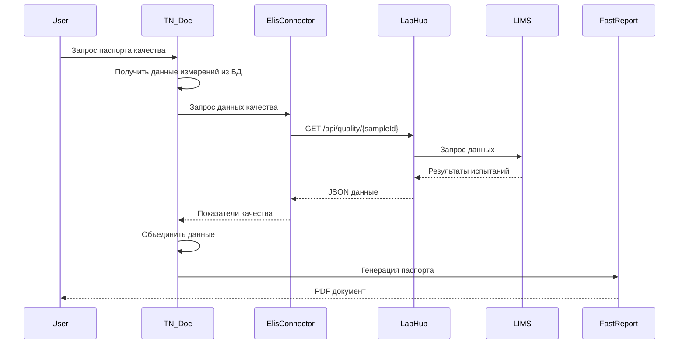
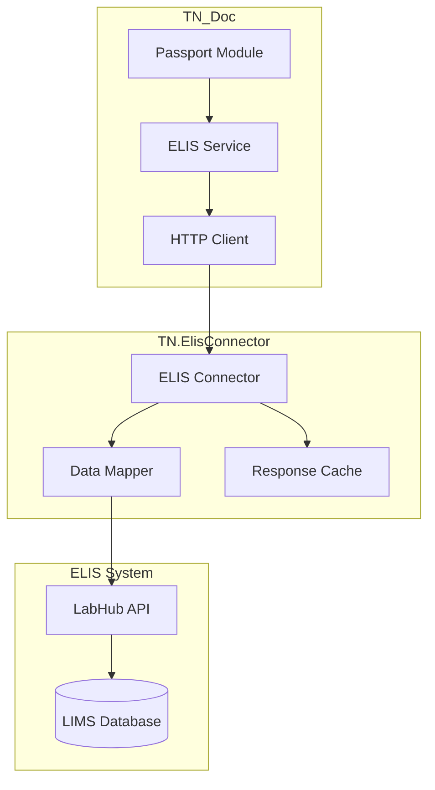
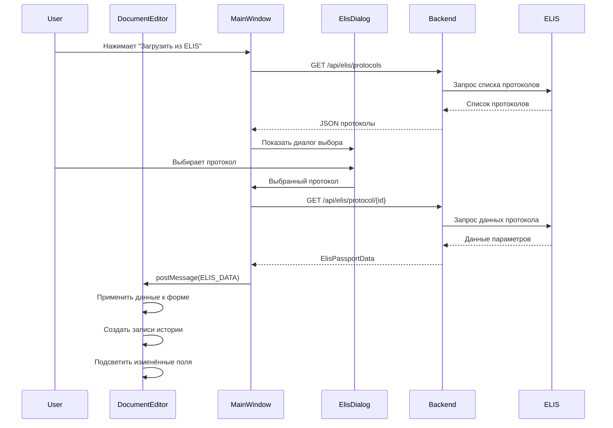

# Интеграция с ELIS

## Обзор

ELIS (Единая Лабораторная Информационная Система) — это система управления лабораторными данными, которая предоставляет данные показателей качества для автоматического заполнения паспортов качества продукции.

> ⚠️ В текущем UI Document Editor принимает данные ELIS через `postMessage` от родительского окна. В API TN_Doc нет эндпойнтов вида `/api/elis/*` для загрузки протоколов.
>
> Отдельно от этого есть callback endpoint'ы контроллера `ElisController` (`/Elis/ErrorMessage` и `/Elis/WarnMessage`) для приёма сообщений об ошибках/предупреждениях от интеграции.

## Архитектура интеграции



## Компоненты интеграции



## Конфигурация

### CfgApp.json

```json
{
  "Elis": {
    "Use": true,
    "Url": "https://labhub.company.com/api",
    "Timeout": 5000,
    "Certificate": {
      "Path": "Cert/elis-client.crt",
      "Password": "***"
    },
    "RetryPolicy": {
      "MaxRetries": 3,
      "BackoffMs": 1000
    }
  },
  "Devices": [
    {
      "IdDevice": "IVK-1",
      "ElisConfig": {
        "Override": true,
        "Url": "https://labhub-alt.company.com/api",
        "LabId": "LAB-001"
      }
    }
  ]
}
```

### Параметры конфигурации

| Параметр | Описание | По умолчанию |
|----------|----------|--------------|
| `Use` | Включить интеграцию | `false` |
| `Url` | URL LabHub API | - |
| `Timeout` | Таймаут запроса (мс) | `5000` |
| `Certificate.Path` | Путь к сертификату SSL | - |
| `RetryPolicy.MaxRetries` | Макс. повторов | `3` |

## Формат данных

### Запрос к ELIS

```http
GET /api/quality/samples/{sampleId} HTTP/1.1
Host: labhub.company.com
Authorization: Bearer {token}
Accept: application/json
```

### Ответ от ELIS (Backend API)

**Старый формат (для генерации PDF):**

```json
{
  "sampleId": "SAMPLE-2025-001",
  "productName": "Нефть сырая",
  "samplingDate": "2025-10-02T14:30:00Z",
  "parameters": [
    {
      "name": "Плотность при 20°C",
      "value": 850.5,
      "unit": "кг/м³",
      "method": "ГОСТ 3900-85",
      "testDate": "2025-10-02T16:00:00Z",
      "result": "Соответствует",
      "norm": {
        "min": 840.0,
        "max": 860.0
      }
    }
  ]
}
```

### Формат ElisPassportData (Document Editor)

**Используется в Document Editor (v1.4.4+):**

```typescript
interface ElisPassportData {
  // Общая информация
  protocolNumber?: string;              // Номер протокола ELIS
  labName?: string;                     // Название лаборатории

  // Информация о лаборатории
  labInfo?: {
    labName?: string;
    chiefLabShortSign?: string;         // "И. О. Фамилия" (авто-генерируется)
    chiefLabPosition?: string;
    chiefLabOrganization?: string;
  };

  // Подписанты (исходные данные из ELIS)
  signers?: {
    laboratory?: {
      givenName: string;                // "Иван"
      middleName: string;               // "Петрович"
      familyName: string;               // "Сидоров"
      post: string;                     // "Начальник лаборатории"
      company: string;                  // "ООО 'ЛабТест'"
    };
  };

  // Параметры качества
  parameters?: ElisParameter[];
}

interface ElisParameter {
  // Название параметра (русское или английское)
  name: string;                         // "Массовая доля воды(%)"

  // Значения (поддержка camelCase и PascalCase)
  value?: number | string;              // 0.28
  valueString?: string;                 // "Менее 4,0" (парсится через parseElisValueString)

  // Метод испытаний
  testMethodName?: string;              // "ГОСТ 2477-2014 п. 8.3"

  // Результат
  result?: string;                      // "Соответствует" или "Не соответствует"

  // Документ ELIS (дополнительная информация)
  elisDocument?: {
    number?: string;
    date?: string;
  };
}

interface ElisMethodData {
  name: string;                         // "ГОСТ 2477-2014 п. 8.3"
  limitValue?: number;                  // 4.0 (из "Менее 4,0")
  operator?: 'less' | 'more' | 'less_equal' | 'more_equal';
  limitValueString?: string;            // "Менее 4,0"
}
```

**Пример реальных данных (Document Editor):**

```json
{
  "protocolNumber": "ПР-2024-12345",
  "labName": "Испытательная лаборатория АО 'ЛУКОЙЛ'",
  "signers": {
    "laboratory": {
      "givenName": "Иван",
      "middleName": "Петрович",
      "familyName": "Сидоров",
      "post": "Начальник лаборатории",
      "company": "АО 'ЛУКОЙЛ'"
    }
  },
  "parameters": [
    {
      "name": "Массовая доля воды(%)",
      "value": 0.28,
      "valueString": "Менее 4,0",
      "testMethodName": "ГОСТ 2477-2014 п. 8.3",
      "result": "Соответствует"
    },
    {
      "name": "Плотность при 20 градусах Цельсия(кг/м3)",
      "value": 850.567,
      "testMethodName": "ГОСТ 3900-85",
      "result": "Соответствует"
    }
  ]
}
```

**Автоматическое обогащение данных:**

После получения данных из ELIS, `enrichElisData()` автоматически добавляет:

```json
{
  // ... исходные данные ELIS ...

  // Авто-генерируемые поля
  "chiefLabShortSign": "И. П. Сидоров",
  "chiefLabPosition": "Начальник лаборатории",
  "chiefLabOrganization": "АО 'ЛУКОЙЛ'",

  "labInfo": {
    "labName": "Испытательная лаборатория АО 'ЛУКОЙЛ'",
    "chiefLabShortSign": "И. П. Сидоров",
    "chiefLabPosition": "Начальник лаборатории",
    "chiefLabOrganization": "АО 'ЛУКОЙЛ'"
  }
}
```

## Маппинг данных

### Backend Mapping (FastReport)

```mermaid
graph LR
    subgraph "ELIS Response"
        EP[parameters[]]
        Name[name]
        Value[value]
        Unit[unit]
        Method[method]
    end

    subgraph "TN_Doc Model"
        QI[QualityIndicator]
        Param[ParameterName]
        Val[Value]
        Un[Unit]
        Meth[TestMethod]
        Res[Result]
    end

    EP --> QI
    Name --> Param
    Value --> Val
    Unit --> Un
    Method --> Meth
    EP --> Res
```

### Document Editor Mapping (v1.4.4+)

**Поддержка camelCase и PascalCase:**

Document Editor использует fallback механизм через `findElisValue()`:

```typescript
// Пример маппинга AdditionalInfo полей
const additionalInfoFields = [
  {
    controlId: 'Laboratory',
    elisAlias: ['labName', 'LabName', 'laboratoryName', 'LaboratoryName'],
    searchPath: 'labInfo'
  },
  {
    controlId: 'Laboratory_IOF',
    elisAlias: ['chiefLabShortSign'],
    searchPath: 'labInfo'
  },
  {
    controlId: 'Sample',
    elisAlias: ['sampleNumber', 'SampleNumber', 'protocolNumber'],
    searchPath: undefined  // Поиск в корне объекта
  }
];

// Применение
additionalInfoFields.forEach(field => {
  const value = findElisValue(elisData, field.elisAlias, field.searchPath);
  if (value) {
    store.updateField(field.controlId, value);
  }
});
```

**Маппинг параметров качества:**

```typescript
// Пример конфигурации параметра
const qualityParams = [
  {
    key: 'WaterContent',                 // ParameterKey в базе данных
    displayName: 'Массовая доля воды',   // Отображаемое название
    elisAlias: [                         // Варианты названий в ELIS
      'Массовая доля воды(%)',
      'Массовая концентрация воды(%)',
      'Water Content',
      'waterContent'
    ]
  }
];

// Поиск соответствующего параметра ELIS
elisData.parameters.forEach(elisParam => {
  const param = qualityParams.find(p =>
    p.elisAlias.some(alias =>
      alias.toLowerCase() === elisParam.name.toLowerCase()
    )
  );

  if (param) {
    // Применить value
    if (elisParam.value !== undefined) {
      store.updateField(`value.${param.key}`, elisParam.value);
    }

    // Применить method (с парсингом limitValue из valueString)
    if (elisParam.testMethodName) {
      const method = createMethodFromElisData(elisParam);
      store.updateField(`method.${param.key}`, method);
    }

    // Применить result
    if (elisParam.result) {
      store.updateField(`result.${param.key}`, elisParam.result);
    }
  }
});
```

## ELIS Integration in Document Editor (v1.4.4+)

### Архитектура интеграции

Document Editor использует composable `useElisIntegration.ts` для взаимодействия с ELIS:



### Composable useElisIntegration

**Расположение:** `TN_Doc/Client/document-editor/src/composables/useElisIntegration.ts`

**Основные функции:**

```typescript
// 1. Поиск значения в ELIS данных с поддержкой fallback алиасов
findElisValue(elisData, ["labName", "laboratoryName"], "labInfo")

// 2. Форматирование ФИО в "И. О. Фамилия"
formatShortName("Иван", "Петрович", "Сидоров") // → "И. П. Сидоров"

// 3. Парсинг текстовых значений ("Менее 4,0" → limitValue: 4.0, operator: 'less')
parseElisValueString("Не более 5,32") // → { limitValue: 5.32, operator: 'less_equal' }

// 4. Создание объекта метода из ELIS параметра
createMethodFromElisData(elisParam) // → { name, limitValue, operator }

// 5. Обогащение ELIS данных (добавление вычисляемых полей)
enrichElisData(elisData) // → добавляет chiefLabShortSign, labInfo.*

// 6. Приём данных через postMessage
useElisIntegration((elisData) => {
  // Применить данные к форме
});
```

### Процесс загрузки из ELIS

**1. Пользователь выбирает протокол ELIS**

Главное окно TN_Doc отправляет данные в Document Editor через `postMessage`:

```typescript
// Главное окно TN_Doc
const sendElisDataToEditor = (elisData: ElisPassportData) => {
  const editorIframe = document.getElementById('documentEditor') as HTMLIFrameElement;
  editorIframe.contentWindow?.postMessage({
    type: 'ELIS_DATA',
    payload: elisData
  }, '*');
};
```

**2. Document Editor принимает данные**

```typescript
// TN_Doc/Client/document-editor/src/views/PassportEditView.vue
useElisIntegration((elisData) => {
  logger.info('[PassportEditView] Получены данные ELIS', {
    parametersCount: elisData.parameters?.length || 0
  });

  applyElisDataToForm(elisData);
});
```

**3. Автоматическое заполнение полей**

```typescript
const applyElisDataToForm = (elisData: ElisPassportData) => {
  const { trackElisLoad } = useFieldHistory();

  // Применить AdditionalInfo поля
  additionalInfoFields.forEach(field => {
    const value = findElisValue(elisData, field.elisAlias, field.searchPath);
    if (value) {
      store.updateField(field.controlId, value);
      trackElisLoad(field.controlId, value, elisData.protocolNumber);
    }
  });

  // Применить параметры качества
  elisData.parameters.forEach(elisParam => {
    const param = qualityParams.find(p => p.elisAlias.includes(elisParam.name));
    if (param) {
      // Значение
      if (elisParam.value) {
        store.updateField(`value.${param.key}`, elisParam.value);
        trackElisLoad(`value.${param.key}`, elisParam.value, elisData.protocolNumber);
      }

      // Метод
      if (elisParam.testMethodName) {
        const method = createMethodFromElisData(elisParam);
        store.updateField(`method.${param.key}`, method);
        trackElisLoad(`method.${param.key}`, JSON.stringify(method), elisData.protocolNumber);
      }

      // Результат
      if (elisParam.result) {
        store.updateField(`result.${param.key}`, elisParam.result);
        trackElisLoad(`result.${param.key}`, elisParam.result, elisData.protocolNumber);
      }
    }
  });
};
```

**4. Создание записей истории**

Для каждого заполненного поля автоматически создаётся запись истории:

```typescript
// useFieldHistory.ts
const trackElisLoad = (fieldKey: string, value: any, protocolNumber?: string) => {
  const entry: FieldHistoryEntry = {
    source: DataSource.ELIS,
    modifiedAt: new Date().toISOString(),
    modifiedBy: 'ELIS',
    value: normalizeValue(value),
    previousValue: undefined,
    comment: protocolNumber
      ? `Загружено из протокола ${protocolNumber}`
      : 'Загружено из ELIS'
  };

  // Добавить в историю поля
  if (!store.formHistory[fieldKey]) {
    store.formHistory[fieldKey] = [];
  }
  store.formHistory[fieldKey].push(entry);
};
```

**5. Визуальная индикация**

- Изменённые поля подсвечиваются зелёным фоном `#8fd19e`
- В правом углу появляется зелёный индикатор "ЕЛИС"
- При наведении на индикатор показывается история с номером протокола

### Маппинг данных ELIS → Document Editor

**Поддержка camelCase и PascalCase:**

```typescript
// Пример: поиск названия лаборатории
const labName = findElisValue(elisData, [
  "labName",           // camelCase (новый формат ELIS)
  "LabName",           // PascalCase (старый формат)
  "laboratoryName",    // альтернативное название
  "LaboratoryName"
], "labInfo");
```

**Автоматическое добавление новых методов:**

Если метод из ELIS отсутствует в локальном списке, он автоматически добавляется:

```typescript
// PassportMethodSelect.vue
const onMethodSelected = (selectedMethod: string) => {
  const existingMethod = methods.value.find(m => m.name === selectedMethod);

  if (!existingMethod) {
    // Новый метод из ELIS - добавить в список
    methods.value.push({
      name: selectedMethod,
      // limitValue, operator и т.д. из ELIS данных
    });
  }
};
```

### Field History Integration

Подробнее см. [Field History Documentation](../features/field-history.md)

**Автоматическое создание записей:**

При загрузке из ELIS для каждого поля создаётся запись истории с:
- `source: DataSource.ELIS`
- `modifiedBy: "ELIS"`
- `comment: "Загружено из протокола {номер}"`
- `value: данные из ELIS`

**Визуальная индикация:**

- ✅ Зелёный индикатор "ЕЛИС" в правом углу поля
- ✅ Popup с детальной историей при наведении
- ✅ Номер протокола ELIS в комментарии к записи

**Раздельная история:**

- `value.{ParameterKey}` - измеренное значение
- `method.{ParameterKey}` - метод испытаний (JSON)
- `result.{ParameterKey}` - результат для печати
- `document.{ParameterKey}` - документ ELIS (JSON)

## Использование в коде

### Backend: Получение данных из ELIS

```csharp
public class DocPassport : DocGeneral, IDocUpdater, IDocumentEditor
{
    private readonly IElisService _elisService;

    public DocPassport(DbContextOptions<DocGeneral> options,
        IAppConfigService appConfig,
        IConfigurationCacheService configCache,
        int idDevice, IdDoc idDoc, string path)
        : base(options, appConfig, configCache, idDevice, idDoc, path)
    {
        IdDoc = IdDoc.Passport;
        PathToDocConfigFile = GetPathConfigFile();
        PathToDocEditConfigFile = GetPathEditConfigFile();
        PathToDocTemplateFile = GetPathTemplateFile();
    }

    public string GetViewDoc(int id)
    {
        // Получить данные измерений из БД
        var measurements = DataDoc.FirstOrDefault(x => x.Id == id);
        if (measurements == null)
        {
            _logger.LogWarning($"Документ {IdDoc} с id={id} не найден");
            return string.Empty;
        }

        // Получить данные качества из ELIS (если включено)
        ElisQualityData qualityData = null;
        if (_appConfig.IsUsedElis && !string.IsNullOrEmpty(measurements.SampleId))
        {
            try
            {
                qualityData = _elisService.GetQualityData(measurements.SampleId);
            }
            catch (Exception ex)
            {
                _logger.LogWarning(ex,
                    "Не удалось получить данные ELIS для пробы {SampleId}",
                    measurements.SampleId);
            }
        }

        // Объединить данные для FastReport
        var documentData = new PassportData
        {
            Header = measurements.ToHeader(),
            Measurements = measurements.ToMeasurements(),
            QualityIndicators = qualityData?.Parameters
                .Select(p => p.ToQualityIndicator())
                .ToList() ?? new List<QualityIndicator>()
        };

        return JsonConvert.SerializeObject(documentData);
    }
}
```

### Backend: Callback ошибок ELIS и запись в системный журнал ОС

```csharp
public class ElisController : Controller
{
    private readonly ILogger<ElisController> _logger;
    private readonly ISystemJournalService _systemJournal;

    [HttpPost]
    [AllowAnonymous]
    public void ErrorMessage(string msg)
    {
        if (string.IsNullOrEmpty(msg))
            return;

        _logger.LogError(msg);
        _systemJournal.WriteError(msg, "ELIS");
    }

    public void WarnMessage(string msg)
    {
        if (string.IsNullOrEmpty(msg))
            return;

        _logger.LogWarning(msg);
    }
}
```

`ErrorMessage` логирует ошибку в NLog и дополнительно отправляет её в системный журнал ОС, а `WarnMessage` пишет только warning в обычный лог приложения.

### Frontend: Использование useElisIntegration

```typescript
// PassportEditView.vue
import { useElisIntegration, findElisValue, createMethodFromElisData } from '@/composables/useElisIntegration';
import { useFieldHistory } from '@/composables/useFieldHistory';

const store = useDocumentStore();
const { trackElisLoad } = useFieldHistory();

// Настроить слушатель ELIS данных
useElisIntegration((elisData) => {
  logger.info('[PassportEditView] Получены данные ELIS');

  // Применить AdditionalInfo
  const labName = findElisValue(elisData, ["labName", "LabName"], "labInfo");
  if (labName) {
    store.updateField("Laboratory", labName);
    trackElisLoad("Laboratory", labName, elisData.protocolNumber);
  }

  // Применить параметры качества
  elisData.parameters.forEach(elisParam => {
    const param = qualityParams.find(p =>
      p.elisAlias.includes(elisParam.name)
    );

    if (param && elisParam.value) {
      // Значение
      store.updateField(`value.${param.key}`, elisParam.value);
      trackElisLoad(`value.${param.key}`, elisParam.value, elisData.protocolNumber);

      // Метод
      const method = createMethodFromElisData(elisParam);
      if (method) {
        store.updateField(`method.${param.key}`, method);
        trackElisLoad(`method.${param.key}`, JSON.stringify(method), elisData.protocolNumber);
      }
    }
  });
});
```

## SSL/TLS Сертификаты

### Установка сертификатов

```bash
# Скопировать сертификаты
sudo mkdir -p /opt/TN_Doc/Cert
sudo cp elis-client.crt /opt/TN_Doc/Cert/
sudo cp elis-client.key /opt/TN_Doc/Cert/

# Установить права
sudo chown alphadaemon:alphadaemon /opt/TN_Doc/Cert/*
sudo chmod 600 /opt/TN_Doc/Cert/*
```

### Настройка HTTP Client

```csharp
services.AddHttpClient("ELIS", client =>
{
    client.BaseAddress = new Uri(config.Elis.Url);
    client.Timeout = TimeSpan.FromMilliseconds(config.Elis.Timeout);
})
.ConfigurePrimaryHttpMessageHandler(() =>
{
    var handler = new HttpClientHandler();

    if (!string.IsNullOrEmpty(config.Elis.Certificate?.Path))
    {
        var cert = new X509Certificate2(
            config.Elis.Certificate.Path,
            config.Elis.Certificate.Password
        );
        handler.ClientCertificates.Add(cert);
    }

    return handler;
});
```

## Кэширование


## Обработка ошибок

### Backend: Типы ошибок

```csharp
public class ElisException : Exception
{
    public ElisErrorCode ErrorCode { get; set; }
}

public enum ElisErrorCode
{
    ConnectionTimeout,
    SampleNotFound,
    InvalidResponse,
    AuthenticationFailed,
    ServerError
}
```

### Backend: Retry Policy

```csharp
var retryPolicy = Policy
    .Handle<HttpRequestException>()
    .Or<TimeoutException>()
    .WaitAndRetryAsync(
        retryCount: _config.Elis.RetryPolicy.MaxRetries,
        sleepDurationProvider: retryAttempt =>
            TimeSpan.FromMilliseconds(
                _config.Elis.RetryPolicy.BackoffMs * Math.Pow(2, retryAttempt)
            ),
        onRetry: (exception, timeSpan, retryCount, context) =>
        {
            _logger.LogWarning(
                "ELIS request failed, retry {RetryCount} after {Delay}ms",
                retryCount,
                timeSpan.TotalMilliseconds
            );
        }
    );
```

### Frontend: Обработка ошибок в Document Editor

**Проверка наличия данных ELIS:**

```typescript
// useElisIntegration.ts
useElisIntegration((elisData) => {
  if (!elisData || !elisData.parameters) {
    logger.warn('[ELIS] Получены некорректные данные ELIS', { elisData });
    toast.add({
      severity: 'warn',
      summary: 'Предупреждение',
      detail: 'Данные ELIS некорректны или пусты',
      life: 3000
    });
    return;
  }

  logger.info('[ELIS] Получены данные ELIS', {
    protocolNumber: elisData.protocolNumber,
    parametersCount: elisData.parameters.length
  });

  applyElisDataToForm(elisData);
});
```

**Обработка отсутствующих параметров:**

```typescript
const applyElisDataToForm = (elisData: ElisPassportData) => {
  let appliedCount = 0;
  let notFoundCount = 0;

  elisData.parameters.forEach(elisParam => {
    const param = qualityParams.find(p =>
      p.elisAlias.some(alias =>
        alias.toLowerCase() === elisParam.name.toLowerCase()
      )
    );

    if (param) {
      // Применить данные
      appliedCount++;
    } else {
      // Параметр не найден в конфигурации
      notFoundCount++;
      logger.warn('[ELIS] Параметр из ELIS не найден в конфигурации', {
        elisParamName: elisParam.name
      });
    }
  });

  // Уведомление пользователя
  toast.add({
    severity: 'success',
    summary: 'Данные загружены из ELIS',
    detail: `Применено: ${appliedCount}, не найдено: ${notFoundCount}`,
    life: 5000
  });
};
```

**Обработка ошибок парсинга:**

```typescript
// parseElisValueString.ts
export function parseElisValueString(valueString: string): {
  limitValue: number;
  operator: 'less' | 'more' | 'less_equal' | 'more_equal';
  limitValueString: string;
} | null {
  // ... проверки ...

  // Если не удалось распознать формат
  logger.warn('[ELIS] Не удалось распознать формат текстового представления', {
    valueString: trimmed
  });

  // Вернуть null - значение будет применено как есть
  return null;
}
```

## Мониторинг

### Health Check

```csharp
public class ElisHealthCheck : IHealthCheck
{
    private readonly IElisService _elisService;

    public async Task<HealthCheckResult> CheckHealthAsync(
        HealthCheckContext context,
        CancellationToken cancellationToken = default)
    {
        try
        {
            var isHealthy = await _elisService.PingAsync();
            return isHealthy
                ? HealthCheckResult.Healthy("ELIS is reachable")
                : HealthCheckResult.Degraded("ELIS responded with error");
        }
        catch (Exception ex)
        {
            return HealthCheckResult.Unhealthy(
                "ELIS is unreachable",
                ex
            );
        }
    }
}
```

### Логирование

```csharp
_logger.LogInformation(
    "ELIS request: GET /api/quality/samples/{SampleId}",
    sampleId
);

_logger.LogInformation(
    "ELIS response received in {ElapsedMs}ms for sample {SampleId}",
    stopwatch.ElapsedMilliseconds,
    sampleId
);

_logger.LogWarning(
    "ELIS timeout after {Timeout}ms for sample {SampleId}",
    timeout,
    sampleId
);

// callback об ошибке от ELIS (через ElisController)
_logger.LogError(msg);
_systemJournal.WriteError(msg, "ELIS");
```

**Как это работает по ОС:**

| ОС | Куда пишется | Детали |
|----|--------------|--------|
| Windows | Application Event Log | Source: `.NET Runtime`, тип: `Error`, `EventId=1000`, сообщение: `[ELIS] ...` |
| Linux | syslog/journald | Команда `logger -p user.err -t TN_Doc:ELIS -- <message>` |

## Тестирование

### Mock ELIS для разработки

```csharp
public class MockElisService : IElisService
{
    public Task<ElisQualityData> GetQualityData(string sampleId)
    {
        return Task.FromResult(new ElisQualityData
        {
            SampleId = sampleId,
            ProductName = "Нефть сырая (MOCK)",
            Parameters = new List<ElisParameter>
            {
                new ElisParameter
                {
                    Name = "Плотность при 20°C",
                    Value = 850.5,
                    Unit = "кг/м³",
                    Method = "ГОСТ 3900-85",
                    Result = "Соответствует"
                }
            }
        });
    }
}
```

## Диагностика

```bash
# Проверить подключение к ELIS
curl -k https://labhub.company.com/api/health

# Проверить сертификаты
openssl s_client -connect labhub.company.com:443 -cert /opt/TN_Doc/Cert/elis-client.crt

# Логи ELIS запросов
grep "ELIS" /opt/TN_Doc/logs/$(date +%Y-%m-%d).log

# Linux: записи ELIS в системном журнале ОС
journalctl -t TN_Doc:ELIS -p err --since "today"
```

## См. также

- [Field History Documentation](../features/field-history.md) - Система истории изменений полей с интеграцией ELIS
- [Document Editor Architecture](../architecture/document-editor.md) - Архитектура Document Editor
- [OPC Integration](opc.md) - Интеграция с OPC для получения данных измерений
- [MessagingService Integration](messaging-service.md) - Сервис обмена сообщениями
- [Configuration Guide](../deployment/configuration.md) - Руководство по конфигурации

---

## История изменений документации

**2026-01-16** - Актуализация по системному журналу ОС для ELIS
- ✅ Добавлен backend-поток для `ElisController.ErrorMessage` + `ISystemJournalService`
- ✅ Описано различие между `ErrorMessage` (NLog + системный журнал) и `WarnMessage` (только NLog)
- ✅ Добавлены диагностические команды для Linux (`journalctl -t TN_Doc:ELIS`)

**v1.4.4 (2025-01-20)** - Обновление алгоритма заполнения и передача полного протокола
- ✅ **Передача полного протокола ELIS на бэкенд:**
  - Добавлено сохранение полного протокола ELIS в поле `__elisProtocol`
  - Протокол передаётся при каждом сохранении документа
  - Бэкенд извлекает протокол для дополнительной обработки
  - Поддержка парсинга через `JsonConvert.DeserializeObject<QualityPassport>`
- ✅ **Улучшения алгоритма заполнения:**
  - Использование `bulkUpdateFields()` для эффективного обновления множества полей
  - Автоматическая установка флага `__elisFilled` для заполненных полей
  - Улучшенная обработка методов испытаний (автодобавление новых методов)
  - Поддержка заполнения документов ELIS (номер, тип, дата)
- ✅ **Обновлён раздел "Процесс загрузки из ELIS":**
  - Добавлены примеры кода с bulk update
  - Документация обработки `__elisProtocol` на бэкенде
  - Логирование протокола ELIS для отладки

**v1.4.4 (2025-01-17)** - Полная актуализация
- ✅ Добавлен раздел "ELIS Integration in Document Editor"
- ✅ Описан composable useElisIntegration.ts с функциями
- ✅ Добавлена диаграмма процесса загрузки из ELIS
- ✅ Добавлены интерфейсы ElisPassportData, ElisParameter, ElisMethodData
- ✅ Примеры реальных данных ELIS
- ✅ Маппинг с поддержкой camelCase/PascalCase
- ✅ Интеграция с Field History системой
- ✅ Визуальная индикация (зелёная подсветка, индикаторы)
- ✅ Обработка ошибок на фронтенде
- ✅ Автоматическое обогащение данных (enrichElisData)
- ✅ Парсинг текстовых значений ("Менее 4,0" → limitValue + operator)

**v1.4.2 (2024-10)** - Первая версия
- Базовая информация о ELIS интеграции для генерации PDF
- Backend архитектура и API
- SSL/TLS сертификаты
- Кэширование и мониторинг
